# Create loops that repeat actions or process arrays in workflows with Azure Logic Apps

[!INCLUDE [logic-apps-sku-consumption-standard](../../includes/logic-apps-sku-consumption-standard.md)]

Azure Logic Apps includes the following loop actions that you can use in your workflow:

* To repeat one or more actions on an array, add the [**For each** action](#foreach-loop) to your workflow.

  Alternatively, if you have a trigger that receives an array and want to run an iteration for each array item, you can *debatch* that array with the [**SplitOn** trigger property](../logic-apps/logic-apps-workflow-actions-triggers.md#split-on-debatch).

* To repeat one or more actions until a condition gets met or a state changes, add the [Until action](#until-loop) to your workflow.

  Your workflow first runs all the actions inside the loop, and then checks the condition or state. If the condition is met, the loop stops. Otherwise, the loop repeats. For the default and maximum limits on the number of **Until** loops that a workflow can have, see [Concurrency, looping, and debatching limits](../logic-apps/logic-apps-limits-and-config.md#looping-debatching-limits).

## Prerequisites

* An Azure account and subscription. If you don't have a subscription, [sign up for a free Azure account](https://azure.microsoft.com/free/?WT.mc_id=A261C142F). 

* Basic knowledge about [logic app workflows](../logic-apps/logic-apps-overview.md)

<a name="foreach-loop"></a>

## For each

The **For each** action repeats one or more actions on each array item and works only on arrays. The following list contains some considerations for when you want to use a **For each** action:

* The **For each** action can process a limited number of array items. For this limit, see [Concurrency, looping, and debatching limits](../logic-apps/logic-apps-limits-and-config.md#looping-debatching-limits).

* By default, the cycles or iterations in a **For each** action run at the same time in parallel.

  This behavior differs from [Power Automate's **Apply to each** loop](/power-automate/apply-to-each) where iterations run one at a time, or sequentially. However, you can [set up sequential **For each** iterations](#sequential-foreach-loop). For example, if you want to pause the next iteration in a **For each** action by using the [Delay action](../connectors/connectors-native-delay.md), you need to set up each iteration to run sequentially.

  As an exception to the default behavior, a nested **For each** action's iterations always run sequentially, not in parallel. To run operations in parallel for items in a nested loop, create and [call a child logic app workflow](../logic-apps/logic-apps-http-endpoint.md).

* To get predictable results from operations on variables during each iteration, run the iterations sequentially. For example, when a concurrently running iteration ends, the **Increment variable**, **Decrement variable**, and **Append to variable** operations return predictable results. However, during each iteration in the concurrently running loop, these operations might return unpredictable results.

* Actions in a **For each** loop use the [`item()` function](../logic-apps/workflow-definition-language-functions-reference.md#item) to reference and process each item in the array. If you specify data that's not in an array, the workflow fails.

The following example workflow sends a daily summary for a website RSS feed. The workflow uses a **For each** action that sends an email for each new item.

Follow the steps based on whether you create a Consumption or Standard logic app workflow.

### [Consumption](#tab/consumption)

1. In the [Azure portal](https://portal.azure.com), create an example Consumption logic app workflow with the following steps in the specified order:

   * The **RSS** trigger named **When a feed item is published** 

     For more information, [follow these general steps to add a trigger](create-workflow-with-trigger-or-action.md?tabs=consumption#add-trigger).

   * The **Outlook.com** or **Office 365 Outlook** action named **Send an email**

     For more information, [follow these general steps to add an action](create-workflow-with-trigger-or-action.md?tabs=consumption#add-action).

1. [Follow the same general steps](create-workflow-with-trigger-or-action.md?tabs=consumption#add-action) to add the **For each** action between the RSS trigger and **Send an email** action in your workflow.

1. Now build the loop:

   1. Select inside the **Select an output from previous steps** box so that the dynamic content list opens.

   1. In the **Add dynamic content** list, from the **When a feed item is published** section, select **Feed links**, which is an array output from the RSS trigger.

      > [!NOTE]
      >
      > If the **Feed links** output doesn't appear, next to the trigger section label, select **See more**. 
      > From the dynamic content list, you can select *only* outputs from previous steps.

      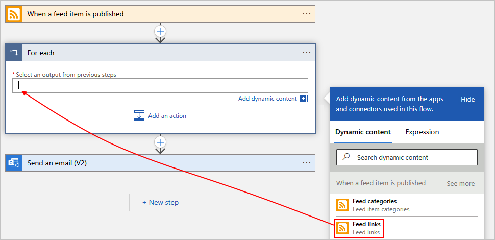

      When you're done, the selected array output appears as in the following example:

      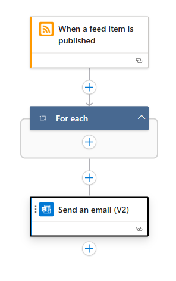

   1. To run an existing action on each array item, drag the **Send an email** action into the **For each** loop.

      Now, your workflow looks like the following example:

      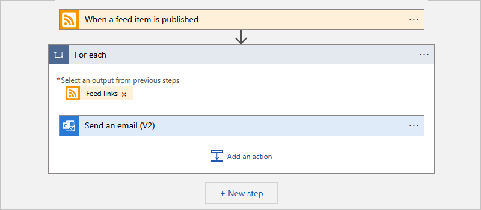

1. When you're done, save your workflow.

1. To manually test your workflow, on the designer toolbar, select **Run Trigger** > **Run**.

### [Standard](#tab/standard)

1. In the [Azure portal](https://portal.azure.com), create an example Standard logic app workflow with the following steps in the specified order:

   * The **RSS** trigger named **When a feed item is published** 

     For more information, [follow these general steps to add a trigger](create-workflow-with-trigger-or-action.md?tabs=standard#add-trigger).

   * The **Outlook.com** or **Office 365 Outlook** action named **Send an email**

     For more information, [follow these general steps to add an action](create-workflow-with-trigger-or-action.md?tabs=standard#add-action).

1. [Follow the same general steps](create-workflow-with-trigger-or-action.md?tabs=standard#add-action) to add the **For each** action between the RSS trigger and **Send an email** action in your workflow.

1. Now build the loop:

   1. On the designer, make sure that the **For each** action is selected.

   1. On the action information pane, select inside the **Select an output from previous steps** box so that the options for the dynamic content list (lightning icon) and expression editor (formula icon) appear. Select the dynamic content list option.

      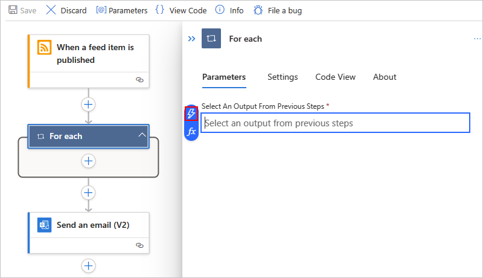

   1. In the **Add dynamic content** list, from the **When a feed item is published** section, select **Feed links**, which is an array output from the RSS trigger.

      > [!NOTE]
      >
      > If the **Feed links** output doesn't appear, next to the trigger section label, select **See more**. 
      > From the dynamic content list, you can select *only* outputs from previous steps.

      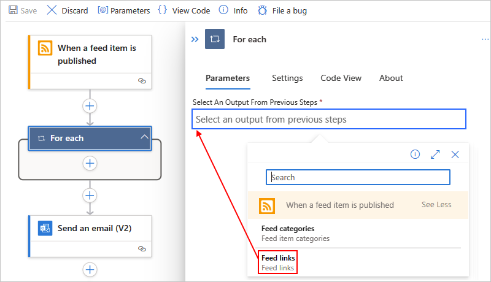

      When you're done, the selected array output appears as in the following example:

      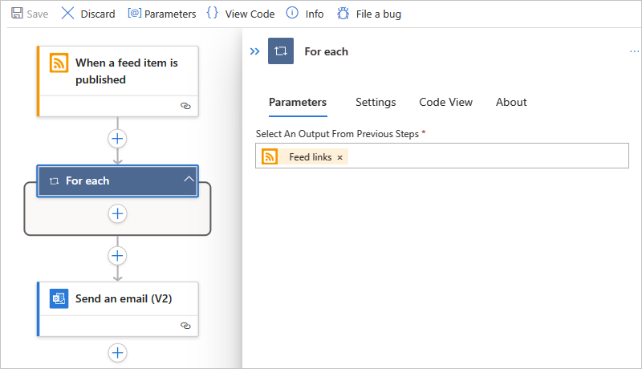

   1. To run an existing action on each array item, drag the **Send an email** action into the **For each** loop.

      Now, your workflow looks like the following example:

      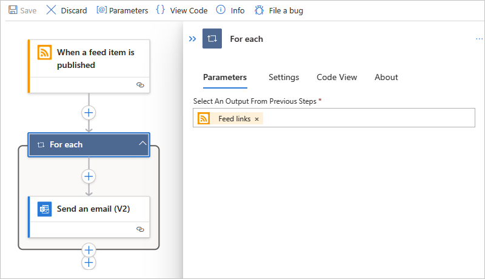

1. When you're done, save your workflow.

1. To manually test your workflow, on the workflow menu, select **Overview**. On the **Overview** toolbar, select **Run** > **Run**.

---

<a name="for-each-json"></a>

## For each action definition (JSON)

If you're working in code view, you can define the `For_each` action in your workflow's JSON definition, for example:

``` json
"actions": {
   "For_each": {
      "actions": {
         "Send_an_email_(V2)": {
            "type": "ApiConnection",
            "inputs": {
               "body": {
                  "Body": "@{item()}",
                  "Subject": "New CNN post @{triggerBody()?['publishDate']}",
                  "To": "me@contoso.com"
               },
               "host": {
                  "connection": {
                     "name": "@parameters('$connections')['office365']['connectionId']"
                  }
               },
               "method": "post",
               "path": "/v2/Mail"
            },
            "runAfter": {}
         }
      },
      "foreach": "@triggerBody()?['links']",
      "runAfter": {},
      "type": "Foreach"
   }
},
```

<a name="sequential-foreach-loop"></a>

## For each: Run sequentially

By default, the iterations in a **For each** loop run at the same time in parallel. However, when you have nested loops or variables inside the loops where you expect predictable results, you must run those loops one at a time or sequentially.

### [Consumption](#tab/consumption)

1. In the **For each** action's upper right corner, select **ellipses** (**...**) > **Settings**.

1. Under **Concurrency Control**, change the setting from **Off** to **On**.

1. Move the **Degree of Parallelism** slider to **1**, and select **Done**.

   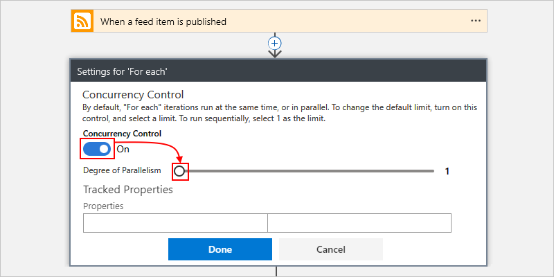

### [Standard](#tab/standard)

1. On the **For each** action's information pane, under **General**, select **Settings**.

1. Under **Concurrency Control**, change the setting from **Off** to **On**.

1. Move the **Degree of Parallelism** slider to **1**.

   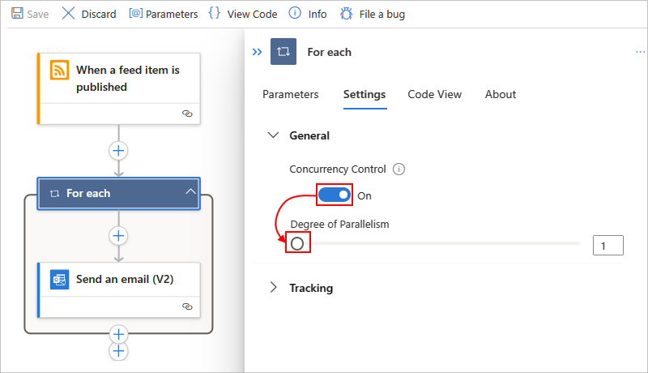

---

## For each action definition (JSON): Run sequentially

If you're working in code view with the `For_each` action in your workflow's JSON definition, you can use the `Sequential` option by adding the `operationOptions` parameter, for example:

``` json
"actions": {
   "For_each": {
      "actions": {
         "Send_an_email_(V2)": { }
      },
      "foreach": "@triggerBody()?['links']",
      "runAfter": {},
      "type": "Foreach",
      "operationOptions": "Sequential"
   }
}
```

<a name="until-loop"></a>

## Until

The **Until** action runs and repeats one or more actions until the required specified condition is met. If the condition is met, the loop stops. Otherwise, the loop repeats. For the default and maximum limits on the number of **Until** actions or iterations that a workflow can have, see [Concurrency, looping, and debatching limits](logic-apps-limits-and-config.md#looping-debatching-limits).

The following list contains some common scenarios where you can use an **Until** action:

* Call an endpoint until you get the response you want.

* Create a record in a database. Wait until a specific field in that record gets approved. Continue processing.

In the following example workflow, starting at 8:00 AM each day, the **Until** action increments a variable until the variable's value equals 10. The workflow then sends an email that confirms the current value.

> [!NOTE]
>
> This example uses Office 365 Outlook, but you can use [any email provider that Azure Logic Apps supports](/connectors/). 
> If you use another email account, the general steps stay the same, but your UI might look slightly different.

### [Consumption](#tab/consumption)

1. In the [Azure portal](https://portal.azure.com), create a Consumption logic app resource with a blank workflow.

1. In the designer, [follow these general steps to add the **Recurrence** built-in trigger named **Schedule** to your workflow](create-workflow-with-trigger-or-action.md?tabs=consumption#add-trigger).

1. In the **Recurrence** trigger, specify the interval, frequency, and hour of the day for the trigger to fire.

   | Property | Value |
   |----------|-------|
   | **Interval** | **1** |
   | **Frequency** | **Day** |
   | **At these hours** | **8** |

   To add the **At these hours** parameter, open the **Add new parameter** list, and select **At these hours**, which appears only after you set **Frequency** to **Day**.

   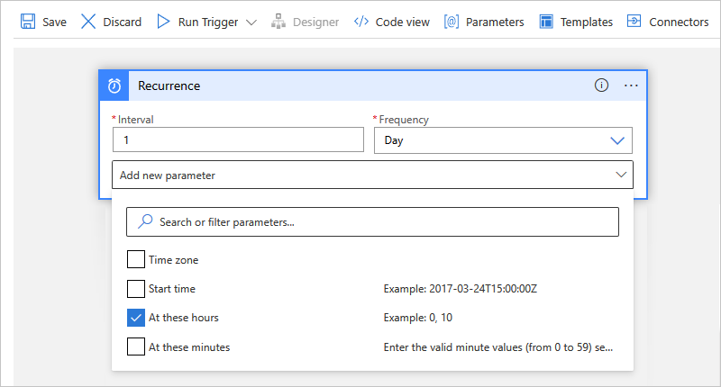

   When you're done, the **Recurrence** trigger looks like the following example:

   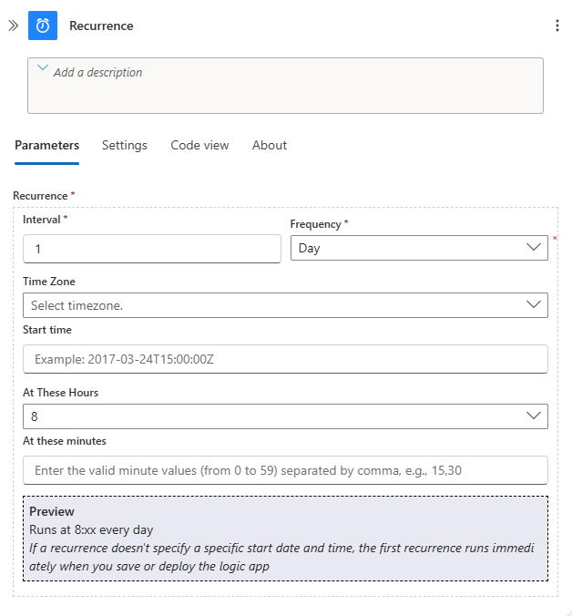

1. Under the trigger, [follow these general steps to add the **Variables** built-in action named **Initialize variable** to your workflow](create-workflow-with-trigger-or-action.md?tabs=consumption#add-action).

1. In the **Initialize variable** action, provide the following values:

   | Property | Value | Description |
   |----------|-------|-------------|
   | **Name** | **Limit** | Your variable's name |
   | **Type** | **Integer** | Your variable's data type |
   | **Value** | **0** | Your variable's starting value |

   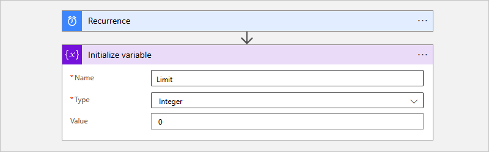

1. Under the **Initialize variable** action, [follow these general steps to add the **Control** built-in action named **Until** to your workflow](create-workflow-with-trigger-or-action.md?tabs=consumption#add-action).

1. In the **Until** action, provide the following values to set up the stop condition for the loop.

   1. Select inside the leftmost box named **Choose a value**, which automatically opens the dynamic content list.

   1. From the list, under **Variables**, select the variable named **Limit**.

   1. From the middle operator list, select the **is equal to** operator.

   1. In the rightmost box named **Choose a value**, enter **10** as the comparison value.

   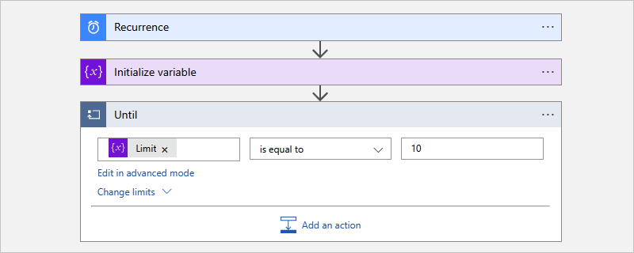

1. Inside the **Until** action, select **Add an action**.

1. In the **Choose an operation** search box, [follow these general steps to add the **Variables** built-in action named **Increment variable** to the **Until** action](create-workflow-with-trigger-or-action.md?tabs=consumption#add-action).

1. In the **Increment variable** action, provide the following values to increment the **Limit** variable's value by 1:

   | Property | Value |
   |----------|-------|
   | **Name** | Select the **Limit** variable. |
   | **Value** | **1** |

   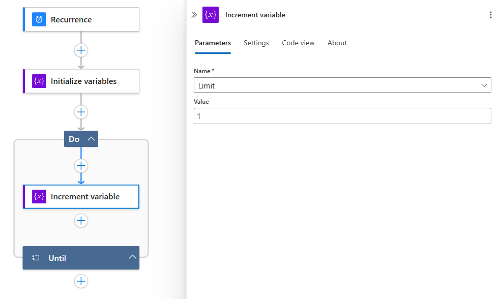

1. Outside and under **Until** action, [follow these general steps to add an action that sends email](create-workflow-with-trigger-or-action.md?tabs=consumption#add-action).

   This example continues with the **Office 365 Outlook** action named **Send an email**.

1. In the email action, provide the following values:

   | Property | Value | Description |
   |----------|-------|-------------|
   | **To** | <*email-address\@domain*> | The recipient's email address. For testing, use your own email address. | 
   | **Subject** | **Current value for "Limit" variable is:** **Limit** | The email subject. For this example, make sure that you include the **Limit** variable to confirm that the current value meets your specified condition: <br><br>1. Select inside the **Subject** box so that the dynamic content list appears. <br><br>2. In the dynamic content list, next to the **Variables** section header, select **See more**. <br><br>3. Select **Limit**. |
   | **Body** | <*email-content*> | The email message content that you want to send. For this example, enter whatever text you want. |

   When you're done, your email action looks similar to the following example:

   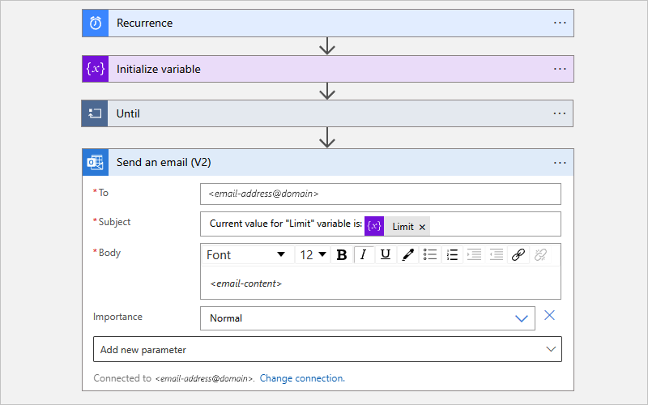

1. Save your workflow.

### [Standard](#tab/standard)

1. In the [Azure portal](https://portal.azure.com), create a Standard logic app resource with a blank workflow.

1. In the designer, [follow these general steps to add the **Recurrence** built-in trigger named **Schedule** to your workflow](create-workflow-with-trigger-or-action.md?tabs=standard#add-trigger).

1. In the **Recurrence** trigger information pane, on the **Parameters** tab, specify the interval, frequency, and hour of the day for the trigger to fire.

   The **At These Hours** parameter appears only after you set **Frequency** to **Day**.

   | Property | Value |
   |----------|-------|
   | **Interval** | **1** |
   | **Frequency** | **Day** |
   | **At These Hours** | **8** |

   When you're done, the **Recurrence** trigger information pane looks like the following example:

   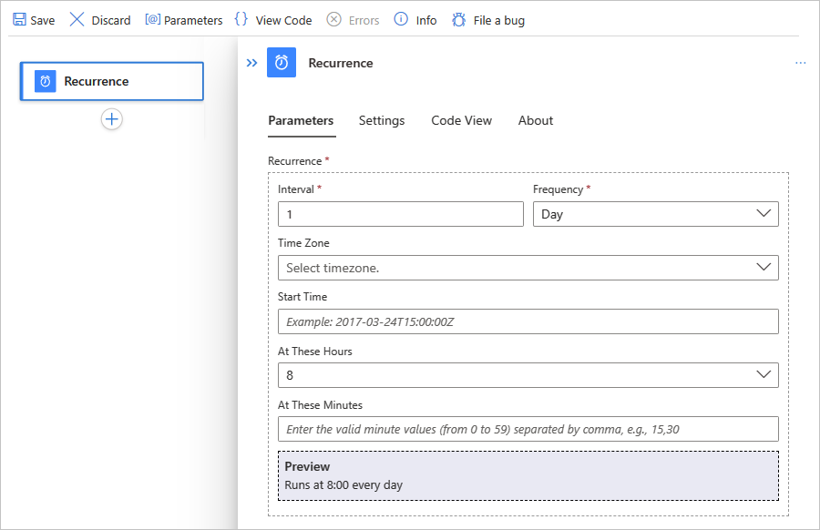

1. Under the trigger, [follow these general steps to add the **Variables** built-in action named **Initialize variable** to your workflow](create-workflow-with-trigger-or-action.md?tabs=standard#add-action).

1. In the **Initialize variable** action information pane, on the **Parameters** tab, provide the following values:

   | Property | Value | Description |
   |----------|-------|-------------|
   | **Name** | **Limit** | Your variable's name |
   | **Type** | **Integer** | Your variable's data type |
   | **Value** | **0** | Your variable's starting value |

   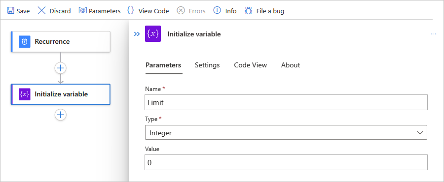

1. Under the **Initialize variable** action, [follow these general steps to add the **Control** built-in action named **Until** to your workflow](create-workflow-with-trigger-or-action.md?tabs=standard#add-action).

1. In the **Until** action information pane, on the **Parameters** tab, provide the following values to set up the stop condition for the loop.

   1. Under **Loop Until**, select inside the leftmost box named **Choose a value**, and select the option to open the dynamic content list (lightning icon).

   1. From the list, under **Variables**, select the variable named **Limit**.

   1. From the middle operator list, select the **is equal to** operator.

   1. In the rightmost box named **Choose a value**, enter **10** as the comparison value.

   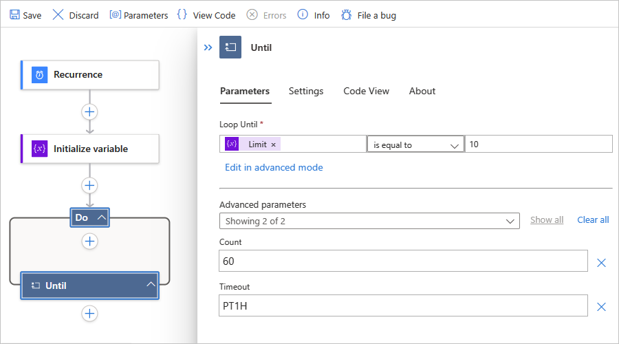

1. Inside the **Until** action, select the plus (**+**) sign, and then select **Add an action**.

1. [Follow these general steps to add the **Variables** built-in action named **Increment variable** to the **Until** action](create-workflow-with-trigger-or-action.md?tabs=standard#add-action).

1. In the **Increment variable** action information pane, provide the following values to increment the **Limit** variable's value by 1:

   | Property | Value |
   |----------|-------|
   | **Name** | Select the **Limit** variable. |
   | **Value** | **1** |

   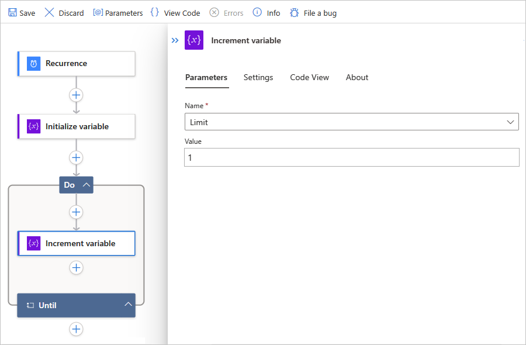

1. Outside and under the **Until** action, [follow these general steps to add an action that sends email](create-workflow-with-trigger-or-action.md?tabs=standard#add-action).

   This example continues with the **Office 365 Outlook** action named **Send an email**.

1. In the email action information pane, on the **Parameters** tab, provide the following values:

   | Property | Value | Description |
   |----------|-------|-------------|
   | **To** | <*email-address\@domain*> | The recipient's email address. For testing, use your own email address. | 
   | **Subject** | **Current value for "Limit" variable is:** **Limit** | The email subject. For this example, make sure that you include the **Limit** variable to confirm that the current value meets your specified condition: <br><br>1. Select inside the **Subject** box so that the dynamic content list appears. <br><br>2. In the dynamic content list, next to the **Variables** section header, select **See more**. <br><br>3. Select **Limit**. |
   | **Body** | <*email-content*> | The email message content that you want to send. For this example, enter whatever text you want. |

   When you're done, your email action looks similar to the following example:

   

1. Save your workflow.

---

### Test your workflow

To manually test your logic app workflow, follow the steps based on whether you have a Consumption or Standard logic app.

### [Consumption](#tab/consumption)

On the designer toolbar, select **Run Trigger** > **Run**.

### [Standard](#tab/standard)

1. On the workflow menu, select **Overview**.

1. On the **Overview** page toolbar, select **Run** > **Run**.

---

After your workflow starts running, you get an email with the content that you specified:


<a name="prevent-endless-loops"></a>

### Prevent endless loops

The **Until** action stops execution based on the following properties, which you can view by selecting **Change limits** in the action. Make sure that you set these property values accordingly:

| Property | Description |
|----------|-------------|
| **Count** | The maximum number of iterations that run before the loop exits. <br><br>For the default and maximum limits on the number of **Until** actions that a workflow can have, see [Concurrency, looping, and debatching limits](logic-apps-limits-and-config.md#looping-debatching-limits). |
| **Timeout** | The maximum amount of time that the **Until** action, including all iterations, runs before the loop exits. This value is specified in [ISO 8601 format](https://en.wikipedia.org/wiki/ISO_8601) and is evaluated for each iteration. <br><br>If any action in the loop takes longer than the timeout limit, the current iteration doesn't stop. However, the next iteration doesn't start because the timeout limit condition is met. <br><br>For the default and maximum limits on the **Timeout** value, see [Concurrency, looping, and debatching limits](../logic-apps/logic-apps-limits-and-config.md#looping-debatching-limits). |

<a name="until-json"></a>

## "Until" definition (JSON)

If you're working in code view, you can define an `Until` action in your workflow's JSON definition, for example:

``` json
"actions": {
   "Initialize_variable": {
      // Definition for initialize variable action
   },
   "Send_an_email": {
      // Definition for send email action
   },
   "Until": {
      "type": "Until",
      "actions": {
         "Increment_variable": {
            "type": "IncrementVariable",
            "inputs": {
               "name": "Limit",
               "value": 1
            },
            "runAfter": {}
         }
      },
      "expression": "@equals(variables('Limit'), 10)",
      // To prevent endless loops, an "Until" loop 
      // includes these default limits that stop the loop. 
      "limit": { 
         "count": 60,
         "timeout": "PT1H"
      },
      "runAfter": {
         "Initialize_variable": [
            "Succeeded"
         ]
      }
   }
}
```

This example **Until** loop calls an HTTP endpoint, which creates a resource. The loop stops when the 
HTTP response body returns with `Completed` status. To prevent endless loops, the loop also stops 
if any of the following conditions happen:

* The loop ran 10 times as specified by the `count` attribute. The default is 60 times.

* The loop ran for two hours as specified by the `timeout` attribute in ISO 8601 format. The default is one hour.

``` json
"actions": {
   "myUntilLoopName": {
      "type": "Until",
      "actions": {
         "Create_new_resource": {
            "type": "Http",
            "inputs": {
               "body": {
                  "resourceId": "@triggerBody()"
               },
               "url": "https://domain.com/provisionResource/create-resource",
               "body": {
                  "resourceId": "@triggerBody()"
               }
            },
            "runAfter": {},
            "type": "ApiConnection"
         }
      },
      "expression": "@equals(triggerBody(), 'Completed')",
      "limit": {
         "count": 10,
         "timeout": "PT2H"
      },
      "runAfter": {}
   }
}
```

## Next steps

* [Run steps based on a condition (condition action)](logic-apps-control-flow-conditional-statement.md)
* [Run steps based on different values (switch action)](logic-apps-control-flow-switch-statement.md)
* [Run or merge parallel steps (branches)](logic-apps-control-flow-branches.md)
* [Run steps based on grouped action status (scopes)](logic-apps-control-flow-run-steps-group-scopes.md)