---
# required metadata
title: Add loops that repeat actions or process arrays - Azure Logic Apps | Microsoft Docs
description: How to create loops that repeat workflow actions or process arrays in Azure Logic Apps
services: logic-apps
ms.service: logic-apps
ms.suite: integration
author: ecfan
ms.author: estfan
ms.reviewer: klam, LADocs
manager: jeconnoc
ms.date: 01/05/2019
ms.topic: article
---

# Create loops that repeat workflow actions or process arrays in Azure Logic Apps

To process an array in your logic app, you can create a ["Foreach" loop](#foreach-loop). 
This loop repeats one or more actions on each item in the array. 
For limits on the number of array items that "Foreach" loops can process, see 
[Limits and configuration](../logic-apps/logic-apps-limits-and-config.md). 

To repeat actions until a condition gets met or a state changes, 
you can create an ["Until" loop](#until-loop). Your logic app first runs 
all the actions inside the loop, and then checks the condition or state. 
If the condition is met, the loop stops. Otherwise, the loop repeats. 
For limits on the number of "Until" loops in a logic app run, see 
[Limits and configuration](../logic-apps/logic-apps-limits-and-config.md). 

> [!TIP]
> If you have a trigger that receives an array 
> and want to run a workflow for each array item, 
> you can *debatch* that array with the 
> [**SplitOn** trigger property](../logic-apps/logic-apps-workflow-actions-triggers.md#split-on-debatch). 

## Prerequisites

* An Azure subscription. If you don't have a subscription, 
[sign up for a free Azure account](https://azure.microsoft.com/free/). 

* Basic knowledge about [how to create logic apps](../logic-apps/quickstart-create-first-logic-app-workflow.md)

<a name="foreach-loop"></a>

## "Foreach" loop

A "Foreach loop" repeats one or more actions 
on each array item and works only on arrays. 
Iterations in a "Foreach" loop run in parallel. 
However, you can run iterations one at a time 
by setting up a [sequential "Foreach" loop](#sequential-foreach-loop). 

Here are some considerations when you use "Foreach" loops:

* In nested loops, iterations always run sequentially, 
not in parallel. To run operations in parallel for items 
in a nested loop, create and [call a child logic app](../logic-apps/logic-apps-http-endpoint.md).

* To get predictable results from operations on variables during each loop iteration, 
run those loops sequentially. For example, when a concurrently running loop ends, 
the increment, decrement, and append to variable operations return predictable results. 
However, during each iteration in the concurrently running loop, these operations might 
return unpredictable results. 

* Actions in a "Foreach" loop use the 
[`@item()`](../logic-apps/workflow-definition-language-functions-reference.md#item) 
expression to reference and process each item in the array. 
If you specify data that's not in an array, 
the logic app workflow fails. 

This example logic app sends a daily summary for a website RSS feed. 
The app uses a "Foreach" loop that sends an email for each new item.

1. [Create this sample logic app](../logic-apps/quickstart-create-first-logic-app-workflow.md) 
with an Outlook.com or Office 365 Outlook account.

2. Between the RSS trigger and send email action, 
add a "Foreach" loop. 

   1. To add a loop between steps, move your 
   pointer over the arrow between those steps. 
   Choose the **plus sign** (**+**) that appears, 
   then select **Add an action**.

      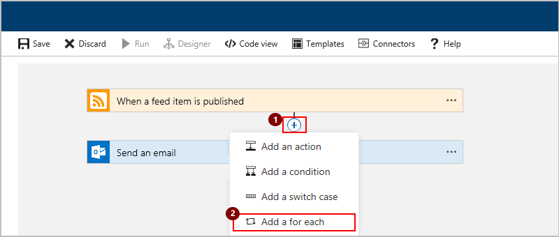

   1. Under the search box, choose **All**. In the search box, 
   type "for each" as your filter. From the actions list, 
   select this action: **For each - Control**

      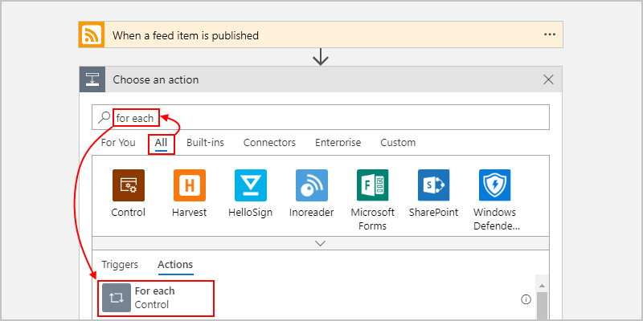

3. Now build the loop. Under **Select an output from previous steps** 
after the **Add dynamic content** list appears, 
select the **Feed links** array, which is output from the RSS trigger. 

   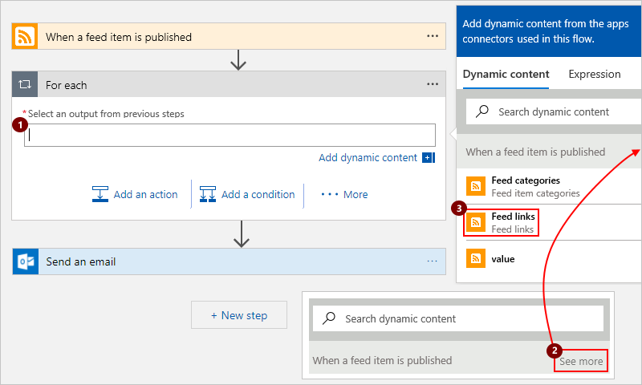

   > [!NOTE] 
   > You can select *only* array outputs from the previous step.

   The selected array now appears here:

   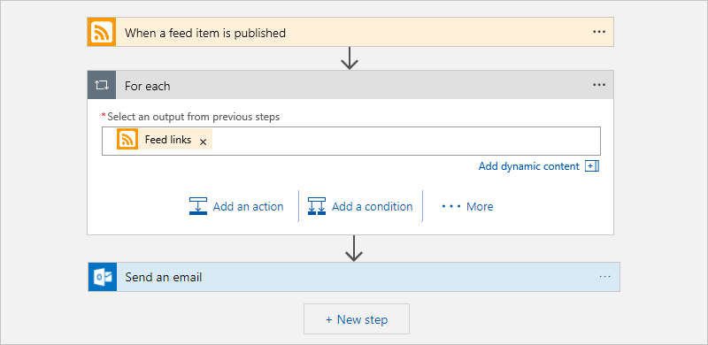

4. To run an action on each array item, 
drag the **Send an email** action into the loop. 

   Your logic app might look something like this example:

   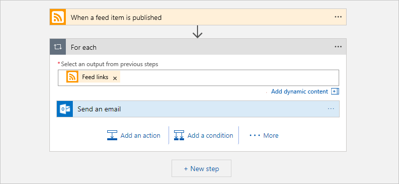

5. Save your logic app. To manually test your logic app, 
on the designer toolbar, choose **Run**.

<a name="for-each-json"></a>

## "Foreach" loop definition (JSON)

If you're working in code view for your logic app, 
you can define the `Foreach` loop in your 
logic app's JSON definition instead, for example:

``` json
"actions": {
   "myForEachLoopName": {
      "type": "Foreach",
      "actions": {
         "Send_an_email": {
            "type": "ApiConnection",
            "inputs": {
               "body": {
                  "Body": "@{item()}",
                  "Subject": "New CNN post @{triggerBody()?['publishDate']}",
                  "To": "me@contoso.com"
               },
               "host": {
                  "api": {
                     "runtimeUrl": "https://logic-apis-westus.azure-apim.net/apim/office365"
                  },
                  "connection": {
                     "name": "@parameters('$connections')['office365']['connectionId']"
                  }
               },
               "method": "post",
               "path": "/Mail"
            },
            "runAfter": {}
         }
      },
      "foreach": "@triggerBody()?['links']",
      "runAfter": {}
   }
}
```

<a name="sequential-foreach-loop"></a>

## "Foreach" loop: Sequential

By default, cycles in a "Foreach" loop run in parallel. 
To run each cycle sequentially, set the loop's **Sequential** option. 
"Foreach" loops must run sequentially when you have nested 
loops or variables inside loops where you expect predictable results. 

1. In the loop's upper right corner, choose **ellipses** (**...**) > **Settings**.

   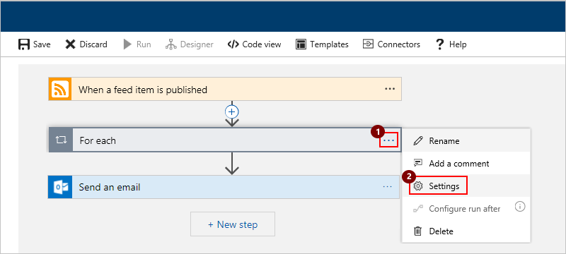

1. Under **Concurrency Control**, turn the 
**Concurrency Control** setting to **On**. 
Move the **Degree of Parallelism** slider to **1**, 
and choose **Done**.

   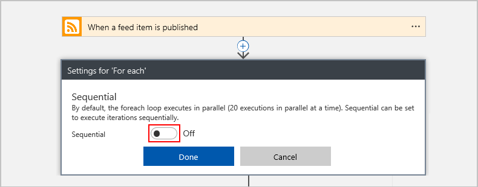

If you're working with your logic app's JSON definition, 
you can use the `Sequential` option by adding the 
`operationOptions` parameter, for example:

``` json
"actions": {
   "myForEachLoopName": {
      "type": "Foreach",
      "actions": {
         "Send_an_email": { }
      },
      "foreach": "@triggerBody()?['links']",
      "runAfter": {},
      "operationOptions": "Sequential"
   }
}
```

<a name="until-loop"></a>

## "Until" loop
  
To run and repeat actions until a condition gets met or a state changes, 
put those actions in an "Until" loop. Your logic app first runs any and 
all actions inside the loop, and then checks the condition or state. 
If the condition is met, the loop stops. Otherwise, the loop repeats.

Here are some common scenarios where you can use an "Until" loop:

* Call an endpoint until you get the response you want.

* Create a record in a database. Wait until a specific field 
in that record gets approved. Continue processing. 

Starting at 8:00 AM each day, this example logic app increments 
a variable until the variable's value equals 10. The logic app 
then sends an email that confirms the current value. 

> [!NOTE]
> These steps use Office 365 Outlook, but you can 
> use any email provider that Logic Apps supports. 
> [Check the connectors list here](https://docs.microsoft.com/connectors/). 
> If you use another email account, the general steps stay the same, 
> but your UI might look slightly different. 

1. Create a blank logic app. In Logic App Designer, 
   under the search box, choose **All**. Search for "recurrence". 
   From the triggers list, select this trigger: **Recurrence - Schedule**

   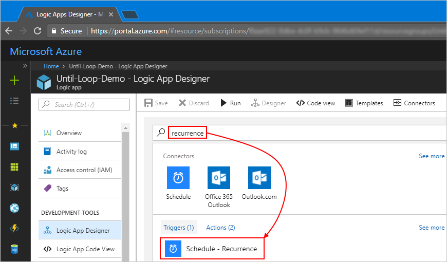

1. Specify when the trigger fires by setting the interval, frequency, 
   and hour of the day. To set the hour, choose **Show advanced options**.

   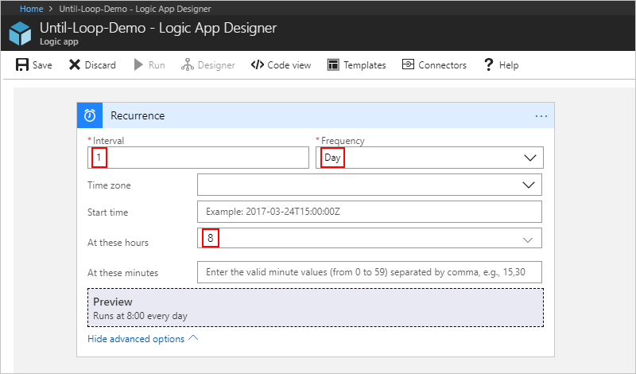

   | Property | Value |
   | -------- | ----- |
   | **Interval** | 1 | 
   | **Frequency** | Day |
   | **At these hours** | 8 |
   ||| 

1. Under the trigger, choose **New step**. 
   Search for "variables", and select this action: 
   **Initialize variable - Variables**

   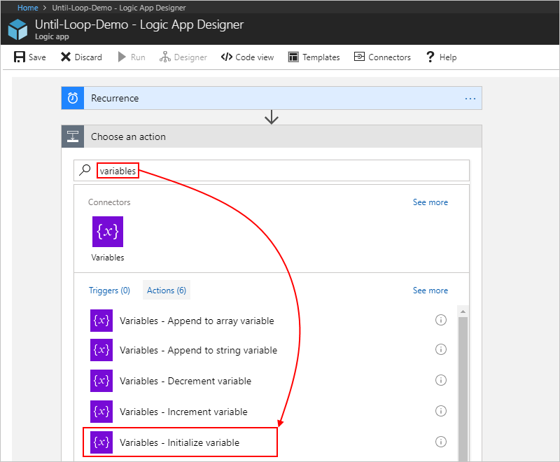

1. Set up your variable with these values:

   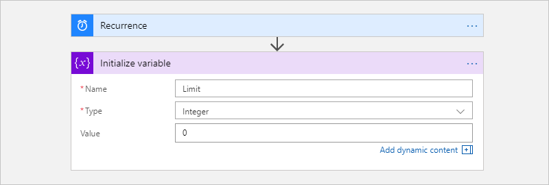

   | Property | Value | Description |
   | -------- | ----- | ----------- |
   | **Name** | Limit | Your variable's name | 
   | **Type** | Integer | Your variable's data type | 
   | **Value** | 0 | Your variable's starting value | 
   |||| 

1. Under the **Initialize variable** action, choose **New step**. 

1. Under the search box, choose **All**. Search for "until", 
   and select this action: **Until - Control**

   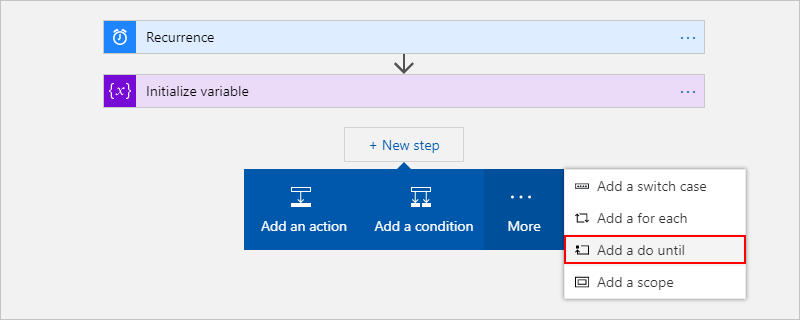

1. Build the loop's exit condition by selecting 
   the **Limit** variable and the **is equal** operator. 
   Enter **10** as the comparison value.

   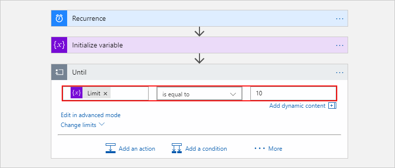

1. Inside the loop, choose **Add an action**. 

1. Under the search box, choose **All**. Search for "variables", 
   and select this action: **Increment variable - Variables**

   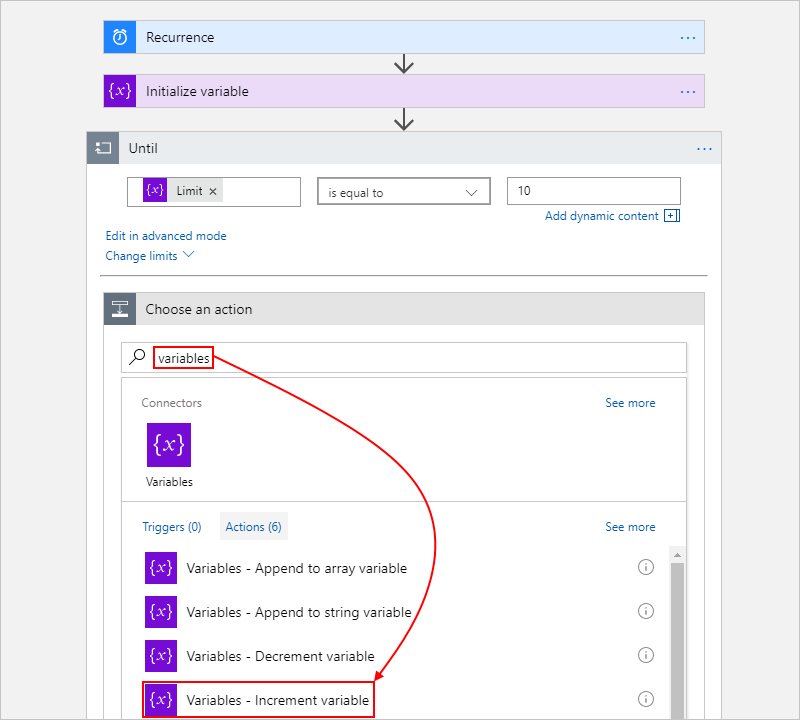

1. For **Name**, select the **Limit** variable. For **Value**, 
     enter "1". 

     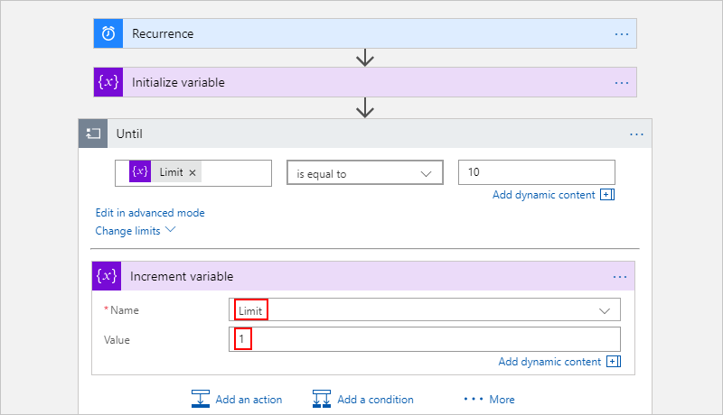

1. Outside and under the loop, choose **New step**. 

1. Under the search box, choose **All**. 
     Find and add an action that sends email, 
     for example: 

     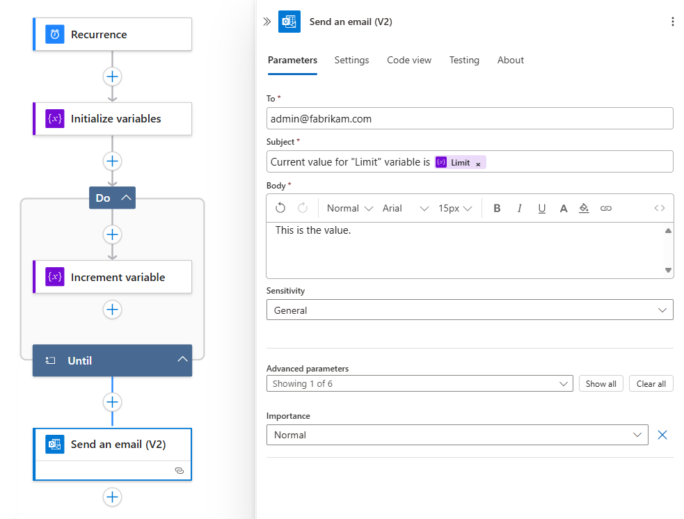

1. If prompted, sign in to your email account.

1. Set the email action's properties. Add the **Limit** 
     variable to the subject. That way, you can confirm the 
     variable's current value meets your specified condition, 
     for example:

      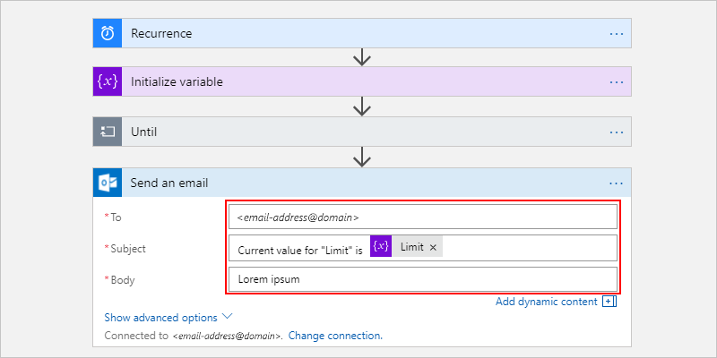

      | Property | Value | Description |
      | -------- | ----- | ----------- | 
      | **To** | *\<email-address\@domain>* | The recipient's email address. For testing, use your own email address. | 
      | **Subject** | Current value for "Limit" is **Limit** | Specify the email subject. For this example, make sure that you include the **Limit** variable. | 
      | **Body** | <*email-content*> | Specify the email message content you want to send. For this example, enter whatever text you like. | 
      |||| 

1. Save your logic app. To manually test your logic app, 
     on the designer toolbar, choose **Run**.

      After your logic starts running, you get an email with the content that you specified:

      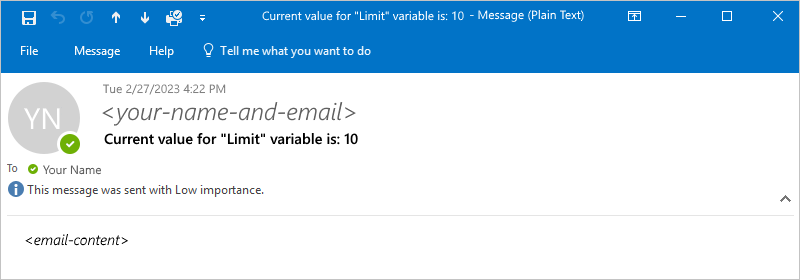

## Prevent endless loops

An "Until" loop has default limits that stop execution 
if any of these conditions happen:

| Property | Default value | Description | 
| -------- | ------------- | ----------- | 
| **Count** | 60 | The highest number of loops that run before the loop exits. The default is 60 cycles. | 
| **Timeout** | PT1H | The most amount of time to run a loop before the loop exits. The default is one hour and is specified in ISO 8601 format. <p>The timeout value is evaluated for each loop cycle. If any action in the loop takes longer than the timeout limit, the current cycle doesn't stop. However, the next cycle doesn't start because the limit condition isn't met. | 
|||| 

To change these default limits, 
choose **Show advanced options** in the loop action shape.

<a name="until-json"></a>

## "Until" definition (JSON)

If you're working in code view for your logic app, 
you can define an `Until` loop in your logic app's 
JSON definition instead, for example:

``` json
"actions": {
   "Initialize_variable": {
      // Definition for initialize variable action
   },
   "Send_an_email": {
      // Definition for send email action
   },
   "Until": {
      "type": "Until",
      "actions": {
         "Increment_variable": {
            "type": "IncrementVariable",
            "inputs": {
               "name": "Limit",
               "value": 1
            },
            "runAfter": {}
         }
      },
      "expression": "@equals(variables('Limit'), 10)",
      // To prevent endless loops, an "Until" loop 
      // includes these default limits that stop the loop. 
      "limit": { 
         "count": 60,
         "timeout": "PT1H"
      },
      "runAfter": {
         "Initialize_variable": [
            "Succeeded"
         ]
      }
   }
}
```

This example "Until" loop calls an HTTP endpoint, 
which creates a resource. The loop stops when the 
HTTP response body returns with `Completed` status. 
To prevent endless loops, the loop also stops 
if any of these conditions happen:

* The loop ran 10 times as specified by the `count` attribute. 
The default is 60 times. 

* The loop ran for two hours as specified by the `timeout` attribute in ISO 8601 format. 
The default is one hour.
  
``` json
"actions": {
   "myUntilLoopName": {
      "type": "Until",
      "actions": {
         "Create_new_resource": {
            "type": "Http",
            "inputs": {
               "body": {
                  "resourceId": "@triggerBody()"
               },
               "url": "https://domain.com/provisionResource/create-resource",
               "body": {
                  "resourceId": "@triggerBody()"
               }
            },
            "runAfter": {},
            "type": "ApiConnection"
         }
      },
      "expression": "@equals(triggerBody(), 'Completed')",
      "limit": {
         "count": 10,
         "timeout": "PT2H"
      },
      "runAfter": {}
   }
}
```

## Get support

* For questions, visit the 
[Azure Logic Apps forum](https://social.msdn.microsoft.com/Forums/en-US/home?forum=azurelogicapps).
* To submit or vote on features and suggestions, 
[Azure Logic Apps user feedback site](https://aka.ms/logicapps-wish).

## Next steps

* [Run steps based on a condition (conditional statements)](../logic-apps/logic-apps-control-flow-conditional-statement.md)
* [Run steps based on different values (switch statements)](../logic-apps/logic-apps-control-flow-switch-statement.md)
* [Run or merge parallel steps (branches)](../logic-apps/logic-apps-control-flow-branches.md)
* [Run steps based on grouped action status (scopes)](../logic-apps/logic-apps-control-flow-run-steps-group-scopes.md)
