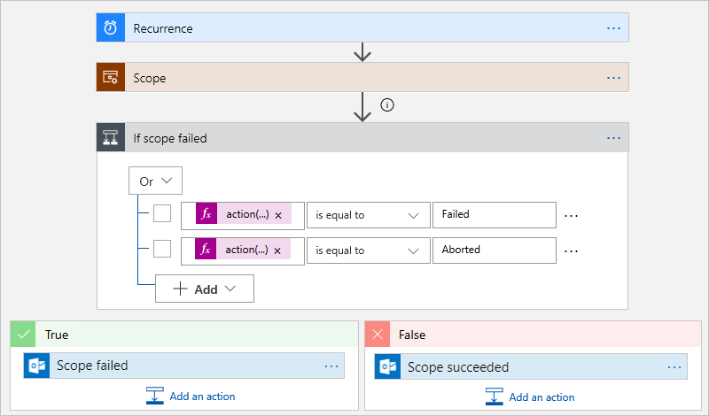
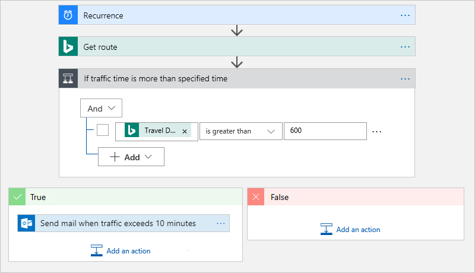
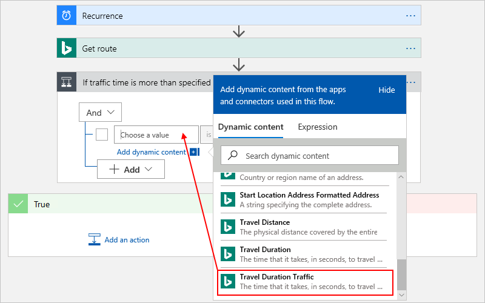
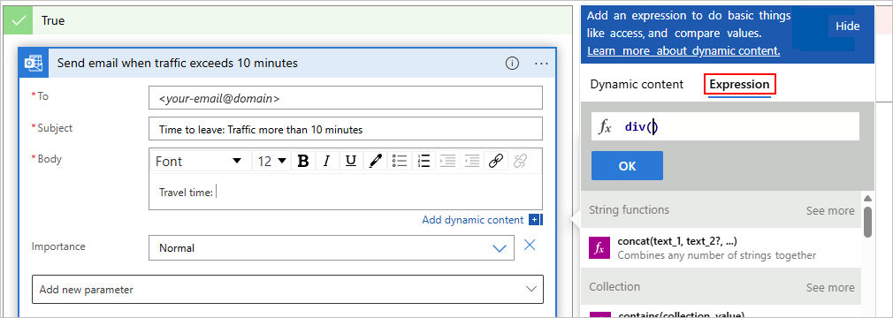
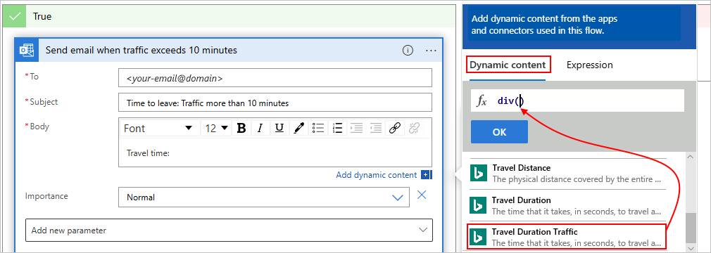
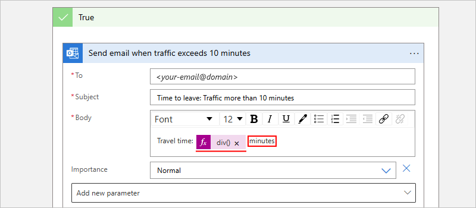
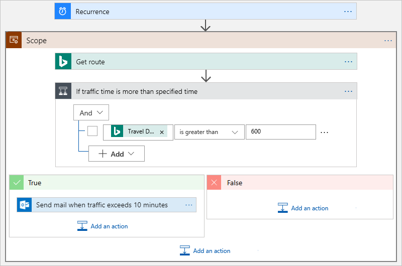
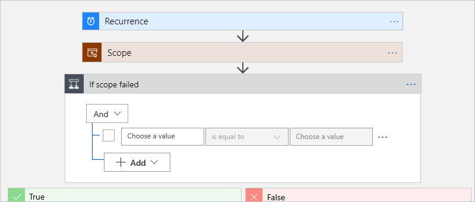
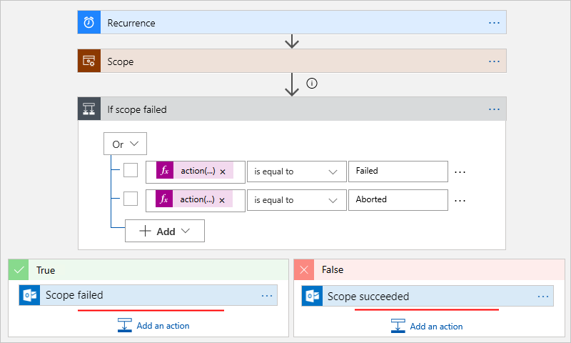

---
# required metadata
title: Add scopes that run actions based on group status - Azure Logic Apps | Microsoft Docs
description: How to create scopes that run workflow actions based on group action status in Azure Logic Apps
services: logic-apps
ms.service: logic-apps
author: ecfan
ms.author: estfan
manager: jeconnoc
ms.date: 03/05/2018
ms.topic: article

# optional metadata
ms.reviewer: klam, LADocs
ms.suite: integration
---

# Create scopes that run workflow actions based on group status in Azure Logic Apps

To run actions only after another group of actions succeed or fail, 
group those actions inside a *scope*. This structure is useful when 
you want to organize actions as a logical group, 
evaluate that group's status, and perform actions 
that are based on the scope's status. 
After all the actions in a scope finish running, 
the scope also gets its own status. For example, 
you can use scopes when you want to implement 
[exception and error handling](../logic-apps/logic-apps-exception-handling.md#scopes). 

To check a scope's status, you can use the same criteria 
that you use to determine a logic apps' run status, 
such as "Succeeded", "Failed", "Cancelled", and so on. 
By default, when all the scope's actions succeed, 
the scope's status is marked "Succeeded." 
But when any action in the scope fails or is canceled, 
the scope's status is marked "Failed." 
For limits on scopes, see 
[Limits and config](../logic-apps/logic-apps-limits-and-config.md). 

For example, here is a high-level logic app that uses a scope to 
run specific actions and a condition to check the scope's status. 
If any actions in the scope fail or end unexpectedly, 
the scope is marked "Failed" or "Aborted" respectively, 
and the logic app sends a "Scope failed" message. 
If all the scoped actions succeed, the logic app sends a "Scope succeeded" message.



## Prerequisites

To follow the example in this article, you need these items:

* An Azure subscription. If you don't have a subscription, 
[sign up for a free Azure account](https://azure.microsoft.com/free/). 

* An email account from any email provider supported by Logic Apps. 
This example uses Outlook.com. If you use a different provider, 
the general flow stays the same, but your UI appears different.

* A Bing Maps key. To get this key, see 
<a href="https://msdn.microsoft.com/library/ff428642.aspx" target="_blank">Get a Bing Maps key</a>.

* Basic knowledge about [how to create logic apps](../logic-apps/quickstart-create-first-logic-app-workflow.md)

## Create sample logic app

First, create this sample logic app so that you can add a scope later:



* A **Schedule - Recurrence** trigger that checks the 
Bing Maps service at an interval that you specify
* A **Bing Maps - Get route** action that checks the 
travel time between two locations
* A conditional statement that checks whether the 
travel time exceeds your specified travel time
* An action that sends you email that current 
travel time exceeds your specified time

You can save your logic app at any time, 
so save your work often.

1. Sign in to the <a href="https://portal.azure.com" target="_blank">Azure portal</a>, 
if you haven't already. Create a blank logic app.

2. Add the **Schedule - Recurrence** trigger with these settings: 
**Interval** = "1" and **Frequency** = "Minute"

   

   > [!TIP]
   > To visually simplify your view and hide each action's details in the designer, 
   > collapse each action's shape as you progress through these steps.

3. Add the **Bing Maps - Get route** action. 

   1. If you don't already have a Bing Maps connection, 
   you're asked to create a connection.

      | Setting | Value | Description |
      | ------- | ----- | ----------- |
      | **Connection Name** | BingMapsConnection | Provide a name for your connection. | 
      | **API Key** | <*your-Bing-Maps-key*> | Enter the Bing Maps key that you previously received. | 
      ||||  

   2. Set up your **Get route** action as shown the table below this image:

       

      For more information about these parameters, see [Calculate a route](https://msdn.microsoft.com/library/ff701717.aspx).

      | Setting | Value | Description |
      | ------- | ----- | ----------- |
      | **Waypoint 1** | <*start*> | Enter your route's origin. | 
      | **Waypoint 2** | <*end*> | Enter your route's destination. | 
      | **Avoid** | None | Enter items to avoid on your route, such as highways, tolls, and so on. For possible values, see [Calculate a route](https://msdn.microsoft.com/library/ff701717.aspx). | 
      | **Optimize** | timeWithTraffic | Select a parameter to optimize your route, such as distance, time with current traffic information, and so on. This example uses this value: "timeWithTraffic" | 
      | **Distance unit** | <*your-preference*> | Enter the unit of distance to calculate your route. This example uses this value: "Mile" | 
      | **Travel mode** | Driving | Enter the mode of travel for your route. This example uses this value "Driving" | 
      | **Transit Date-Time** | None | Applies to transit mode only. | 
      | **Transit Date-Type Type** | None | Applies to transit mode only. | 
      ||||  

4. Add a condition to heck whether the current travel time with 
traffic exceeds a specified time. For this example, follow the steps 
under this image:

   

   1. Rename the condition with this description: **If traffic time more than specified time**

   2. From the parameter list, select the **Travel Duration Traffic** field, 
   which is in seconds. 

   3. For the comparison operator, select this operator: **is greater than**

   4. For the comparison value, enter **600**, which is in seconds 
   and equivalent to 10 minutes.

5. In the condition's **If true** branch, add a "send email" action for your 
email provider. Set up this action with the details as shown in the table under 
this image:

   

   1. For the **To** field, enter your email address for testing purposes.

   2. For the **Subject** field, enter this text:

      ```Time to leave: Traffic more than 10 minutes```

   3. For the **Body** field, enter this text with a trailing space: 

      ```Travel time: ```

      While your cursor appears in the **Body** field, 
      the dynamic content list stays open so that you can 
      select any parameters that are available at this point.

   4. In the dynamic content list, choose **Expression**.

   5. Find and select the **div( )** function.

   6. While your cursor is inside the function's parentheses, 
   choose **Dynamic content** so that you can add the 
   **Traffic Duration Traffic** parameter next.

   7. Under **Get route** in the dynamic parameter list, 
   select the **Traffic Duration Traffic** field.

      

   8. After the field resolves to JSON format, 
   add a **comma** (```,```) followed by the number ```60``` 
   so that you convert the value in **Traffic Duration Traffic** 
   from seconds to minutes. 
   
      ```
      div(body('Get_route')?['travelDurationTraffic'],60)
      ```

      Your expression now looks like this example:

        

   9. Make sure that you choose **OK** when you're done.

  10. After the expression resolves, 
  add this text with a leading space: ``` minutes```
  
      Your **Body** field now looks like this example:

      

6. Save your logic app.

Next, add a scope so that you can group specific actions and evaluate 
their status.

## Add a scope

1. If you haven't already, open your logic app in Logic App Designer. 

2. Add a scope at the workflow location that you want. 
For example:

   * To add a scope between existing steps in the logic app workflow, 
   move the pointer over the arrow where you want to add the scope. 
   Choose the **plus sign** (**+**) > **Add a scope**.

     

     When you want to add a scope at the end of your workflow, 
     at the bottom of your logic app, 
     choose **+ New step** > **...More** > **Add a scope**.

3. Now add the steps or drag existing steps that 
you want to run inside the scope. For this example, 
drag these actions into the scope:
      
   * **Get route**
   * **If traffic time more than specified time**, 
      which includes both the **true** and **false** branches

   Your logic app now looks like this example:

   

4. Under the scope, add a condition that checks the scope's status. 
Rename the condition with this description: **If scope failed**

   
  
5. Build this expression that checks whether the scope's status is 
equal to `Failed` or `Aborted`.

   

   Or, to enter this expression as text, choose **Edit in advanced mode**.

   ```@equals('@result(''Scope'')[0][''status'']', 'Failed, Aborted')```

6. In the **If true** and **If false** branches, 
add the actions that you want to perform, for example, 
send email or a message.

   

7. Save your logic app.

Your finished logic app now looks like this example with all the shapes expanded:


## Test your work

On the designer toolbar, choose **Run**. If all the scoped actions succeed, 
you get a "Scope succeeded" message. If any scoped actions don't succeed, 
you get a "Scope failed" message. 

<a name="scopes-json"></a>

## JSON definition

If you're working in code view, you can define a scope structure 
in your logic app's JSON definition instead. For example, 
here is the JSON definition for trigger and actions in the previous logic app:

``` json
"triggers": {
  "Recurrence": {
    "type": "Recurrence",
    "recurrence": {
       "frequency": "Minute",
       "interval": 1
    },
  }
}
```

```json
"actions": {
  "If_scope_failed": {
    "type": "If",
    "actions": {
      "Scope_failed": {
        "type": "ApiConnection",
        "inputs": {
          "body": {
            "Body": "Scope failed",
            "Subject": "Scope failed",
            "To": "<your-email@domain.com>"
          },
          "host": {
            "connection": {
              "name": "@parameters('$connections')['outlook']['connectionId']"
            }
          },
          "method": "post",
          "path": "/Mail"
        },
        "runAfter": {}
      }
    },
    "else": {
      "actions": {
        "Scope_succeded": {
          "type": "ApiConnection",
          "inputs": {
            "body": {
              "Body": "None",
              "Subject": "Scope succeeded",
              "To": "<your-email@domain.com>"
            },
            "host": {
              "connection": {
               "name": "@parameters('$connections')['outlook']['connectionId']"
              }
            },
            "method": "post",
            "path": "/Mail"
          },
          "runAfter": {}
        }
      }
    },
    "expression": "@equals('@result(''Scope'')[0][''status'']', 'Failed, Aborted')",
    "runAfter": {
      "Scope": [
        "Succeeded"
      ]
    }
  },
  "Scope": {
    "type": "Scope",
    "actions": {
      "Get_route": {
        "type": "ApiConnection",
        "inputs": {
          "host": {
            "connection": {
              "name": "@parameters('$connections')['bingmaps']['connectionId']"
            }
          },
          "method": "get",
          "path": "/REST/V1/Routes/Driving",
          "queries": {
            "distanceUnit": "Mile",
            "optimize": "timeWithTraffic",
            "travelMode": "Driving",
            "wp.0": "<start>",
            "wp.1": "<end>"
          }
        },
        "runAfter": {}
      },
      "If_traffic_time_more_than_specified_time": {
        "type": "If",
        "actions": {
          "Send_mail_when_traffic_exceeds_10_minutes": {
            "type": "ApiConnection",
            "inputs": {
              "body": {
                 "Body": "Travel time:@{div(body('Get_route')?['travelDurationTraffic'], 60)} minutes",
                 "Subject": "Time to leave: Traffic more than 10 minutes",
                 "To": "<your-email@domain.com>"
              },
              "host": {
                "connection": {
                   "name": "@parameters('$connections')['outlook']['connectionId']"
                }
              },
              "method": "post",
              "path": "/Mail"
            },
            "runAfter": {}
          }
        },
        "expression": "@greater(body('Get_route')?['travelDurationTraffic'], 600)",
        "runAfter": {
          "Get_route": [
            "Succeeded"
          ]
        }
      }
    },
    "runAfter": {}
  }
}
```

## Get support

* For questions, visit the 
[Azure Logic Apps forum](https://social.msdn.microsoft.com/Forums/en-US/home?forum=azurelogicapps).
* To submit or vote on features and suggestions, 
visit the [Azure Logic Apps user feedback site](http://aka.ms/logicapps-wish).

## Next steps

* [Run steps based on a condition (conditional statements)](../logic-apps/logic-apps-control-flow-conditional-statement.md)
* [Run steps based on different values (switch statements)](../logic-apps/logic-apps-control-flow-switch-statement.md)
* [Run and repeat steps (loops)](../logic-apps/logic-apps-control-flow-loops.md)
* [Run or merge parallel steps (branches)](../logic-apps/logic-apps-control-flow-branches.md)
