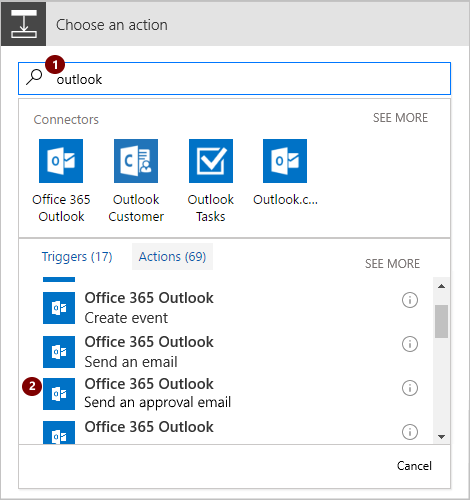
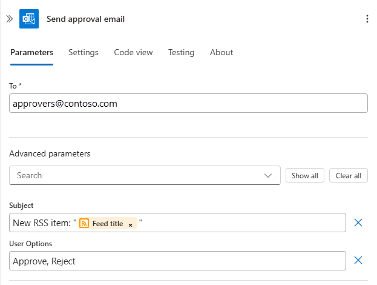
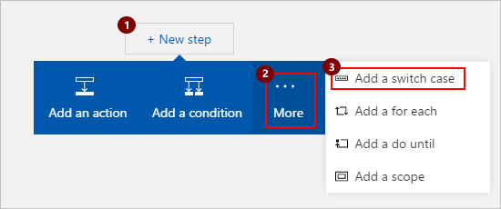
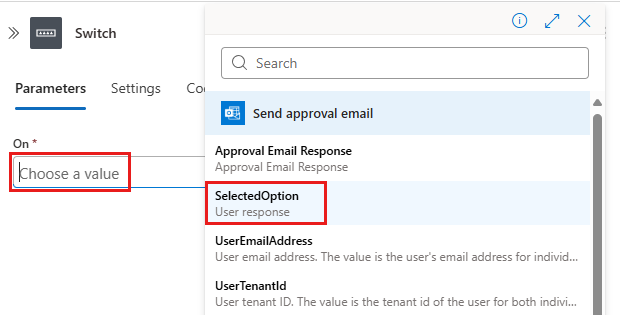
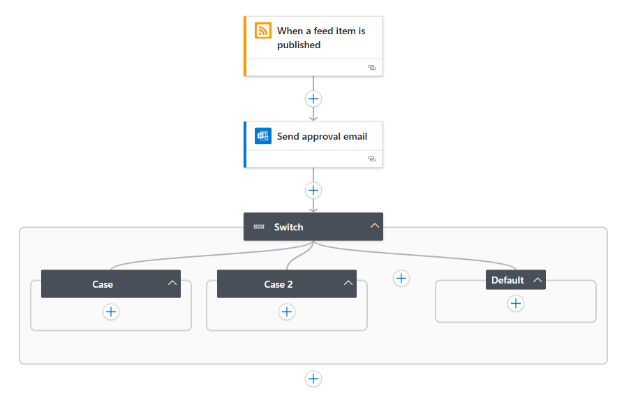
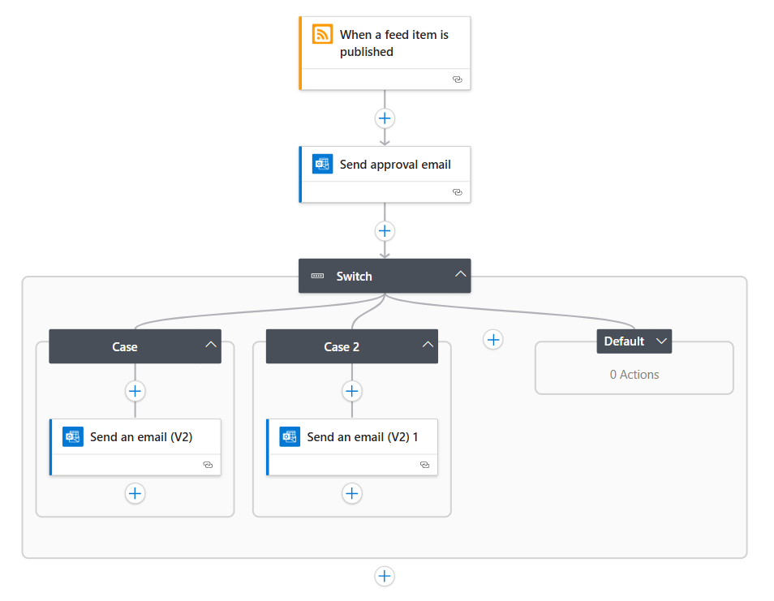

# Create switch actions that run workflow actions based on specific values in Azure Logic Apps

[!INCLUDE [logic-apps-sku-consumption](../../includes/logic-apps-sku-consumption.md)]

To run specific actions based on the values of objects, expressions, 
or tokens, add a *switch* action. This structure evaluates the object, 
expression, or token, chooses the case that matches the result, 
and runs specific actions only for that case. When the switch action runs, 
only one case should match the result.

For example, suppose you want a logic app that takes different 
steps based on an option selected in email. In this example, 
the logic app checks a website's RSS feed for new content. 
When a new item appears in the RSS feed, the logic app sends 
email to an approver. Based on whether the approver selects 
"Approve" or "Reject", the logic app follows different steps.

> [!TIP]
> Like all programming languages, switch actions 
> support only equality operators. If you need other 
> relational operators, such as "greater than", use a 
> [condition action](../logic-apps/logic-apps-control-flow-conditional-statement.md).
> To ensure deterministic execution behavior, 
> cases must contain a unique and static value 
> instead of dynamic tokens or expressions.

## Prerequisites

* An Azure subscription. If you don't have a subscription, 
[sign up for a free Azure account](https://azure.microsoft.com/free/).

* To follow the example in this article, [create the example Consumption logic app workflow](../logic-apps/quickstart-create-example-consumption-workflow.md) with an Outlook.com account or a work or school account.

  1. When you add the action to send email, 
  find and select this action instead: 
  **Send an approval email**

     

  1. Provide the required fields, like the email address 
  for the person who gets the approval email. 
  Under **User Options**, enter "Approve, Reject".

     

## Add a switch action

1. For this example, add a switch action at the end 
your sample workflow. After the last step, choose **New step**.

   When you want to add a switch action between steps, 
   move the pointer over the arrow where you want to add 
   the switch action. Choose the **plus sign** (**+**) 
   that appears, then choose **Add an action**.

1. In the search box, enter "switch" as your filter. 
Select this action: **Switch - Control**

   

   A switch action appears with one case and a default case. 
   By default, a switch action requires at least one case plus the default case. 

   

1. Click inside the **On** box so that the dynamic content list appears. 
From that list, select the **SelectedOption** field whose output 
determines the action to perform. 

   

1. To handle the cases where the approver selects `Approve` or `Reject`, 
add another case between **Case** and **Default**. 

   

1. Add these actions to the corresponding cases:

   | Case # | **SelectedOption** | Action |
   |--------|--------------------|--------|
   | Case 1 | **Approve** | Add the Outlook **Send an email** action for sending details about the RSS item only when the approver selected **Approve**. |
   | Case 2 | **Reject** | Add the Outlook **Send an email** action for notifying other approvers that the RSS item was rejected. |
   | Default | None | No action necessary. In this example, the **Default** case is empty because **SelectedOption** has only two options. |
   |||

   

1. Save your logic app. 

   To manually test this example, choose **Run** until the logic app 
   finds a new RSS item and sends an approval email. 
   Select **Approve** to observe the results.

## JSON definition

Now that you created a logic app using a switch action, 
let's look at the high-level code definition behind the switch action.

``` json
"Switch": {
   "type": "Switch",
   "expression": "@body('Send_approval_email')?['SelectedOption']",
   "cases": {
      "Case": {
         "actions": {
           "Send_an_email": {}
         },
         "case" : "Approve"
      },
      "Case_2": {
         "actions": {
           "Send_an_email_2": {}
         },
         "case": "Reject"
      }
   },
   "default": {
      "actions": {}
   },
   "runAfter": {
      "Send_approval_email": [
         "Succeeded"
      ]
   }
}
```

| Label | Description |
|-------|-------------|
| `"Switch"`         | The name of the switch action, which you can rename for readability |
| `"type": "Switch"` | Specifies that the action is a switch action |
| `"expression"`     | In this example, specifies the approver's selected option that's evaluated against each case as declared later in the definition |
| `"cases"` | Defines any number of cases. For each case, `"Case_*"` is the default name for that case, which you can rename for readability |
| `"case"` | Specifies the case's value, which must be a constant and unique value that the switch action uses for comparison. If no cases match the switch expression result, the actions in the `"default"` section are run. | 
| | | 

## Get support

* For questions, visit the 
[Microsoft Q&A question page for Azure Logic Apps](/answers/topics/azure-logic-apps.html).
* To submit or vote on features or suggestions, visit the 
[Azure Logic Apps user feedback site](https://aka.ms/logicapps-wish).

## Next steps

* [Run steps based on a condition (condition action)](../logic-apps/logic-apps-control-flow-conditional-statement.md)
* [Run and repeat steps (loops)](../logic-apps/logic-apps-control-flow-loops.md)
* [Run or merge parallel steps (branches)](../logic-apps/logic-apps-control-flow-branches.md)
* [Run steps based on grouped action status (scopes)](../logic-apps/logic-apps-control-flow-run-steps-group-scopes.md)
