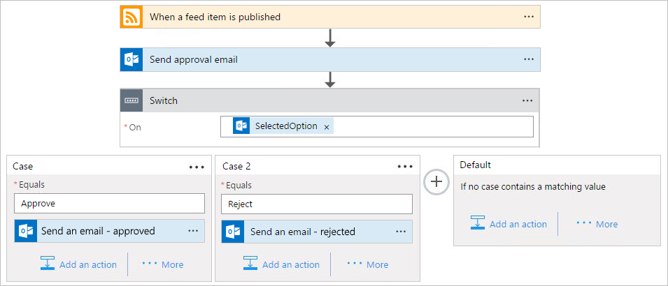

---
# required metadata
title: Add switch statements to workflows - Azure Logic Apps | Microsoft Docs
description: How to create switch statements that control workflow actions based on specific values in Azure Logic Apps
services: logic-apps
ms.service: logic-apps
author: ecfan
ms.author: estfan
manager: jeconnoc
ms.date: 03/05/2018
ms.topic: article

# optional metadata
ms.reviewer: klam, LADocs
ms.suite: integration
---

# Create switch statements that run workflow actions based on specific values in Azure Logic Apps

To run specific actions based on the values of objects, expressions, or tokens, 
add a *switch* statement. This structure evaluates the object, expression, or token, 
chooses the case that matches the result, and runs specific actions only for that case. 
When the switch statement runs, only one case should match the result.

For example, suppose you want a logic app that takes different steps 
based on an option selected in email. In this example, 
the logic app checks a website's RSS feed for new content. 
When a new item appears in the RSS feed, 
the logic app sends email to an approver. 
Based on whether the approver selects "Approve" or "Reject", 
the logic app follows different steps.

> [!TIP]
> Like all programming languages, 
> switch statements support only equality operators. 
> If you need other relational operators, 
> such as "greater than", use a [conditional statement](#conditions).
> To ensure deterministic execution behavior, 
> cases must contain a unique and static value 
> instead of dynamic tokens or expressions.

## Prerequisites

* An Azure subscription. If you don't have a subscription, 
[sign up for a free Azure account](https://azure.microsoft.com/free/).

* To follow the example in this article, [create this sample logic app](../logic-apps/quickstart-create-first-logic-app-workflow.md) 
with an Outlook.com or Office 365 Outlook account.

  1. When you add the action to send email, 
  select **Send an approval email** instead.

     

  2. Provide the required fields, like the email address 
  for the person who gets the approval email. 
  Under **User Options**, enter "Approve, Reject".

     

## Add a switch statement

1. At the end of the sample workflow, 
choose **+ New step** > **... More** > **Add a switch case**. 

   

   A switch statement appears with one case and a default case. 
   A switch statement requires at least one case plus the default case. 

   When you want to add a switch statement between steps, 
   move the pointer over the arrow where you want to add the switch statement. 
   Choose the **plus sign** (**+**) that appears, then choose **Add a switch case**.

4. In the **On** box, select the **SelectedOption** field whose output 
determines the action to perform. 
   
   You can select the field from the **Add dynamic content** list that appears.

5. To handle the cases where the approver selects `Approve` or `Reject`, 
add another case between **Case** and **Default**. 
   
6. Add these actions to the corresponding cases:

   | Case # | **SelectedOption** | Action |
   |:------ |:-------------------|:------ |
   | Case 1 | **Approve** | Add the Outlook **Send an email** action for sending details about the RSS item only when the approver selected **Approve**. |
   | Case 2 | **Reject** | Add the Outlook **Send an email** action for notifying other approvers that the RSS item was rejected. |
   | Default | \<none\> | No action necessary. In this example, the **Default** case is empty because **SelectedOption** has only two options. |
   |         |          |

   

7. Save your logic app. 

   To manually test this example, choose **Run** until the logic app 
   finds a new RSS item and sends an approval email. 
   Select **Approve** to observe the results.

## JSON definition

Now that you created a logic app using a switch statement, 
let's look at the high-level code definition behind the switch statement.

``` json
"Switch": {
   "type": "Switch",
   "expression": "@body('Send_approval_email')?['SelectedOption']",
   "cases": {
      "Case" : {
         "actions" : {
           "Send_an_email": { }
         },
         "case" : "Approve"
      },
      "Case_2" : {
         "actions" : {
           "Send_an_email_2": { }
         },
         "case" : "Reject"
      }
   },
   "default": {
      "actions": {}
   },
   "runAfter": {
      "Send_approval_email": [
         "Succeeded"
      ]
   }
}
```

| Label              | Description |
| :----------------- | :---------- |
| `"Switch"`         | The name of the switch statement, which you can rename for readability |
| `"type": "Switch"` | Specifies that the action is a switch statement |
| `"expression"`     | In this example, specifies the approver's selected option that's evaluated against each case as declared later in the definition |
| `"cases"` | Defines any number of cases. For each case, `"Case_*"` is the default name for that case, which you can rename for readability |
| `"case"` | Specifies the case's value, which must be a constant and unique value that the switch statement uses for comparison. If no cases match the switch expression result, the actions in the `"default"` section are run.
|           |         |

## Get support

* For questions, visit the 
[Azure Logic Apps forum](https://social.msdn.microsoft.com/Forums/en-US/home?forum=azurelogicapps).
* To submit or vote on features or suggestions, visit the 
[Azure Logic Apps user feedback site](http://aka.ms/logicapps-wish).

## Next steps

* [Run steps based on a condition (conditional statements)](../logic-apps/logic-apps-control-flow-conditional-statement.md)
* [Run and repeat steps (loops)](../logic-apps/logic-apps-control-flow-loops.md)
* [Run or merge parallel steps (branches)](../logic-apps/logic-apps-control-flow-branches.md)
* [Run steps based on grouped action status (scopes)](../logic-apps/logic-apps-control-flow-run-steps-group-scopes.md)
