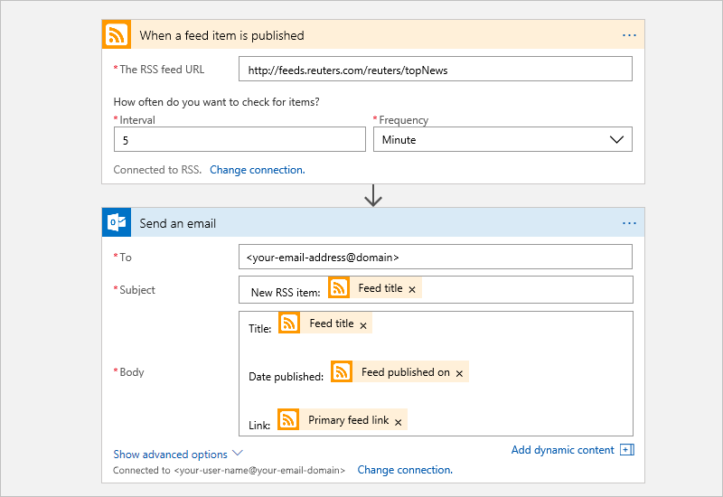
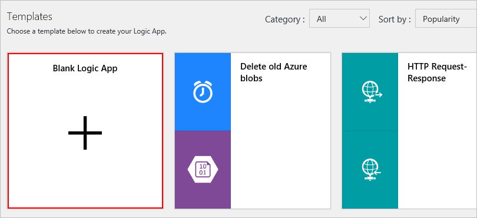
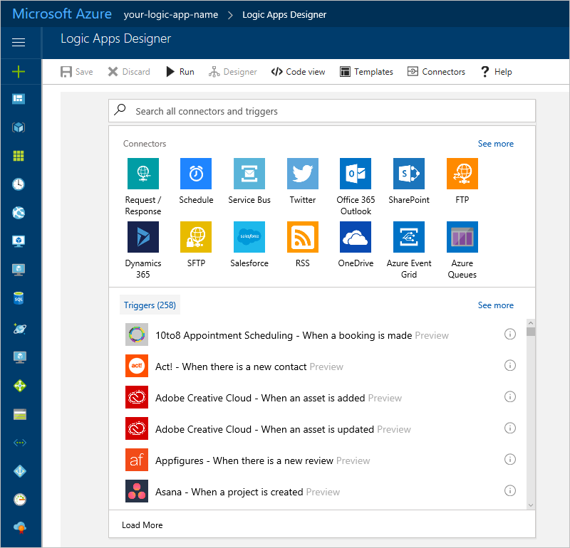
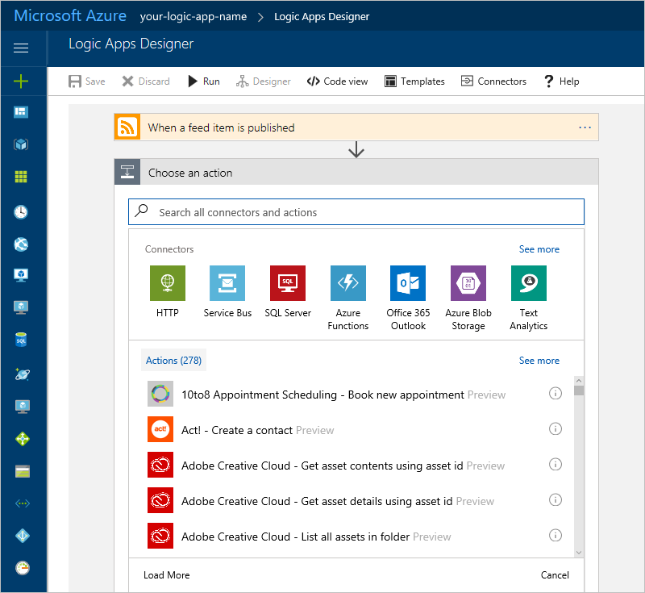
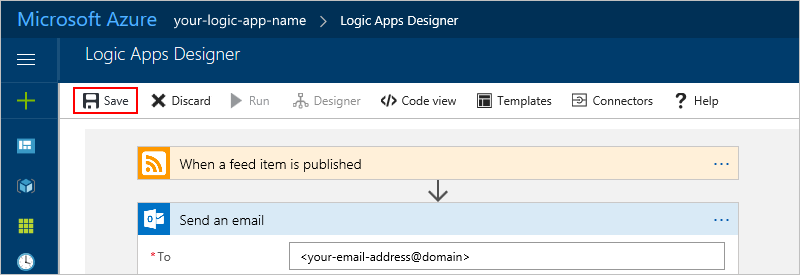
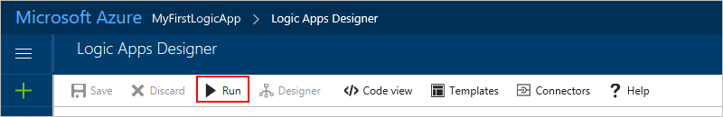
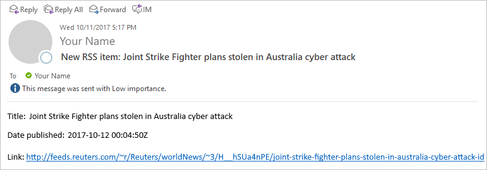
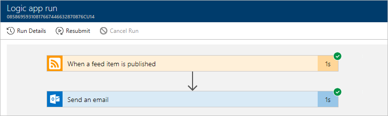
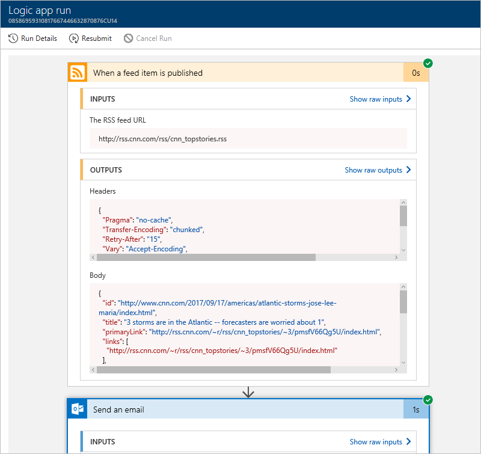
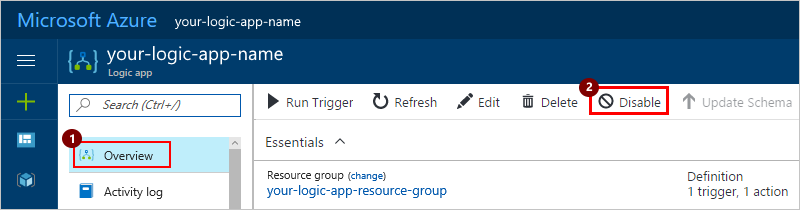

# Create your first logic app for automating workflows and processes through the Azure portal

Without writing code, you can integrate systems and services 
by building and running automated workflows with 
[Azure Logic Apps](../logic-apps/logic-apps-what-are-logic-apps.md). 
This tutorial creates a basic logic app that checks an RSS feed 
for new content on a website. For each new item in the feed, 
the logic app sends an email. This tutorial walks you through 
building this logic app:

In this tutorial, you learn how to:

> [!div class="checklist"]
> * Create a blank logic app.
> * Add a trigger for starting your logic app when an RSS feed item is published.
> * Add an action for sending email with details about the RSS feed item.
> * Run and check your logic app.

## Prerequisites

* An Azure subscription. If you don't have a subscription, you can 
[start with a free Azure account](https://azure.microsoft.com/free/). 
Otherwise, you can [sign up for a Pay-As-You-Go subscription](https://azure.microsoft.com/pricing/purchase-options/).

* An email account from [any email provider supported by Azure Logic Apps](../connectors/apis-list.md) 
for sending notifications. For example, you can use Office 365 Outlook, 
Outlook.com, Gmail, or another supported provider. This tutorial uses Office 365 Outlook.

  > [!TIP]
  > If you have a personal 
  > [Microsoft account](https://account.microsoft.com/account), 
  > you have an Outlook.com account. 
  > Otherwise, if you have an Azure work or school account, 
  > you have an Office 365 Outlook account.

* A link to a website's RSS feed. This example uses the 
[RSS feed for top stories from the CNN.com website](http://rss.cnn.com/rss/cnn_topstories.rss): 
`http://rss.cnn.com/rss/cnn_topstories.rss`

## 1. Create a blank logic app 

1. Sign in to the [Azure portal](https://portal.azure.com "Azure portal").

2. From the main Azure menu, choose 
**New** > **Enterprise Integration** > **Logic App**.

   

3. Create your logic app with the settings specified in the table.

   

   | Setting | Suggested value | Description | 
   | ------- | --------------- | ----------- | 
   | **Name** | *your-logic-app-name* | Provide a unique logic app name. | 
   | **Subscription** | *your-Azure-subscription* | Select the Azure subscription that you want to use. | 
   | **Resource group** | *your-Azure-resource-group* | Create or select an Azure resource group, which helps you organize and manage related Azure resources. | 
   | **Location** | *your-Azure-region* | Select the datacenter region for deploying your logic app. | 
   |||| 

4. When you're ready, select **Pin to dashboard**, then choose **Create**.

   You've now created an Azure resource for your logic app. 
   After Azure deploys your logic app, the Logic Apps Designer 
   shows you templates for common patterns so you can get started faster.

   > [!NOTE] 
   > When you select **Pin to dashboard**, 
   > your logic app appears on the Azure dashboard after deployment, 
   > and automatically opens in Logic Apps Designer. 
   > If not, you can manually find and open your logic app.

5. For now, under **Templates**, choose **Blank Logic App** 
so that you can build your logic app from scratch.

   

   The Logic Apps Designer now shows you available [*connectors*](../connectors/apis-list.md) and their [*triggers*](../logic-apps/logic-apps-what-are-logic-apps.md#logic-app-concepts), 
   which you use for starting your logic app workflow.

   

## 2. Add a trigger for starting the workflow

Every logic app must start with a [*trigger*](../logic-apps/logic-apps-what-are-logic-apps.md#logic-app-concepts). 
The trigger fires when a specific event happens or when new data 
meets the condition that you've set. The Logic Apps engine then 
creates a logic app instance for running your workflow. 
Each time that the trigger fires, the engine creates another 
separate instance that runs your logic app workflow.

1. In the search box, type "rss" as your filter. 
Select this trigger: **RSS - When a feed item is published** 

   

2. Provide the link for the website's RSS feed that you want to track, for example, `http://rss.cnn.com/rss/cnn_topstories.rss`. 
Set the interval and frequency for the recurrence. 
In this example, set these properties to check the feed every day. 

   

3. Save your work for now. On the designer toolbar, choose **Save**.
To collapse and hide the trigger's details, choose the trigger's title bar.

   

   Your logic app is now live but doesn't do anything 
   other than check for new items in the RSS feed 
   until you add actions to the workflow. 

## 3. Add an action that responds to the trigger

Now add an [*action*](../logic-apps/logic-apps-what-are-logic-apps.md#logic-app-concepts), 
which is a task that your logic app workflow performs. In this example, 
add an action that sends email when a new item appears in the RSS feed.

1. In the Logic Apps Designer, under the trigger, 
choose **+ New step** > **Add an action**.

   

   The designer shows [available connectors](../connectors/apis-list.md) so 
   that you can select an action to perform when your trigger fires.

   

2. In the search box, enter "send email" as your filter. 
Based on your email provider, find and select the matching connector. 
Then select the "send email" action for your connector. 
For example: 

   * For an Azure work or school account, 
   select the Office 365 Outlook connector. 
   * For personal Microsoft accounts, 
   select the Outlook.com connector. 
   * For Gmail accounts, select the Gmail connector. 

   We're going to continue with the Office 365 Outlook connector. 
   If you use a different provider, the steps remain the same, 
   but your UI might appear different. 

   

3. When you're prompted for credentials, 
sign in with the username and password for your email account. 

4. Provide the details specified in the table and 
choose the fields that you want included in the mail.

   * To select fields available for your workflow, 
   click in an edit box so that the **Dynamic content** list opens, 
   or choose **Add dynamic content**. 
   
   * To view any other available fields, 
   choose **See more** for each section in the **Dynamic content** list. 

   * To add blank lines in your content, press Shift + Enter.
   
   * To close the **Dynamic content** list, 
   choose **Add dynamic content**.

   

   | Setting | Suggested value | Description | 
   | ------- | --------------- | ----------- | 
   | **To** | *recipient-email-address* | Enter the recipient's email address. For testing purposes, you can use your own email address. | 
   | **Subject** | New CNN post: **Feed title** | Enter the content for the email's subject. 
For this tutorial, enter the suggested text and select the trigger's **Feed title** field, which shows the feed item's title. | 
   | **Body** | Title: **Feed title** 
Date published: **Feed primary link** 
Link: **Primary feed link** | Enter the content for the email's body. 
For this tutorial, enter the suggested text, then select these trigger fields: 
- **Feed title**, which shows the feed item's title again  - **Feed published on**, which shows the item's published date and time  - **Primary feed link**, which shows the URL for the feed item | 
   |||| 

   > [!NOTE] 
   > If you select a field that represents an array, 
   > the designer automatically adds a "For each" loop 
   > around the action that references the array. 
   > That way, your logic app performs that action on each array item.

5. When you're done, save your changes. On the designer toolbar, choose **Save**.

   

   To test your logic app now, continue to the next section.

## 4. Run and test your logic app workflow

1. To manually run your logic app for testing, 
on the designer toolbar bar, choose **Run**. 
Or, you can let your logic app check the specified 
RSS feed based on the schedule that you set up.

   

   If your logic app finds new items, 
   the logic app sends email that 
   includes your selected data, for example:

   

   If no new items are found, your logic app 
   skips the action that sends email. 
   So, nothing else happens.

2. To review your logic app's runs and trigger history, 
on your logic app menu, choose **Overview**.
To view more details about a run, choose the row for that run.

   

   > [!TIP]
   > If you don't find the data that you expect, 
   > on the toolbar, try choosing **Refresh**.

   Whether the run passed or failed, the Run Details view 
   shows the steps that passed or failed. 

   

   For more details about your logic app's status, runs history, 
   and trigger history, or to diagnose your logic app, see 
   [Troubleshoot your logic app](../logic-apps/logic-apps-diagnosing-failures.md).

3. To view the inputs and outputs for each step, 
expand the step that you want to review. 
This information can help you diagnose and debug 
problems in your logic app. For example:

   

   For more information, see 
   [Monitor your logic app](../logic-apps/logic-apps-monitor-your-logic-apps.md).

Congratulations, you've now created and run your first basic logic app. 
This example shows how easily you can create workflows that automate 
processes for integrating systems and services - all without code.

> [!NOTE]
> Your logic app continues running until you turn off your app. 
> To temporarily turn off your app, continue to the next section.

## Clean up resources

This tutorial uses resources and performs actions 
that might incur charges on your Azure subscription. 
When you're done with the tutorial and testing, 
make sure that you disable or delete any resources 
where you don't want to incur charges.

You can stop your logic app from running and 
sending email without deleting the app. 
On your logic app menu, choose **Overview**. 
On the toolbar, choose **Disable**.

## FAQ

**Q:** What else can I do with my logic app?  
**A:** There are other tasks that you can perform, 
for example, edit, view the JSON definition, 
review the activity log, or delete your logic app.

To find other logic app management tasks, 
review these commands in the logic app menu:

| Task | Steps | 
| ---- | ----- | 
| View your app's status, runs and trigger history, and general information | Choose **Overview**. | 
| Edit your app | Choose **Logic App Designer**. | 
| View your app's workflow JSON definition | Choose **Logic App Code View**. | 
| View operations performed on your logic app | Choose **Activity log**. | 
| View past versions for your logic app | Choose **Versions**. | 
| Turn off your app temporarily | Choose **Overview**, then on the toolbar, choose **Disable**. | 
| Delete your app | Choose **Overview**, then on the toolbar, choose **Delete**. Enter your logic app's name, and choose **Delete**. | 
||| 

## Get support

* For questions about Azure Logic Apps, visit the [Azure Logic Apps forum](https://social.msdn.microsoft.com/Forums/en-US/home?forum=azurelogicapps).

* Want to help improve Azure Logic Apps and connectors? Vote on or submit ideas at the 
[Azure Logic Apps User Voice site](http://aka.ms/logicapps-wish).

## Next steps

* [Create your logic app with Visual Studio](../logic-apps/logic-apps-deploy-from-vs.md)
* [Add conditions and run workflows](../logic-apps/logic-apps-use-logic-app-features.md)
*	[Logic app templates](../logic-apps/logic-apps-use-logic-app-templates.md)
* [Create logic apps from Azure Resource Manager templates](../logic-apps/logic-apps-arm-provision.md)
* [Logic Apps usage metering](../logic-apps/logic-apps-pricing.md) 
* [Logic Apps pricing](https://azure.microsoft.com/pricing/details/logic-apps)
