# Create your first logic app workflow to automate processes between cloud apps and cloud services

Without writing any code, you can automate business processes more easily and quickly 
when you create and run workflows with [Azure Logic Apps](logic-apps-what-are-logic-apps.md). 
This first example shows how to create a basic logic app workflow that checks 
an RSS feed for new content on a website. When new items appear in the website's feed, 
the logic app sends email from an Outlook or Gmail account.

To create and run a logic app, you need these items:

* An Azure subscription. If you don't have a subscription, you can 
[start with a free Azure account](https://azure.microsoft.com/free/). 
Otherwise, you can [sign up for a Pay-As-You-Go subscription](https://azure.microsoft.com/pricing/purchase-options/).

  Your Azure subscription is used for billing logic app usage. Learn how 
  [usage metering](../logic-apps/logic-apps-pricing.md) and 
  [pricing](https://azure.microsoft.com/pricing/details/logic-apps) 
  work for Azure Logic Apps.

Also, this example requires these items:

* An Outlook.com, Office 365 Outlook, or Gmail account

	> [!TIP]
	> If you have a personal 
	> [Microsoft account](https://account.microsoft.com/account), 
	> you have an Outlook.com account. 
	> Otherwise, if you have an Azure work or school account, 
	> you have an **Office 365 Outlook** account.

* A link to a website's RSS feed. This example uses the 
[RSS feed for top stories from the CNN.com website](http://rss.cnn.com/rss/cnn_topstories.rss): 
`http://rss.cnn.com/rss/cnn_topstories.rss`

## Add a trigger that starts your workflow

A [*trigger*](./logic-apps-what-are-logic-apps.md#logic-app-concepts) 
is an event that starts your logic app workflow 
and is the first item that your logic app needs.

1. Sign in to the [Azure portal](https://portal.azure.com "Azure portal").

2. From the left menu, choose **New** > **Enterprise Integration** > **Logic App** 
as shown here:

	 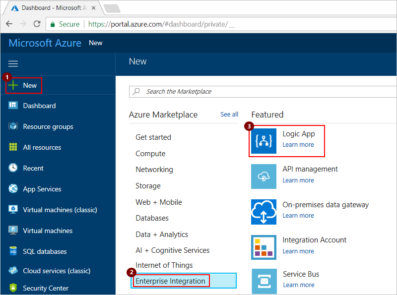

   > [!TIP]
   > You can also choose **New**, then in the search box, 
   > type `logic app`, and press Enter. 
   > Then choose **Logic App** > **Create**.

3. Name your logic app and select your Azure subscription. 
Now create or select an Azure resource group, which helps you organize and 
manage related Azure resources. Finally, select the datacenter location 
for hosting your logic app. When you're ready, 
choose **Pin to dashboard** and then **Create**.

	 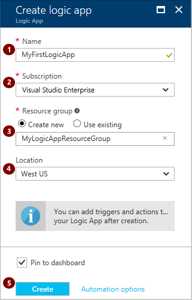

   > [!NOTE]
   > When you select **Pin to dashboard**, 
   > your logic app appears on the Azure dashboard after deployment, 
   > and opens automatically. If your logic app doesn't appear on the dashboard, 
   > on the **All resources** tile, choose **See More**, and select your logic app. 
   > Or on the left menu, choose **More services**. Under **Enterprise Integration**, 
   > choose **Logic Apps**, and select your logic app.

4. When you open your logic app for the first time, 
the Logic App Designer shows templates that 
you can use to get started. 
For now, choose **Blank Logic App** so you can 
build your logic app from scratch.

	The Logic App Designer opens and shows 
 	available services and *triggers* that 
 	you can use in your logic app.

5. In the search box, type `RSS`, and select 
this trigger: **RSS - When a feed item is published** 

	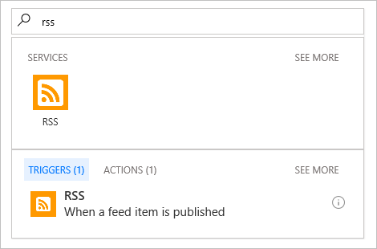

6. Enter the link for the website's RSS feed that you want to track. 

	 You can also change **Frequency** and **Interval**. 
	 These settings determine how often your logic app checks for 
	 new items and returns all items found during that time span.

	 For this example, let's check every day for 
     top stories posted to the CNN website.

	 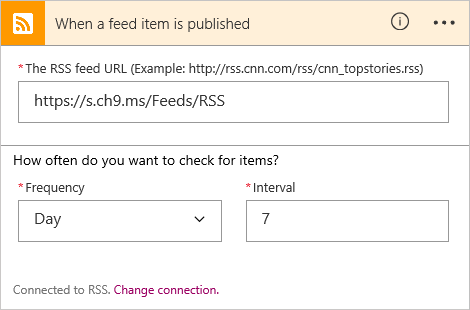

7. Save your work for now. (On the designer command bar, choose **Save**.)

   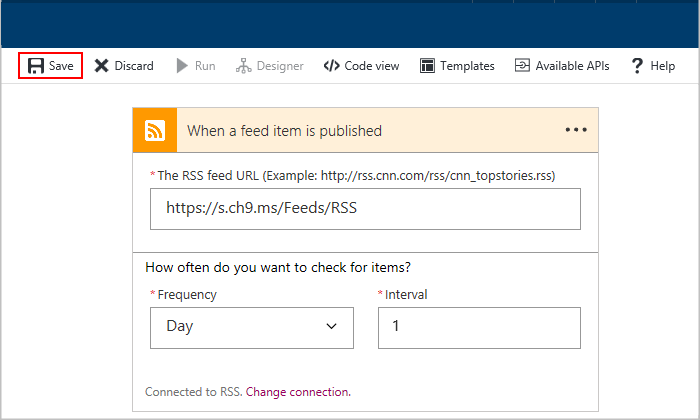

   When you save, your logic app goes live, but currently, 
   your logic app only checks for new items in the specified RSS feed. 
   To make this example more useful, we add an action that your 
   logic app performs after your trigger fires.

## Add an action that responds to your trigger

An [*action*](./logic-apps-what-are-logic-apps.md#logic-app-concepts) 
is a task performed by your logic app workflow. After you add a trigger to your logic app, 
you can add an action to perform operations with data generated by that trigger. 
For our example, we now add an action that sends email when new items appear in the website's RSS feed.

1. In the designer, under your trigger, choose **New step** > **Add an action** as shown here:

   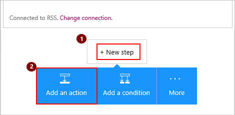

   The designer shows [available connectors](../connectors/apis-list.md) so 
   that you can select an action to perform when your trigger fires.

2. Based on your email account, follow the steps for Outlook or Gmail.

   * To send email from your Outlook account, in the search box, 
   enter `outlook`. Under **Services**, choose **Outlook.com** for personal Microsoft accounts, 
   or choose **Office 365 Outlook** for Azure work or school accounts. 
   Under **Actions**, select **Send an email**.

       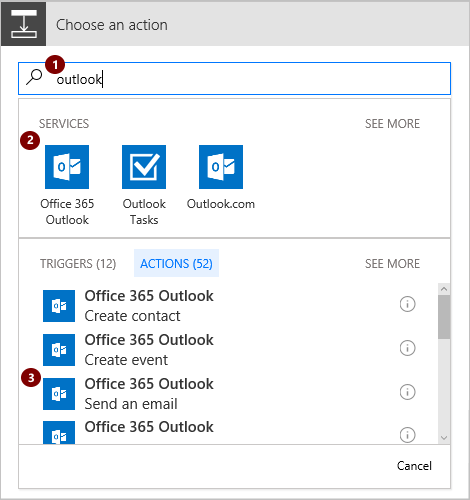

   * To send email from your Gmail account, in the search box, enter `gmail`. 
   Under **Actions**, select **Send email**.

       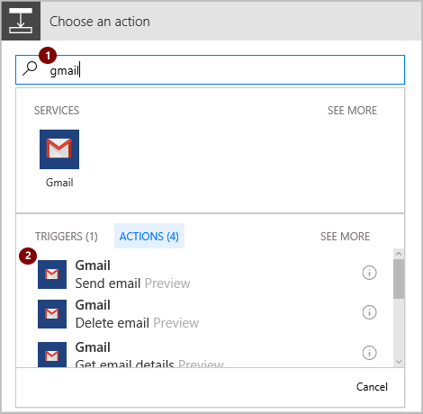

3. When you're prompted for credentials, 
sign in with the username and password for your email account. 

4. Provide the details for this action, like the destination email address, 
and choose the parameters for the data to include in the email, 
for example:

   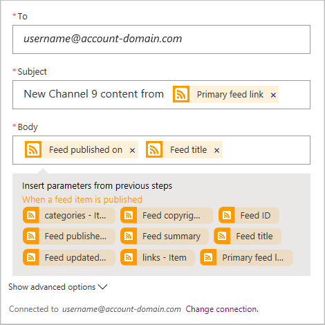

	So if you chose Outlook, 
	your logic app might look like this example:

	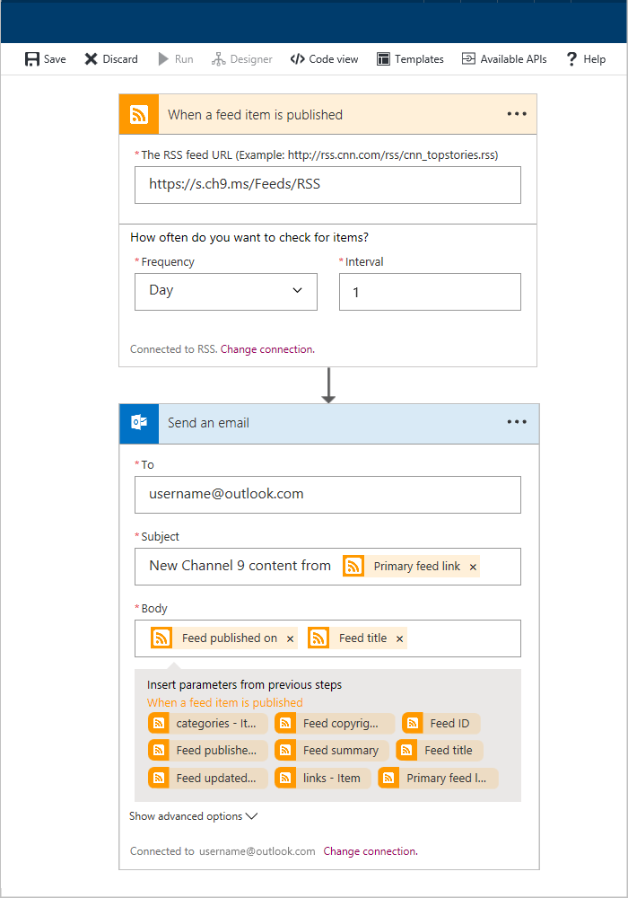

5.	Save your changes. (On the designer command bar, choose **Save**.)

6. You can now manually run your logic app for testing. 
On the designer command bar, choose **Run**. Otherwise, 
you can let your logic app check the specified RSS feed 
based on the schedule that you set up.

   If your logic app finds new items, 
   the logic app sends email that includes your selected data. 
   If no new items are found, your logic app skips 
   the action that sends email.

7. To monitor and check your logic app's run and trigger history, 
on your logic app menu, choose **Overview**.

   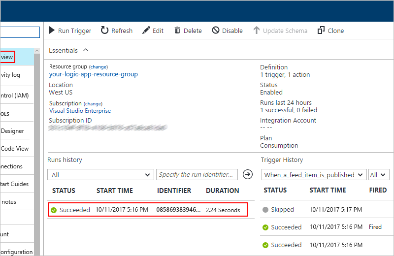

   > [!TIP]
   > If you don't find the data that you expect, on the command bar, 
   > try choosing **Refresh**.

   To learn more about your logic app's status or run and trigger 
   history, or to diagnose your logic app, see 
   [Troubleshoot your logic app](logic-apps-diagnosing-failures.md).

      > [!NOTE]
      > Your logic app continues running until you turn off your app. 
      > To turn off your app for now, on your logic app menu, 
      > choose **Overview**. On the command bar, choose **Disable**.

Congratulations, you just set up and run your first basic logic app. 
You also learned how easily you can create workflows that automate 
processes, and integrate cloud apps and cloud services - all without code.

## Manage your logic app

To manage your app, you can perform tasks like check the status, 
edit, view history, turn off, or delete your logic app.

1. Sign in to the [Azure portal](https://portal.azure.com "Azure portal").

2. On the left menu, choose **More services**. Under **Enterprise Integration**, 
choose **Logic Apps**. Select your logic app. 

   In the logic app menu, you can find these logic app management tasks:

   |Task|Steps| 
   |:---|:---| 
   | View your app's status, execution history, and general information| Choose **Overview**.| 
   | Edit your app | Choose **Logic App Designer**. | 
   | View your app's workflow JSON definition | Choose **Logic App Code View**. | 
   | View operations performed on your logic app | Choose **Activity log**. | 
   | View past versions for your logic app | Choose **Versions**. | 
   | Turn off your app temporarily | Choose **Overview**, then on the command bar, choose **Disable**. | 
   | Delete your app | Choose **Overview**, then on the command bar, choose **Delete**. Enter your logic app's name, and choose **Delete**. | 

## Get help

To ask questions, answer questions, and learn what other Azure Logic Apps users are doing, 
visit the [Azure Logic Apps forum](https://social.msdn.microsoft.com/Forums/en-US/home?forum=azurelogicapps).

To help improve Azure Logic Apps and connectors, vote on or submit ideas at the 
[Azure Logic Apps user feedback site](http://aka.ms/logicapps-wish).

## Next steps

*  [Add conditions and run workflows](../logic-apps/logic-apps-use-logic-app-features.md)
*	 [Logic app templates](../logic-apps/logic-apps-use-logic-app-templates.md)
*  [Create logic apps from Azure Resource Manager templates](../logic-apps/logic-apps-arm-provision.md)
