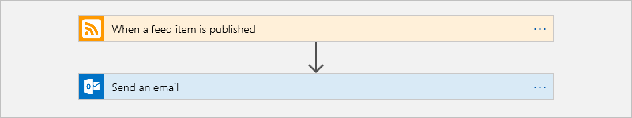
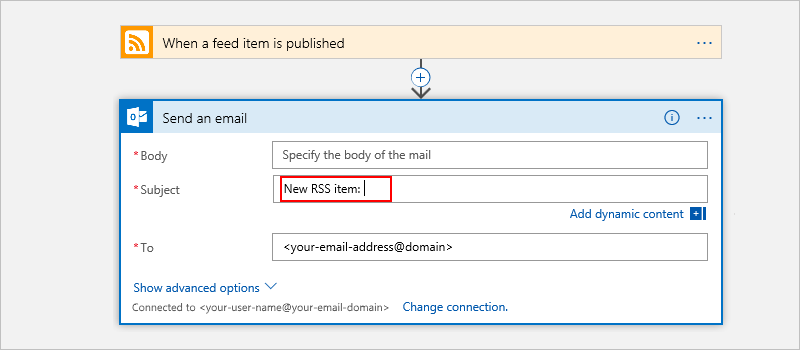
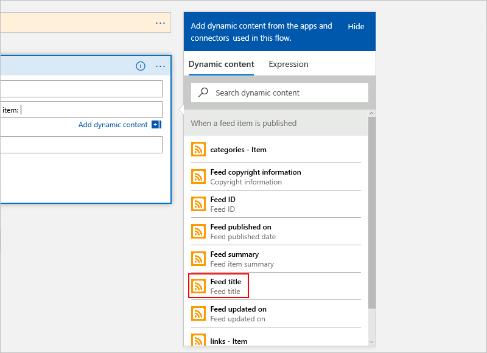
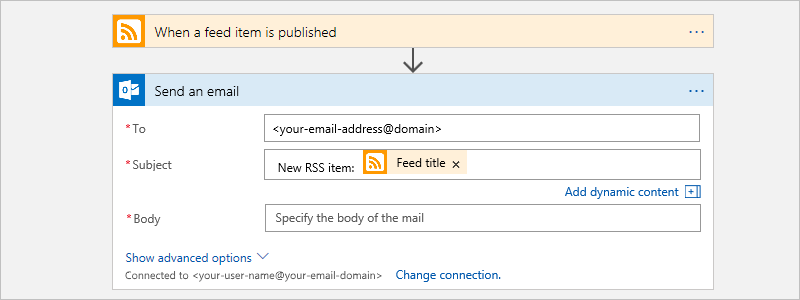
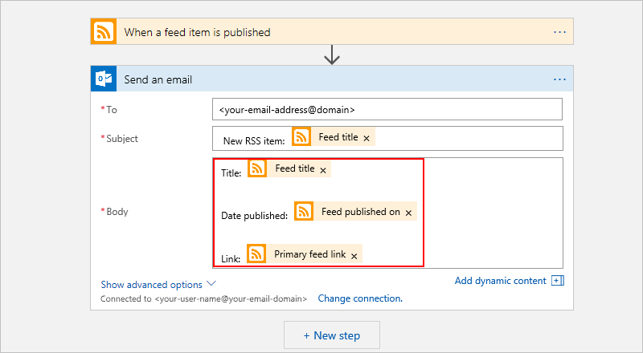
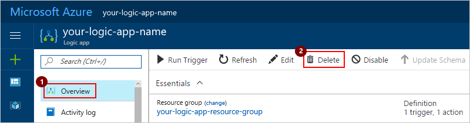

# Automate your first workflow to process data with a logic app

To integrate systems and services more quickly for your organization, 
you can automate workflows and business processes with 
[Azure Logic Apps](../logic-apps/logic-apps-what-are-logic-apps.md). 
This quickstart introduces how easily you can build 
and run an automated workflow by creating a logic app. 
The example app shows how to automate a workflow that 
checks a website RSS feed for new items 
and sends email for each item.

This sample logic app sends an email like this example:

And here is the high-level logic app workflow that you build:

In this quickstart, you learn how to:

> [!div class="checklist"]
> * Create a blank logic app.
> * Add a trigger to start the workflow when a new item appears in the RSS feed.
> * Add an action to send email with details about the RSS feed item.
> * Run your logic app workflow.

If you don't have an Azure subscription, 
[sign up for a free Azure account](https://azure.microsoft.com/free/) before you begin.

## Prerequisites

* An email account from any email provider that's 
supported by Azure Logic Apps for sending notifications. 
For example, you can use Office 365 Outlook, Outlook.com, 
or Gmail. For other supported email connectors, 
[review the connectors list](https://docs.microsoft.com/connectors/). 
This quickstart uses Office 365 Outlook.

  > [!TIP]
  > If you have a personal 
  > [Microsoft account](https://account.microsoft.com/account), 
  > you have an Outlook.com account. 
  > Otherwise, if you have an Azure work or school account, 
  > you have an Office 365 Outlook account.

* A link to a website's RSS feed. This example uses the 
[RSS feed for top stories from the Reuters website](http://feeds.reuters.com/reuters/topNews): 
`http://feeds.reuters.com/reuters/topNews`

This quickstart doesn't require writing code, 
but Logic Apps supports other scenarios that use code, 
for example, running your own code from a logic app with [Azure Functions](../azure-functions/functions-overview.md).

## Create a blank logic app 

1. Sign in to the [Azure portal](https://portal.azure.com "Azure portal"). 

2. From the main Azure menu, choose 
**New** > **Enterprise Integration** > **Logic App**.

   

3. Create your logic app with the settings in the table under this image:

   

   | Setting | Suggested value | Description | 
   | ------- | --------------- | ----------- | 
   | **Name** | *your-logic-app-name* | Provide a unique logic app name. | 
   | **Subscription** | *your-Azure-subscription-name* | Select the Azure subscription that you want to use. | 
   | **Resource group** | *your-Azure-resource-group-name* | Create an [Azure resource group](../azure-resource-manager/resource-group-overview.md) for this logic app and to organize all resources associated with this app. | 
   | **Location** | *your-Azure-datacenter-region* | Select the datacenter region for deploying your logic app, for example, West US. | 
   | **Log Analytics** | Off | Turn on diagnostic logging for your logic app, but for this quickstart, keep the **Off** setting. | 
   |||| 

4. When you're ready, select **Pin to dashboard**. 
That way, your logic app automatically appears on 
your Azure dashboard and opens after deployment. 
Choose **Create**.

   > [!NOTE]
   > If you don't want to pin your logic app, 
   > you must manually find and open your logic app 
   > after deployment so you can continue.

   After Azure deploys your logic app, the Logic Apps Designer 
   opens and shows a page with an introduction video. 
   Under the video, you can find templates for common logic app patterns. 
   This quickstart builds your logic app from scratch. 

5. Scroll past the introduction video and common triggers. 
Under **Templates**, choose **Blank Logic App**.

   

   The Logic Apps Designer shows you available connectors and their triggers, 
   which are used to start logic app workflows.

   

## Add a trigger to detect new items

Every logic app workflow starts with a [trigger](../logic-apps/logic-apps-what-are-logic-apps.md#logic-app-concepts). 
The trigger fires when a specific event happens or when new data meets 
the condition that you set. Each time the trigger fires, 
the Logic Apps engine creates a logic app instance that starts and runs your workflow.

1. In the search box, enter "rss" as your filter. 
Select this trigger: **RSS - When a feed item is published** 

   

2. Provide the link for the RSS feed that you want to monitor, 
for example, `http://feeds.reuters.com/reuters/topNews`. 
Set the interval and frequency for the recurrence. 
This example checks the feed every five minutes.

   

   Logic Apps creates a connection to the RSS feed.

   > [!TIP]
   > To simplify your view in the designer, 
   > you can collapse and hide a shape's details - 
   > just click inside the shape's title bar.

3. Save your work. On the designer toolbar, choose **Save**. 

   

   Your logic app is now live but doesn't do anything other than 
   check the RSS feed. So, let's add an action that responds when the trigger fires.

## Add an action to send email

Now that you have a trigger, add an 
[action](../logic-apps/logic-apps-what-are-logic-apps.md#logic-app-concepts) 
that sends email when a new item appears in the RSS feed. 
Your workflow performs this action after the trigger fires.

1. In the Logic Apps Designer, under the trigger, 
choose **+ New step** > **Add an action**.

   

   The designer shows the actions that your logic app can 
   perform when the trigger fires.

   

2. In the search box, enter "send email" as your filter. 
Find and select the email connector that you want to use. 
Then select the "send email" action for that connector. 
For example: 

   * For Azure work or school accounts, 
   select Office 365 Outlook. 
   * For personal Microsoft accounts, 
   select Outlook.com. 
   * For Gmail accounts, select Gmail. 

   This quickstart uses Office 365 Outlook. 
   If you use a different email provider, the steps stay the same, 
   but your UI might appear different. 

   

3. When you're prompted for credentials, 
sign in with the username and password for your email account. 

   Logic Apps creates a connection to your email account.

4. Now specify the data that you want to include in the email. 

   1. In the **To** box, enter the recipient's email address. 
   For testing purposes, you can use your own email address.

   2. In the **Subject** box, enter the email subject. 
   For this example, enter "New RSS item: " as shown:

      

      When you click inside the edit box, 
      the **Add dynamic content list** opens 
      so that you can select available data fields 
      to include in your action. 
      If the dynamic content list doesn't open, 
      under the respective edit box, 
      choose **Add dynamic content**.

   3. From the **Add dynamic content** list, 
   select **Feed title**, which includes the item's title in the email.

      

      When you're done, the email subject looks like this example:

      

      > [!NOTE] 
      > If you happen to select a field that contains an array, 
      > such as **categories-item**, the designer automatically 
      > adds a "For each" loop around the action that references that field. 
      > That way, your logic app can perform that action on each array item. 
      > 
      > To remove the loop, choose the ellipses (**...**) 
      > on the loop's title bar, then choose **Delete**.

   4. In the **Body** box, enter the content for the email body. 
   For this example, enter this text and select these fields:

      

      | Field | Description | 
      | ----- | ----------- | 
      | **Feed title** | Show the item's title. | 
      | **Feed published on** | Show the item's publish date and time. | 
      | **Primary feed link** | Show the URL for the item. | 
      ||| 

      > [!TIP]
      > To add blank lines in an edit box, press Shift + Enter. 
      
5. Save your work. On the designer toolbar, choose **Save**.

   

## Run your logic app workflow

To manually start your logic app, 
on the designer toolbar bar, choose **Run**. 
Otherwise, you can wait for your logic app 
to run on the schedule that you set up.

If the RSS feed has new items, 
your logic app sends an email for each new item. 
For example, here is a sample Outlook email that this logic app sends:

If the feed doesn't have new items, 
your logic app skips the step that sends email 
and waits for the next interval before checking again. 

> [!TIP]
> If you don't get any emails, check your junk email folder. 
> Otherwise, if you're unsure that your logic app ran correctly, 
> see [Troubleshoot your logic app](../logic-apps/logic-apps-diagnosing-failures.md).

Congratulations, you've now created and run your first logic app. 
This quickstart showed how easily and quickly you can create 
automated workflows for integrating systems and services.

## Clean up resources

Your logic app continues running and possibly incurring charges 
on your Azure subscription until you turn off or delete your app. 
Also, when you create connections for your logic app, 
those connections remain, even after you delete your logic app. 

When you're done, make sure that you disable or delete any 
resources where you don't want to incur charges or don't want to keep. 
To delete all resources that you created for this quickstart, 
delete the Azure resource group that you created for this logic app. 

### Delete resource group

If you don't want to keep anything related to your logic app, 
delete the resource group that you created for this quickstart 
and all related resources. Learn more about 
[how to manage Azure resource groups](../azure-resource-manager/resource-group-portal.md#manage-resources).

1. On the Azure menu, choose **Resource groups**.

2. Choose the resource group that you want to delete. 
On the resource group menu, choose **Overview**, if not already selected. 

3. Review all the resources in the group that you want to delete. 
When you're ready, choose **Delete resource group** on the resource group toolbar.

### Turn off logic app

To stop running your logic app without deleting your work, 
disable your app. 

On your logic app menu, choose **Overview**. 
On the toolbar, choose **Disable**.

  

  > [!TIP]
  > If you don't see the logic app menu, 
  > try returning to the Azure dashboard, 
  > and reopen your logic app.

### Delete logic app

You can delete just your logic app, but keep all other related resources, 
like the connections that you created.

1. On the logic app menu, choose **Overview**. 
On the toolbar, choose **Delete**. 

   

   > [!TIP]
   > If you don't see the logic app menu, 
   > try returning to the Azure dashboard, 
   > and reopen your logic app.

2. Confirm that you want to delete your logic app, 
then choose **Delete**.

## Get support

* For questions, visit the [Azure Logic Apps forum](https://social.msdn.microsoft.com/Forums/en-US/home?forum=azurelogicapps).
* To submit or vote on feature ideas, visit the [Logic Apps user feedback site](http://aka.ms/logicapps-wish).

## Next steps

> [!div class="nextstepaction"]
> [Create logic app workflows from prebuilt templates](../logic-apps/logic-apps-create-logic-apps-from-templates.md)