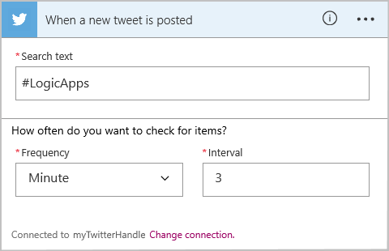
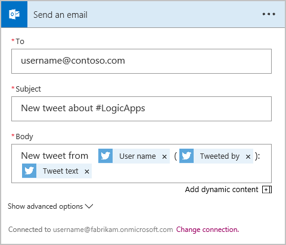

# Create a new logic app connecting SaaS services
This topic demonstrates how, in just a few minutes, you can get started with [Azure Logic Apps](logic-apps-what-are-logic-apps.md). We'll walk through a simple workflow that lets you send interesting tweets to your email.

To use this scenario, you need:

* An Azure subscription
* A Twitter account
* A Outlook.com or Office 365 Outlook account

## Create a new logic app to email you tweets

1. Sign in to the [Azure portal](https://portal.azure.com). 

2. From the left menu, choose **New** > **Enterprise Integration** > **Logic App**.

	You can also choose **New**, then in the search box, 
	type `logic app`, and press Enter. Choose **Logic App** > **Create**.

3. Enter a name for your logic app, select your Azure subscription, 
create or select an Azure resource group, select a location, and choose **Create**.

	If you select **Pin to Dashboard**, the logic app automatically opens after deployment.

4. When you open your logic app for the first time, you can select from a template to start.
For now click **Blank Logic App** to build this from scratch. 

5. The first item you need to create is the trigger. This is the event that starts your logic app. 
In the search box, search for **twitter**, and select **When a new tweet is posted**. 
Sign in with the user name and password for your Twitter account.

6. Now type in a search term to trigger your logic app.

   

	The **Frequency** and **Interval** determine 
	how often your logic app checks for new tweets, 
	and returns all tweets during that time span.

7. Select **New step**, and choose **Add an action** or **Add a condition**.

	When you select **Add an Action**, 
	you can search [available connectors](../connectors/apis-list.md) to choose an action. 

8. In the search box, search for **outlook**, and select **Send an email** 
to send email from your Outlook account to any specified email address.

   

9. Now you have to fill out the parameters for the email you want:

   

10. Finally, you can select **Save** to make your logic app live.

## Manage your logic app after creation

Now your logic app is up and running. It will periodically check for tweets with the search term entered. When it finds a matching tweet, it will send you an email. Finally, you'll see how to disable the app, or see how it’s doing.

1. Go to the [Azure portal](https://portal.azure.com).

2. On the left menu, click **More services**. Under **Enterprise Integration**, 
choose **Logic Apps**. Select your logic app.

	*	To view your app's status, execution history, and general information, 
	on the logic app menu, choose **Overview**. If you don't find the
	data that you expect, on the command bar, choose **Refresh**.

	*	To edit your app, on the logic app menu, choose **Logic App Designer**.

	*	To turn off your app temporarily, on the logic app menu, 
	choose **Overview**. On the command bar, choose **Disable**.

	*	To delete your app, on the logic app menu, choose **Overview**. 
	On the command bar, choose **Delete**. Enter your logic app's name, 
	and choose **Delete**.

In less than 5 minutes you were able to set up a simple logic app running in the cloud. To learn more about using Logic Apps features, see [Use logic app features]. To learn about the Logic App definitions themselves, see [author Logic App definitions](../logic-apps/logic-apps-author-definitions.md).

<!-- Shared links -->
[Azure portal]: https://portal.azure.com
[Use logic app features]: logic-apps-create-a-logic-app.md