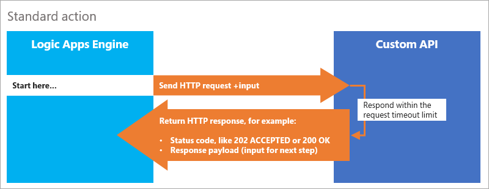
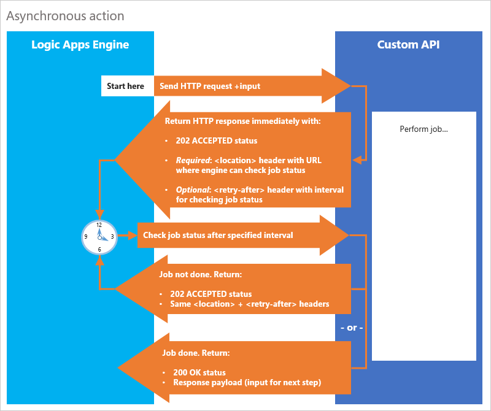
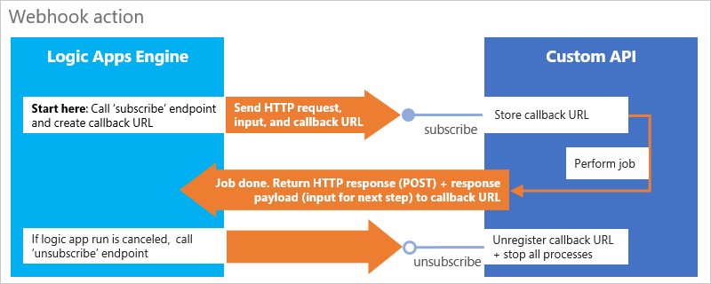
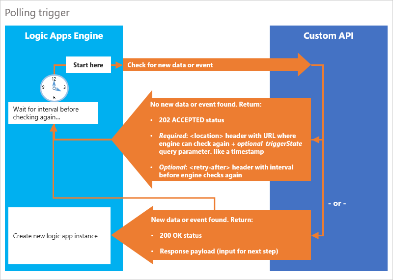
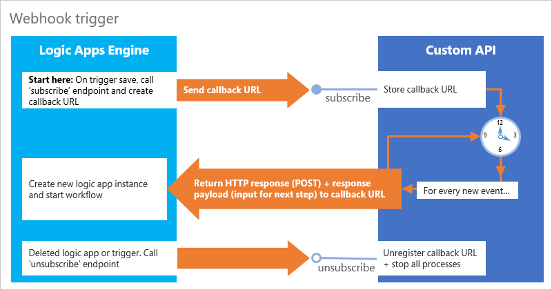

# Create custom APIs as connectors for logic apps

Although Azure Logic Apps offers [100+ built-in connectors](../connectors/apis-list.md) 
that you can use in logic app workflows, you might want to call APIs, systems, 
and services that aren't available as connectors. You can create your own 
custom APIs that provide actions and triggers to use in logic apps. 
Here are other reasons why you might want to create your own APIs to 
use as connectors in logic apps:

* Extend your current system integration and data integration workflows.
* Help customers use your service to manage professional or personal tasks.
* Expand the reach, discoverability, and use for your service.

Basically, connectors are web APIs that use REST for pluggable interfaces, 
[Swagger metadata format](http://swagger.io/specification/) for documentation, 
and JSON as their data exchange format. Because connectors are REST APIs 
that communicate through HTTP endpoints, you can use any language, 
like .NET, Java, or Node.js, for building connectors. 
You can also host your APIs on [Azure App Service](../app-service/app-service-value-prop-what-is.md), 
a platform-as-a-service (PaaS) offering that provides one of the best, easiest, 
and most scalable ways for API hosting. 

For custom APIs to work with logic apps, your API can provide 
[*actions*](./logic-apps-what-are-logic-apps.md#logic-app-concepts) 
that perform specific tasks in logic app workflows. Your API can also act as a 
[*trigger*](./logic-apps-what-are-logic-apps.md#logic-app-concepts) 
that starts a logic app workflow when new data or an event meets a specified condition. 
This topic describes common patterns that you can follow 
for building actions and triggers in your API, 
based on the behavior that you want your API to provide.

> [!TIP] 
> Although you can deploy your APIs as 
> [web apps](../app-service-web/app-service-web-overview.md), 
> consider deploying your APIs as 
> [API apps](../app-service-api/app-service-api-apps-why-best-platform.md), 
> which can make your job easier when you build, host, and consume APIs 
> in the cloud and on premises. You don't have to change any code in your 
> APIs -- just deploy your code to an API app. Learn how to 
> [build API apps created with ASP.NET](../app-service-api/app-service-api-dotnet-get-started.md), 
> [Java](../app-service-api/app-service-api-java-api-app.md), 
> or [Node.js](../app-service-api/app-service-api-nodejs-api-app.md). 
>
> For API App samples built for logic apps, visit the 
> [Azure Logic Apps GitHub repository](http://github.com/logicappsio) or [blog](http://aka.ms/logicappsblog).

## Helpful tools

A custom API works best with logic apps when the API also has a 
[Swagger document](http://swagger.io/specification/) 
that describes the API's operations and parameters.
Many libraries, like [Swashbuckle](https://github.com/domaindrivendev/Swashbuckle), 
can automatically generate the Swagger file for you. 
To annotate the Swagger file for display names, property types, and so on, 
you can also use [TRex](https://github.com/nihaue/TRex) 
so that your Swagger file works well with logic apps.

## Action patterns

For logic apps to perform tasks, your custom API should provide 
[*actions*](./logic-apps-what-are-logic-apps.md#logic-app-concepts). 
Each operation in your API maps to an action. A basic action is a 
controller that accepts HTTP requests and returns HTTP responses. 
So for example, a logic app sends an HTTP request to your web app or API app. 
Your app then returns an HTTP response, along with content that the logic app can process.

For a standard action, you can write an HTTP request method in your API and 
describe that method in a Swagger file. You can then call your API directly 
with an [HTTP action](../connectors/connectors-native-http.md) 
or an [HTTP + Swagger](../connectors/connectors-native-http-swagger.md) action. 
By default, responses must be returned within the [request timeout limit](./logic-apps-limits-and-config.md). 

To make a logic app wait while your API finishes longer-running tasks, 
your API can follow the [asynchronous polling pattern](#async-pattern) 
or the [asynchronous webhook pattern](#webhook-actions) described in this topic. 
For an analogy that helps you visualize these patterns' different behaviors, 
imagine the process for ordering a custom cake from a bakery. 
The polling pattern mirrors the behavior where you call the 
bakery every 20 minutes to check whether the cake is ready. 
The webhook pattern mirrors the behavior where the bakery asks you 
for your phone number so they can call you when the cake is ready.

For samples, visit the [Logic Apps GitHub repository](https://github.com/logicappsio). 
Also, learn more about [usage metering for actions](logic-apps-pricing.md).

### Perform long-running tasks with the polling action pattern

To have your API perform tasks that could run longer than the 
[request timeout limit](./logic-apps-limits-and-config.md), 
you can use the asynchronous polling pattern. This pattern has 
your API do work in a separate thread, 
but keep an active connection to the Logic Apps engine. 
That way, the logic app does not time out or continue with 
the next step in the workflow before your API finishes working.

Here's the general pattern:

1. Make sure that the engine knows that your API accepted the request and started working.
2. When the engine makes subsequent requests for job status, let the engine know when your API finishes the task.
3. Return relevant data to the engine so that the logic app workflow can continue.

Now apply the previous bakery analogy to the polling pattern, 
and imagine that you call a bakery and order a custom cake for delivery. 
The process for making the cake takes time, 
and you don't want to wait on the phone while the bakery works on the cake. 
The bakery confirms your order and has you call every 20 minutes for the cake's status. 
After 20 minutes pass, you call the bakery, but they tell you that your cake isn't 
done and that you should call in another 20 minutes. 
This back-and-forth process continues until you call, 
and the bakery tells you that your order is ready and delivers your cake. 

So let's map this polling pattern back. The bakery represents your custom API, 
while you, the cake customer, represent the Logic Apps engine. 
When the engine calls your API with a request, your API confirms the request 
and responds with the time interval when the engine can check job status. 
The engine continues checking job status until your API responds 
that the job is done and returns data to your logic app, 
which then continues workflow. 

Here are the specific steps for your API to follow, 
described from the API's perspective:

1. When your API gets an HTTP request to start work, 
immediately return an HTTP `202 ACCEPTED` response with the 
`location` header described later in this step. 
This response lets the Logic Apps engine know that your API got the request, 
accepted the request payload (data input), and is now processing. 
   
   The `202 ACCEPTED` response should include these headers:
   
   * *Required*: A `location` header that specifies the absolute path 
   to a URL where the Logic Apps engine can check your API's job status

   * *Optional*: A `retry-after` header that specifies the number of seconds 
   that the engine should wait before checking the `location` URL for job status. 

     By default, the engine checks every 20 seconds. To specify a different interval, 
     include the `retry-after` header and the number of seconds until the next poll.

2. After the specified time passes, the Logic Apps engine polls 
the `location` URL to check job status. Your API should perform these 
checks and return these responses:
   
   * If the job is done, return an HTTP `200 OK` response, 
   along with the response payload (input for the next step).

   * If the job is still processing, return another HTTP `202 ACCEPTED` response, 
   but with the same headers as the original response.

When your API follows this pattern, you don't have to do anything in the 
logic app workflow definition to continue checking job status. 
When the engine gets an HTTP `202 ACCEPTED` response and a 
valid `location` header, the engine respects the asynchronous pattern 
and checks the `location` header until your API returns a non-202 response.

> [!TIP]
> For an example asynchronous pattern, review this 
> [asynchronous controller response sample in GitHub](https://github.com/logicappsio/LogicAppsAsyncResponseSample).

### Perform long-running tasks with the webhook action pattern

As an alternative, you can use the webhook pattern 
for long-running tasks and asynchronous processing. 
This pattern has the logic app pause and wait for a "callback" 
from your API to finish processing before continuing workflow. 
This callback is an HTTP POST that sends a message to a URL when an event happens. 

Now apply the previous bakery analogy to the webhook pattern, 
and imagine that you call a bakery and order a custom cake for delivery. 
The process for making the cake takes time, 
and you don't want to wait on the phone while the bakery works on the cake. 
The bakery confirms your order, but this time, 
you give them your phone number so they can call you when the cake is done. 
This time, the bakery tells you when your order is ready and delivers your cake.

When we map this webhook pattern back, the bakery represents your custom API, 
while you, the cake customer, represent the Logic Apps engine. 
The engine calls your API with a request and includes a "callback" URL.
When the job is done, your API uses the URL to notify the engine 
and return data to your logic app, which then continues workflow. 

For this pattern, set up two endpoints on your controller: `subscribe` and `unsubscribe`

*  `subscribe` endpoint: When execution reaches your API's action in the workflow, 
the Logic Apps engine calls the `subscribe` endpoint. This step causes the 
logic app to create a callback URL that your API stores and then wait for the 
callback from your API when work is complete. Your API then calls back 
with an HTTP POST to the URL and passes any returned content and 
headers as input to the logic app.

* `unsubscribe` endpoint: If the logic app run is canceled, 
the Logic Apps engine calls the `unsubscribe` endpoint. 
Your API can then unregister the callback URL and stop any processes as necessary.

> [!NOTE]
> Currently, the Logic App Designer doesn't support 
> discovering webhook endpoints through Swagger. 
> So for this pattern, you have to add a 
> [**Webhook** action](../connectors/connectors-native-webhook.md)
> and specify the URL, headers, and body for your request. 
> See also [Workflow actions and triggers](logic-apps-workflow-actions-triggers.md#api-connection-webhook-action). 
> To pass in the callback URL, you can use the `@listCallbackUrl()` 
> workflow function in any of the previous fields as necessary.

> [!TIP]
> For an example webhook pattern, review this 
> [webhook trigger sample in GitHub](https://github.com/logicappsio/LogicAppTriggersExample/blob/master/LogicAppTriggers/Controllers/WebhookTriggerController.cs).

## Trigger patterns

Your custom API can act as a [*trigger*](./logic-apps-what-are-logic-apps.md#logic-app-concepts) 
that starts a logic app when new data or an event meets a specified condition. 
This trigger can either check regularly, or wait and listen, 
for new data or events at your service endpoint. 
If new data or an event meets the specified condition, 
the trigger fires and starts the logic app, which is listening to that trigger. 
To start logic apps this way, your API can follow the 
[*polling trigger*](#polling-triggers) or the [*webhook trigger*](#webhook-triggers) pattern. 
These patterns are similar to their counterparts for 
[polling actions](#async-pattern) and [webhook actions](#webhook-actions). 
Also, learn more about [usage metering for triggers](logic-apps-pricing.md).

### Check for new data or events regularly with the polling trigger pattern

A *polling trigger* acts much like the [polling action](#async-pattern) 
previously described in this topic. The Logic Apps engine periodically 
calls and checks the trigger endpoint for new data or events. 
If the engine finds new data or an event that meets your specified condition, 
the trigger fires. Then, the engine creates a logic app instance that processes the data as input. 

> [!NOTE]
> Each polling request counts as an action execution, even when no logic app instance is created. 
> To prevent processing the same data multiple times, 
> your trigger should clean up data that was already read and passed to the logic app.

Here are specific steps for a polling trigger, described from the API's perspective:

| Found new data or event?  | API response | 
| ------------------------- | ------------ |
| Found | Return an HTTP `200 OK` status with the response payload (input for next step).  This response creates a logic app instance and starts the workflow. |
| Not found | Return an HTTP `202 ACCEPTED` status with a `location` header and a `retry-after` header.  For triggers, the `location` header should also contain a `triggerState` query parameter, which is usually a "timestamp." Your API can use this identifier to track the last time that the logic app was triggered. |

For example, to periodically check your service for new files, 
you might build a polling trigger that has these behaviors:

| Request includes `triggerState`? | API response |
| -------------------------------- | -------------|
| No | Return an HTTP `202 ACCEPTED` status plus a `location` header with `triggerState` set to the current time and the `retry-after` interval to 15 seconds. |
| Yes | Check your service for files added after the `DateTime` for `triggerState`. |

| Number of files found | API response |
| --------------------- | -------------|
| Single file | Return an HTTP `200 OK` status and the content payload, update `triggerState` to the `DateTime` for the returned file, and set `retry-after` interval to 15 seconds. |
| Multiple files | Return one file at a time and an HTTP `200 OK` status, update `triggerState`, and set the `retry-after` interval to 0 seconds.  These steps let the engine know that more data is available, and that the engine should immediately request the data from the URL in the `location` header. |
| No files | Return an HTTP `202 ACCEPTED` status, don't change `triggerState`, and set the `retry-after` interval to 15 seconds. |

> [!TIP]
> For an example polling trigger pattern, review this 
> [poll trigger controller sample in GitHub](https://github.com/logicappsio/LogicAppTriggersExample/blob/master/LogicAppTriggers/Controllers/PollTriggerController.cs).

### Wait and listen for new data or events with the webhook trigger pattern

A webhook trigger is a *push trigger* that waits and listens for new data or 
events at your service endpoint. If new data or an event meets the specified condition, 
the trigger fires and creates a logic app instance, which then processes the data as input.
Webhook triggers act much like the [webhook actions](#webhook-actions) previously 
described in this topic, and are set up with `subscribe` and `unsubscribe` endpoints. 

* `subscribe` endpoint: When you add and save a webhook trigger in your logic app, 
the Logic Apps engine calls the `subscribe` endpoint. This step causes 
the logic app to create a callback URL that your API stores. 
When there's new data or an event that meets the specified condition, 
your API calls back with an HTTP POST to the URL. 
The content payload and headers pass as input to the logic app.

* `unsubscribe` endpoint: If the webhook trigger or entire logic app is deleted, 
the Logic Apps engine calls the `unsubscribe` endpoint. 
Your API can then unregister the callback URL and stop any processes as necessary.

> [!NOTE]
> Currently, the Logic App Designer doesn't support 
> discovering webhook endpoints through Swagger. 
> So for this pattern, you have to add a 
> [**Webhook** trigger](../connectors/connectors-native-webhook.md) 
> and specify the URL, headers, and body for your request. 
> See also [HTTPWebhook trigger](logic-apps-workflow-actions-triggers.md#httpwebhook-trigger). 
> To pass in the callback URL, you can use the `@listCallbackUrl()` workflow 
> function in any of the previous fields as necessary.
>
> To prevent processing the same data multiple times, 
> your trigger should clean up data that was already read and passed to the logic app.

> [!TIP]
> For an example webhook pattern, review this 
> [webhook trigger controller sample in GitHub](https://github.com/logicappsio/LogicAppTriggersExample/blob/master/LogicAppTriggers/Controllers/WebhookTriggerController.cs).

## Deploy, call, and secure custom APIs

After creating your custom APIs, set up your APIs for deployment so you can call them securely. 
Learn how to [deploy, call, and secure custom APIs for logic apps](./logic-apps-custom-hosted-api.md).

## Publish custom APIs to Azure

To make your custom APIs available for public use in Azure, submit your nominations to the 
[Microsoft Azure Certified program](https://azure.microsoft.com/marketplace/programs/certified/logic-apps/).

## Get help

For specific help with custom APIs, contact [customapishelp@microsoft.com](mailto:customapishelp@microsoft.com).

To ask questions, answer questions, and see what other Azure Logic Apps users are doing, visit the 
[Azure Logic Apps forum](https://social.msdn.microsoft.com/Forums/en-US/home?forum=azurelogicapps).

To help improve Logic Apps and connectors, vote on or submit ideas at the 
[Logic Apps user feedback site](http://aka.ms/logicapps-wish). 

## Next steps

* [Usage metering for actions and triggers](logic-apps-pricing.md)
* [Handle content types](./logic-apps-content-type.md)
* [Handle errors and exceptions](./logic-apps-exception-handling.md)
* [Secure access to your logic apps](./logic-apps-securing-a-logic-app.md)
* [Call, trigger, or nest logic apps with HTTP endpoints](./logic-apps-http-endpoint.md)