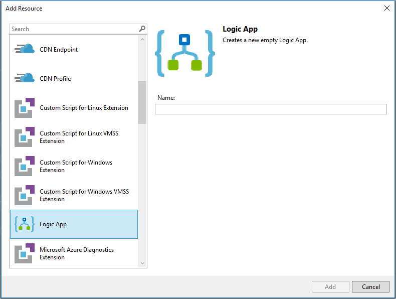

# Create Azure Resource Manager templates for deploying logic apps

After a logic app has been created, you might want 
to create it as an Azure Resource Manager template.
This way, you can easily deploy the logic app 
to any environment or resource group where you might need it.
For more about Resource Manager templates, see
[authoring Azure Resource Manager templates](../azure-resource-manager/resource-group-authoring-templates.md)
and [deploying resources by using Azure Resource Manager templates](../azure-resource-manager/resource-group-template-deploy.md).

## Logic app deployment template

A logic app has three basic components:

* **Logic app resource**: Contains information about things like
pricing plan, location, and the workflow definition.
* **Workflow definition**: Describes your logic app's workflow steps
and how the Logic Apps engine should execute the workflow.
You can view this definition in your logic app's **Code View** window.
In the logic app resource, you can find this definition in the `definition` property.
* **Connections**: Refers to separate resources that securely
store metadata about any connector connections,
such as a connection string and an access token.
In the logic app resource, your logic app references
these resources in the `parameters` section.

You can view all these pieces of existing logic apps by using a tool like
[Azure Resource Explorer](http://resources.azure.com).

To make a template for a logic app to use with resource group deployments,
you must define the resources and parameterize as needed.
For example, if you're deploying to a development, test, and production environment,
you likely want to use different connection strings to a SQL database in each environment.
Or, you might want to deploy within different subscriptions or resource groups.  

## Create a logic app deployment template

The easiest way to have a valid logic app deployment template is to use the
[Visual Studio Tools for Logic Apps](../logic-apps/quickstart-create-logic-apps-with-visual-studio.md#prerequisites).
The Visual Studio tools generate a valid deployment template that can be used across any subscription or location.

A few other tools can assist you as you create a logic app deployment template.
You can author by hand, that is, by using the resources already discussed here to create parameters as needed.
Another option is to use a [logic app template creator](https://github.com/jeffhollan/LogicAppTemplateCreator)
PowerShell module. This open-source module first evaluates the logic app and any connections that it is using,
and then generates template resources with the necessary parameters for deployment.
For example, if you have a logic app that receives a message from an Azure Service Bus queue and adds data to an Azure SQL database,
the tool preserves all the orchestration logic and parameterizes the SQL and Service Bus connection strings
so that they can be set at deployment.

> [!NOTE]
> Connections must be within the same resource group as the logic app.
>
>

### Install the logic app template PowerShell module
The easiest way to install the module is via the [PowerShell Gallery](https://www.powershellgallery.com/packages/LogicAppTemplate/0.1), by using the command `Install-Module -Name LogicAppTemplate`.  

You also can install the PowerShell module manually:

1. Download the latest release of the [logic app template creator](https://github.com/jeffhollan/LogicAppTemplateCreator/releases).  
2. Extract the folder in your PowerShell module folder (usually `%UserProfile%\Documents\WindowsPowerShell\Modules`).

For the module to work with any tenant and subscription access token, we recommend that you use it with the [ARMClient](https://github.com/projectkudu/ARMClient) command-line tool.  This [blog post](http://blog.davidebbo.com/2015/01/azure-resource-manager-client.html) discusses ARMClient in more detail.

### Generate a logic app template by using PowerShell
After PowerShell is installed, you can generate a template by using the following command:

`armclient token $SubscriptionId | Get-LogicAppTemplate -LogicApp MyApp -ResourceGroup MyRG -SubscriptionId $SubscriptionId -Verbose | Out-File C:\template.json`

`$SubscriptionId` is the Azure subscription ID. This line first gets an access token via ARMClient, then pipes it through to the PowerShell script, and then creates the template in a JSON file.

## Add parameters to a logic app template
After you create your logic app template, you can continue to add or modify parameters that you might need. For example, if your definition includes a resource ID to an Azure function or nested workflow that you plan to deploy in a single deployment, you can add more resources to your template and parameterize IDs as needed. The same applies to any references to custom APIs or Swagger endpoints you expect to deploy with each resource group.

### Add references for dependent resources to Visual Studio deployment templates

When you want your logic app to reference dependent resources, you can use 
[Azure Resource Manager template functions](https://docs.microsoft.com/azure/azure-resource-manager/resource-group-template-functions) in your logic app deployment template. 
For example, you might want your logic app to reference an Azure Function 
or integration account that you want to deploy alongside your logic app. 
Follow these guidelines about how to use parameters in your deployment template 
so that the Logic App Designer renders correctly. 

You can use logic app parameters in these kinds of triggers and actions:

*   Child workflow
*   Function app
*   APIM call
*   API connection runtime URL
*   API connection path

And you can use template functions such as parameters, variables, resourceId, concat, etc. 
For example, here's how you can replace the Azure Function resource ID:

```
"parameters":{
	"functionName": {
		"type":"string",
		"minLength":1,
		"defaultValue":"<FunctionName>"
	}
},
```

And where you would use parameters:

```
"MyFunction": {
	"type": "Function",
	"inputs": {
		"body":{},
		"function":{
			"id":"[resourceid('Microsoft.Web/sites/functions','functionApp',parameters('functionName'))]"
		}
	},
	"runAfter":{}
}
```
As another example you can parameterize the Service Bus send message operation:

```
"Send_message": {
	"type": "ApiConnection",
		"inputs": {
			"host": {
				"connection": {
					"name": "@parameters('$connections')['servicebus']['connectionId']"
				}
			},
			"method": "post",
			"path": "[concat('/@{encodeURIComponent(''', parameters('queueuname'), ''')}/messages')]",
			"body": {
				"ContentData": "@{base64(triggerBody())}"
			},
			"queries": {
				"systemProperties": "None"
			}
		},
		"runAfter": {}
	}
```
> [!NOTE] 
> host.runtimeUrl is optional and can be removed from your template if present.
> 


> [!NOTE] 
> For the Logic App Designer to work when you use parameters, 
> you must provide default values, for example:
> 
> ```
> "parameters": {
>     "IntegrationAccount": {
>     "type":"string",
>     "minLength":1,
>     "defaultValue":"/subscriptions/<subscriptionID>/resourceGroups/<resourceGroupName>/providers/Microsoft.Logic/integrationAccounts/<integrationAccountName>"
>     }
> },
> ```

## Add your logic app to an existing Resource Group project

If you have an existing Resource Group project, 
you can add your logic app to that project in 
the JSON Outline window. You can also add another 
logic app alongside the app you previously created.

1. Open the `<template>.json` file.

2. To open the JSON Outline window, 
go to **View** > **Other Windows** > **JSON Outline**.

3. To add a resource to the template file, 
click **Add Resource** at the top of the JSON Outline window. 
Or in the JSON Outline window, 
right-click **resources**, and select **Add New Resource**.

	
    
4. In the **Add Resource** dialog box, find and select **Logic App**. 
Name your logic app, and choose **Add**.

	


## Deploy a logic app template

You can deploy your template by using any tools like PowerShell,
REST API, [Azure DevOps Release Management](#team-services),
and template deployment through the Azure portal.
Also, to store the values for parameters,
we recommend that you create a
[parameter file](../azure-resource-manager/resource-group-template-deploy.md#parameter-files).
Learn how to [deploy resources with Azure Resource Manager templates and PowerShell](../azure-resource-manager/resource-group-template-deploy.md)
or [deploy resources with Azure Resource Manager templates and the Azure portal](../azure-resource-manager/resource-group-template-deploy-portal.md).

### Authorize OAuth connections

After deployment, the logic app works end-to-end with valid parameters.
However, you must still authorize OAuth connections to generate a valid access token.
To authorize OAuth connections, open the logic app in the Logic Apps Designer,
and authorize these connections. Or for automated deployment,
you can use a script to consent to each OAuth connection.
There's an example script on GitHub under the
[LogicAppConnectionAuth](https://github.com/logicappsio/LogicAppConnectionAuth) project.

<a name="team-services"></a>
## Azure DevOps Release Management

A common scenario for deploying and managing an environment is to use a tool like Release Management in Azure DevOps,
with a logic app deployment template. Azure DevOps includes a [Deploy Azure Resource Group](https://github.com/Microsoft/vsts-tasks/tree/master/Tasks/DeployAzureResourceGroup) task that you can add to any build or release pipeline. You need to have a [service principal](https://blogs.msdn.microsoft.com/visualstudioalm/2015/10/04/automating-azure-resource-group-deployment-using-a-service-principal-in-visual-studio-online-buildrelease-management/) for authorization to deploy, and then you can generate the release pipeline.

1. In Release Management, select **Empty** so that you create an empty pipeline.

    ![Create empty pipeline][1]

2. Choose any resources you need for this, most likely including the logic app template
that is generated manually or as part of the build process.
3. Add an **Azure Resource Group Deployment** task.
4. Configure with a [service principal](https://blogs.msdn.microsoft.com/visualstudioalm/2015/10/04/automating-azure-resource-group-deployment-using-a-service-principal-in-visual-studio-online-buildrelease-management/), and reference the Template and Template Parameters files.
5. Continue to build out steps in the release process for any other environment, automated test, or approvers as needed.

<!-- Image References -->
[1]: ./media/logic-apps-create-deploy-template/emptyreleasedefinition.png
