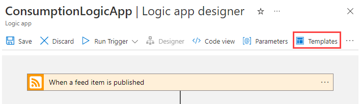
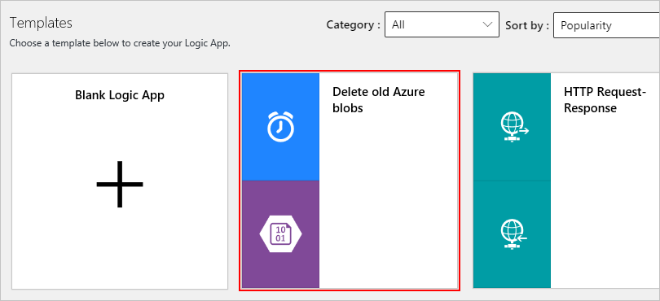
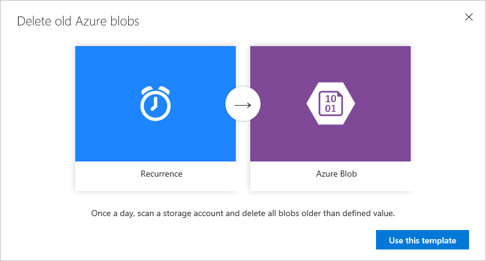
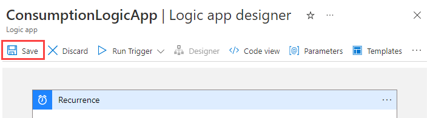

# Create logic app workflows from prebuilt templates

[!INCLUDE [logic-apps-sku-consumption](../../includes/logic-apps-sku-consumption.md)]

To get you started creating workflows quickly, Azure Logic Apps provides templates, which are prebuilt logic app workflows that follow commonly used patterns. 

This how-to guide shows how to use these templates as provided or edit them to fit your scenario.

Here are some template categories:

| Template type | Description | 
| ------------- | ----------- | 
| Enterprise cloud templates | For integrating Azure Blob Storage, Dynamics CRM, Salesforce, and Box. Also includes other connectors for your enterprise cloud needs. For example, you can use these templates to organize business leads or back up your corporate file data. | 
| Personal productivity templates | For improving personal productivity by setting daily reminders, turning important work items into to-do lists, and automating lengthy tasks down to a single user approval step. | 
| Consumer cloud templates | For integrating social media services such as Twitter, Slack, and email. Useful for strengthening social media marketing initiatives. These templates also include tasks such as cloud copying, which increases productivity by saving time on traditionally repetitive tasks. | 
| Enterprise integration pack templates | For configuring validate, extract, transform, enrich, and route (VETER) pipelines, receiving an X12 EDI document over AS2 and transforming to XML, and handling X12, EDIFACT, and AS2 messages. | 
| Protocol pattern templates | For implementing protocol patterns such as request-response over HTTP and integrations across FTP and SFTP. Use these templates as provided, or build on them for complex protocol patterns. | 
||| 

## Prerequisites

- An Azure account and subscription. If you don't have a subscription, create a [free account](https://azure.microsoft.com/free/?WT.mc_id=A261C142F).
- A basic understanding of how to build a logic app workflow. For more information, see [Create a Consumption logic app workflow](../logic-apps/quickstart-create-first-logic-app-workflow.md).

## Create logic apps from templates

1. Sign in to the [Azure portal](https://portal.azure.com).

1. Select **Create a resource** > **Integration** > **Logic App**.

   :::image type="content" source="./media/logic-apps-create-logic-apps-from-templates/azure-portal-create-logic-app.png" alt-text="Screenshot of the Azure portal. Under 'Popular Azure services,' 'Logic App' is highlighted. In the navigation menu, 'Integration' is highlighted.":::

1. In the **Create Logic App** page, enter the following values:

   | Setting | Value | Description | 
   | ------- | ----- | ----------- | 

   | **Subscription** | <*your-Azure-subscription-name*> | Select the Azure subscription that you want to use. |
   | **Resource Group** | <*your-Azure-resource-group-name*> | Create or select an [Azure resource group](../azure-resource-manager/management/overview.md) for this logic app and to organize all resources associated with this app. |
   | **Logic App name** | <*your-logic-app-name*> | Provide a unique logic app name. |
   | **Region** | <*your-Azure-datacenter-region*> | Select the datacenter region for deploying your logic app, for example, **West US**. |
   | **Enable log analytics** | **No** (default) or **Yes** | Set up [diagnostic logging](../logic-apps/monitor-logic-apps-log-analytics.md) for your logic app by using [Azure Monitor logs](../azure-monitor/logs/log-query-overview.md). Requires that you already have a Log Analytics workspace. |
   | **Plan type** | **Consumption** or **Standard** | Select **Consumption** to create a Consumption logic app workflow. |
   | **Zone redundancy** | **Disabled** (default) or **Enabled** | If this option is available, select **Enabled** if you want to protect your logic app from a regional failure. But first [check that zone redundancy is available in your Azure region](/azure/logic-apps/set-up-zone-redundancy-availability-zones?tabs=consumption#considerations). |
   ||||

   :::image type="content" source="./media/logic-apps-create-logic-apps-from-templates/logic-app-settings.png" alt-text="Screenshot of the 'Create Logic App' page. The 'Consumption' plan type is selected, and values are visible in other input fields.":::

1. Select **Review + Create**.

   :::image type="content" source="./media/logic-apps-create-logic-apps-from-templates/create-logic-app.png" alt-text="Screenshot of the 'Create Logic App' page. The name, subscription, and other values are visible, and the 'Create' button is highlighted.":::

1. Review the values, and then select **Create**.

1. After deployment is complete, select **Go to resource**. The designer opens and shows a page with an introduction video. Under the video, you can find templates for common logic app patterns. 

1. Scroll past the introduction video and common triggers to **Templates**. Select a prebuilt template.

   :::image type="content" source="./media/logic-apps-create-logic-apps-from-templates/choose-logic-app-template.png" alt-text="Screenshot of the designer. Under 'Templates,' three templates are visible. One called 'Delete old Azure blobs' is highlighted.":::

   When you select a prebuilt template, you can view more information about that template.

   :::image type="content" source="./media/logic-apps-create-logic-apps-from-templates/logic-app-choose-prebuilt-template.png" alt-text="Screenshot that shows information about the 'Delete old Azure blobs' template, including a description and a diagram that shows a recurring schedule.":::

1. To continue with the selected template, select **Use this template**. 

1. Based on the connectors in the template, you're prompted to perform any of these steps:

   * Sign in with your credentials to systems or services that are referenced by the template.

   * Create connections for any services or systems that are referenced by the template. To create a connection, provide a name for your connection, and if necessary, select the resource that you want to use. 

   If you already set up these connections, select **Continue**.

   :::image type="content" source="./media/logic-apps-create-logic-apps-from-templates/logic-app-create-connection.png" alt-text="Screenshot that shows information about the 'Delete old Azure blobs' template, including a description and a diagram that shows a recurring schedule.":::

   When you're done, your logic app opens 
   and appears in the Logic Apps Designer.

   > [!TIP]
   > To return to the template viewer, choose **Templates** 
   > on the designer toolbar. This action discards any unsaved changes, 
   > so a warning message appears to confirm your request.

1. Continue building your logic app.

   > [!NOTE] 
   > Many templates include connectors that might 
   > already have prepopulated required properties. 
   > However, some templates might still require that you provide 
   > values before you can properly deploy the logic app. 
   > If you try to deploy without completing the missing property fields, 
   > you get an error message. 

## Update logic apps with templates

1. In the [Azure portal](https://portal.azure.com "Azure portal"), 
find and open your logic app in th Logic App Designer.

1. On the designer toolbar, choose **Templates**. 
This action discards any unsaved changes, 
so a warning message appears so you can confirm 
that you want to continue. To confirm, choose **OK**. 
For example:

   

1. Scroll past the introduction video and common triggers to **Templates**. 
Choose a prebuilt template. For example:

   

   When you select a prebuilt template, 
   you can view more information about that template. 
   For example:

   

1. To continue with the selected template, 
choose **Use this template**. 

1. Based on the connectors in the template, 
you are prompted to perform any of these steps:

   * Sign in with your credentials to systems or 
   services that are referenced by the template.

   * Create connections for any services or systems 
   referenced by the template. To create a connection, 
   provide a name for your connection, and if necessary, 
   select the resource that you want to use. 

   * If you already set up these connections, 
   choose **Continue**.

   

   Your logic app now opens and appears in the Logic Apps Designer.

1. Continue building your logic app. 

   > [!TIP]
   > If you haven't saved your changes, you can discard your work 
   > and return to your previous logic app. On the designer toolbar, 
   > choose **Discard**.

> [!NOTE] 
> Many templates include connectors that might have 
> already pre-populated required properties. 
> However, some templates might still require that you provide 
> values before you can properly deploy the logic app. 
> If you try to deploy without completing the missing property fields, 
> you get an error message.

## Deploy logic apps built from templates

After you make your changes to the template, 
you can save your changes. This action also 
automatically publishes your logic app.

On the designer toolbar, choose **Save**.

  

## Get support

* For questions, visit the [Microsoft Q&A question page for Azure Logic Apps](/answers/topics/azure-logic-apps.html).
* To submit or vote on feature ideas, visit the [Logic Apps user feedback site](https://aka.ms/logicapps-wish).

## Next steps

Learn about building logic apps through examples, 
scenarios, customer stories, and walkthroughs.

> [!div class="nextstepaction"]
> [Review logic app examples, scenarios, and walkthroughs](../logic-apps/logic-apps-examples-and-scenarios.md)
