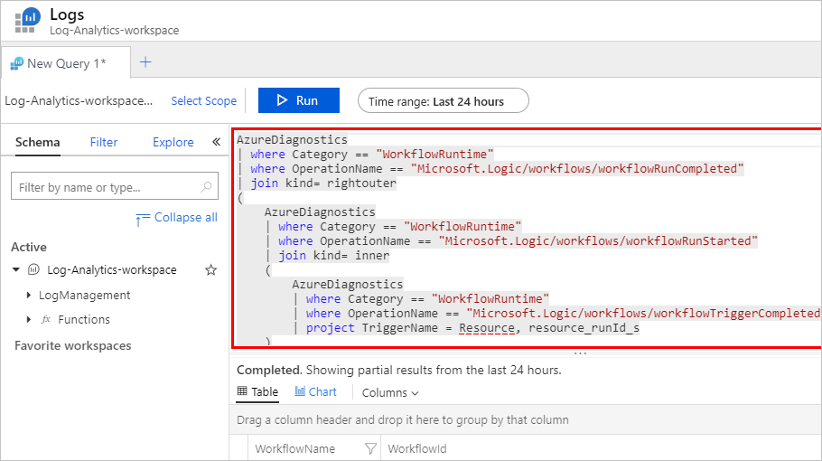
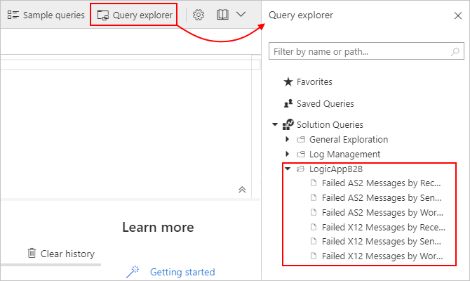
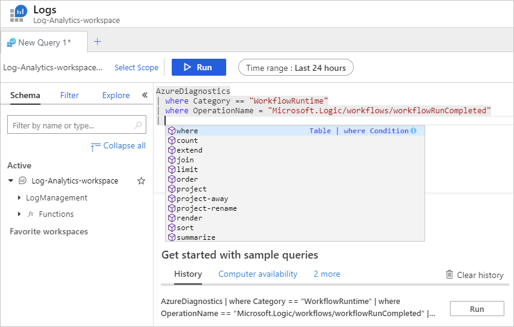

# View and create queries for monitoring and tracking in Azure Monitor logs for Azure Logic Apps

You can view the underlying queries that produce the results from [Azure Monitor logs](../log-analytics/log-analytics-overview.md) and create queries that filter the results based your specific criteria. For example, you can find messages based on a specific interchange control number. Queries use the [Kusto query language](https://aka.ms/LogAnalyticsLanguageReference), which you can edit if you want to view different results. For more information, see [Azure Monitor log queries](../azure-monitor/log-query/query-language.md).

## Prerequisites

* A Log Analytics workspace. If you don't have a Log Analytics workspace, learn [how to create a Log Analytics workspace](../azure-monitor/learn/quick-create-workspace.md).

* A logic app that's set up with Azure Monitor logging and sends that information to a Log Analytics workspace. Learn [how to set up Azure Monitor logs for your logic app](../logic-apps/monitor-logic-apps.md).

* If you're using an integration account, make sure that you've set up the account with Azure Monitor logging to send that information to a Log Analytics workspace. Learn how to [set up Azure Monitor logging for your integration account](../logic-apps/monitor-b2b-messages-log-analytics.md).

## View queries behind results

To view or edit the query that produces the results in your workspace summary, follow these steps:

1. On any results page, at the bottom, select **See All**.

   

   The Logs page opens and shows the query behind the previous results page.

   

1. On the **Logs** page, you can select these options:

   * To view the query results as a table, under the query editor, select **Table**.

   * To change the query, update the query string and select **Run** to view the results in the table.

## Create your own query

To find or filter results based on specific properties or values, you can create your own query by starting from an empty query or use an existing query. For more information, see [Get started with log queries in Azure Monitor](../azure-monitor/log-query/get-started-queries.md).

1. In the [Azure portal](https://portal.azure.com), find and select your Log Analytics workspace.

1. On your workspace menu, under **General**, select **Logs**.

1. Start from an empty query or any available existing queries.

   * To check whether any existing queries are available, on the query toolbar, select either **Samples queries** > **History**, which shows queries from previous query runs, or select **Query explorer**, which shows prebuilt queries.

     For example, the Logic Apps B2B solution provides these prebuilt queries:

     

   * To start from an empty query, in the query editor, start typing the [Kusto query language](../azure-monitor/log-query/query-language.md) for your query.

     

## Next steps

* [AS2 tracking schemas](../logic-apps/logic-apps-track-integration-account-as2-tracking-schemas.md)
* [X12 tracking schemas](../logic-apps/logic-apps-track-integration-account-x12-tracking-schema.md)
* [Custom tracking schemas](../logic-apps/logic-apps-track-integration-account-custom-tracking-schema.md)