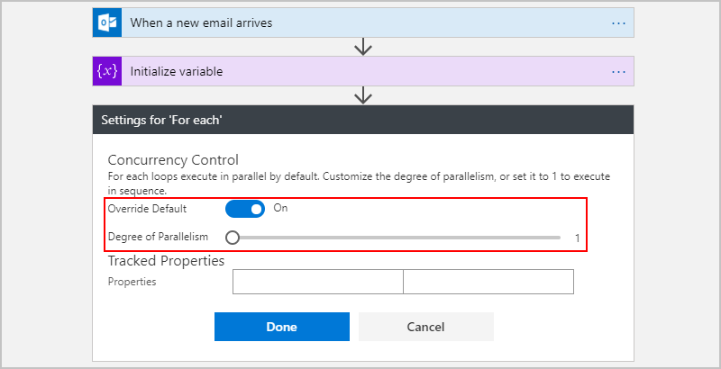

---
# required metadata
title: Save values as variables - Azure Logic Apps | Microsoft Docs
description: Create variables for saving and changing values in Azure Logic Apps
services: logic-apps
author: ecfan
manager: cfowler
ms.author: estfan
ms.topic: article
ms.date: 05/26/2018
ms.service: logic-apps

# optional metadata
ms.reviewer: klam, LADocs
ms.suite: integration
---

# Save and manage values as variables in Azure Logic Apps

This article shows how you can store and work with values 
throughout your logic app by creating variables. 
For example, variables can help count the number 
of times that a loop runs. You can use a variable 
as the index value for each item in an array when 
checking that array for a specific item. 

You can create variables for data types such as integer, 
float, boolean, string, array, and object. 
After you create a variable, you can perform other tasks, 
for example:

* Increase or decrease the value for a variable.
* Assign a different value to a variable.
* Add a value as the last item in a variable for a string or array.
* Get the value from a variable.

Variables exist only within the logic app instance that creates them. 
Also, they persist across any loop iterations inside a logic app instance. 

If you don't have an Azure subscription yet, 
<a href="https://azure.microsoft.com/free/" target="_blank">sign up for a free Azure account</a>. 

## Prerequisites

* The logic app where you want to create a variable 

  If you're new to logic apps, review 
  [What is Azure Logic Apps](../logic-apps/logic-apps-overview.md) 
  and [Quickstart: Create your first logic app](../logic-apps/quickstart-create-first-logic-app-workflow.md).

* A [trigger](../logic-apps/logic-apps-overview.md#logic-app-concepts) as the first step in your logic app 

  Before you can add actions for creating and working with variables, 
  your logic app must start with a trigger.

<a name="create-variable"></a>

## Create variable

You can declare a variable along with its data 
type and its starting value - all inside one action. 

1. In the Azure portal or Visual Studio, 
open your logic app in Logic App Designer. 

   This example uses the Azure portal 
   and a logic app with an existing trigger.

2. In your logic app, under the step where you want to add a variable, 
follow one of these steps: 

   * To add an action under the last step, 
   choose **New step** > **Add an action**.

     

   * To add an action between steps, move your mouse 
   over the connecting arrow so the plus sign (+) appears. 
   Choose the plus sign, and then choose **Add an action**.

3. In the search box, enter "variables" as your filter. 
From the actions list, select **Variables - Initialize variable**.

   

4. Provide this information for your variable:

   | Property | Required | Value |  Description |
   |----------|----------|-------|--------------|
   | Name | Yes | <*variable-name*> | The name for the variable to increment | 
   | Type | Yes | <*variable-type*> | The data type for the variable | 
   | Value | No | <*start-value*> | The initial value for your variable <p><p>**Tip**: Although optional, set this value as a best practice so you always know the start value for your variable. | 
   ||||| 

   

5. Now continue adding the actions you want. 
When you're done, on the designer toolbar, choose **Save**.

If you switch from the designer to the code view editor, 
here is the way the **Initialize variable** action 
appears inside your logic app definition, 
which is in JavaScript Object Notation (JSON) format:

```json
"actions": {
   "Initialize_variable": {
      "type": "InitializeVariable",
      "inputs": {
         "variables": [ {
               "name": "Count",
               "type": "Integer",
               "value": 0
          } ]
      },
      "runAfter": {}
   }
},
```

Here are examples for a few other variable types:

*String variable*

```json
"actions": {
   "Initialize_variable": {
      "type": "InitializeVariable",
      "inputs": {
         "variables": [ {
               "name": "myStringVariable",
               "type": "String",
               "value": "lorem ipsum"
          } ]
      },
      "runAfter": {}
   }
},
```

*Boolean variable*

```json
"actions": {
   "Initialize_variable": {
      "type": "InitializeVariable",
      "inputs": {
         "variables": [ {
               "name": "myBooleanVariable",
               "type": "Boolean",
               "value": false
          } ]
      },
      "runAfter": {}
   }
},
```

*Array with integers*

```json
"actions": {
   "Initialize_variable": {
      "type": "InitializeVariable",
      "inputs": {
         "variables": [ {
               "name": "myArrayVariable",
               "type": "Array",
               "value": [1, 2, 3]
          } ]
      },
      "runAfter": {}
   }
},
```

*Array with strings*

```json
"actions": {
   "Initialize_variable": {
      "type": "InitializeVariable",
      "inputs": {
         "variables": [ {
               "name": "myArrayVariable",
               "type": "Array",
               "value": ["red", "orange", "yellow"]
          } ]
      },
      "runAfter": {}
   }
},
```

<a name="increment-value"></a>

## Increment variable 

To increase a variable by a specific value, add the 
**Variables - Increment variable** action to your logic app. 
This action works only with integer and float variables.

1. In Logic App Designer, under the step where 
you want to increase an existing variable, 
choose **New step** > **Add an action**. 

   For example, this logic app already has a trigger 
   and an action that created a variable. So, 
   add a new action under these steps:

   

   To add an action between existing steps, 
   move your mouse over the connecting arrow 
   so that the plus sign (+) appears. Choose 
   the plus sign, and then choose **Add an action**.

2. In the search box, enter "increment variable" as your filter. 
In the actions list, select **Variables - Increment variable**.

   

3. Provide this information for incrementing your variable:

   | Property | Required | Value |  Description |
   |----------|----------|-------|--------------|
   | Name | Yes | <*variable-name*> | The name for the variable to increment | 
   | Value | No | <*increment-value*> | The value used for incrementing the variable. The default value is one. <p><p>**Tip**: Although optional, set this value as a best practice so you always know the specific value for incrementing your variable. | 
   |||| 

   For example: 
   
   

4. When you're done, on the designer toolbar, choose **Save**. 

If you switch from the designer to the code view editor, 
here is the way the **Increment variable** action appears 
inside your logic app definition, which is in JSON format:

```json
"actions": {
   "Increment_variable": {
      "type": "IncrementVariable",
      "inputs": {
         "name": "Count",
         "value": 1
      },
      "runAfter": {}
   }
},
```

### Example: Count loop cycles

Variables often perform the work for counting how often a loop runs. 
This example shows how you can create and use variables for this task.

1. Create a blank logic app, and add a trigger that checks for new email. 
Set up the trigger to fire only when the email has one or more attachments. 

   This example uses the Office 365 Outlook trigger for **When a new email arrives**. 
   However, you can use any connector that checks for new emails with attachments, 
   such as the Outlook.com connector.

2. Set up the trigger to check for attachments and 
include those attachments as inputs for the workflow. 

   1. In this example, inside the trigger, 
   choose **Show advanced options**. 

   2. Select **Yes** for these properties: 
   
      * **Has Attachment** 
      * **Include Attachments** 

      

3. [Add the **Initialize variable** action](#create-variable) 
and create an integer variable that counts 
and tracks the number of attachments, for example:

   

4. Add a "for each" loop that cycles through each attachment. 

   1. Choose **New step** > **More** > **Add a for each**.

      

      Now set up your loop to run sequentially. By default, 
      a "for each" loop's cycles run in parallel. This setting 
      might cause problems when calculating the number of attachments.
   
   2. In your loop's upper-right corner, choose the ellipsis (...) button, 
   and then choose **Settings**. 

   3. Under **Concurrency Control**, set **Override Default** to **On**.
   For **Degree of Parallelism**, drag the slider to **1**.

      

   4. When you're ready, choose **Done**.

5. Inside the loop, click in the **Select an output from previous steps** box. 
When the dynamic content list appears, select **Attachments**. 

   

   The **Attachments** field passes in an array that 
   has the email attachments in the trigger output.

6. In the "for each" loop, select **Add an action**. 

   

7. In the search box, enter "increment variable" as your filter. 
From the actions list, select **Variables - Increment variable**.

   > [!NOTE]
   > Make sure the **Increment variable** action appears inside the loop. 
   > If the action appears outside the loop, drag the action into the loop.

8. In the **Increment variable** action, 
open the **Name** list, and select the **Count** variable. 

   

9. Under the loop, add an action that 
sends you the total number of attachments. 
This example sends an email with the results.

   

10. Save your logic app. On the designer toolbar, choose **Save**. 

### Test your logic app

1. If your logic app isn't running already, on the logic app menu, 
choose **Overview**. On the **Overview** page, choose **Enable**. 

2. On the Logic App Designer toolbar, choose **Run**. 
This step manually and immediately starts your logic app.

3. Send an email with one or more attachments 
to the email account you used in this example. 

   This step fires the logic app's trigger, which creates 
   and runs an instance for the logic app workflow.
   As a result, the logic app sends you email 
   with the number of attachments in the email
   you sent to yourself.

If you switch from the designer to the code view editor, 
here is the way the "for each" loop appears with the 
**Increment variable** action inside your logic app definition, 
which is in JSON format.

```json
"actions": {
   "For_each": {
      "type": "Foreach",
      "actions": {
         "Increment_variable": {
           "type": "IncrementVariable",
            "inputs": {
               "name": "Count",
               "value": 1
            },
            "runAfter": {}
         }
      },
      "foreach": "@triggerBody()?['Attachments']",
      "runAfter": {
         "Initialize_variable": [ "Succeeded" ]
      }
   }
},
```

<a name="decrement-value"></a>

## Decrement variable

To decrease a variable by a specific value, you can follow 
the steps for [increasing a variable](#increment-value) except that you 
find and select the **Variables - Decrement variable** action instead. 
This action works only with integer and float variables.

Here are the properties for the **Decrement variable** action:

| Property | Required | Value |  Description |
|----------|----------|-------|--------------|
| Name | Yes | <*variable-name*> | The name for the variable to decrement | 
| Value | No | <*increment-value*> | The value for decrementing the variable. The default value is one. <p><p>**Tip**: Although optional, set this value as a best practice so you always know the specific value for decrementing your variable. | 
||||| 

If you switch from the designer to the code view editor, 
here is the way the **Decrement variable** action appears 
inside your logic app definition, which is in JSON format.

```json
"actions": {
   "Decrement_variable": {
      "type": "DecrementVariable",
      "inputs": {
         "name": "Count",
         "value": 1
      },
      "runAfter": {}
   }
},
```

<a name="assign-value"></a>

## Assign new value

To assign a different value to an existing variable, 
you can follow the steps for [increasing a variable](#increment-value) 
except that you use these steps: 

* Find and select the **Variables - Set variable** action instead. 

* Provide the value you want to assign the variable. 
This value is required because this action doesn't have a default value. 
Both the new value and the variable must have the same data type.

Here are the properties for the **Set variable** action:

| Property | Required | Value |  Description | 
|----------|----------|-------|--------------| 
| Name | Yes | <*variable-name*> | The name for the variable to change | 
| Value | Yes | <*new-value*> | The value you want to assign the variable. Both must have the same data type. | 
||||| 

If you switch from the designer to the code view editor, 
here is the way the **Set variable** action appears 
inside your logic app definition, which is in JSON format. 
This example changes the "Count" variable's start value to another value. 

```json
"actions": {
   "Initialize_variable": {
      "type": "InitializeVariable",
      "inputs": {
         "variables": [ {
               "name": "Count",
               "type": "Integer",
               "value": 0
          } ]
      },
      "runAfter": {}
   },
   "Set_variable": {
      "type": "SetVariable",
      "inputs": {
         "name": "Count",
         "value": 100
      },
      "runAfter": {
         "Initialize_variable": [ "Succeeded" ]
      }
   }
},
```

<a name="append-value"></a>

## Append to variable

For variables that store strings or arrays, you can 
add a value as the last item in those strings or arrays. 
You can follow the steps for [increasing a variable](#increment-value) 
except that you use these steps: 

* Select an action based on whether you have a string or array variable: 

  * **Variables - Append to string variable**
  * **Variables - Append to array variable** 

* Provide the value you want to add as the last item in the string or array. 
This value is required. 

Here are the properties for the **Append to...** actions:

| Property | Required | Value |  Description | 
|----------|----------|-------|--------------| 
| Name | Yes | <*variable-name*> | The name for the variable to change | 
| Value | Yes | <*append-value*> | The value you want to append, which can have any type | 
|||||  

If you switch from the designer to the code view editor, 
here is the way the **Append to array variable** action 
appears inside your logic app definition, which is in JSON format.
This example first creates an array variable, 
and then adds the specified value as the last array item. 
Your result is `[1,2,3,"red"]`.

```json
"actions": {
   "Initialize_variable": {
      "type": "InitializeVariable",
      "inputs": {
         "variables": [ {
            "name": "myArrayVariable",
            "type": "Array",
            "value": [1, 2, 3]
         } ]
      },
      "runAfter": {}
   },
   "Append_to_array_variable": {
      "type": "AppendToArrayVariable",
      "inputs": {
         "name": "myArrayVariable",
         "value": "red"
      },
      "runAfter": {
        "Initialize_variable": [ "Succeeded" ]
      }
   }
},
```

<a name="get-value"></a>

## Get value from variable

To retrieve or reference the value or values in a variable, you can use the 
[variables() function](../logic-apps/workflow-definition-language-functions-reference.md#variables) in the Logic App Designer or in the code view editor.

For example, this expression gets the items from the array variable 
[previously created in this article](#append-value) and the **variables()** function. 
The **string()** function returns those array items as this string: "1, 2, 3, 4"

```json
@{string(variables('myArrayVariable'))}
```

## Get support

* For questions, visit the [Azure Logic Apps forum](https://social.msdn.microsoft.com/Forums/en-US/home?forum=azurelogicapps).
* To submit or vote on feature ideas, visit the [Logic Apps user feedback site](http://aka.ms/logicapps-wish).

## Next steps

* Learn about [Logic Apps connectors](../connectors/apis-list.md)
