# Create variables to store and manage values in Azure Logic Apps

[!INCLUDE [logic-apps-sku-consumption-standard](../../includes/logic-apps-sku-consumption-standard.md)]

This how-to guide shows how to create and work with variables so that you can store and use values in your logic app workflow. For example, variables can help you track the number of times that a loop runs. To iterate over an array or check an array for a specific item, you can use a variable to reference the index number for each array item.

You can create variables for data types such as integer, float, boolean, string, array, and object. After you create a variable, you can perform other tasks, for example:

* Get or reference the variable's value.
* Increase or decrease the variable by a constant value, also known as *increment* and *decrement*.
* Assign a different value to the variable.
* Insert or *append* the variable's value as the last item in a string or array.

Variables exist and are global only within the workflow instance that creates them. Also, they persist across any loop iterations inside a workflow instance. When you reference a variable, use the variable's name as the token, not the action's name, which is the usual way to reference an action's outputs.

> [!IMPORTANT]
>
> By default, the iterations in a **For each** loop run in parallel. When you use variables in loops, 
> run the loop [sequentially](../logic-apps/logic-apps-control-flow-loops.md#sequential-foreach-loop) 
> so that variables return predictable results.

## Prerequisites

* An Azure account and subscription. If you don't have subscription, [sign up for a free Azure account](https://azure.microsoft.com/free/?WT.mc_id=A261C142F).

* A logic app workflow where you want to create the variable and a trigger that starts the workflow.

  Before you can add actions for creating and working with variables, your workflow must start with a trigger as the first step in your workflow. For more information, see [Build a workflow with a trigger or action](create-workflow-with-trigger-or-action.md).

The following steps use the Azure portal, but with the appropriate Azure Logic Apps extension, you can also use the following tools to create logic app workflows:

* Consumption workflows: [Visual Studio](quickstart-create-logic-apps-with-visual-studio.md) or [Visual Studio Code](quickstart-create-logic-apps-visual-studio-code.md)

* Standard workflows: [Visual Studio Code](create-single-tenant-workflows-visual-studio-code.md)

Based on whether you have a Consumption or Standard workflow, follow the corresponding steps:

<a name="create-variable"></a>

## Initialize variable

You can create a variable and declare its data type and initial value by using a single action in your workflow. You can only declare variables at the global level, not within scopes, conditions, and loops.

### [Consumption](#tab/consumption)

1. In the [Azure portal](https://portal.azure.com), open your workflow in the designer.

1. In the designer, [follow these general steps to add an action named **Initialize variable**](create-workflow-with-trigger-or-action.md?tabs=consumption#add-action).

1. Provide the following information about your variable:

   | Property | Required | Value |  Description |
   |----------|----------|-------|--------------|
   | **Name** | Yes | <*variable-name*> | The name for the variable to increment |
   | **Type** | Yes | <*variable-type*> | The data type for the variable |
   | **Value** | No | <*start-value*> | The initial value for your variable <br><br>**Tip**: Although optional, set the value as a best practice so you always know your variable's start value. |

   The following example shows the initial values for this sample variable:

   [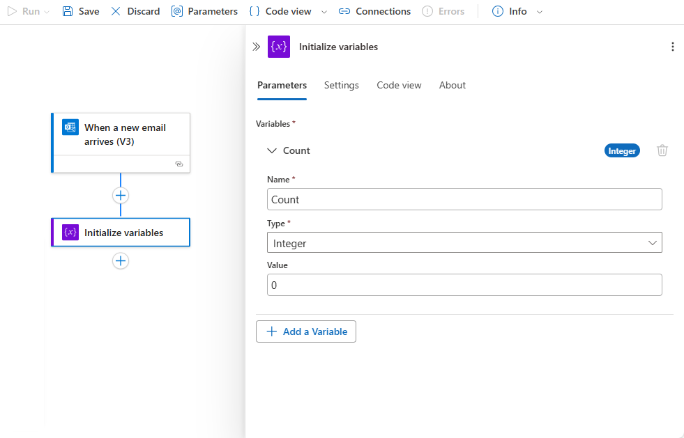](./media/logic-apps-create-variables-store-values/initialize-variable-consumption.png#lightbox)

1. Now continue adding the actions you want for your scenario. When you're done, on the designer toolbar, select **Save**.

### [Standard](#tab/standard)

1. In the [Azure portal](https://portal.azure.com), open your workflow in the designer.

1. In the designer, [follow these general steps to add an action named **Initialize variable**](create-workflow-with-trigger-or-action.md?tabs=standard#add-action).

1. Provide the following information about your variable:

   | Property | Required | Value |  Description |
   |----------|----------|-------|--------------|
   | **Name** | Yes | <*variable-name*> | The name for the variable to increment |
   | **Type** | Yes | <*variable-type*> | The data type for the variable |
   | **Value** | No | <*start-value*> | The initial value for your variable <br><br>**Tip**: Although optional, set the value as a best practice so that you always know your variable's start value. |

   The following example shows the sample values for this action:

   [](./media/logic-apps-create-variables-store-values/initialize-variable-standard.png#lightbox)

1. Now continue adding the actions you want for your scenario. When you're done, on the designer toolbar, select **Save**.

---

If you switch from the designer to code view, the following example shows how the **Initialize variable** action appears in your workflow definition, which is in JavaScript Object Notation (JSON) format:

```json
"actions": {
   "Initialize_variable": {
      "type": "InitializeVariable",
      "inputs": {
         "variables": [ 
            {
               "name": "Count",
               "type": "Integer",
               "value": 0
            }
         ]
      },
      "runAfter": {}
   }
},
```

> [!NOTE]
>
> Although the **Initialize variable** action has a `"variables"` object that's structured as an array, the action 
> can create only one variable at a time. Each new variable requires an individual **Initialize variable** action.

The following examples show other variable types:

*Boolean variable*

```json
"actions": {
   "Initialize_variable": {
      "type": "InitializeVariable",
      "inputs": {
         "variables": [
            {
               "name": "myBooleanVariable",
               "type": "boolean",
               "value": false
            }
         ]
      },
      "runAfter": {}
   }
},
```

*Float variable*

```json
"actions": {
   "Initialize_variable": {
      "type": "InitializeVariable",
      "inputs": {
         "variables": [
            {
               "name": "myFloatVariable",
               "type": "float",
               "value": 1.99999
            }
         ]
      },
      "runAfter": {}
   }
},
```

*String variable*

```json
"actions": {
   "Initialize_variable": {
      "type": "InitializeVariable",
      "inputs": {
         "variables": [
            {
               "name": "myStringVariable",
               "type": "string",
               "value": "lorem ipsum"
            }
         ]
      },
      "runAfter": {}
   }
},
```

*Object variable*

```json
"actions": {
   "Initialize_variable": {
      "type": "InitializeVariable",
      "inputs": {
         "variables": [
            {
               "name": "MyObjectVariable",
               "type": "object",
               "value": {
                  "ProductItem": {
                     "Name": "myProductName",
                     "ProductID": "000000"
                  }
               }
            }
         ]
      },
      "runAfter": {}
   }
},
```

*Array with integers*

```json
"actions": {
   "Initialize_variable": {
      "type": "InitializeVariable",
      "inputs": {
         "variables": [
            {
               "name": "myArrayVariable",
               "type": "array",
               "value": [1, 2, 3]
            }
         ]
      },
      "runAfter": {}
   }
},
```

*Array with strings*

```json
"actions": {
   "Initialize_variable": {
      "type": "InitializeVariable",
      "inputs": {
         "variables": [
            {
               "name": "myArrayVariable",
               "type": "array",
               "value": ["red", "orange", "yellow"]
            }
         ]
      },
      "runAfter": {}
   }
},
```

<a name="get-value"></a>

## Get a variable's value

To retrieve or reference a variable's contents, you can use the [variables() function](workflow-definition-language-functions-reference.md#variables) in the workflow designer and the code view editor. When you reference a variable, use the variable's name as the token, not the action's name, which is the usual way to reference an action's outputs.

For example, the following expression gets the items from the array variable [that's created in this guide](#append-value) by using the `variables()` function. The `string()` function returns the variable's contents in string format: `"1, 2, 3, red"`

```json
@{string(variables('myArrayVariable'))}
```

<a name="increment-value"></a>

## Increment variable

To increase or *increment* a variable by a specific constant value, add the **Increment variable** action to your workflow. This action works only with integer and float variables.

### [Consumption](#tab/consumption)

1. In the workflow designer, [follow these general steps to add an action named **Increment variable**](create-workflow-with-trigger-or-action.md?tabs=consumption#add-action).

1. Provide the following information for this action:

   | Property | Required | Value |  Description |
   |----------|----------|-------|--------------|
   | **Name** | Yes | <*variable-name*> | The name for the variable to increment |
   | **Value** | No | <*increment-value*> | The value used for incrementing the variable. The default value is **`1`**. <br><br>**Tip**: Although optional, set this value as a best practice so that you always know the specific value for incrementing your variable. |

   The following example shows the sample values for this action:

   [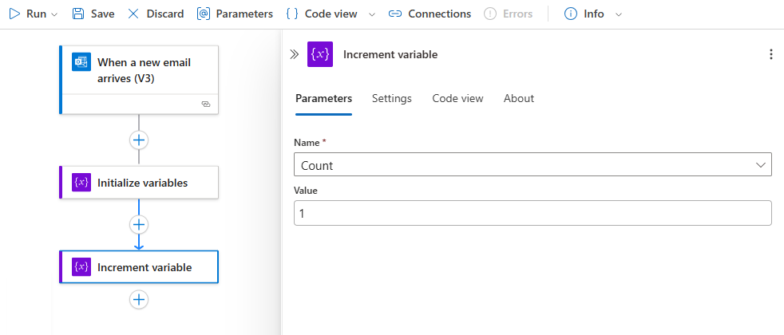](./media/logic-apps-create-variables-store-values/increment-variable-action-consumption.png#lightbox)

1. When you're done, save your workflow. On the designer toolbar, select **Save**.

### [Standard](#tab/standard)

1. In the workflow designer, [follow these general steps to add an action named **Increment variable**](create-workflow-with-trigger-or-action.md?tabs=standard#add-action).

1. Provide the following information for this action:

   | Property | Required | Value |  Description |
   |----------|----------|-------|--------------|
   | **Name** | Yes | <*variable-name*> | The name for the variable to increment |
   | **Value** | No | <*increment-value*> | The value used for incrementing the variable. The default value is **`1`**. <br><br>**Tip**: Although optional, set this value as a best practice so that you always know the specific value for incrementing your variable. |

   The following example shows the sample values for this action:

   [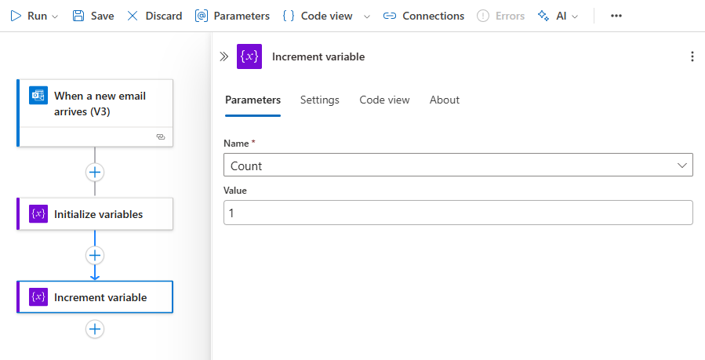](./media/logic-apps-create-variables-store-values/increment-variable-action-standard.png#lightbox)

1. When you're done, save your workflow. On the designer toolbar, select **Save**.

---

If you switch from the designer to code view, the following example shows how the **Increment variable** action appears in your workflow definition, which is in JSON format:

```json
"actions": {
   "Increment_variable": {
      "type": "IncrementVariable",
      "inputs": {
         "name": "Count",
         "value": 1
      },
      "runAfter": {}
   }
},
```

## Example: Create loop counter

Variables are commonly used for counting the number of times that a loop runs. This example shows how you can create and use variables for this task by creating a loop that counts the attachments in an email.

### [Consumption](#tab/consumption)

1. In the Azure portal, create your Consumption logic app resource with a blank workflow. Add a trigger that checks for new email and any attachments.

   This example uses the Office 365 Outlook trigger for **When a new email arrives**. You can set up this trigger to fire only when the email has attachments. However, you can use any connector that checks for new emails with attachments, such as the Outlook.com connector.

1. In the trigger, to check for attachments and pass those attachments into your workflow, select **Yes** for the following properties:

   * **Only with Attachment**
   * **Include Attachments**

   [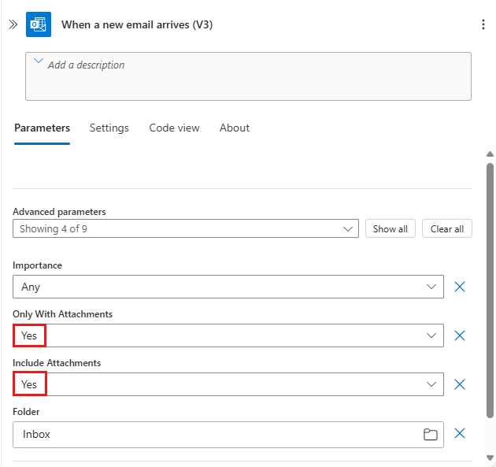](./media/logic-apps-create-variables-store-values/check-include-attachments-consumption.png#lightbox)

1. Add the [**Initialize variable** action](#create-variable) to create an integer variable named **Count** that has a start value set to **`0`**.

1. To iterate through each attachment, [follow these general steps to add an action called a **For each** loop](create-workflow-with-trigger-or-action.md?tabs=consumption#add-action).

1. In the loop, select inside the box named **Select an output from previous steps**. After the dynamic content list appears, under **When a new email arrives**, select **Attachments**.

   [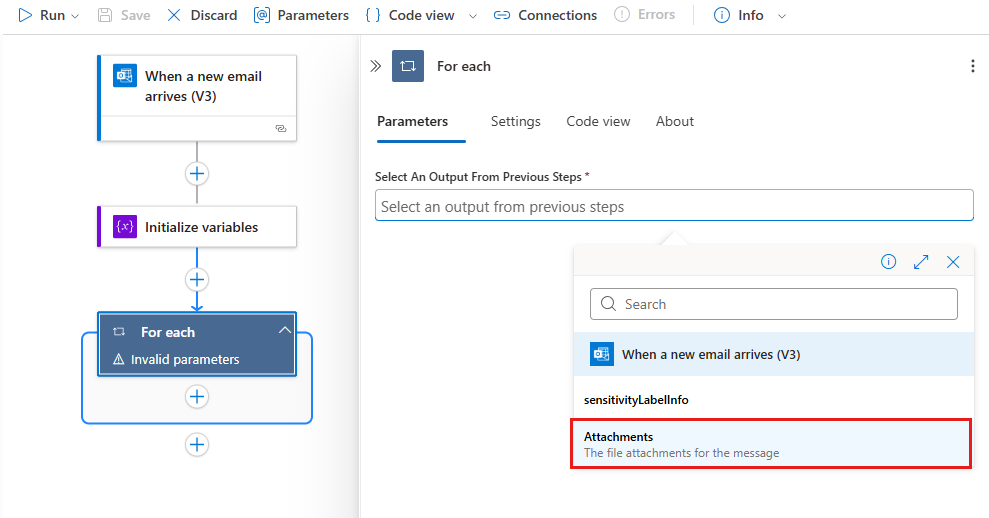](./media/logic-apps-create-variables-store-values/select-attachments-consumption.png#lightbox)

   The **Attachments** property passes an array that contains the email attachments from the trigger's output into the loop for your workflow to iterate over.

1. In the **For each** loop, select **Add an action**. 

1. [Follow these general steps to add an action called a **Increment variable** to the loop](create-workflow-with-trigger-or-action.md?tabs=consumption#add-action).

   > [!NOTE]
   > Make sure that the **Increment variable** action appears inside the loop. 
   > If the action appears outside the loop, drag the action into the loop.

1. In the **Increment variable** action, from the **Name** list, select the **Count** variable. Set the **Value** property to **`1`**.

   [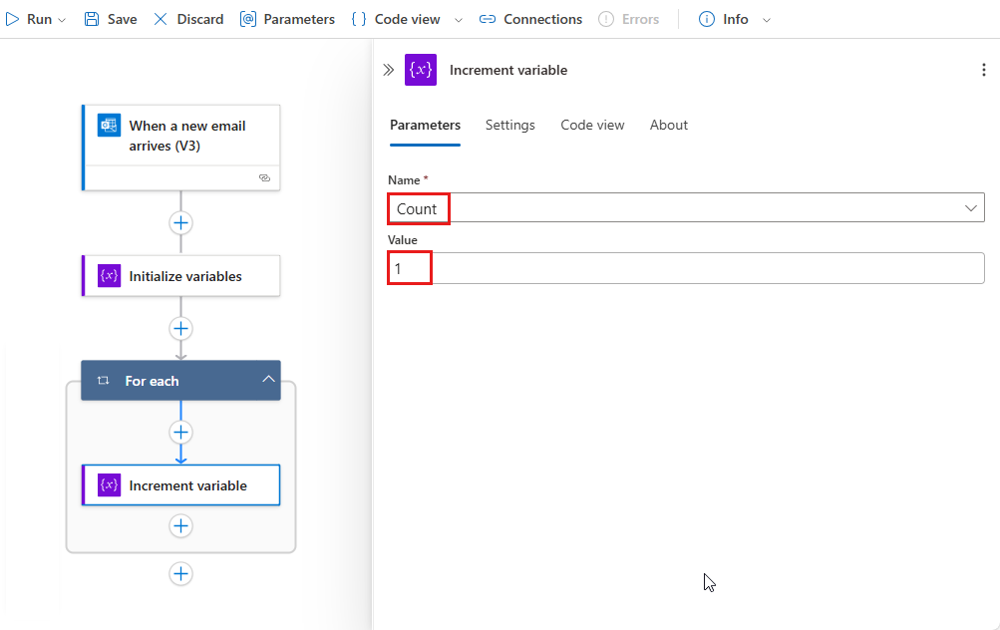](./media/logic-apps-create-variables-store-values/add-increment-variable-loop-consumption.png#lightbox)

1. Under the loop, add any action that sends you the number of attachments. In your action, include the value from the **Count** variable, for example:

   [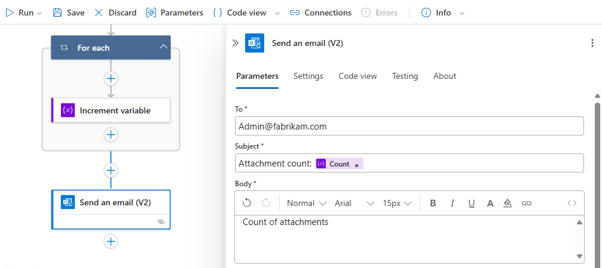](./media/logic-apps-create-variables-store-values/send-email-results-consumption.png#lightbox)

1. When you're done, save your workflow. On the designer toolbar, select **Save**.

### [Standard](#tab/standard)

1. In the Azure portal, create your Standard logic app resource with a blank workflow. Add a trigger that checks for new email and any attachments.

   This example uses the Office 365 Outlook trigger for **When a new email arrives**. You can set up this trigger to fire only when the email has attachments. However, you can use any connector that checks for new emails with attachments, such as the Outlook.com connector.

1. In the trigger, to check for attachments and pass those attachments into your workflow, select **Yes** for the following properties:

   * **Only with Attachment**
   * **Include Attachments**

   If these properties don't already appear in the trigger, add them from the **Add new parameters** list.

   [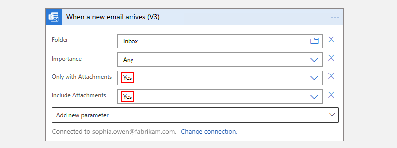](./media/logic-apps-create-variables-store-values/check-include-attachments-standard.png#lightbox)

1. Add the [**Initialize variable** action](#create-variable) to create an integer variable named **Count** that has a start value set to **`0`**.

1. To iterate through each attachment, [follow these general steps to add an action called a **For each** loop](create-workflow-with-trigger-or-action.md?tabs=standard#add-action).

1. In the loop, select inside the box named **Select an output from previous steps**. After the dynamic content list appears, under **When a new email arrives**, select **Attachments**.

   > [!TIP]
   >
   > If the **Attachments** output doesn't appear in the dynamic content list, 
   > next to **When a new email arrives**, select **See more**.

   [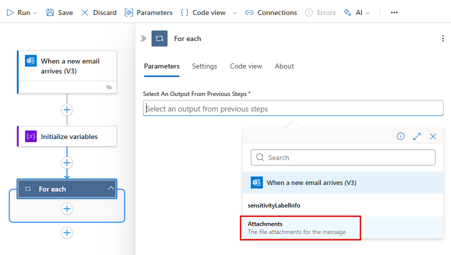](./media/logic-apps-create-variables-store-values/select-attachments-standard.png#lightbox)

   The **Attachments** property passes an array that contains the email attachments from the trigger's output into the loop for your workflow to iterate over.

1. In the **For each** loop, select the plus sign (**+**), and then select **Add an action**. 

1. [Follow these general steps to add an action called a **Increment variable** to the loop](create-workflow-with-trigger-or-action.md?tabs=standard#add-action).

   > [!NOTE]
   >
   > Make sure that the **Increment variable** action appears inside the loop. 
   > If the action appears outside the loop, drag the action into the loop.

1. In the **Increment variable** action, from the **Name** list, select the **Count** variable. Set the **Value** property to **`1`**.

   [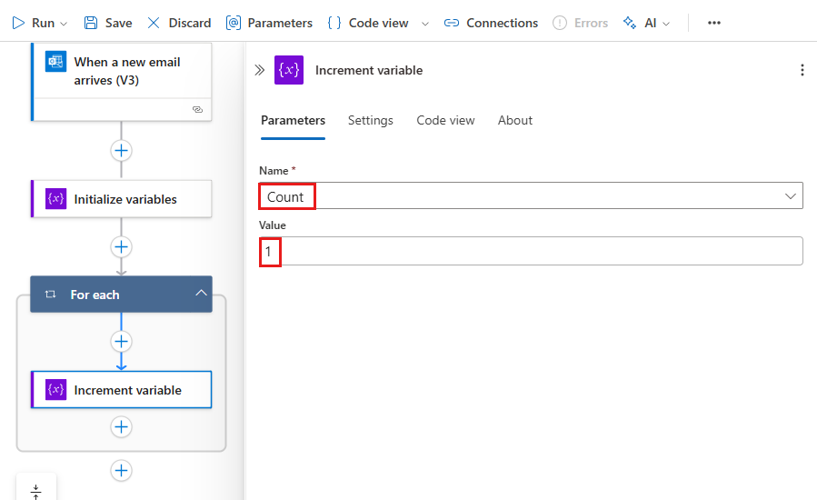](./media/logic-apps-create-variables-store-values/add-increment-variable-loop-standard.png#lightbox)

1. Under the loop, add any action that sends you the number of attachments. In your action, include the value from the **Count** variable, for example:

   [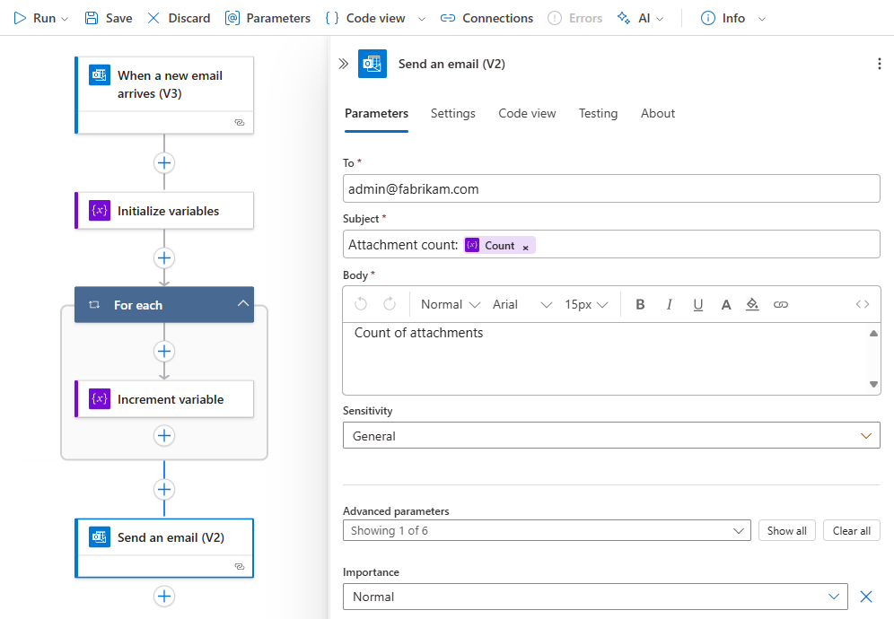](./media/logic-apps-create-variables-store-values/send-email-results-standard.png#lightbox)

1. When you're done, save your workflow. On the designer toolbar, select **Save**.

---

### Test your workflow

1. To manually trigger your workflow, follow the corresponding step:

   **Consumption workflow**

   On the designer workflow toolbar, select **Run Trigger** > **Run** to manually run your workflow.

   **Standard workflow**

   On the workflow menu, select **Overview**. On the toolbar, select **Run** > **Run**.

1. Send an email with one or more attachments to the email account you used in this example.

   This step fires the workflow trigger, which creates and runs a workflow instance. As a result, the workflow sends you a message or email that shows the number of attachments in the email that you sent.

If you switch from the designer to code view, the following example shows how the **For each** loop appears along with the **Increment variable** action in your workflow definition, which is in JSON format:

```json
"actions": {
   "For_each": {
      "type": "Foreach",
      "actions": {
         "Increment_variable": {
           "type": "IncrementVariable",
            "inputs": {
               "name": "Count",
               "value": 1
            },
            "runAfter": {}
         }
      },
      "foreach": "@triggerBody()?['Attachments']",
      "runAfter": {
         "Initialize_variable": [ "Succeeded" ]
      }
   }
},
```

<a name="decrement-value"></a>

## Decrement variable

To decrease or *decrement* a variable by a specific constant value, follow the steps for [incrementing a variable](#increment-value) except that you add the **Decrement variable** action to your workflow instead. This action works only with integer and float variables.

The following table describes the information for the **Decrement variable** action:

| Property | Required | Value |  Description |
|----------|----------|-------|--------------|
| **Name** | Yes | <*variable-name*> | The name for the variable to decrement | 
| **Value** | No | <*increment-value*> | The value for decrementing the variable. The default value is one. <br><br>**Tip**: Although optional, set this value as a best practice so you always know the specific value for decrementing your variable. |

If you switch from the designer to code view, the following example shows how the **Decrement variable** action appears in your workflow definition, which is in JSON format:

```json
"actions": {
   "Decrement_variable": {
      "type": "DecrementVariable",
      "inputs": {
         "name": "Count",
         "value": 1
      },
      "runAfter": {}
   }
},
```

<a name="assign-value"></a>

## Set variable

To assign a different value to an existing variable, follow the steps for [incrementing a variable](#increment-value) with the following exceptions:

1. Find and select the **Set variable** action instead.

1. Provide the variable name and value you want to assign. Both the new value and the variable must have the same data type. The value is required because this action doesn't have a default value.

The following table describes the information for the **Set variable** action:

| Property | Required | Value |  Description |
|----------|----------|-------|--------------|
| **Name** | Yes | <*variable-name*> | The name for the variable to change |
| **Value** | Yes | <*new-value*> | The value you want to assign the variable. Both must have the same data type. |

> [!NOTE]
>
> Unless you're incrementing or decrementing variables, changing variables inside loops 
> *might* create unexpected results because loops run in parallel, or concurrently, 
> by default. For these cases, try setting your loop to run sequentially. For example, 
> when you want to reference the variable value inside the loop and expect same value 
> at the start and end of that loop instance, follow these steps to change how the loop runs: 
>
> 1. On your loop, find and open the loop settings.
>
> 2. Based on your workflow type, follow the corresponding steps:
>
>    - Consumption: Change the **Concurrency Control** setting from **Off** to **On**.
>
>    - Standard: Under **General**, change the **Concurrency Control** setting from **Off** to **On**.
>
> 3. Drag the **Degree of Parallelism** slider to **1**.

If you switch from the designer to code view, the following example shows how the **Set variable** action appears in your workflow definition, which is in JSON format:

The following example changes the **`Count`** variable's current value to another value:

```json
"actions": {
   "Initialize_variable": {
      "type": "InitializeVariable",
      "inputs": {
         "variables": [ {
               "name": "Count",
               "type": "Integer",
               "value": 0
          } ]
      },
      "runAfter": {}
   },
   "Set_variable": {
      "type": "SetVariable",
      "inputs": {
         "name": "Count",
         "value": 100
      },
      "runAfter": {
         "Initialize_variable": [ "Succeeded" ]
      }
   }
},
```

<a name="append-value"></a>

## Append to variable

For variables that store strings or arrays, you can insert or *append* a variable's value as the last item in those strings or arrays. You can follow the steps for [incrementing a variable](#increment-value) with the following exceptions:

1. Find and select one of these actions based on whether your variable is a string or an array: 

   * **Append to string variable**
   * **Append to array variable** 

1. Provide the value to append as the last item in the string or array. This value is required.

The following table describes the information for the **Append to...** actions:

| Property | Required | Value |  Description |
|----------|----------|-------|--------------|
| **Name** | Yes | <*variable-name*> | The name for the variable to change |
| **Value** | Yes | <*append-value*> | The value you want to append, which can have any type |


If you switch from the designer to code view, the following example shows how the **Append to array variable** action appears in your workflow definition, which is in JSON format.

The following example creates an array variable, and adds another value as the last item in the array. Your result is an updated variable that contains this array: `[1,2,3,"red"]`

```json
"actions": {
   "Initialize_variable": {
      "type": "InitializeVariable",
      "inputs": {
         "variables": [ {
            "name": "myArrayVariable",
            "type": "Array",
            "value": [1, 2, 3]
         } ]
      },
      "runAfter": {}
   },
   "Append_to_array_variable": {
      "type": "AppendToArrayVariable",
      "inputs": {
         "name": "myArrayVariable",
         "value": "red"
      },
      "runAfter": {
        "Initialize_variable": [ "Succeeded" ]
      }
   }
},
```

## Next steps

* [Managed connectors for Azure Logic Apps](../connectors/managed.md)
* [Built-in connectors for Azure Logic Apps](../connectors/built-in.md)
