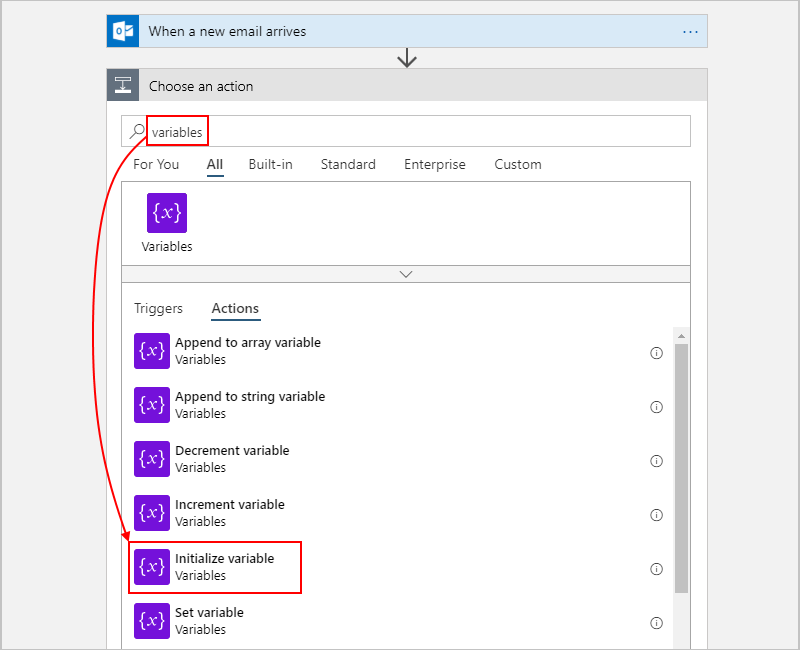
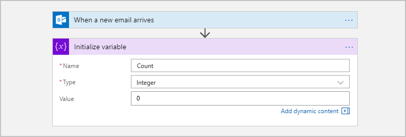
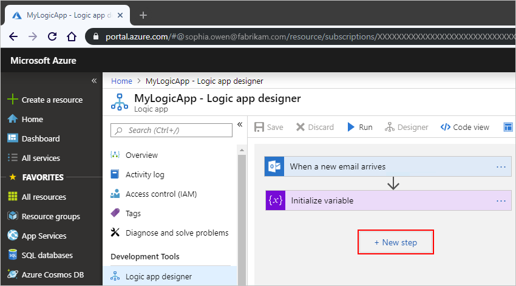
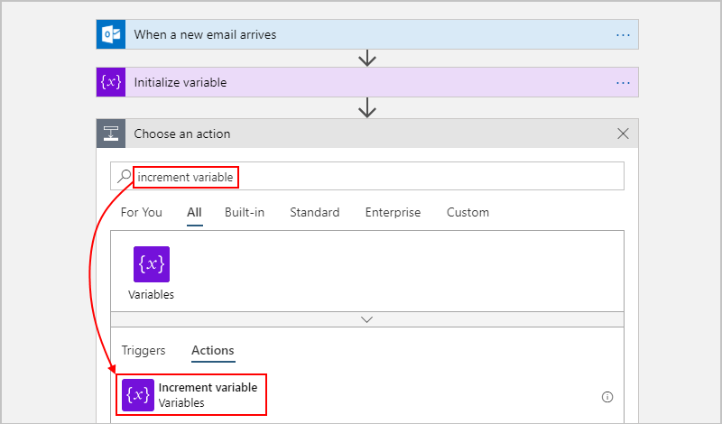
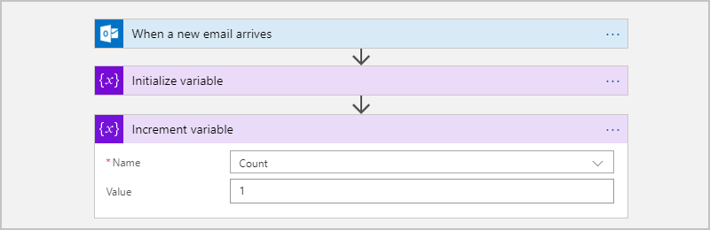
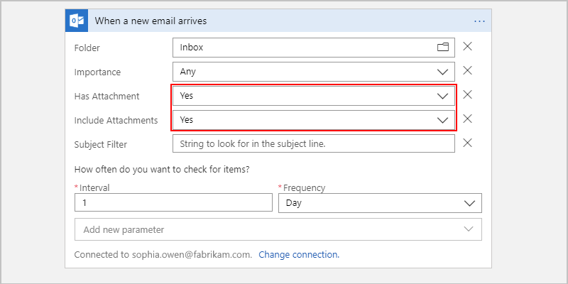
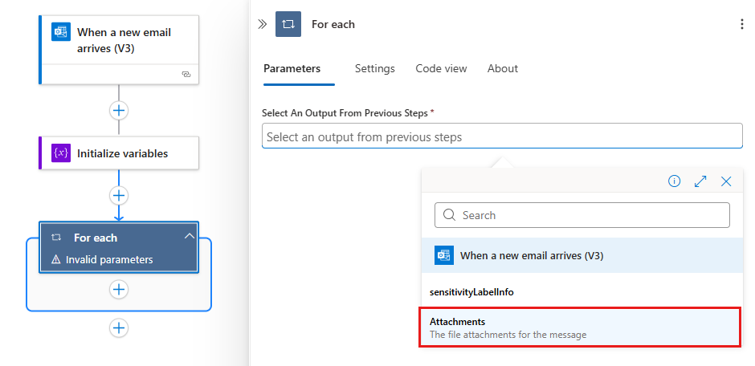
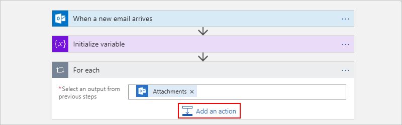
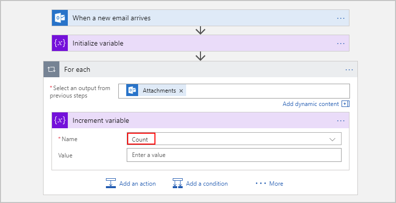
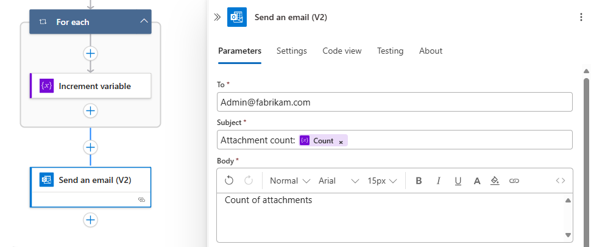

# Store and manage values by using variables in Azure Logic Apps

This article shows how to create and work with variables that you use to store values in your logic app. For example, variables can help you track the number of times that a loop runs. To iterate over an array or check an array for a specific item, you can use a variable to reference the index number for each array item.

You can create variables for data types such as integer, float, boolean, string, array, and object. After you create a variable, you can perform other tasks, for example:

* Get or reference the variable's value.
* Increase or decrease the variable by a constant value, also known as *increment* and *decrement*.
* Assign a different value to the variable.
* Insert or *append* the variable's value as the last item in a string or array.

Variables exist and are global only within the logic app instance that creates them. Also, they persist across any loop iterations inside a logic app instance. When you reference a variable, use the variable's name as the token, not the action's name, which is the usual way to reference an action's outputs.

> [!IMPORTANT]
> By default, cycles in a "For each" loop run in parallel. When you use variables in loops, 
> run the loop [sequentially](../logic-apps/logic-apps-control-flow-loops.md#sequential-foreach-loop) 
> so that variables return predictable results.

## Prerequisites

* An Azure subscription. If you don't have subscription, [sign up for a free Azure account](https://azure.microsoft.com/free/).

* The logic app where you want to create the variable

  If you're new to logic apps, review [What is Azure Logic Apps?](../logic-apps/logic-apps-overview.md) and [Quickstart: Create your first logic app](../logic-apps/quickstart-create-first-logic-app-workflow.md).

* A [trigger](../logic-apps/logic-apps-overview.md#logic-app-concepts) as the first step in your logic app

  Before you can add actions for creating and working with variables, your logic app must start with a trigger.

<a name="create-variable"></a>

## Initialize variable

You can create a variable and declare its data type and initial value - all within one action in your logic app. You can only declare variables at the global level, not within scopes, conditions, and loops.

1. In the [Azure portal](https://portal.azure.com) or Visual Studio, open your logic app in the Logic App Designer.

   This example uses the Azure portal and a logic app with an existing trigger.

1. In your logic app, under the step where you want to add a variable, follow one of these steps: 

   * To add an action under the last step, select **New step**.

     

   * To add an action between steps, move your mouse over the connecting arrow so that the plus sign (**+**) appears. Select the plus sign, and then select **Add an action**.

1. Under **Choose an action**, in the search box, enter `variables` as your filter. From the actions list, select **Initialize variable**.

   

1. Provide this information about your variable as described below:

   | Property | Required | Value |  Description |
   |----------|----------|-------|--------------|
   | **Name** | Yes | <*variable-name*> | The name for the variable to increment |
   | **Type** | Yes | <*variable-type*> | The data type for the variable |
   | **Value** | No | <*start-value*> | The initial value for your variable <p><p>**Tip**: Although optional, set this value as a best practice so you always know the start value for your variable. |
   |||||

   For example:

   

1. Now continue adding the actions you want. When you're done, on the designer toolbar, select **Save**.

If you switch from the designer to the code view editor, here is the way that the **Initialize variable** action appears in your logic app definition, which is in JavaScript Object Notation (JSON) format:

```json
"actions": {
   "Initialize_variable": {
      "type": "InitializeVariable",
      "inputs": {
         "variables": [ {
               "name": "Count",
               "type": "Integer",
               "value": 0
          } ]
      },
      "runAfter": {}
   }
},
```

> [!NOTE]
> Although the **Initialize variable** action has a `variables` section that's structured as an array, 
> the action can create only one variable at a time. Each new variable requires an individual **Initialize variable** action.

Here are examples for some other variable types:

*String variable*

```json
"actions": {
   "Initialize_variable": {
      "type": "InitializeVariable",
      "inputs": {
         "variables": [ {
               "name": "myStringVariable",
               "type": "String",
               "value": "lorem ipsum"
          } ]
      },
      "runAfter": {}
   }
},
```

*Boolean variable*

```json
"actions": {
   "Initialize_variable": {
      "type": "InitializeVariable",
      "inputs": {
         "variables": [ {
               "name": "myBooleanVariable",
               "type": "Boolean",
               "value": false
          } ]
      },
      "runAfter": {}
   }
},
```

*Array with integers*

```json
"actions": {
   "Initialize_variable": {
      "type": "InitializeVariable",
      "inputs": {
         "variables": [ {
               "name": "myArrayVariable",
               "type": "Array",
               "value": [1, 2, 3]
          } ]
      },
      "runAfter": {}
   }
},
```

*Array with strings*

```json
"actions": {
   "Initialize_variable": {
      "type": "InitializeVariable",
      "inputs": {
         "variables": [ {
               "name": "myArrayVariable",
               "type": "Array",
               "value": ["red", "orange", "yellow"]
          } ]
      },
      "runAfter": {}
   }
},
```

<a name="get-value"></a>

## Get the variable's value

To retrieve or reference a variable's contents, you can also use the [variables() function](../logic-apps/workflow-definition-language-functions-reference.md#variables) in the Logic App Designer and the code view editor. When referencing a variable, use the variable's name as the token, not the action's name, which is the usual way to reference an action's outputs.

For example, this expression gets the items from the array variable [created previously in this article](#append-value) by using the `variables()` function. The `string()` function returns the variable's contents in string format: `"1, 2, 3, red"`

```json
@{string(variables('myArrayVariable'))}
```

<a name="increment-value"></a>

## Increment variable 

To increase or *increment* a variable by a constant value, add the **Increment variable** action to your logic app. This action works only with integer and float variables.

1. In the Logic App Designer, under the step where you want to increase an existing variable, select **New step**. 

   For example, this logic app already has a trigger and an action that created a variable. So, add a new action under these steps:

   

   To add an action between existing steps, move your mouse over the connecting arrow so that the plus sign (+) appears. Select the plus sign, and then select **Add an action**.

1. In the search box, enter "increment variable" as your filter. In the actions list, select **Increment variable**.

   

1. Provide this information for incrementing your variable:

   | Property | Required | Value |  Description |
   |----------|----------|-------|--------------|
   | **Name** | Yes | <*variable-name*> | The name for the variable to increment |
   | **Value** | No | <*increment-value*> | The value used for incrementing the variable. The default value is one. <p><p>**Tip**: Although optional, set this value as a best practice so you always know the specific value for incrementing your variable. |
   ||||

   For example:

   

1. When you're done, on the designer toolbar, select **Save**.

If you switch from the designer to the code view editor, here is the way that the **Increment variable** action appears inside your logic app definition, which is in JSON format:

```json
"actions": {
   "Increment_variable": {
      "type": "IncrementVariable",
      "inputs": {
         "name": "Count",
         "value": 1
      },
      "runAfter": {}
   }
},
```

## Example: Create loop counter

Variables are commonly used for counting the number of times that a loop runs. This example shows how you create and use variables for this task by creating a loop that counts the attachments in an email.

1. In the Azure portal, create a blank logic app. Add a trigger that checks for new email and any attachments.

   This example uses the Office 365 Outlook trigger for **When a new email arrives**. You can set up this trigger to fire only when the email has attachments. However, you can use any connector that checks for new emails with attachments, such as the Outlook.com connector.

1. In the trigger, to check for attachments and pass those attachments into your logic app's workflow, select **Yes** for these properties:

   * **Has Attachment**
   * **Include Attachments**

   

1. Add the [**Initialize variable** action](#create-variable). Create an integer variable named `Count` that has a zero start value.

   

1. To cycle through each attachment, add a *for each* loop.

   1. Under the **Initialize variable** action, select **New step**.

   1. Under **Choose an action**, select **Built-in**. In the search box, enter `for each` as your search filter, and select **For each**.

      

1. In the loop, click inside the **Select an output from previous steps** box. When the dynamic content list appears, select **Attachments**.

   

   The **Attachments** property passes an array, which has the email attachments from the trigger's output, into your loop.

1. In the **For each** loop, select **Add an action**.

   

1. In the search box, enter "increment variable" as your filter. From the actions list, select **Increment variable**.

   > [!NOTE]
   > Make sure that the **Increment variable** action appears inside the loop. 
   > If the action appears outside the loop, drag the action into the loop.

1. In the **Increment variable** action, from the **Name** list, select the **Count** variable.

   

1. Under the loop, add any action that sends you the number of attachments. In your action, include the value from the **Count** variable, for example:

   

1. Save your logic app. On the designer toolbar, select **Save**.

### Test your logic app

1. If your logic app isn't enabled, on your logic app menu, select **Overview**. On the toolbar, select **Enable**.

1. On the Logic App Designer toolbar, select **Run**. This step manually starts your logic app.

1. Send an email with one or more attachments to the email account you used in this example.

   This step fires the logic app's trigger, which creates and runs an instance for your logic app's workflow. As a result, the logic app sends you a message or email that shows the number of attachments in the email you sent.

If you switch from the designer to the code view editor, here is the way that the **For each** loop appears along with the **Increment variable** action inside your logic app definition, which is in JSON format.

```json
"actions": {
   "For_each": {
      "type": "Foreach",
      "actions": {
         "Increment_variable": {
           "type": "IncrementVariable",
            "inputs": {
               "name": "Count",
               "value": 1
            },
            "runAfter": {}
         }
      },
      "foreach": "@triggerBody()?['Attachments']",
      "runAfter": {
         "Initialize_variable": [ "Succeeded" ]
      }
   }
},
```

<a name="decrement-value"></a>

## Decrement variable

To decrease or *decrement* a variable by a constant value, follow the steps for [increasing a variable](#increment-value) except that you find and select the **Decrement variable** action instead. This action works only with integer and float variables.

Here are the properties for the **Decrement variable** action:

| Property | Required | Value |  Description |
|----------|----------|-------|--------------|
| **Name** | Yes | <*variable-name*> | The name for the variable to decrement | 
| **Value** | No | <*increment-value*> | The value for decrementing the variable. The default value is one. <p><p>**Tip**: Although optional, set this value as a best practice so you always know the specific value for decrementing your variable. |
||||| 

If you switch from the designer to the code view editor, here is the way that the **Decrement variable** action appears inside your logic app definition, which is in JSON format.

```json
"actions": {
   "Decrement_variable": {
      "type": "DecrementVariable",
      "inputs": {
         "name": "Count",
         "value": 1
      },
      "runAfter": {}
   }
},
```

<a name="assign-value"></a>

## Set variable

To assign a different value to an existing variable, follow the steps for [increasing a variable](#increment-value) except that you:

1. Find and select the **Set variable** action instead.

1. Provide the variable name and value you want to assign. Both the new value and the variable must have the same data type. The value is required because this action doesn't have a default value.

Here are the properties for the **Set variable** action:

| Property | Required | Value |  Description |
|----------|----------|-------|--------------|
| **Name** | Yes | <*variable-name*> | The name for the variable to change |
| **Value** | Yes | <*new-value*> | The value you want to assign the variable. Both must have the same data type. |
||||| 

> [!NOTE]
> Unless you're incrementing or decrementing variables, changing variables 
> inside loops *might* create unexpected results because loops run in parallel, 
> or concurrently, by default. For these cases, try setting your loop to run sequentially. 
> For example, when you want to reference the variable value inside the loop and expect 
> same value at the start and end of that loop instance, follow these steps to change how the loop runs: 
>
> 1. In your loop's upper-right corner, select the ellipsis (**...**) button, 
> and then select **Settings**.
> 
> 2. Under **Concurrency Control**, change the **Override Default** setting to **On**.
>
> 3. Drag the **Degree of Parallelism** slider to **1**.

If you switch from the designer to the code view editor, here is the way that the **Set variable** action appears inside your logic app definition, which is in JSON format. This example changes the `Count` variable's current value to another value.

```json
"actions": {
   "Initialize_variable": {
      "type": "InitializeVariable",
      "inputs": {
         "variables": [ {
               "name": "Count",
               "type": "Integer",
               "value": 0
          } ]
      },
      "runAfter": {}
   },
   "Set_variable": {
      "type": "SetVariable",
      "inputs": {
         "name": "Count",
         "value": 100
      },
      "runAfter": {
         "Initialize_variable": [ "Succeeded" ]
      }
   }
},
```

<a name="append-value"></a>

## Append to variable

For variables that store strings or arrays, you can insert or *append* a variable's value as the last item in those strings or arrays. You can follow the steps for [increasing a variable](#increment-value) except that you follow these steps instead: 

1. Find and select one of these actions based on whether your variable is a string or an array: 

   * **Append to string variable**
   * **Append to array variable** 

1. Provide the value to append as the last item in the string or array. This value is required.

Here are the properties for the **Append to...** actions:

| Property | Required | Value |  Description |
|----------|----------|-------|--------------|
| **Name** | Yes | <*variable-name*> | The name for the variable to change |
| **Value** | Yes | <*append-value*> | The value you want to append, which can have any type |
|||||

If you switch from the designer to the code view editor, here is the way that the **Append to array variable** action appears inside your logic app definition, which is in JSON format. This example creates an array variable, and adds another value as the last item in the array. Your result is an updated variable that contains this array: `[1,2,3,"red"]`

```json
"actions": {
   "Initialize_variable": {
      "type": "InitializeVariable",
      "inputs": {
         "variables": [ {
            "name": "myArrayVariable",
            "type": "Array",
            "value": [1, 2, 3]
         } ]
      },
      "runAfter": {}
   },
   "Append_to_array_variable": {
      "type": "AppendToArrayVariable",
      "inputs": {
         "name": "myArrayVariable",
         "value": "red"
      },
      "runAfter": {
        "Initialize_variable": [ "Succeeded" ]
      }
   }
},
```

## Next steps

* Learn about [Logic Apps connectors](../connectors/apis-list.md)
