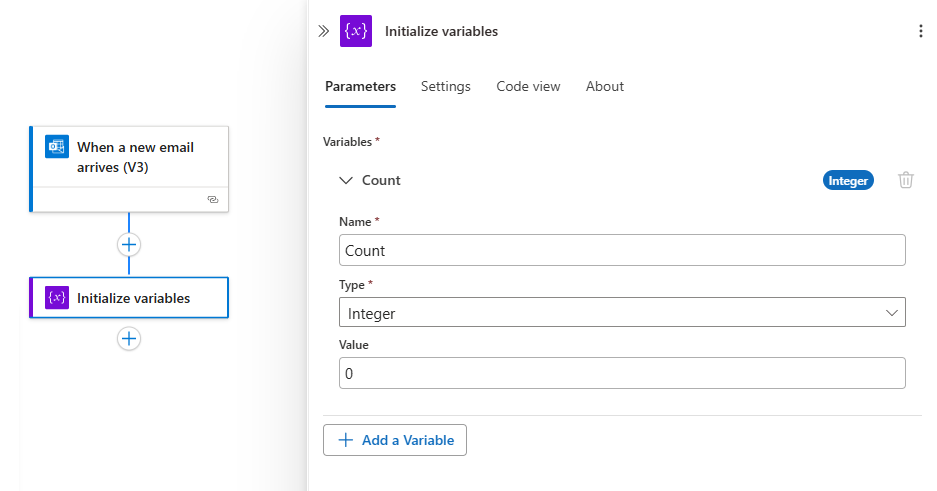

---
# required metadata
title: Save values with variables - Azure Logic Apps | Microsoft Docs
description: Create variables so you can save and manage values in Azure Logic Apps
services: logic-apps
author: ecfan
manager: cfowler
ms.author: estfan
ms.topic: article
ms.date: 05/26/2018
ms.service: logic-apps

# optional metadata
ms.reviewer: klam, LADocs
ms.suite: integration
---

# Save and manage values with variables in Azure Logic Apps

This article shows how you can store and use values throughout your logic 
app by creating variables so that you can save and work with those values. 
For example, variables can help you count how often a loop runs, 
or find an array item by referencing that item's index value. 
You can perform other tasks with those values, for example:

* Increase the value in a variable.
* Decrease the value in a variable.
* Change the value in a variable.
* Add the value in a variable to the end of an array.
* Add the value in a variable to the end of a string.

Variables exist globally and are shared across 
any loop iterations inside a logic app instance, 
but variables exist only within that instance. 

If you don't have an Azure subscription, 
[sign up for a free Azure account](https://azure.microsoft.com/free/). 
If you're new to logic apps, review 
[What is Azure Logic Apps](../logic-apps/logic-apps-overview.md) 
and [Quickstart: Create your first logic app](../logic-apps/quickstart-create-first-logic-app-workflow.md).

## Prerequisites

* The logic app where you want to create a variable 

## Create variable

1. In the Azure portal or Visual Studio, 
open your logic app in Logic App Designer. 

   This example uses the Azure portal 
   and a logic app with an existing trigger.

2. In Logic App Designer, under the step in your logic app 
where you want to add a variable, add an action.

   To add an action under the last step, 
   choose **New step** > **Add an action**.

     

   To add an action between existing steps, 
   move your mouse over the connecting arrow 
   so that the plus sign (+) appears. Choose 
   the plus sign, and then choose **Add an action**.

3. In the search box, enter "variables" as your filter. 
From the actions list, select this action: 
**Variables - Initialize variable** 

   

4. Provide this information for the variable you want to create.

   | Property | Required | Value |  Description |
   |----------|----------|-------|--------------|
   | Name | Yes | <*variable-name*> | The name for the variable to increment | 
   | Type | Yes | <*variable-type*> | The data type for the variable | 
   | Value | No | <*start-value*> | The initial value for your variable | 
   |||| 

   For example: 

   

5. Now continue adding the actions you want. 
When you're done, on the designer toolbar, choose **Save**.

## Change variable values

In Logic App Designer, you have several ways that you 
can easily change the value in an existing variable. 

* Add a value to the variable, or "increment" the variable.
* Subtract a value from the variable, or "decrement" the variable.
* Assign a new value to the variable.

If you don't have an existing variable yet, 
[create that variable now](#create-variable).

### Increment variable 

To increase a variable by a specific value, add the 
**Variables - Increment variable** action to your logic app. 

1. In Logic App Designer, under the step where you want 
to increase an existing variable, choose 
**New step** > **Add an action**.

   

   To add an action between existing steps, 
   move your mouse over the connecting arrow 
   so that the plus sign (+) appears. Choose 
   the plus sign, and then choose **Add an action**.

2. In the search box, enter "increment variable" as your filter. 
In the actions list, select this action: 
**Variables - Increment variable**

   

3. Provide the information for incrementing your variable.

   | Property | Required | Value |  Description |
   |----------|----------|-------|--------------|
   | Name | Yes | <*variable-name*> | The name for the existing variable to increment | 
   | Value | No | <*increment-value*> | The value to add to the variable value | 
   |||| 

   For example: 
   
   

4. When you're done, on the designer toolbar, choose **Save**.

### Example: Count loop cycles

Variables often perform the work for counting how many times a loop runs. 
This example shows how you can use variables for this task by creating a 
variable that starts at zero and increasing that variable for each file 
that's attached to each email that you get.

a "for-each" loop that cycles through the attachments counts the attachments for each email 
that arrives: 

 with a "do-until" loop

1. Outside your loop, create a variable that tracks the 
count value and set the starting value to zero. 

2. Inside your loop, you increase the variable's value, 
usually by a value of one, but you can specify any value you want. 

   

