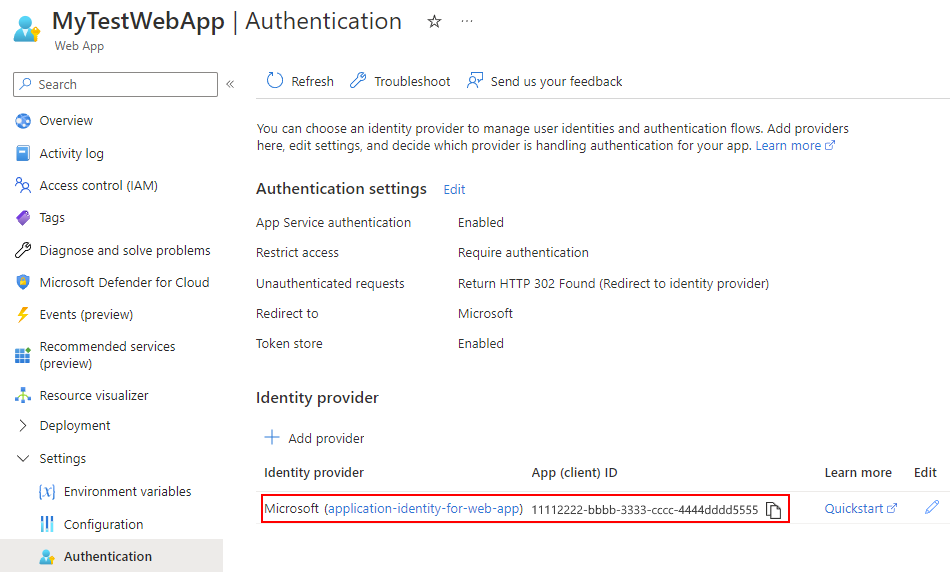
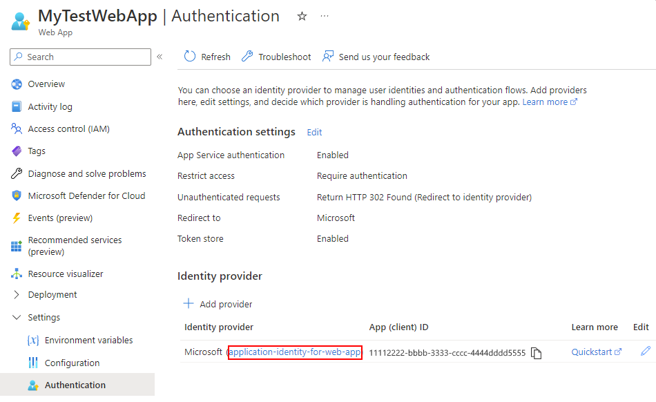
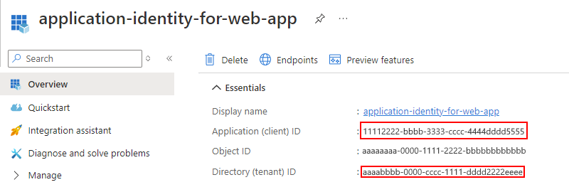

# Add authentication when calling custom APIs from Azure Logic Apps

To improve security for calls to your APIs, you can set up Microsoft Entra authentication through the Azure portal so you don't have to update your code. Or, you can require and enforce authentication through your API's code.

You can add authentication in the following ways:

* [No code changes](#no-code): Protect your API with [Microsoft Entra ID](../active-directory/fundamentals/active-directory-whatis.md) through the Azure portal, so you don't have to update your code or redeploy your API.

  > [!NOTE]
  >
  > By default, the Microsoft Entra authentication that you select in the Azure portal doesn't 
  > provide fine-grained authorization. For example, this authentication locks your API 
  > to just a specific tenant, not to a specific user or app.

* [Update your API's code](#update-code): Protect your API by enforcing [certificate authentication](#certificate), [basic authentication](#basic), or [Microsoft Entra authentication](#azure-ad-code) through code.

<a name="no-code"></a>

## Authenticate calls to your API without changing code

Here are the general steps for this method:

1. Create two Microsoft Entra application identities: one for your logic app resource and one for your web app (or API app).

1. To authenticate calls to your API, use the credentials (client ID and secret) for the service principal that's associated with the Microsoft Entra application identity for your logic app.

1. Include the application IDs in your logic app's workflow definition.

<a name='part-1-create-an-azure-ad-application-identity-for-your-logic-app'></a>

### Part 1: Create a Microsoft Entra application identity for your logic app

Your logic app resource uses this Microsoft Entra application identity to authenticate against Microsoft Entra ID. You only have to set up this identity one time for your directory. For example, you can choose to use the same identity for all your logic apps, even though you can create unique identities for each logic app. You can set up these identities in the Azure portal or use [PowerShell](#powershell).

#### [Portal](#tab/azure-portal)

1. In the [Azure portal](https://portal.azure.com), select **Microsoft Entra ID**.

1. Confirm that you're in the same directory as your web app or API app.

   > [!TIP]
   >
   > To switch directories, choose your profile and select another directory.
   > Or, select **Overview** > **Switch directory**.

1. On the directory menu, under **Manage**, select **App registrations** > **New registration**.

   The **All registrations** list shows all the app registrations in your directory. To view only your app registrations, select **Owned applications**.

   

1. Provide a user-facing name for your logic app's application identity. Select the supported account types. For **Redirect URI**, select **Web**, provide a unique URL where to return the authentication response, and select **Register**.

   

   The **Owned applications** list now includes your created application identity. If this identity doesn't appear, on the toolbar, select **Refresh**.

   

1. From the app registrations list, select your new application identity.

1. From the application identity navigation menu, select **Overview**.

1. On the **Overview** pane, under **Essentials**, copy and save the **Application ID** to use as the "client ID" for your logic app in Part 3.

   

1. From the application identity navigation menu, select **Certificates & secrets**.

1. On the **Client secrets** tab, select **New client secret**.

1. For **Description**, provide a name for your secret. Under **Expires**, select a duration for your secret. When you're done, select **Add**.

   The secret that you create acts as the application identity's "secret" or password for your logic app.

   

   On the **Certificates & secrets** pane, under **Client secrets**, your secret now appears along with a secret value and secret ID.

   

1. Copy the secret value for later use. When you configure your logic app in Part 3, you specify this value as the "secret" or password.

<a name="powershell"></a>

#### [PowerShell](#tab/azure-powershell)

[!INCLUDE [updated-for-az](../../includes/updated-for-az.md)]

You can perform this task through Azure Resource Manager with PowerShell. In PowerShell, run the following commands:

1. `Add-AzAccount`

1. `$SecurePassword = Read-Host -AsSecureString`

1. Enter a password and press Enter.

1. `New-AzADApplication -DisplayName "MyLogicAppID" -HomePage "http://mydomain.tld" -IdentifierUris "http://mydomain.tld" -Password $SecurePassword`

1. Make sure to copy the **Tenant ID** (GUID for your Microsoft Entra tenant), the **Application ID**, and the password that you used.

For more information, learn how to [create a service principal with PowerShell to access resources](../active-directory/develop/howto-authenticate-service-principal-powershell.md).

---

<a name='part-2-create-an-azure-ad-application-identity-for-your-web-app-or-api-app'></a>

### Part 2: Create a Microsoft Entra application identity for your web app or API app

If your web app or API app is already deployed, you can turn on authentication and create the application identity in the Azure portal. Otherwise, you can [turn on authentication when you deploy with an Azure Resource Manager template](#authen-deploy).

**Create the application identity for a deployed web app or API app in the Azure portal**

1. In the [Azure portal](https://portal.azure.com), find and select your web app or API app.

1. Under **Settings**, select **Authentication** > **Add identity provider**.

1. After the **Add an identity provider** pane opens, on the **Basics** tab, from the **Identity provider** list, select **Microsoft** to use Microsoft Entra identities, and then select **Add**.

1. Now, create an application identity for your web app or API app as follows:

   1. For **App registration type**, select **Create new app registration**.

   1. For **Name**, provide a name for your application identity.

   1. For **Supported account types**, select the account types appropriate for your scenario.

   1. For **Restrict access**, select **Require authentication**.

   1. For **Unauthenticated requests**, select the option based on your scenario.

   1. When you're done, select **Add**.

   The application identity that you just created for your web app or API app now appears in the **Identity provider** section:

   

   > [!TIP]
   >
   > If the application identity doesn't appear, on the toolbar, select **Refresh**. 

Now you must find the application (client) ID and tenant ID for the application identity that you just created for your web app or API app. You use these IDs in Part 3. So, continue with the following steps for the Azure portal.

**Find application identity's client ID and tenant ID for your web app or API app in the Azure portal**

1. On your web app's navigation menu, select **Authentication**.

1. In the **Identity provider** section, find the application identity you previously created. Select the name for your application identity.

   

1. After the application identity's **Overview** pane opens, find the values for **Application (client) ID** and **Directory (tenant) ID**. Copy and save the values for use in Part 3.

   

   You can also use the tenant ID GUID in your web app or API app's deployment template, if necessary. This GUID is your specific tenant's GUID ("tenant ID") and should appear in this URL: `https://sts.windows.net/{GUID}`

<a name="authen-deploy"></a>

**Set up authentication when you deploy with an Azure Resource Manager template**

If you're using an Azure Resource Manager template (ARM template), you still have to create a Microsoft Entra application identity for your web app or API app that differs from the app identity for your logic app. To create the application identity, and then find the client ID and tenant ID, follow the previous steps in Part 2 for the Azure portal. You'll use both the client ID and tenant ID in your app's deployment template and also for Part 3.

> [!IMPORTANT]
>
> When you create the Microsoft Entra application identity for your web app or API app, you must use the Azure portal, not PowerShell. The PowerShell commandlet doesn't set up the required permissions to sign users into a website.

After you get the client ID and tenant ID, include these IDs as a subresource of your web app or API app in your deployment template:

``` json
"resources": [
   {
      "apiVersion": "2015-08-01",
      "name": "web",
      "type": "config",
      "dependsOn": ["[concat('Microsoft.Web/sites/','parameters('webAppName'))]"],
      "properties": {
         "siteAuthEnabled": true,
         "siteAuthSettings": {
            "clientId": "<client-ID>",
            "issuer": "https://sts.windows.net/<tenant-ID>/"
         }
      }
   }
]
```

To automatically deploy a blank web app and a logic app together with Microsoft Entra authentication, [view the complete template here](https://github.com/Azure/azure-quickstart-templates/tree/master/quickstarts/microsoft.logic/logic-app-custom-api), or select the following **Deploy to Azure** button:

[](https://portal.azure.com/#create/Microsoft.Template/uri/https%3A%2F%2Fraw.githubusercontent.com%2FAzure%2Fazure-quickstart-templates%2Fmaster%2Fquickstarts%2Fmicrosoft.logic%2Flogic-app-custom-api%2Fazuredeploy.json)

### Part 3: Populate the Authorization section in your logic app

The previous template already has this authorization section set up, but if you are directly authoring your logic app definition, you must include the full authorization section.

1. Open your logic app definition in code view.

1. Go to the **HTTP** action definition, find the **Authorization** section, and include the following properties:

```json
{
   "tenant": "<tenant-ID>",
   "audience": "<client-ID-from-Part-2-web-app-or-API app>",
   "clientId": "<client-ID-from-Part-1-logic-app>",
   "secret": "<secret-from-Part-1-logic-app>",
   "type": "ActiveDirectoryOAuth"
}
```

| Property | Required | Description |
| -------- | -------- | ----------- |
| `tenant` | Yes | The GUID for the Microsoft Entra tenant |
| `audience` | Yes | The GUID for the target resource that you want to access, which is the client ID from the application identity for your web app or API app |
| `clientId` | Yes | The GUID for the client requesting access, which is the client ID from the application identity for your logic app |
| `secret` | Yes | The secret or password from the application identity for the client that's requesting the access token |
| `type` | Yes | The authentication type. For ActiveDirectoryOAuth authentication, the value is `ActiveDirectoryOAuth`. |

For example:

``` json
{
   "actions": {
      "HTTP": {
         "inputs": {
            "method": "POST",
            "uri": "https://your-api-azurewebsites.net/api/your-method",
            "authentication": {
               "tenant": "tenant-ID",
               "audience": "client-ID-from-azure-ad-app-for-web-app-or-api-app",
               "clientId": "client-ID-from-azure-ad-app-for-logic-app",
               "secret": "key-from-azure-ad-app-for-logic-app",
               "type": "ActiveDirectoryOAuth"
            }
         }
      }
   }
}
```

<a name="update-code"></a>

## Secure API calls through code

<a name="certificate"></a>

### Certificate authentication

To validate the incoming requests from your logic app workflow to your web app or API app, you can use client certificates. To set up your code, learn [how to configure TLS mutual authentication](../app-service/app-service-web-configure-tls-mutual-auth.md).

In the **Authorization** section, include the following properties:

```json
{
   "type": "ClientCertificate",
   "password": "<password>",
   "pfx": "<long-pfx-key>"
}
```

| Property | Required | Description |
| -------- | -------- | ----------- |
| `type` | Yes | The authentication type. For TLS/SSL client certificates, the value must be `ClientCertificate`. |
| `password` | No | The password for accessing the client certificate (PFX file) |
| `pfx` | Yes | The base64-encoded contents of the client certificate (PFX file) |

<a name="basic"></a>

### Basic authentication

To validate incoming requests from your logic app to your web app or API app, you can use basic authentication, such as a username and password. Basic authentication is a common pattern, and you can use this authentication in any language used to build your web app or API app.

In the **Authorization** section, include the following properties:

```json
{
   "type": "Basic",
   "username": "<username>",
   "password": "<password>"
}
```

| Property | Required | Description |
| -------- | -------- | ----------- |
| `type` | Yes | The authentication type that you want to use. For basic authentication, the value must be `Basic`. |
| `username` | Yes | The username that you want to use for authentication |
| `password` | Yes | The password that you want to use for authentication |

<a name="azure-ad-code"></a>

<a name='azure-active-directory-authentication-through-code'></a>

### Microsoft Entra authentication through code

By default, the Microsoft Entra authentication that you turn on in the Azure portal doesn't provide fine-grained authorization. For example, this authentication locks your API to just a specific tenant, not to a specific user or app.

To restrict API access to your logic app through code, extract the header that has the JSON web token (JWT). Check the caller's identity, and reject requests that don't match.

<!-- Going further, to implement this authentication entirely in your own code, and not use the Azure portal, learn how to [authenticate with on-premises Active Directory in your Azure app](../app-service/overview-authentication-authorization.md).

To create an application identity for your logic app and use that identity to call your API,
you must follow the previous steps. -->

## Next steps

* [Deploy and call custom APIs from logic app workflows](../logic-apps/logic-apps-custom-api-host-deploy-call.md)
