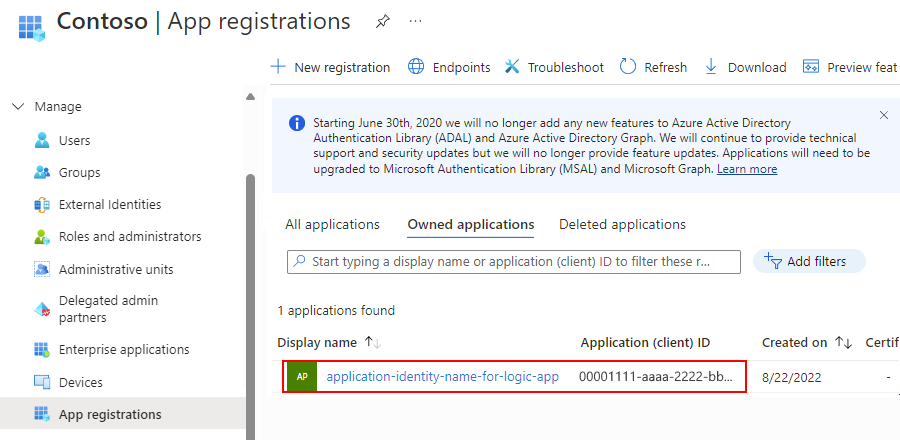

# Secure calls to custom APIs from Azure Logic Apps

To secure calls to your APIs, you can set up Azure Active Directory (Azure AD) 
authentication through the Azure portal so you don't have to update your code. 
Or, you can require and enforce authentication through your API's code.

## Authentication options for your API

You can secure calls to your custom API in these ways:

* [No code changes](#no-code): Protect your API with 
[Azure Active Directory (Azure AD)](../active-directory/fundamentals/active-directory-whatis.md) 
through the Azure portal, so you don't have to update your code or redeploy your API.

  > [!NOTE]
  > By default, the Azure AD authentication that you turn on 
  > in the Azure portal doesn't provide fine-grained authorization. 
  > For example, this authentication locks your API to just a specific tenant, 
  > not to a specific user or app. 

* [Update your API's code](#update-code): Protect your API by enforcing 
[certificate authentication](#certificate), [basic authentication](#basic), 
or [Azure AD authentication](#azure-ad-code) through code.

<a name="no-code"></a>

### Authenticate calls to your API without changing code

Here are the general steps for this method:

1. Create two Azure Active Directory (Azure AD) application identities: 
one for your logic app and one for your web app (or API app).

2. To authenticate calls to your API, use the credentials (client ID and secret) for the 
service principal that's associated with the Azure AD application identity for your logic app.

3. Include the application IDs in your logic app definition.

#### Part 1: Create an Azure AD application identity for your logic app

Your logic app uses this Azure AD application identity to authenticate against Azure AD. 
You only have to set up this identity one time for your directory. 
For example, you can choose to use the same identity for all your logic apps, 
even though you can create unique identities for each logic app. 
You can set up these identities in the Azure portal or use [PowerShell](#powershell).

**Create the application identity for your logic app in the Azure portal**

1. In the [Azure portal](https://portal.azure.com "https://portal.azure.com"), 
choose **Azure Active Directory**. 

2. Confirm that you're in the same directory as your web app or API app.

   > [!TIP]
   > To switch directories, choose your profile and select another directory. 
   > Or, choose **Overview** > **Switch directory**.

3. On the directory menu, under **Manage**, 
choose **App registrations** > **New application registration**.

   > [!TIP]
   > By default, the app registrations list shows all 
   > app registrations in your directory. 
   > To view only your app registrations, next to the search box, 
   > select **My apps**. 

   

4. Give your application identity a name, 
leave **Application type** set to **Web app / API**, 
provide a unique string formatted as a domain 
for **Sign-on URL**, and choose **Create**.

   

   The application identity that you created for your 
   logic app now appears in the app registrations list.

   

5. In the app registrations list, select your new application identity. 
Copy and save the **Application ID** to use as the "client ID" 
for your logic app in Part 3.

   

6. If your application identity settings aren't visible, 
choose **Settings** or **All settings**.

7. Under **API Access**, choose **Keys**. Under **Description**, 
provide a name for your key. Under **Expires**, select a duration for your key.

   The key that you're creating acts as the application identity's 
   "secret" or password for your logic app.

   

8. On the toolbar, choose **Save**. Under **Value**, your key now appears. 
**Make sure to copy and save your key** for later use because the key is hidden 
when you leave the **Keys** page.

   When you configure your logic app in Part 3, 
   you specify this key as the "secret" or password.

   

<a name="powershell"></a>

**Create the application identity for your logic app in PowerShell**

You can perform this task through Azure Resource Manager with PowerShell. 
In PowerShell, run these commands:

1. `Switch-AzureMode AzureResourceManager`

2. `Add-AzureAccount`

3. `New-AzureADApplication -DisplayName "MyLogicAppID" -HomePage "http://mydomain.tld" -IdentifierUris "http://mydomain.tld" -Password "identity-password"`

4. Make sure to copy the **Tenant ID** (GUID for your Azure AD tenant), 
the **Application ID**, and the password that you used.

For more information, learn how to 
[create a service principal with PowerShell to access resources](../azure-resource-manager/resource-group-authenticate-service-principal.md).

#### Part 2: Create an Azure AD application identity for your web app or API app

If your web app or API app is already deployed, you can turn on authentication 
and create the application identity in the Azure portal. Otherwise, you can 
[turn on authentication when you deploy with an Azure Resource Manager template](#authen-deploy). 

**Create the application identity and turn on authentication in the Azure portal for deployed apps**

1. In the [Azure portal](https://portal.azure.com "https://portal.azure.com"), 
find and select your web app or API app. 

2. Under **Settings**, choose **Authentication/Authorization**. 
Under **App Service Authentication**, turn authentication **On**. 
Under **Authentication Providers**, choose **Azure Active Directory**.

   

3. Now create an application identity for your web app or API app as shown here. 
On the **Azure Active Directory Settings** page, 
set **Management mode** to **Express**. Choose **Create New AD App**. 
Give your application identity a name, and choose **OK**. 

   

4. On the **Authentication / Authorization** page, choose **Save**.

Now you must find the client ID and tenant ID for the application identity 
that's associated with your web app or API app. You use these IDs in Part 3. 
So continue with these steps for the Azure portal.

**Find application identity's client ID and tenant ID for your web app or API app in the Azure portal**

1. Under **Authentication Providers**, choose **Azure Active Directory**. 

   

2. On the **Azure Active Directory Settings** page, set **Management mode** to **Advanced**.

3. Copy the **Client ID**, and save that GUID for use in Part 3.

   > [!TIP] 
   > If **Client ID** and **Issuer Url** don't appear, 
   > try refreshing the Azure portal, and repeat Step 1.

4. Under **Issuer Url**, copy and save just the GUID for Part 3. 
You can also use this GUID in your web app or API app's deployment template, if necessary.

   This GUID is your specific tenant's GUID ("tenant ID") and 
   should appear in this URL: `https://sts.windows.net/{GUID}`

5. Without saving your changes, close the **Azure Active Directory Settings** page.

<a name="authen-deploy"></a>

**Turn on authentication when you deploy with an Azure Resource Manager template**

You must still create an Azure AD application identity for your web app or API app 
that differs from the app identity for your logic app. To create the application identity, 
follow the previous steps in Part 2 for the Azure portal. 

You can also follow the steps in Part 1, but make sure to use your web app 
or API app's actual `https://{URL}` for **Sign-on URL** and **App ID URI**. 
From these steps, you have to save both the client ID and tenant ID for use 
in your app's deployment template and also for Part 3.

> [!NOTE]
> When you create the Azure AD application identity for your web app or API app, 
> you must use the Azure portal, not PowerShell. 
> The PowerShell commandlet doesn't set up the required permissions to sign users into a website.

After you get the client ID and tenant ID, include these IDs 
as a subresource of your web app or API app in your deployment template:

``` json
"resources": [ {
    "apiVersion": "2015-08-01",
    "name": "web",
    "type": "config",
    "dependsOn": ["[concat('Microsoft.Web/sites/','parameters('webAppName'))]"],
    "properties": {
        "siteAuthEnabled": true,
        "siteAuthSettings": {
            "clientId": "{client-ID}",
            "issuer": "https://sts.windows.net/{tenant-ID}/",
        }
    }
} ]
```

To automatically deploy a blank web app and a logic app together with 
Azure Active Directory authentication, [view the complete template here](https://github.com/Azure/azure-quickstart-templates/tree/master/201-logic-app-custom-api/azuredeploy.json), 
or click **Deploy to Azure** here:

[](https://portal.azure.com/#create/Microsoft.Template/uri/https%3A%2F%2Fraw.githubusercontent.com%2FAzure%2Fazure-quickstart-templates%2Fmaster%2F201-logic-app-custom-api%2Fazuredeploy.json)

#### Part 3: Populate the Authorization section in your logic app

The previous template already has this authorization section set up, 
but if you are directly authoring the logic app, you must include the full authorization section.

Open your logic app definition in code view, go to the **HTTP** action section, 
find the **Authorization** section, and include this line:

`{"tenant": "{tenant-ID}", "audience": "{client-ID-from-Part-2-web-app-or-API app}", "clientId": "{client-ID-from-Part-1-logic-app}", "secret": "{key-from-Part-1-logic-app}", "type": "ActiveDirectoryOAuth" }`

| Element | Required | Description | 
| ------- | -------- | ----------- | 
| tenant | Yes | The GUID for the Azure AD tenant | 
| audience | Yes | The GUID for the target resource that you want to access, which is the client ID from the application identity for your web app or API app | 
| clientId | Yes | The GUID for the client requesting access, which is the client ID from the application identity for your logic app | 
| secret | Yes | The key or password from the application identity for the client that's requesting the access token | 
| type | Yes | The authentication type. For ActiveDirectoryOAuth authentication, the value is `ActiveDirectoryOAuth`. | 
|||| 

For example:

``` json
{
   "actions": {
      "some-action": {
         "conditions": [],
         "inputs": {
            "method": "post",
            "uri": "https://your-api-azurewebsites.net/api/your-method",
            "authentication": {
               "tenant": "tenant-ID",
               "audience": "client-ID-from-azure-ad-app-for-web-app-or-api-app",
               "clientId": "client-ID-from-azure-ad-app-for-logic-app",
               "secret": "key-from-azure-ad-app-for-logic-app",
               "type": "ActiveDirectoryOAuth"
            }
         },
      }
   }
}
```

<a name="update-code"></a>

### Secure API calls through code

<a name="certificate"></a>

#### Certificate authentication

To validate the incoming requests from your logic app to your web app or API app, 
you can use client certificates. To set up your code, learn 
[how to configure TLS mutual authentication](../app-service/app-service-web-configure-tls-mutual-auth.md).

In the **Authorization** section, include this line: 

`{"type": "clientcertificate", "password": "password", "pfx": "long-pfx-key"}`

| Element | Required | Description | 
| ------- | -------- | ----------- | 
| type | Yes | The authentication type. For SSL client certificates, the value must be `ClientCertificate`. | 
| password | Yes | The password for accessing the client certificate (PFX file) | 
| pfx | Yes | The base64-encoded contents of the client certificate (PFX file) | 
|||| 

<a name="basic"></a>

#### Basic authentication

To validate incoming requests from your logic app to your web app or API app, 
you can use basic authentication, such as a username and password. 
Basic authentication is a common pattern, and you can use this 
authentication in any language used to build your web app or API app.

In the **Authorization** section, include this line:

`{"type": "basic", "username": "username", "password": "password"}`.

| Element | Required | Description | 
| ------- | -------- | ----------- | 
| type | Yes | The authentication type that you want to use. For basic authentication, the value must be `Basic`. | 
| username | Yes | The username that you want to use for authentication | 
| password | Yes | The password that you want to use for authentication | 
|||| 

<a name="azure-ad-code"></a>

#### Azure Active Directory authentication through code

By default, the Azure AD authentication that you turn on 
in the Azure portal doesn't provide fine-grained authorization. 
For example, this authentication locks your API to just a specific tenant, 
not to a specific user or app. 

To restrict API access to your logic app through code, 
extract the header that has the JSON web token (JWT). 
Check the caller's identity, and reject requests that don't match.

<!-- Going further, to implement this authentication entirely in your own code, 
and not use the Azure portal, learn how to 
[authenticate with on-premises Active Directory in your Azure app](../app-service/app-service-authentication-overview.md).

To create an application identity for your logic app and use that identity to call your API, 
you must follow the previous steps. -->

## Next steps

* [Deploy and call custom APIs from logic app workflows](../logic-apps/logic-apps-custom-api-host-deploy-call.md)