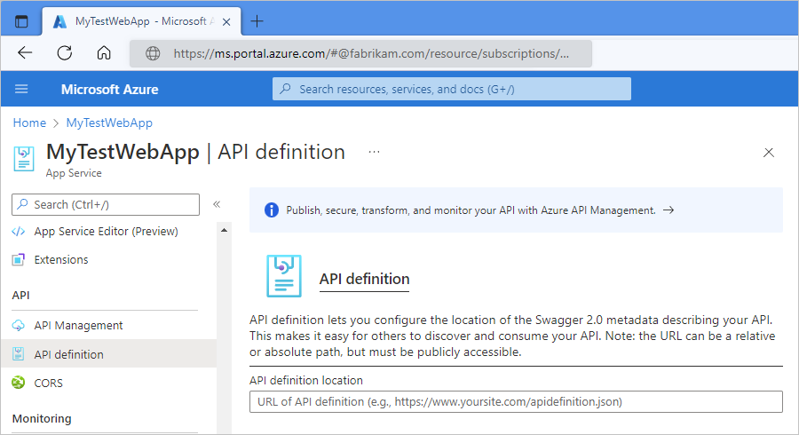
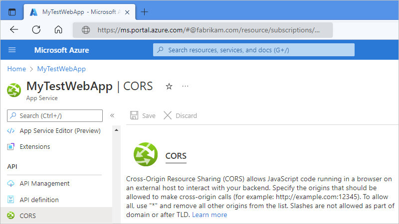

# Deploy and call custom APIs from workflows in Azure Logic Apps

After you [create custom APIs](./logic-apps-create-api-app.md) 
for use in logic app workflows, you must deploy your APIs before you can call them. 
You can deploy your APIs as [web apps](../app-service/app-service-web-overview.md), 
but consider deploying your APIs as [API apps](../app-service/app-service-web-tutorial-rest-api.md), 
which make your job easier when you build, host, and consume APIs 
in the cloud and on premises. You don't have to change any code in your 
APIs - just deploy your code to an API app. You can host your APIs on 
[Azure App Service](../app-service/app-service-web-overview.md), 
a platform-as-a-service (PaaS) offering that provides highly scalable, 
easy API hosting.

Although you can call any API from a logic app, 
for the best experience, add [OpenAPI (previously Swagger) metadata](http://swagger.io/specification/) 
that describes your API's operations and parameters. 
This OpenAPI file helps your API integrate more easily 
and work better with logic apps.

## Deploy your API as a web app or API app

Before you can call your custom API from a logic app, 
deploy your API as a web app or API app to Azure App Service. 
Also, to make your OpenAPI file readable by the Logic Apps Designer, 
set the API definition properties and turn on 
[cross-origin resource sharing (CORS)](../app-service/app-service-web-overview.md) 
for your web app or API app.

1. In the [Azure portal](https://portal.azure.com), 
select your web app or API app.

2. In the app menu that opens, 
under **API**, choose **API definition**. 
Set the **API definition location** 
to the URL for your OpenAPI swagger.json file.

   Usually, the URL appears in this format: 
   `https://{name}.azurewebsites.net/swagger/docs/v1)`

   

3. Under **API**, choose **CORS**. 
Set the CORS policy for **Allowed origins** to **'*'** (allow all).

   This setting permits requests from Logic App Designer.

   

For more information, see 
[Host a RESTful API with CORS in Azure App Service](../app-service/app-service-web-tutorial-rest-api.md).

## Call your custom API from logic app workflows

After you set up the API definition properties and CORS, 
your custom API's triggers and actions should be available 
for you to include in your logic app workflow. 

*  To view websites that have OpenAPI URLs, 
you can browse your subscription websites in the Logic Apps Designer.

*  To view available actions and inputs by pointing at an OpenAPI document, 
use the [HTTP + Swagger action](../connectors/connectors-native-http-swagger.md).

*  To call any API, including APIs that don't have or expose an OpenAPI document, 
you can always create a request with the [HTTP action](../connectors/connectors-native-http.md).

## Next steps

* [Custom connector overview](../logic-apps/custom-connector-overview.md)