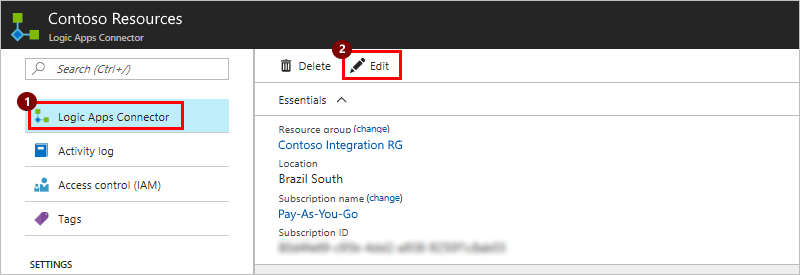
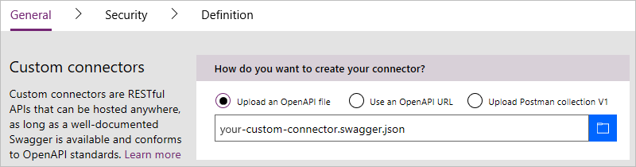
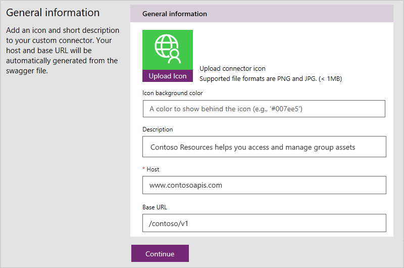
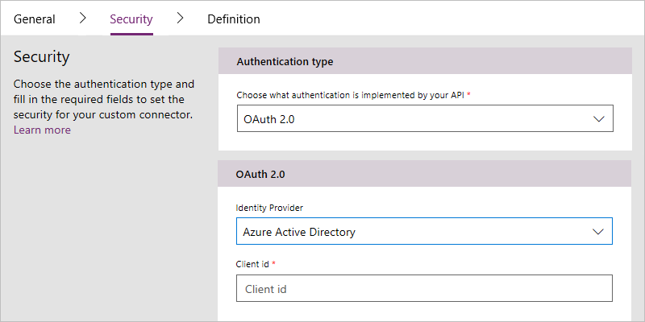
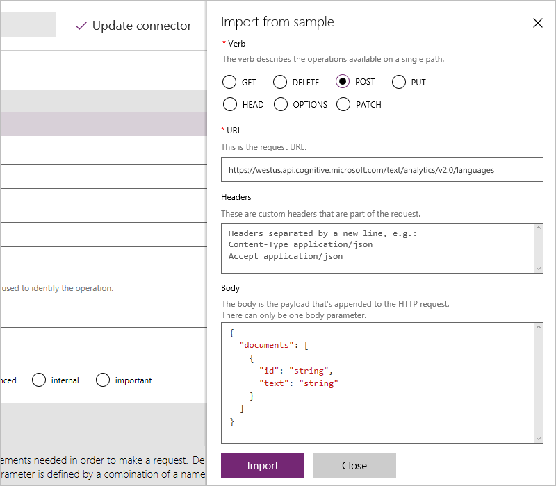
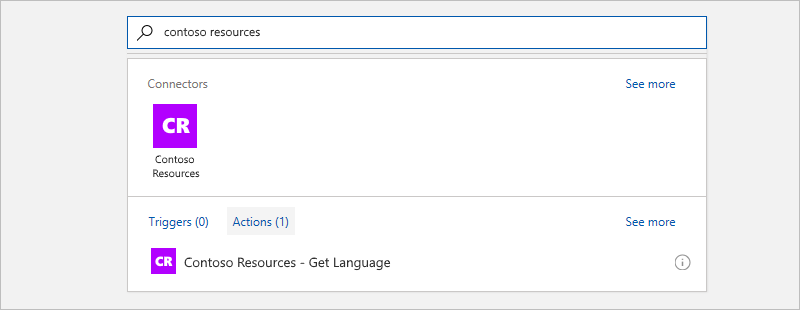

# Register custom connectors in Azure Logic Apps

After you build your REST API, set up authentication, 
and get your OpenAPI definition file, you're ready to register your connector. 

## Prerequisites

To register your custom connector, you need these items:

* Details for registering your connector in Azure, 
such as the name, Azure subscription, Azure resource group, 
and location that you want to use

* An OpenAPI (Swagger) file that describes your API. 
For this tutorial, you can use the 
[sample Azure Resources Manager OpenAPI file](http://pwrappssamples.blob.core.windows.net/samples/AzureResourceManager.json).

* An icon that represents your connector

* A short description for your connector

* The host location for your API

## Create your connector

1. In the Azure portal, on the main Azure menu, choose **New**. 
In the search box, enter "logic apps connector" as your filter, 
and press Enter.

   

2. From the results list, choose **Logic Apps Connector** > **Create**.

   

3. Provide details for registering your connector 
as described in the table. When you're done, 
choose **Pin to dashboard** > **Create**.

   

   | Property | Suggested value | Description | 
   | -------- | --------------- | ----------- | 
   | **Name** | *custom-connector-name* | Provide a name for your connector. | 
   | **Subscription** | *Azure-subscription-name* | Select your Azure subscription. | 
   | **Resource group** | *Azure-resource-group-name* | Create or select an Azure group for organizing your Azure resources. | 
   | **Location** | *deployment-region* | Select a deployment region for your connector. | 
   |||| 

   After Azure deploys your connector, 
   the custom connector menu opens automatically. 
   If not, choose your custom connector from the Azure dashboard.

4. In the connector menu, if not already selected, 
choose **Logic Apps Connector**. In the toolbar, choose **Edit**.

   

5. Choose **General** so that you can provide the details 
in these tables for creating, securing, and defining the 
actions and triggers for your custom connector.

   1. For **Custom connectors**, select an option 
   so you can provide the OpenAPI (Swagger) file that describes your API.

      

      | Option | Format |Description | 
      | ------ | ------ | ----------- | 
      | **Upload an OpenAPI file** | *OpenAPI (Swagger)-json-file* | Browse to the location for your OpenAPI file, and select that file. | 
      | **Use an OpenAPI URL** | http://*path-to-swagger-json-file* | Provide the URL for your API's OpenAPI file. | 
      | **Upload Postman collection V1** | *exported-Postman-collection-V1-file* | Browse to the location for an exported Postman collection in V1 format. | 
      |||| 

   2. For **General information**, upload an icon for your connector. 
   Typically, the **Description**, **Host**, and **Base URL** fields 
   are automatically populated from your OpenAPI file. 
   But if they're not, add this information as described in the table, 
   and choose **Continue**. 

      

      | Option or setting | Format | Description | 
      | ----------------- | ------ | ----------- | 
      | **Upload Icon** | *png-or-jpg-file-under-1-MB* | <li>An icon that represents your connector <li>Color: Preferably a white logo against a color background. <li>Dimensions: A ~160 pixel logo inside a 230 pixel square | 
      | **Icon background color** | *icon-brand-color-hexadecimal-code* | <li>The color behind your icon that matches the background color in your icon file. <li>Format: Hexadecimal. For example, #007ee5 represents the color blue. | 
      | **Description** | *connector-description* | Provide a short description for your connector. | 
      | **Host** | *connector-host* | Provide the host domain for your Web API. | 
      | **Base URL** | *connector-base-URL* | Provide the base URL for your Web API. | 
      |||| 

6. Now choose **Security** so you can review or select the authentication 
that your connector uses. Authentication makes sure that your users' 
identities flow appropriately between your service and any clients.

   

   * When you upload an OpenAPI file, the registration wizard 
   automatically detects the authentication type that your Web API uses, 
   and automatically populates the **Security** section, 
   based on the `securityDefinitions` object in that file. 
   Here's an OAuth2.0 example:

     ``` json
     "securityDefinitions": {
       "AAD": {
       "type": "oauth2",
       "flow": "accessCode",
       "authorizationUrl": "https://login.windows.net/common/oauth2/authorize",
       "tokenUrl": "https://login.windows.net/common/oauth2/token",
       "scopes": {}
       }
     },
     ```

   * A Postman collection automatically populates the authentication 
   type *only* when you use the supported authentication types, 
   such as OAuth 2.0 or Basic.

   * If your OpenAPI file didn't populate the authentication type and properties, 
   choose **Edit** so you can add this information. 
   
     In this tutorial, you previously created Azure AD apps for your Web API 
     and for your connector, so now you can provide the application ID and client key 
     information that you previously saved:
    
     | Setting | Suggested value | Description | 
     | ------- | ----- | ----------- | 
     | **Authentication type** | OAuth 2.0 | | 
     | **Identity Provider** | Azure Active Directory | | 
     | **Client id** | *application-ID-for-connector-Azure-AD-app* | The application ID that you previously saved for your connector's Azure AD app | 
     | **Client secret** | *client-key-for-connector-Azure-AD-app* | The client key for your connector's Azure AD app | 
     | **Login URL** | `https://login.windows.net` | | 
     | **Resource URL** | `https://management.core.windows.net/` | Make sure that you add the URL exactly as specified, including trailing slash. | 
     |||| 

7. To save your connector after entering the security information, 
at the top of the page, choose **Update connector**, 
then choose **Continue**. 

8. Now choose **Definition** so you can review or define 
the actions that users can add to their workflows.

   Actions and triggers are based on the operations defined in your OpenAPI file 
   or Postman collection, which automatically populate the **Definition** page 
   and include the request and response values. So, if the required operations 
   already appear here, you can go to the next step in the registration 
   process without making changes on this page.

   

   To edit existing actions or add new actions, 
   continue with these steps:

   1. To add an action that didn't exist in your OpenAPI file or Postman collection, 
   choose **New action**. 

   2. Under **General**, provide the name, description, ID, and visibility for your operation.

      > [!TIP]
      > Make sure that your description ends with a period.

   3. In the **Request** section, choose **Import from sample**. 

   4. On the **Import from sample** page, paste a sample request. 

      Usually, sample requests are available in the API documentation 
      where you can get information for the **Verb**, **URL**, 
      **Headers**, and **Body** fields. 
      For example, see the [Text Analytics API documentation](https://westus.dev.cognitive.microsoft.com/docs/services/TextAnalytics.V2.0/operations/56f30ceeeda5650db055a3c7).

      

      > [!IMPORTANT]
      > If you create a connector from a Postman collection, 
      > make sure you that you remove the `Content-type` header from actions and triggers. 
      > Logic Apps automatically adds this header. 
      > Also, remove authentication headers that you defined 
      > in the `Security` section from actions and triggers.

      For advanced OpenAPI functionality, 
      see [OpenAPI extensions for custom connectors](../logic-apps/custom-connector-openapi-extensions.md).

   5. To finish the request definition, choose **Import**. 
   Define the response in the same way.

9. After you define all your actions, 
choose **Create** so you can deploy your connector.

Congratulations! Now when you create a logic app, 
you can find your connector in Logic Apps Designer, 
and add that connector to your logic app.



## Share your connector with other Logic Apps users

Registered but uncertified custom connectors work like 
Microsoft-managed connectors, but are visible and available 
*only* to the connector's author and users who have the same 
Azure Active Directory tenant and Azure subscription 
for logic apps in the region where those apps are deployed. 
Although sharing is optional, you might have scenarios where 
you want to share your connectors with other users. 

> [!IMPORTANT]
> If you share a connector, others might start to depend on that connector. 
> ***Deleting your connector deletes all connections to that connector.***
 
To share your connector with external users outside these boundaries, 
for example, with all Logic Apps, Flow, and PowerApps users, 
[submit your connector for Microsoft certification](../logic-apps/custom-connector-submit-certification.md).

## Get support

* For support with development and onboarding, 
or to request features that aren't available in the registration wizard, 
contact [condevhelp@microsoft.com](mailto:condevhelp@microsoft.com).
Microsoft monitors this account for developer questions and problems, 
and routes them to the appropriate team.

* To ask or answer questions, or see what other Azure Logic Apps users are doing, 
visit the [Azure Logic Apps forum](https://social.msdn.microsoft.com/Forums/en-US/home?forum=azurelogicapps).

* To help improve Logic Apps, vote on or submit ideas at the 
[Logic Apps user feedback site](http://aka.ms/logicapps-wish). 

## FAQ

**Q:** Is there a limit on how many requests that users can make with a custom connector? </br>
**A:** Yes, for each connection that's created by a custom connector, 
you can make up to 500 requests per minute.

## Next steps

* [Optional: Certify your connector](../logic-apps/custom-connector-submit-certification.md)
* [Custom connector FAQ](../logic-apps/custom-connector-faq.md)