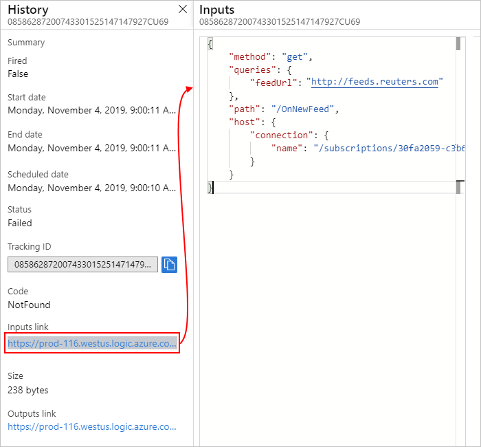
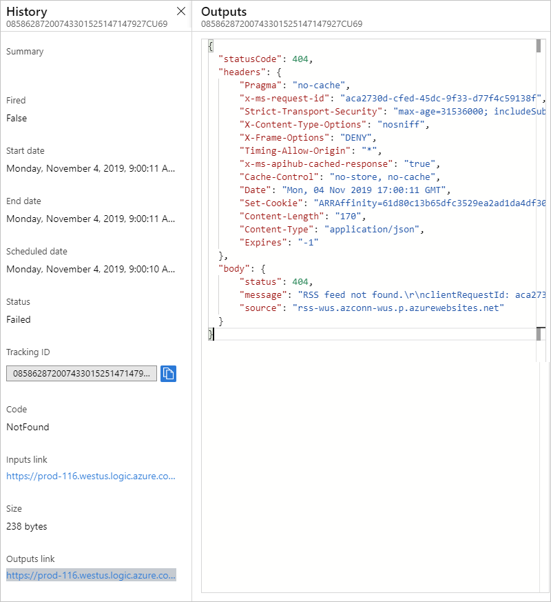
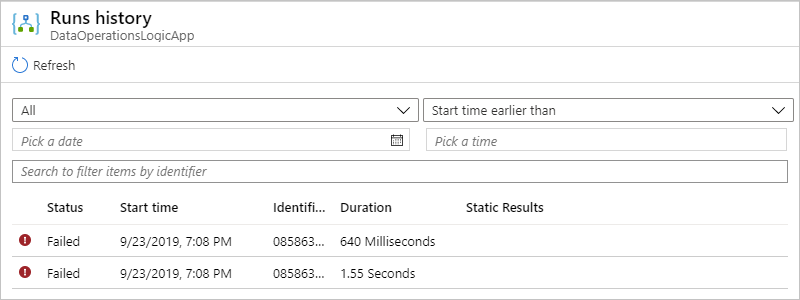
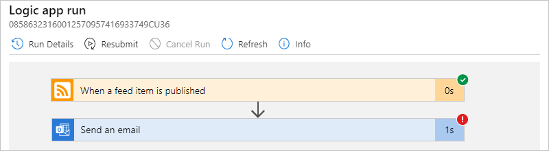

# Troubleshoot and diagnose workflow failures in Azure Logic Apps

Your logic app generates information that can help you diagnose and debug problems in your app. You can diagnose a logic app by reviewing each step in the workflow through the Azure portal. Or, you can add some steps to a workflow for runtime debugging.

## Check trigger history

Each logic app run starts with a trigger attempt, so if the trigger doesn't fire, follow these steps:

1. Check the trigger's status by [checking the trigger history](../logic-apps/monitor-logic-apps.md#review-trigger-history). To view more information about the trigger attempt, select that trigger event, for example:

   

1. Check the trigger's inputs to confirm that they appear as you expect. Under **Inputs link**, select the link, which shows the **Inputs** pane.

   Trigger inputs include the data that the trigger expects and requires to start the workflow. Reviewing these inputs can help you determine whether the trigger inputs are correct and whether the condition was met so that the workflow can continue.

   For example, the `feedUrl` property here has an incorrect RSS feed value:

   

1. Check the triggers outputs, if any, to confirm that they appear as you expect. Under **Outputs link**, select the link, which shows the **Outputs** pane.

   Trigger outputs include the data that the trigger passes to the next step in your workflow. Reviewing these outputs can help you determine whether the correct or expected values passed on to the next step in your workflow, for example:

   

   > [!TIP]
   > If you find any content that you don't recognize, learn more about 
   > [different content types](../logic-apps/logic-apps-content-type.md) in Azure Logic Apps.

## Check runs history

Each time that the trigger fires for an item or event, the Logic Apps engine creates and runs a separate workflow instance for each item or event. If a run fails, follow these steps to review what happened during that run, including the status for each step in the workflow plus the inputs and outputs for each step.

1. Check the workflow's run status by [checking the runs history](../logic-apps/monitor-logic-apps.md#review-runs-history). To view more information about a failed run, including all the steps in that run in their status, select the failed run.

   

1. After all the steps in the run appear, expand the first failed step.

   

1. Check the failed step's inputs to confirm whether they appear as you expect.

1. Review the details for each step in a specific run. Under **Runs history**, select the run that you want to examine.

   

   

1. To examine the inputs, outputs, and any error messages for a specific step, choose that step so that the shape expands and shows the details. For example:

   

## Perform runtime debugging

To help with debugging, you can add diagnostic steps to a logic app workflow, along with reviewing the trigger and runs history. For example, you can add steps that use the [Webhook Tester](https://webhook.site/) service so that you can inspect HTTP requests and determine their exact size, shape, and format.

1. Go to the [Webhook Tester](https://webhook.site/) site and copy the generated unique URL.

1. In your logic app, add an HTTP POST action plus the body content that you want to test, for example, an expression or another step output.

1. Paste your URL from Webhook Tester into the HTTP POST action.

1. To review how a request is formed when generated from the Logic Apps engine, run the logic app, and revisit the Webhook Tester site for more details.

## Next steps

* [Monitor your logic app](../logic-apps/monitor-logic-apps.md)
