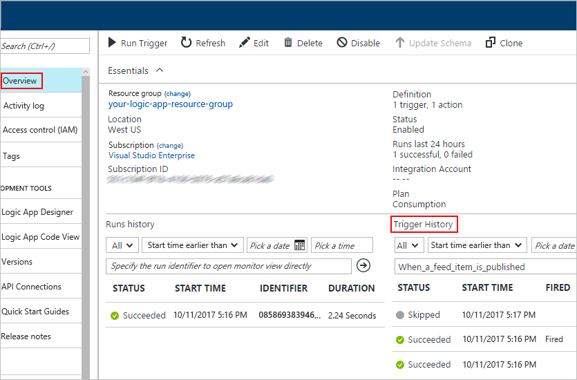
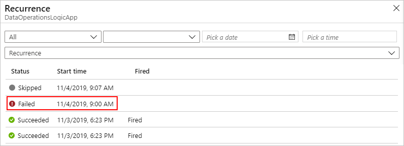
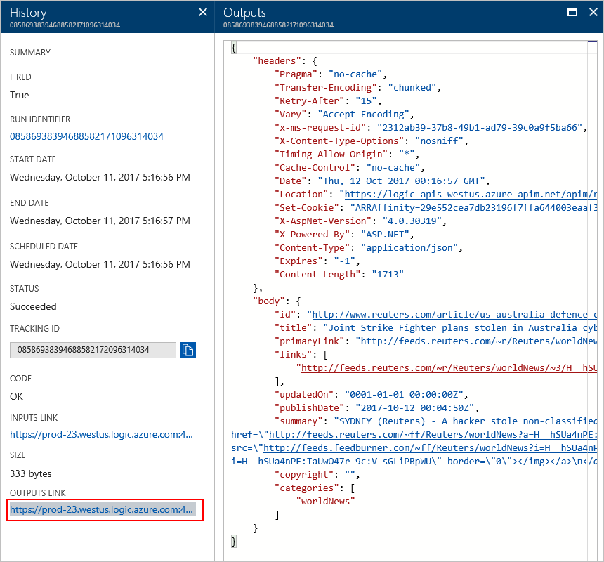
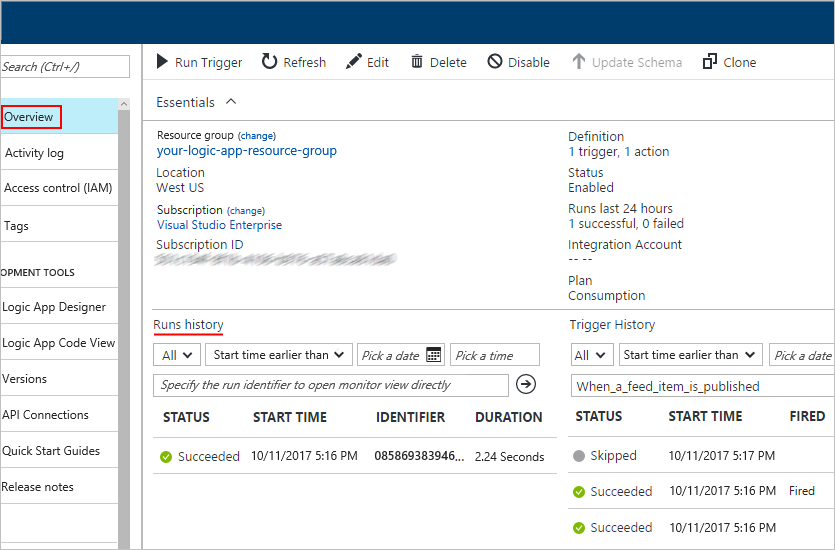
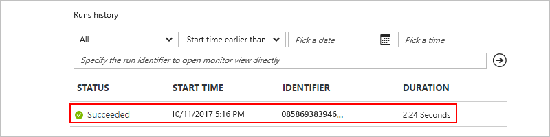
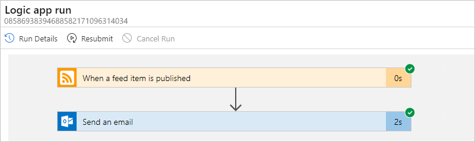
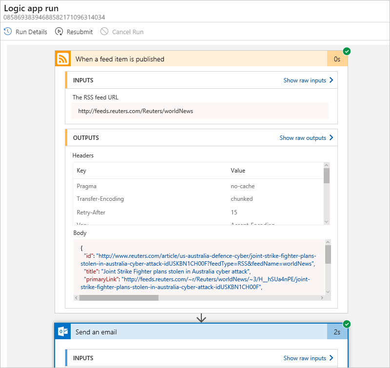

# Troubleshoot and diagnose workflow failures in Azure Logic Apps

Your logic app generates information that can help you 
diagnose and debug problems in your app. 
You can diagnose a logic app by reviewing 
each step in the workflow through the Azure portal. 
Or you can add some steps to a workflow for runtime debugging.

## Review trigger history

Each logic app starts with trigger. If the trigger doesn't fire, 
first check the trigger history. This history lists all the 
trigger attempts that your logic app made and details about 
inputs and outputs for each trigger attempt.

1. To check whether the trigger fired, 
on your logic app menu, choose **Overview**. Under 
**Trigger History**, review the trigger's status.

   > [!TIP]
   > If you don't see the logic app menu, 
   > try returning to the Azure dashboard, 
   > and reopen your logic app.

   

   > [!TIP]
   > * If you don't find the data that you expect, 
   > try selecting **Refresh** on the toolbar.
   > * If the list shows many trigger attempts, 
   > and you can't find the entry you want, 
   > try filtering the list.

   Here are the possible statuses for a trigger attempt:

   | Status | Description | 
   | ------ | ----------- | 
   | **Succeeded** | The trigger checked the endpoint and found available data. Usually, a "Fired" status also appears alongside this status. If not, the trigger definition might have a condition or `SplitOn` command that wasn't met. 
This status can apply to a manual trigger, recurrence trigger, or polling trigger. A trigger can run successfully, but the run itself might still fail when the actions generate unhandled errors. | 
   | **Skipped** | The trigger checked the endpoint but found no data. | 
   | **Failed** | An error occurred. To review any generated error messages for a failed trigger, select that trigger attempt and choose **Outputs**. For example, you might find inputs that aren't valid. | 
   ||| 

   You might have multiple trigger entries with the same date and time, 
   which happens when your logic app finds multiple items. 
   Each time the trigger fires, the Logic Apps engine creates 
   a logic app instance to run your workflow. By default, 
   each instance runs in parallel so that no workflow 
   has to wait before starting a run.

   > [!TIP]
   > You can recheck the trigger without waiting for the next recurrence. 
   > On the overview toolbar, choose **Run trigger**, 
   > and select the trigger, which forces a check. 
   > Or, select **Run** on Logic Apps Designer toolbar.

3. To examine the details for a trigger attempt, 
under **Trigger History**, select that trigger attempt. 

   

4. Review the inputs and any outputs that the trigger generated. 
Trigger outputs show the data that came from the trigger. 
These outputs can help you determine whether all properties 
returned as expected.

   > [!NOTE]
   > If you find any content that you don't understand, 
   > learn how Azure Logic Apps 
   > [handles different content types](../logic-apps/logic-apps-content-type.md).

   

## Review run history

Each fired trigger starts a workflow run. 
You can review what happened during that run, 
including the status for each step in the workflow, 
plus the inputs and outputs for each step.

1. On the logic app menu, choose **Overview**. 
Under **Runs history**, review the run for the fired trigger.

   > [!TIP]
   > If you don't see the logic app menu, 
   > try returning to the Azure dashboard, 
   > and reopen your logic app.

   

   > [!TIP]
   > * If you don't find the data that you expect, 
   > try selecting **Refresh** on the toolbar.
   > * If the list shows many runs, 
   > and you can't find the entry you want, 
   > try filtering the list.

   Here are the possible statuses for a run:

   | Status | Description | 
   | ------ | ----------- | 
   | **Succeeded** | All actions succeeded. 
If any failures happened in a specific action, a following action in the workflow handled that failure. | 
   | **Failed** | At least one action failed, and no later actions in the workflow were set up to handle the failure. | 
   | **Cancelled** | The workflow was running but received a cancel request. | 
   | **Running** | The workflow is currently running. 
This status might happen for throttled workflows, or due to the current pricing plan. For more information, see the [action limits on the pricing page](https://azure.microsoft.com/pricing/details/logic-apps/). If you set up [diagnostics logging](../logic-apps/logic-apps-monitor-your-logic-apps.md), you can also get information about any throttle events that happen. | 
   ||| 

2. Review the details for each step in a specific run. 
Under **Runs history**, select the run that you want to examine.

   

   Whether the run itself succeeded or failed, 
   the Run Details view shows each step and whether 
   they succeeded or failed.

   

3. To examine the inputs, outputs, and any error messages for a specific step, choose that step so that the shape expands and shows the details. For example:

   

## Perform runtime debugging

To help with debugging, you can add diagnostic steps to a workflow, 
along with reviewing the trigger and runs history. For example, 
you can add steps that use the [Webhook Tester](https://webhook.site/) 
service so that you can inspect HTTP requests and determine 
their exact size, shape, and format.

1. Visit [Webhook Tester](https://webhook.site/) and copy the unique URL created

2. In your logic app, add an HTTP POST action with the 
body content that you want to test, 
for example, an expression or another step output.

3. Paste the URL for your Webhook Tester into the HTTP POST action.

4. To review how a request is formed when generated from the Logic Apps engine, 
run the logic app, and see Webhook Tester for details.

## Next steps

[Monitor your logic app](../logic-apps/logic-apps-monitor-your-logic-apps.md)
