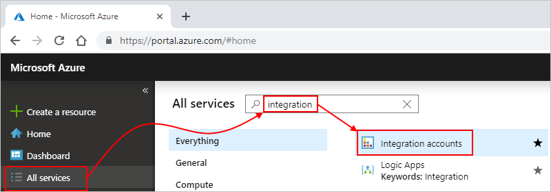
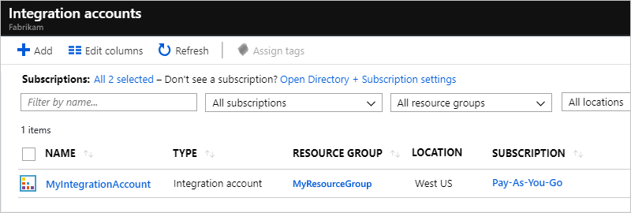
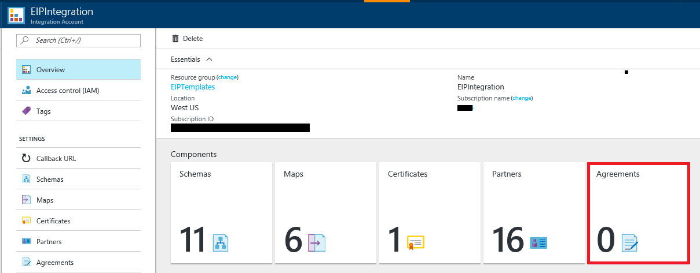
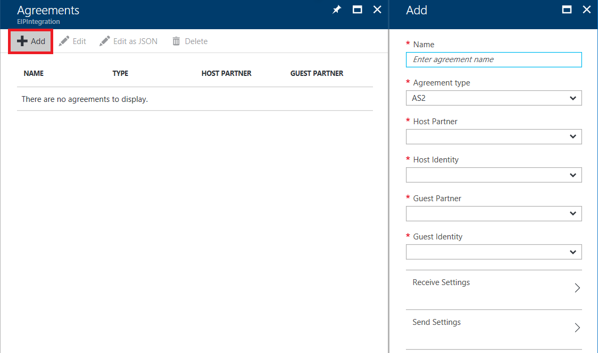

# Create and manage trading partner agreements in Azure Logic Apps

A [trading partner](../logic-apps/logic-apps-enterprise-integration-partners.md) 
*agreement* helps organizations and businesses communicate seamlessly with each 
other by defining the specific industry-standard protocol to use when exchanging 
business-to-business (B2B) messages. Agreements provide common benefits, for example:

* Enable organizations to exchange information by using a well-known format.
* Improve efficiency when conducting B2B transactions.
* Are easy to create, manage, and use for building enterprise integration solutions.

This article shows how to create an AS2, EDIFACT, or X12 agreement that you can use 
when building enterprise integration solutions for B2B scenarios by using the 
[Enterprise Integration Pack](../logic-apps/logic-apps-enterprise-integration-overview.md) 
and [Azure Logic Apps](../logic-apps/logic-apps-overview.md). After you create 
an agreement, you can then use the AS2, EDIFACT, or X12 connectors for exchanging 
B2B messages.

To create agreements for exchanging RosettaNet messages, see [Exchange RosettaNet messages](../logic-apps/logic-apps-enterprise-integration-rosettanet.md).

## Prerequisites

* An Azure subscription. If you don't have an Azure subscription yet, 
[sign up for a free Azure account](https://azure.microsoft.com/free/).

* An [integration account](../logic-apps/logic-apps-enterprise-integration-create-integration-account.md) 
for storing your agreement and other B2B artifacts. This integration 
account must be associated with your Azure subscription.

* At least two [trading partners](../logic-apps/logic-apps-enterprise-integration-partners.md) 
that you've already created in your integration account. 
An agreement requires both a host partner and a guest partner. 
Both partners must use the same "business identity" qualifier 
as the agreement you want to create, such as AS2, X12, or EDIFACT.

* Optional: The logic app where you want to use your agreement 
and a trigger that starts your logic app's workflow. To just 
create your integration account and B2B artifacts, you don't need a logic app. 
However, before your logic app can use the B2B artifacts 
in your integration account, you must link your integration 
account to your logic app. If you're new to logic apps, review 
[What is Azure Logic Apps](../logic-apps/logic-apps-overview.md) and 
[Quickstart: Create your first logic app](../logic-apps/quickstart-create-first-logic-app-workflow.md).

## Create agreements

1. Sign in to the [Azure portal](https://portal.azure.com).
On the main Azure menu, select **All services**. 
In the search box, enter "integration" as your filter. 
From the results, select this resource: **Integration accounts**

   

1. Under **Integration accounts**, select the integration 
account where you want to create the agreement.

   

1. In the right-hand pane, under **Components**, 
choose the **Agreements** tile.

   

1. Under **Agreements**, choose **Add**. 
In the **Add** pane, provide information 
about your agreement, for example:

   

   | Property | Required | Value | Description |
   |----------|----------|-------|-------------|
   | **Name** | Yes | <*agreement-name*> | The name for your agreement |
   | **Agreement type** | Yes | **AS2**, **X12**, or **EDIFACT** | The protocol type for your agreement. When you create your agreement file, the content in that file must match the agreement type. | |  
   | **Host Partner** | Yes | <*host-partner-name*> | The host partner represents the organization that specifies the agreement |
   | **Host Identity** | Yes | <*host-partner-identifier*> | The host partner's identifier |
   | **Guest Partner** | Yes | <*guest-partner-name*> | The guest partner represents the organization that's doing business with the host partner |
   | **Guest Identity** | Yes | <*guest-partner-identifier*> | The guest partner's identifier |
   | **Receive Settings** | Varies | Varies | These properties specify how the host partner receives all incoming messages from the guest partner in the agreement. For more information, see the respective agreement type: 
- [AS2 message settings](../logic-apps/logic-apps-enterprise-integration-as2-message-settings.md)  - [EDIFACT message settings](logic-apps-enterprise-integration-edifact.md)  - [X12 message settings](logic-apps-enterprise-integration-x12.md) |
   | **Send Settings** | Varies | Varies | These properties specify how the host partner sends all outgoing messages to the guest partner in the agreement. For more information, see the respective agreement type: 
- [AS2 message settings](../logic-apps/logic-apps-enterprise-integration-as2-message-settings.md)  - [EDIFACT message settings](logic-apps-enterprise-integration-edifact.md)  - [X12 message settings](logic-apps-enterprise-integration-x12.md) |
   |||||

1. When you're done creating your agreement, on the **Add** page, 
choose **OK**, and return to your integration account.

   The **Agreements** list now shows your new agreement.

## Edit agreements

1. In the [Azure portal](https://portal.azure.com), 
on the main Azure menu, select **All services**.

1. In the search box, enter "integration" as your filter. 
From the results, select this resource: **Integration accounts**

1. Under **Integration accounts**, select the integration 
account that has the agreement you want to edit.

1. In the right-hand pane, under **Components**, 
choose the **Agreements** tile.

1. Under **Agreements**, select your agreement, 
and choose **Edit**.

1. Make and then save your changes.

## Delete agreements

1. In the [Azure portal](https://portal.azure.com), 
on the main Azure menu, select **All services**.

1. In the search box, enter "integration" as your filter. 
From the results, select this resource: **Integration accounts**

1. Under **Integration accounts**, select the integration 
account that has the agreement you want to delete.

1. In the right-hand pane, under **Components**, 
choose the **Agreements** tile.

1. Under **Agreements**, select your agreement, 
and choose **Delete**.

1. Confirm that you want to delete the selected agreement.

## Next steps

* [Exchange AS2 messages](logic-apps-enterprise-integration-as2.md)
* [Exchange EDIFACT messages](logic-apps-enterprise-integration-edifact.md)
* [Exchange X12 messages](logic-apps-enterprise-integration-x12.md)
