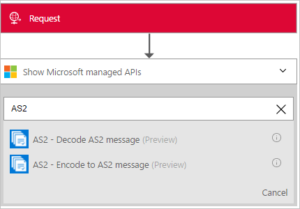
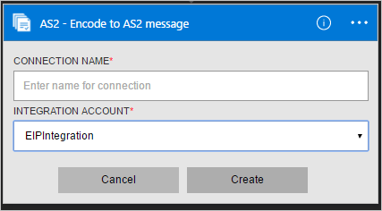
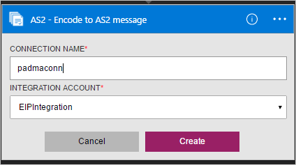
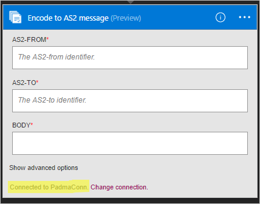

# Encode AS2 messages with Azure Logic Apps and Enterprise Integration Pack

To establish security and reliability while transmitting messages, use the Encode AS2 message connector. 
This connector provides digital signing, encryption, and acknowledgements through Message Disposition Notifications (MDN), 
which also leads to support for Non-Repudiation.

## Before you start

Here's the items you need:

* An Azure account; you can create a [free account](https://azure.microsoft.com/free)
* An [integration account](logic-apps-enterprise-integration-create-integration-account.md) 
that's already defined and associated with your Azure subscription. 
You must have an integration account to use the Encode AS2 message connector.
* At least two [partners](logic-apps-enterprise-integration-partners.md) 
that are already defined in your integration account
* An [AS2 agreement](logic-apps-enterprise-integration-as2.md) 
that's already defined in your integration account

## Encode AS2 messages

1. [Create a logic app](quickstart-create-first-logic-app-workflow.md).

2. The Encode AS2 message connector doesn't have triggers, 
so you must add a trigger for starting your logic app, like a Request trigger. 
In the Logic App Designer, add a trigger, and then add an action to your logic app.

3.	In the search box, enter "AS2" for your filter. 
Select **AS2 - Encode AS2 message**.
   
	

4. If you didn't previously create any connections to your integration account, 
you're prompted to create that connection now. Name your connection, 
and select the integration account that you want to connect. 
   
	  

	Properties with an asterisk are required.

	| Property | Details |
	| --- | --- |
	| Connection Name * |Enter any name for your connection. |
	| Integration Account * |Enter a name for your integration account. Make sure that your integration account and logic app are in the same Azure location. |

5.	When you're done, your connection details should look similar to this example. 
To finish creating your connection, choose **Create**.
   
	

6. After your connection is created, as shown in this example, 
provide details for **AS2-From**, 
**AS2-To identifiers** as configured in your agreement, 
and **Body**, which is the message payload.
   
    

## AS2 encoder details

The Encode AS2 connector performs these tasks: 

* Applies AS2/HTTP headers
* Signs outgoing messages (if configured)
* Encrypts outgoing messages (if configured)
* Compresses the message (if configured)
* Transmit file name in MIME header (if configured)

  > [!NOTE]
  > If you use Azure Key Vault for certificate management, make sure that you configure the keys to permit the **Encrypt** operation.
  > Otherwise, the AS2 Encode will fail.
  >
  > 

## Try this sample

To try deploying a fully operational logic app and sample AS2 scenario, 
see the [AS2 logic app template and scenario](https://azure.microsoft.com/documentation/templates/201-logic-app-as2-send-receive/).

## View the swagger
See the [swagger details](/connectors/as2/). 

## Next steps
[Learn more about the Enterprise Integration Pack](logic-apps-enterprise-integration-overview.md "Learn about Enterprise Integration Pack") 

