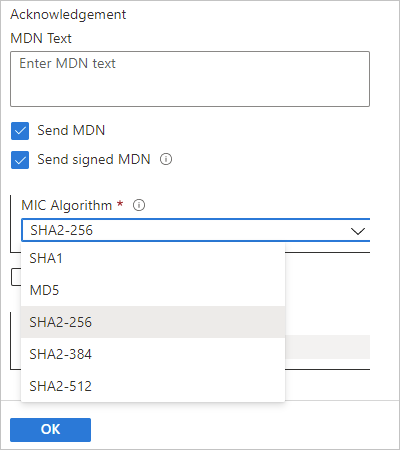

# MDN acknowledgments for AS2 messages in Azure Logic Apps

[!INCLUDE [logic-apps-sku-consumption-standard](../../includes/logic-apps-sku-consumption-standard.md)]

In Azure Logic Apps, you can create workflows that handle AS2 messages for Electronic Data Interchange (EDI) communication when you use **AS2** operations. In EDI messaging, acknowledgments provide the status from processing an EDI interchange. When receiving an interchange, the [**AS2 Decode** action](logic-apps-enterprise-integration-as2.md#decode) can return a Message Disposition Notification (MDN) or acknowledgment to the sender. An MDN verifies the following items:

* The receiving partner successfully received the original message.

  The sending partner compares the `MessageID` for the originally sent message with the `original-message-id` field that the receiver includes in the MDN.

* The receiving partner verified the integrity of the exchanged data.

  A Message Integrity Check (MIC) or MIC digest is calculated from the payload in the originally sent message. The sending partner compares this MIC with the MIC that the receiver calculated from the payload in the received message and included in the `Received-content-MIC` field in the MDN, if signed.

  > [!NOTE]
  > An MDN can be signed, but not encrypted or compressed.

* Non-repudiation of receipt

  The sending partner compares the signed MDN with the receiving partner's public key and verifies that the returned MIC value in the MDN is the same as the MIC for the original message payload stored in the non-repudiation database.

> [!NOTE]
> If you enable sending an MDN in response, your logic app attempts to return an MDN to report the status of AS2 message processing, 
> even if an error occurs during processing. The AS2 transmission isn't complete until the sender receives and verifies the MDN.
> A synchronous MDN serves as an HTTP response, for example, a `200 OK` status.

This topic provides a brief overview about the AS2 MDN ACK, including the properties used to generate the acknowledgment, the MDN headers to use, and the MIC. For other related information, review the following documentation:

* [Exchange AS2 messages for B2B enterprise integration in Azure Logic Apps](logic-apps-enterprise-integration-as2.md)
* [AS2 message settings](logic-apps-enterprise-integration-as2-message-settings.md)
* [What is Azure Logic Apps](logic-apps-overview.md)

## MDN generation

The AS2 Decode action generates an MDN based on a trading partner's AS2 agreement properties when the agreement's **Receive Settings** has the **Send MDN** option selected. In this instance, the **AS2-From** property in the message header is used for generating the MDN, but other properties and their values are taken from the partner's AS2 agreement settings.

By default, the incoming AS2 message headers are used for validation and generating the MDN. To use the agreement's validation and MDN settings instead, in the agreement's **Receive Settings**, select **Override message properties**. Otherwise, if this option remains unselected or an agreement is unavailable, the AS2 Decode action uses the incoming message headers instead.

## MDN headers

To correlate an MDN to the AS2 message as the response, the `AS2-From` header, `AS2-To` header, and `MessageID` context property are used. In the MDN, the `Original-Message-ID` header comes from the `Message-ID` header in the AS2 message for which the MDN is the response. An MDN contains the following headers:

| Headers | Description |
|---------|-------------|
| HTTP and AS2 | For more information, review [AS2 message settings](logic-apps-enterprise-integration-as2-message-settings.md).
| Transfer layer | This header includes the `Content-Type` header that includes the signed multipart message, the algorithm for the MIC, the signature formatting protocol, and the outermost multipart boundary subheaders. |
| First part | The first part of the signed multipart message is the embedded MDN. This part is human readable. |
| Second part | The second part of the signed multipart message contains the digital signature, a reference to the original message, the disposition type and status, and the MIC value. This part is machine readable. |
|||

## MIC digest

The MIC digest or MIC verifies that an MDN correlates to the payload in the originally sent message. This MIC is included in the second part of the signed multipart MDN message in the `Received-Content-MIC` extension field.

The MIC is base64-encoded and is determined from the **MIC Algorithm** property, which is enabled when the **Send MDN** and **Send signed MDN** properties are selected on the AS2 agreement's **Receive Settings** page. For MIC generation, you can choose from the following supported hash algorithms:

* SHA1
* MD5
* SHA2-256
* SHA2-384
* SHA2-512

For example, the following screenshot shows the MDN properties in the AS2 agreement's **Receive Settings** page:

## Next steps

* [AS2 message settings](logic-apps-enterprise-integration-as2-message-settings.md)
