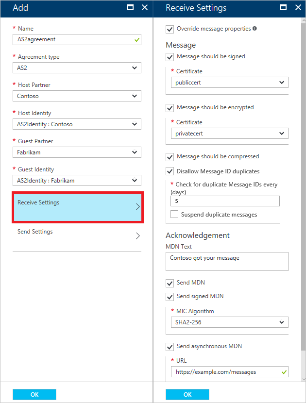
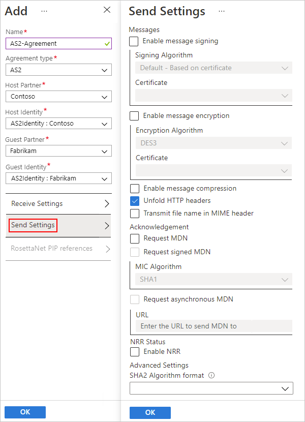

# Reference for AS2 message settings in Azure Logic Apps with Enterprise Integration Pack

This reference describes the properties that you can set for specifying how an AS2 
agreement handles messages sent and received between trading partners. Set up these 
properties based on your agreement with the partner that exchanges messages with you.

## AS2 Receive settings

| Property | Required | Description |
|----------|----------|-------------|
| **Override message properties** | No | Overrides the properties on incoming messages with your property settings. |
| **Message should be signed** | No | Specifies whether all incoming messages must be digitally signed. If you require signing, from the **Certificate** list, select an existing guest partner public certificate for validating the signature on the messages. If you don't have a certificate, learn more about [adding certificates](../logic-apps/logic-apps-enterprise-integration-certificates.md). |
| **Message should be encrypted** | No | Specifies whether all incoming messages must be encrypted. Non-encrypted messages are rejected. If you require encryption, from the **Certificate** list, select an existing host partner private certificate for decrypting incoming messages. If you don't have a certificate, learn more about [adding certificates](../logic-apps/logic-apps-enterprise-integration-certificates.md). |
| **Message should be compressed** | No | Specifies whether all incoming messages must be compressed. Non-compressed messages are rejected. |
| **Disallow Message ID duplicates** | No | Specifies whether to allow messages with duplicate IDs. If you disallow duplicate IDs, select the number of days between checks. You can also choose whether to suspend duplicates. |
| **MDN Text** | No | Specifies the default message disposition notification (MDN) that you want sent to the message sender. |
| **Send MDN** | No | Specifies whether to send synchronous MDNs for received messages.  |
| **Send signed MDN** | No | Specifies whether to send signed MDNs for received messages. If you require signing, from the **MIC Algorithm** list, select the algorithm to use for signing messages. |
| **Send asynchronous MDN** | No | Specifies whether to send MDNs asynchronously. If you select asynchronous MDNs, in the **URL** box, specify the URL for where to send the MDNs. |
||||

## AS2 Send settings

| Property | Required | Description |
|----------|----------|-------------|
| **Enable message signing** | No | Specifies whether all outgoing messages must be digitally signed. If you require signing, select these values: 
- From the **Signing Algorithm** list, select the algorithm to use for signing messages.  - From the **Certificate** list, select an existing host partner private certificate for signing messages. If you don't have a certificate, learn more about [adding certificates](../logic-apps/logic-apps-enterprise-integration-certificates.md). |
| **Enable message encryption** | No | Specifies whether all outgoing messages must be encrypted. If you require encryption, select these values: 
- From the **Encryption Algorithm** list, select the guest partner public certificate algorithm to use for encrypting messages.  - From the **Certificate** list, select an existing guest partner private certificate for encrypting outgoing messages. If you don't have a certificate, learn more about [adding certificates](../logic-apps/logic-apps-enterprise-integration-certificates.md). |
| **Enable message compression** | No | Specifies whether all outgoing messages must be compressed. |
| **Unfold HTTP headers** | No | Puts the HTTP `content-type` header onto a single line. |
| **Transmit file name in MIME header** | No | Specifies whether to include the file name in the MIME header. |
| **Request MDN** | No | Specifies whether to receive message disposition notifications (MDNs) for all outgoing messages. |
| **Request signed MDN** | No | Specifies whether to receive signed MDNs for all outgoing messages. If you require signing, from the **MIC Algorithm** list, select the algorithm to use for signing messages. |
| **Request asynchronous MDN** | No | Specifies whether to receive MDNs asynchronously. If you select asynchronous MDNs, in the **URL** box, specify the URL for where to send the MDNs. |
| **Enable NRR** | No | Specifies whether to require non-repudiation receipt (NRR). This communication attribute provides evidence that the data was received as addressed. |
| **SHA2 Algorithm format** | No | Specifies the MIC algorithm format to use for signing in the headers for the outgoing AS2 messages or MDN |
||||

## Next steps

[Exchange AS2 messages](../logic-apps/logic-apps-enterprise-integration-as2.md)
