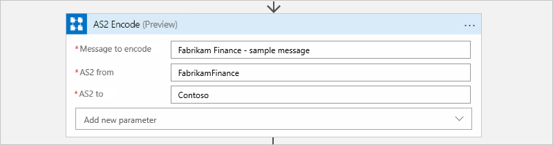
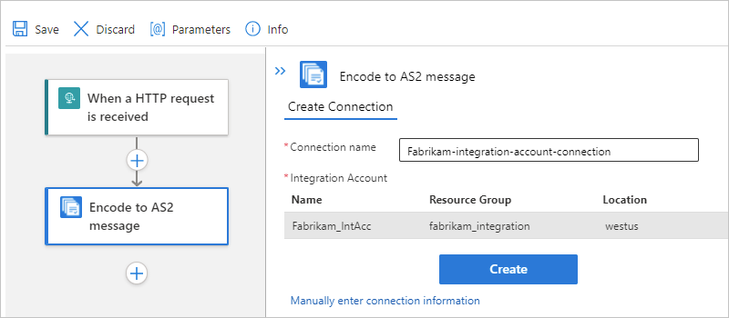
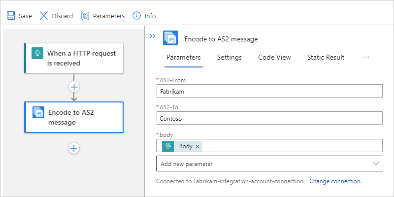
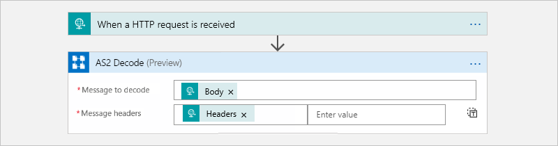
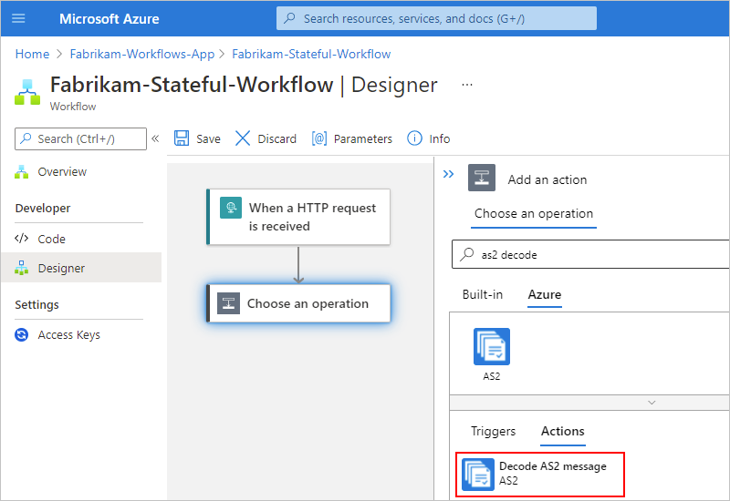
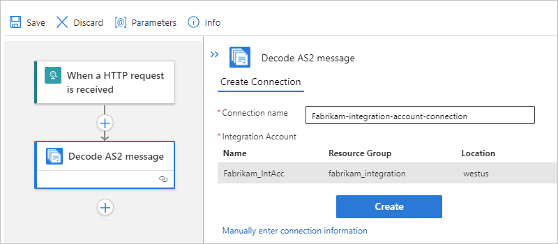

# Exchange AS2 messages using workflows in Azure Logic Apps

[!INCLUDE [logic-apps-sku-consumption-standard](../../includes/logic-apps-sku-consumption-standard.md)]

To send and receive AS2 messages in workflows that you create using Azure Logic Apps, use the **AS2** connector, which provides triggers and actions that support and manage AS2 (version 1.2) communication.

* If you're working with the **Logic App (Consumption)** resource type and don't need tracking capabilities, use the **AS2 (v2)** connector, rather than the original **AS2** connector, which is being deprecated.

  Except for tracking, **AS2 (v2)** provides better performance, the same capabilities as the original version, is native to the Azure Logic Apps runtime, and has significant performance improvements in message size, throughput, and latency. Also, the v2 connector doesn't require that you create a connection to your integration account. Instead, as described in the prerequisites, make sure that you link your integration account to the logic app resource where you plan to use the connector.

* If you're working with the **Logic App (Standard)** resource type, only the original **AS2** connector is currently available.

  For technical information about the original **AS2** connector version, review the [connector's reference page](/connectors/as2/), which describes the triggers, actions, and limits as documented by the connector's Swagger file.

### [Consumption](#tab/consumption)

The following lists describe actions that the **AS2 (v2)** connector provides for establishing security and reliability when transmitting messages:

* [**AS2 Encode** action](#encode) for providing encryption, digital signing, and acknowledgments through Message Disposition Notifications (MDN), which help support non-repudiation. For example, this action applies AS2/HTTP headers and performs these tasks when configured:

  * Signs outgoing messages.
  * Encrypts outgoing messages.
  * Compresses the message.
  * Transmits the file name in the MIME header.

* [**AS2 Decode** action](#decode) for providing decryption, digital signing, and acknowledgments through Message Disposition Notifications (MDN). For example, this action performs these tasks:

  * Processes AS2/HTTP headers.
  * Reconciles received MDNs with the original outbound messages.
  * Updates and correlates records in the non-repudiation database.
  * Writes records for AS2 status reporting.
  * Outputs payload contents as base64-encoded.
  * Determines whether MDNs are required. Based on the AS2 agreement, determines whether MDNs should be synchronous or asynchronous.
  * Generates synchronous or asynchronous MDNs based on the AS2 agreement.
  * Sets the correlation tokens and properties on MDNs.

  This action also performs these tasks when configured:

  * Verifies the signature.
  * Decrypts the messages.
  * Decompresses the message.
  * Check and disallow message ID duplicates.

### [Standard](#tab/standard)

For more information about the original **AS2** connector's triggers, actions, and limits version, review the [connector's reference page](/connectors/as2/) as documented by the connector's Swagger file.

---

This article shows how to add the AS2 encoding and decoding actions to an existing logic app workflow. Although you can use any trigger to start your workflow, the examples use the [Request](../connectors/connectors-native-reqres.md) trigger.

## Limits

For information about the AS2 connector limits for workflows running in [multi-tenant Azure Logic Apps, single-tenant Azure Logic Apps, or the integration service environment (ISE)](logic-apps-overview.md#resource-environment-differences), review the [B2B protocol limits for message sizes](logic-apps-limits-and-config.md#b2b-protocol-limits).

## Prerequisites

* An Azure account and subscription. If you don't have a subscription yet, [sign up for a free Azure account](https://azure.microsoft.com/free/?WT.mc_id=A261C142F).

* An [integration account resource](logic-apps-enterprise-integration-create-integration-account.md) where you define and store artifacts, such as trading partners, agreements, certificates, and so on, for use in your enterprise integration and B2B workflows. This resource has to meet the following requirements:

  * Is associated with the same Azure subscription as your logic app resource.

  * Exists in the same location or Azure region as your logic app resource.

  * When you use the [**Logic App (Consumption)** resource type](logic-apps-overview.md#resource-environment-differences) and the **AS2 (v2)** operations, your logic app resource doesn't need a link to your integration account. However, you still need this account to store artifacts, such as partners, agreements, and certificates, along with using the AS2, [X12](logic-apps-enterprise-integration-x12.md), or [EDIFACT](logic-apps-enterprise-integration-edifact.md) operations. Your integration account still has to meet other requirements, such as using the same Azure subscription and existing in the same location as your logic app resource.

  * When you use the [**Logic App (Standard)** resource type](logic-apps-overview.md#resource-environment-differences) and the original **AS2** operations, your workflow requires a connection to your integration account that you create directly from your workflow when you add the AS2 operation.

* At least two [trading partners](logic-apps-enterprise-integration-partners.md) in your integration account. The definitions for both partners must use the same *business identity* qualifier, which is **AS2Identity** for this scenario.

* An [AS2 agreement](logic-apps-enterprise-integration-agreements.md) in your integration account between the trading partners that participate in your workflow. Each agreement requires a host partner and a guest partner. The content in the messages between you and the other partner must match the agreement type.

* The logic app resource and workflow where you want to use the AS2 operations.

  > [!NOTE]
  > The **AS2 (v2)** connector provides only actions, not triggers. In this article, the examples for this connector use the 
  > [Request](../connectors/connectors-native-reqres.md) trigger. The original **AS2** connector includes triggers and actions. 
  > For more information about the original **AS2** connector's triggers, actions, and limits version, review the 
  > [connector's reference page](/connectors/as2/) as documented by the connector's Swagger file.

  If you're new to logic apps, review [What is Azure Logic Apps](logic-apps-overview.md) and [Quickstart: Create your first logic app](quickstart-create-first-logic-app-workflow.md).

* If you use [Azure Key Vault](../key-vault/general/overview.md) for certificate management, check that your vault keys permit the **Encrypt** and **Decrypt** operations. Otherwise, the encoding and decoding actions fail.

  1. In the Azure portal, open your key vault. On the key vault menu, under **Settings**, select **Keys**.

  1. On the **Keys** pane, select your key. On the **Versions** pane, select the key version that you're using.

  1. On the **Key Version** pane, under **Permitted operations**, confirm that the **Encrypt** and **Decrypt** operations are selected, for example:

     

## Encode AS2 messages

### [Consumption](#tab/consumption)

1. In the [Azure portal](https://portal.azure.com), open your logic app resource and workflow in the designer.

1. On the designer, under the trigger or action where you want to add the AS2 action, select **New step**.

1. Under the **Choose an operation** search box, select **All**. In the search box, enter `as2 encode`. Select the action named **AS2 Encode**.

   

1. After the AS2 operation appears on the designer, provide information for the following properties:

   | Property | Required | Description |
   |----------|----------|-------------|
   | **Message to encode** | Yes | The message payload |
   | **AS2 from** | Yes | The business identifier for the message sender as specified by your AS2 agreement |
   | **AS2 to** | Yes | The business identifier for the message receiver as specified by your AS2 agreement |
   ||||

   For example, the message payload is the **Body** content output from the Request trigger:

   

   > [!TIP]
   > If you experience problems when sending signed or encrypted messages, consider trying different SHA256 algorithm formats. 
   > The AS2 specification doesn't provide any information about SHA256 formats, so each provider uses their own implementation or format.

### [Standard](#tab/standard)

1. In the [Azure portal](https://portal.azure.com), open your logic app resource and workflow in the designer.

1. On the designer, under the trigger or action where you want to add the AS2 action, select **Insert a new step** (plus sign), and then select **Add an action**.

1. Under the **Choose an operation** search box, select **Azure**. In the search box, enter `as2 encode`. Select the action named **Encode to AS2 message**.

   

1. When prompted to create a connection to your integration account, provide the following information:

   | Property | Required | Description |
   |----------|----------|-------------|
   | **Connection name** | Yes | A name for the connection |
   | **Integration account** | Yes | From the list of available integration accounts, select the account to use. |
   ||||

   For example:

   

1. When you're done, select **Create**.

1. After the AS2 details pane appears on the designer, provide information for the following properties:

   | Property | Required | Description |
   |----------|----------|-------------|
   | **Message to encode** | Yes | The message payload |
   | **AS2 from** | Yes | The business identifier for the message sender as specified by your AS2 agreement |
   | **AS2 to** | Yes | The business identifier for the message receiver as specified by your AS2 agreement |
   ||||

   For example, the message payload is the **Body** content output from the Request trigger:

   

   > [!TIP]
   > If you experience problems when sending signed or encrypted messages, consider trying different SHA256 algorithm formats. 
   > The AS2 specification doesn't provide any information about SHA256 formats, so each provider uses their own implementation or format.

---

## Decode AS2 messages

### [Consumption](#tab/consumption)

1. In the [Azure portal](https://portal.azure.com), open your logic app resource and workflow in the designer.

1. On the designer, under the trigger or action where you want to add the AS2 action, select **New step**. This example uses the [Request](../connectors/connectors-native-reqres.md) trigger.

1. Under the **Choose an operation** search box, select **All**. In the search box, enter `as2 decode`. Select the action named **AS2 Decode**.

   

1. In the AS2 operation shape, select the values for the **Message to encode** and the **Message headers** properties from the previous trigger or action outputs.

   In this example, you can select the outputs from the Request trigger.

   

### [Standard](#tab/standard)

1. In the [Azure portal](https://portal.azure.com), open your logic app resource and workflow in the designer.

1. On the designer, under the trigger or action where you want to add the AS2 action, select **Insert a new step** (plus sign), and then select **Add an action**.

1. Under the **Choose an operation** search box, select **Azure**. In the search box, enter `as2 decode`. Select the action named **Decode AS2 message**.

   

1. When prompted to create a connection to your integration account, provide the following information:

   | Property | Required | Description |
   |----------|----------|-------------|
   | **Connection name** | Yes | A name for the connection |
   | **Integration account** | Yes | From the list of available integration accounts, select the account to use. |
   ||||

   For example:

   

1. When you're done, select **Create**.

1. In the AS2 details pane, select the values for the **Message to encode** and the **Message headers** properties from the previous trigger or action outputs.

   In this example, you can select the outputs from the Request trigger.

   

---

## Sample

To try deploying a fully operational logic app and sample AS2 (v2) scenario, review the [AS2 (v2) logic app template and scenario](https://azure.microsoft.com/resources/templates/logic-app-as2-send-receive/).

## Next steps

* Learn about other [connectors for Azure Logic Apps](../connectors/apis-list.md)
