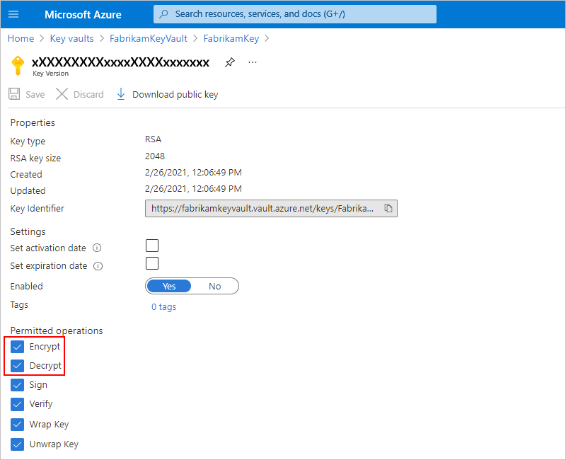

# Exchange AS2 messages for B2B enterprise integration in Azure Logic Apps with Enterprise Integration Pack

> [!IMPORTANT]
> The original AS2 connector is being deprecated, so make sure that you use the **AS2 (v2)** connector instead. 
> This version provides the same capabilities as the original version, is native to the Logic Apps runtime, and provides 
> significant performance improvements in terms of throughput and message size. Also, the native v2 connector doesn't 
> require that you create a connection to your integration account. Instead, as described in the prerequisites, 
> make sure that you link your integration account to the logic app where you plan to use the connector.

To work with AS2 messages in Azure Logic Apps, you can use the AS2 connector, which provides triggers and actions for managing AS2 communication. For example, to establish security and reliability when transmitting messages, you can use these actions:

* [**AS2 Encode** action](#encode) for providing encryption, digital signing, and acknowledgments through Message Disposition Notifications (MDN), which help support non-repudiation. For example, this action applies AS2/HTTP headers and performs these tasks when configured:

  * Signs outgoing messages.
  * Encrypts outgoing messages.
  * Compresses the message.
  * Transmits the file name in the MIME header.

* [**AS2 Decode** action](#decode) for providing decryption, digital signing, and acknowledgments through Message Disposition Notifications (MDN). For example, this action performs these tasks:

  * Processes AS2/HTTP headers.
  * Reconciles received MDNs with the original outbound messages.
  * Updates and correlates records in the non-repudiation database.
  * Writes records for AS2 status reporting.
  * Outputs payload contents as base64-encoded.
  * Determines whether MDNs are required. Based on the AS2 agreement, determines whether MDNs should be synchronous or asynchronous.
  * Generates synchronous or asynchronous MDNs based on the AS2 agreement.
  * Sets the correlation tokens and properties on MDNs.

  This action also performs these tasks when configured:

  * Verifies the signature.
  * Decrypts the messages.
  * Decompresses the message.
  * Check and disallow message ID duplicates.

This article shows how to add the AS2 encoding and decoding actions to an existing logic app.

## Prerequisites

* An Azure subscription. If you don't have an Azure subscription yet, [sign up for a free Azure account](https://azure.microsoft.com/free/).

* The logic app from where you want to use the AS2 connector and a trigger that starts your logic app's workflow. The AS2 connector provides only actions, not triggers. If you're new to logic apps, review [What is Azure Logic Apps](../logic-apps/logic-apps-overview.md) and [Quickstart: Create your first logic app](../logic-apps/quickstart-create-first-logic-app-workflow.md).

* An [integration account](../logic-apps/logic-apps-enterprise-integration-create-integration-account.md) that's associated with your Azure subscription and linked to the logic app where you plan to use the AS2 connector. Both your logic app and integration account must exist in the same location or Azure region.

* At least two [trading partners](../logic-apps/logic-apps-enterprise-integration-partners.md) that you've already defined in your integration account by using the AS2 identity qualifier.

* Before you can use the AS2 connector, you must create an AS2 [agreement](../logic-apps/logic-apps-enterprise-integration-agreements.md) between your trading partners and store that agreement in your integration account.

* If you use [Azure Key Vault](../key-vault/general/overview.md) for certificate management, check that your vault keys permit the **Encrypt** and **Decrypt** operations. Otherwise, the encoding and decoding actions fail.

  In the Azure portal, go to the key in your key vault, review your key's **Permitted operations**, and confirm that the **Encrypt** and **Decrypt** operations are selected, for example:

  

## Encode AS2 messages

1. If you haven't already, in the [Azure portal](https://portal.azure.com), open your logic app in the Logic App Designer.

1. In the designer, add a new action to your logic app.

1. Under **Choose an action** and the search box, select **All**. In the search box, enter "as2 encode", and make sure that you select the AS2 (v2) action: **AS2 Encode**

   

1. Now provide information for these properties:

   | Property | Description |
   |----------|-------------|
   | **Message to encode** | The message payload |
   | **AS2 from** | The identifier for the message sender as specified by your AS2 agreement |
   | **AS2 to** | The identifier for the message receiver as specified by your AS2 agreement |
   |||

   For example:

   

> [!TIP]
> If you experience problems when sending signed or encrypted messages, consider trying different SHA256 algorithm formats. 
> The AS2 specification doesn't provide any information about SHA256 formats, so each provider uses their own implementation or format.

## Decode AS2 messages

1. If you haven't already, in the [Azure portal](https://portal.azure.com), open your logic app in the Logic App Designer.

1. In the designer, add a new action to your logic app.

1. Under **Choose an action** and the search box, select **All**. In the search box, enter "as2 decode", and make sure that you select the AS2 (v2) action: **AS2 Decode**

   

1. For the **Message to encode** and the **Message headers** properties, select these values from previous trigger or action outputs.

   For example, suppose your logic app receives messages through a Request trigger. You can select the outputs from that trigger.

   

## Sample

To try deploying a fully operational logic app and sample AS2 scenario, see the [AS2 logic app template and scenario](https://azure.microsoft.com/documentation/templates/201-logic-app-as2-send-receive/).

## Connector reference

For more technical details about this connector, such as actions and limits as described by the connector's Swagger file, see the [connector's reference page](https://docs.microsoft.com/connectors/as2/). 

> [!NOTE]
> For logic apps in an [integration service environment (ISE)](../logic-apps/connect-virtual-network-vnet-isolated-environment-overview.md), 
> this connector's ISE-labeled version uses the [B2B message limits for ISE](../logic-apps/logic-apps-limits-and-config.md#b2b-protocol-limits).

## Next steps

* Learn about other [Logic Apps connectors](../connectors/apis-list.md)
