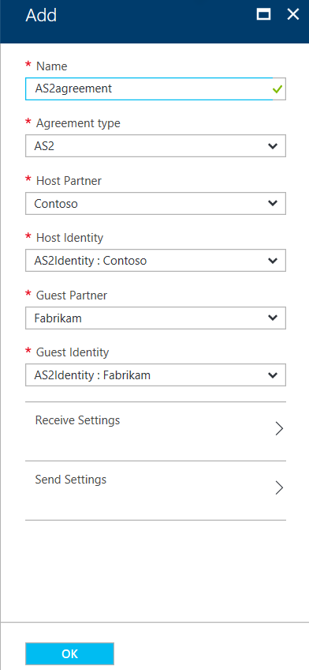
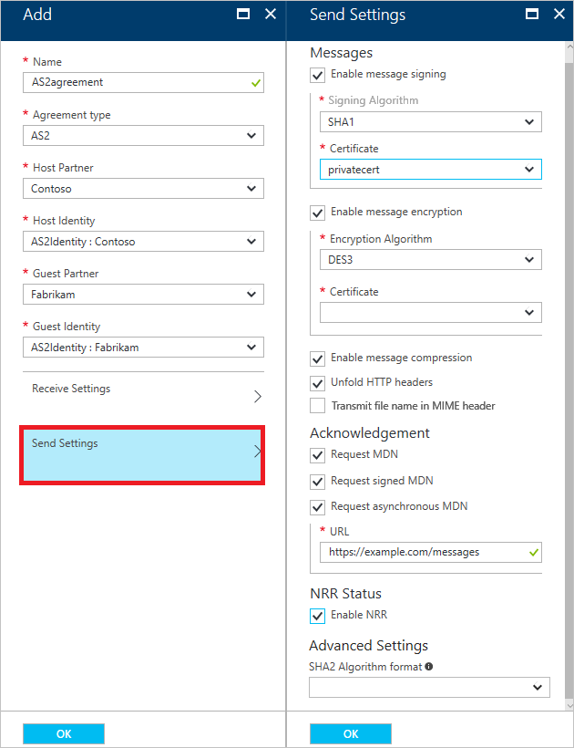
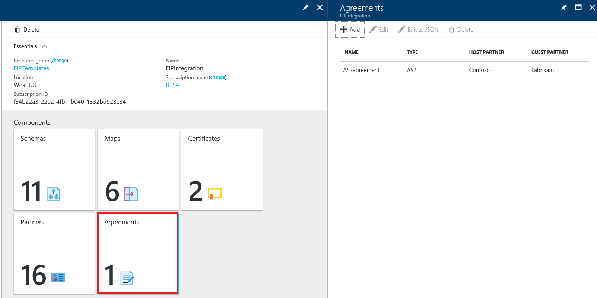

# Enterprise integration with AS2

To use the enterprise features for Azure Logic Apps, you must first create agreements.

## Prerequisites

* An [integration account](../logic-apps/logic-apps-enterprise-integration-accounts.md) must be defined in your Azure subscription.  
* At least two [partners](logic-apps-enterprise-integration-partners.md) must already be defined in your integration account.  

> [!NOTE]
> When you create an agreement, the content in the agreement file must match the agreement type.    

After you've created an integration account and added partners, 
you can create an agreement by following the steps in these sections.

## Create an agreement

1. Sign in to the [Azure portal](http://portal.azure.com "Azure portal").  
2. Select **More services**, enter **integration** in the filter search box, 
and then select **Integration Accounts** in the results list.

	

3. To add the certificate, select the integration account.

	

4. Select the **Agreements** tile. If the tile isn't displayed, add the tile.

	

5. On the **Agreements** blade, select **Add**.

	

6. Enter a name for your agreement, select **AS2** in the **Agreement type** list. 
In the **Host Partner**, **Host Identity**, **Guest Partner**, and **Guest Identity** lists, enter the appropriate information.

	  

	This table describes the properties in the **Add** dialog box:

	| Property | Description |
	| --- | --- |
	| Host Partner     |An agreement requires both a host and guest partner. The host partner represents the organization that's configuring the agreement. |
	| Host Identity    |An identifier for the host partner. |
	| Guest Partner    |An agreement requires both a host and guest partner. The guest partner represents the organization that's doing business with the host partner. |
	| Guest Identity   |An identifier for the guest partner. |
	| Receive Settings |The properties that apply to all messages that are received by the agreement. |
	| Send Settings    |The properties that apply to all messages that are sent by the agreement. |

7.	To configure how messages received via this agreement are to be handled, follow these steps:

  a. Select **Receive Settings**.

  b. Optionally, you can override the properties of incoming messages by selecting the **Override message properties** check box.

  c. To require all incoming messages to be signed, select the **Message should be signed** check box. If you select this option, validate the signature on the messages by selecting **guest partner public certificate** in the **Certificate** list.

  d. To require all incoming messages to be encrypted, select the **Message should be encrypted** check box. If you select this option, decrypt the incoming messages by selecting **host partner private certificate** in the **Certificate** list.

  e. To require messages to be compressed, select the **Message should be compressed** check box.

  f. To send a synchronous message disposition notification (MDN) for received messages, select the **Send MDN** check box.

  g. To send signed MDNs for received messages, select the **Send signed MDN** check box.

  h. To send asynchronous MDNs for received messages, select the **Send asynchronous MDN** check box.

		

		This table describes the **Receive Settings** properties:

		| Property | Description |
		| --- | --- |
		| Override message properties |Indicates that properties in received messages can be overridden. |
		| Message should be signed |Requires messages to be digitally signed. Configure the guest partner public certificate for signature verification.  |
		| Message should be encrypted |Requires messages to be encrypted. Non-encrypted messages are rejected. Configure the host partner private certificate for decrypting the messages.  |
		| Message should be compressed |Requires messages to be compressed. Non-compressed messages are rejected. |
		| MDN Text |The default message disposition notification (MDN) to be sent to the message sender. |
		| Send MDN |Requires MDNs to be sent. |
		| Send signed MDN |Requires MDNs to be signed. |
		| MIC Algorithm | |
		| Send asynchronous MDN | Requires messages to be sent asynchronously. |
		| URL | The URL that the MDNs are to be sent to. |

8. To configure how messages that are sent via this agreement are to be handled, follow these steps:

  a. Select **Send Settings**.  

  b. To send signed messages to the partner, select the **Enable message signing** check box. If you select this option, sign the messages by selecting **host partner private certificate MIC Algorithm** in the **MIC Algorithm** list and **host partner private certificate** in the **Certificate** list.

  c. To send encrypted messages to the partner, select the **Enable message encryption** check box. If you select this option, encrypt the messages by selecting **guest partner public certificate algorithm** in the **Encryption Algorithm** list and **guest partner public certificate** in the **Certificate** list.

  d. To compress the message, select the **Enable message compression** check box.

  e. To unfold the HTTP content-type header into a single line, select the **Unfold HTTP headers** check box.

  f. To receive synchronous MDNs for the sent messages, select the **Request MDN** check box.

  g. To receive signed MDNs for the sent messages, select the **Request signed MDN** check box.

  h. To receive asynchronous MDNs for the sent messages, select the **Request asynchronous MDN** check box. If you select this option, enter the URL that the MDNs are to be sent to.  

  i. To require non-repudiation of receipt, select the **Enable NRR** check box.

  j. Select **OK**.

		  

		The following table describes the **Send Settings** properties:  

		| Property | Description |
		| --- | --- |
		| Enable message signing |Requires all messages that are sent from the agreement to be signed. |
		| MIC Algorithm |The algorithm to use to sign messages. Configures the host partner private certificate MIC Algorithm for signing the messages. |
		| Certificate |The certificate to use to sign messages. Configures the host partner private certificate for signing the messages. |
		| Enable message encryption |Requires encryption of all messages that are sent from this agreement. Configures the guest partner public certificate algorithm for encrypting the messages. |
		| Encryption Algorithm |The encryption algorithm to use for message encryption. Configures the guest partner public certificate for encrypting the messages. |
		| Certificate |The certificate to use to encrypt messages. Configures the guest partner private certificate for encrypting the messages. |
		| Enable message compression |Requires compression of all messages that are sent from this agreement. |
		| Unfold HTTP headers |Places the HTTP content-type header onto a single line. |
		| Request MDN |Requires an MDN for all messages that are sent from this agreement. |
		| Request signed MDN |Requires all MDNs that are sent to this agreement to be signed. |
		| Request asynchronous MDN |Requires asynchronous MDNs to be sent to this agreement. |
		| URL |The URL that the MDNs are to be sent to. |
		| Enable NRR |Requires non-repudiation of receipt (NRR), a communication attribute that provides evidence that the data was received as addressed. |

## View the Agreements list
To view the newly added agreement, select the **Agreements** tile on the **Integration Account** blade.

## Next steps
* [Learn more about the Enterprise Integration Pack](logic-apps-enterprise-integration-overview.md "Learn about Enterprise Integration Pack")  
