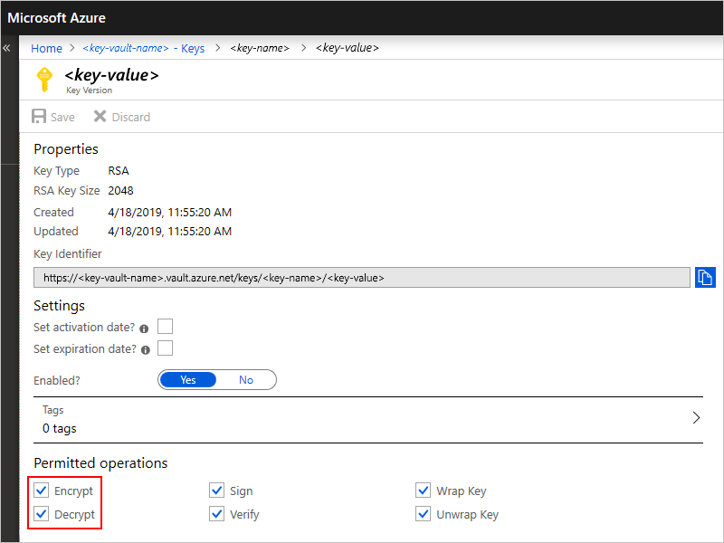
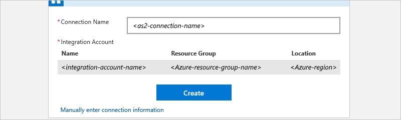
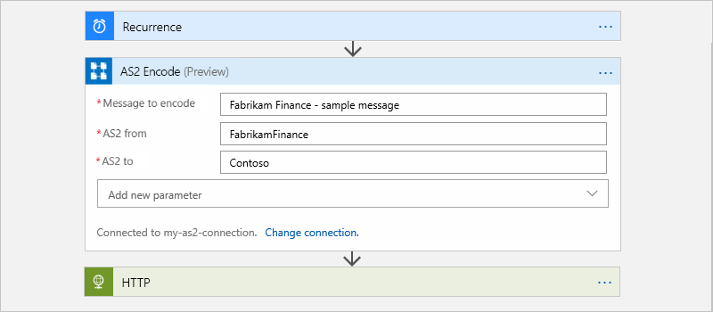
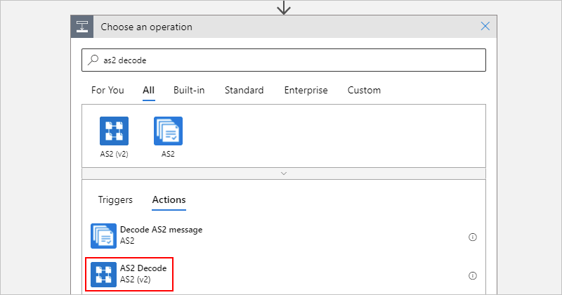
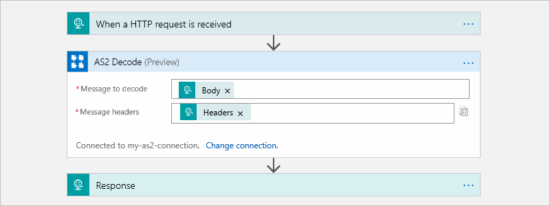

# Exchange AS2 messages for B2B enterprise integration in Azure Logic Apps with Enterprise Integration Pack

To work with AS2 messages in Azure Logic Apps, 
you can use the AS2 connector, which provides 
triggers and actions for managing AS2 communication. 
For example, to establish security and reliability 
when transmitting messages, you can use these actions:

* [**Encode to AS2 message** action](#encode) for providing encryption, 
digital signing, and acknowledgements through Message Disposition 
Notifications (MDN), which help support non-repudiation. For example, 
this action applies AS2/HTTP headers and performs these tasks when configured:

  * Signs outgoing messages.
  * Encrypts outgoing messages.
  * Compresses the message.
  * Transmits the file name in the MIME header.

* [**Decode AS2 message** action](#decode) for providing decryption, 
digital signing, and acknowledgements through Message 
Disposition Notifications (MDN). For example, this action 
performs these tasks: 

  * Processes AS2/HTTP headers.
  * Reconciles received MDNs with the original outbound messages.
  * Updates and correlates records in the non-repudiation database.
  * Writes records for AS2 status reporting.
  * Outputs payload contents as base64-encoded.
  * Determines whether MDNs are required. Based on the AS2 agreement, determines whether MDNs should be synchronous or asynchronous.
  * Generates synchronous or asynchronous MDNs based on the AS2 agreement.
  * Sets the correlation tokens and properties on MDNs.

  This action also performs these tasks when configured:

  * Verifies the signature.
  * Decrypts the messages.
  * Decompresses the message. 
  * Check and disallow message ID duplicates.

This article shows how to add the AS2 encoding and 
decoding actions to an existing logic app.

## Prerequisites

* An Azure subscription. If you don't have an Azure subscription yet, 
[sign up for a free Azure account](https://azure.microsoft.com/free/).

* The logic app from where you want to use the AS2 connector 
and a trigger that starts your logic app's workflow. The AS2 
connector provides only actions, not triggers. 
If you're new to logic apps, review 
[What is Azure Logic Apps](../logic-apps/logic-apps-overview.md) and 
[Quickstart: Create your first logic app](../logic-apps/quickstart-create-first-logic-app-workflow.md).

* An [integration account](../logic-apps/logic-apps-enterprise-integration-create-integration-account.md) 
that's associated with your Azure subscription and linked 
to the logic app where you plan to use the AS2 connector. 
Both your logic app and integration account must exist 
in the same location or Azure region.

* At least two [trading partners](../logic-apps/logic-apps-enterprise-integration-partners.md) 
that you've already defined in your integration account 
by using the AS2 identity qualifier.

* Before you can use the AS2 connector, you must create an AS2 
[agreement](../logic-apps/logic-apps-enterprise-integration-agreements.md) 
between your trading partners and store that agreement in your 
integration account.

* If you use [Azure Key Vault](../key-vault/key-vault-overview.md) 
for certificate management, check that your vault keys permit the 
**Encrypt** and **Decrypt** operations. Otherwise, the encoding 
and decoding actions fail.

  In the Azure portal, go to your key vault, 
  view your vault key's **Permitted operations**, 
  and confirm that the **Encrypt** and **Decrypt** 
  operations are selected.

  

## Encode AS2 messages

1. If you haven't already, in the [Azure portal](https://portal.azure.com), 
open your logic app in the Logic App Designer.

1. In the designer, add a new action to your logic app. 

1. Under **Choose an action** and the search box, choose **All**. 
In the search box, enter "encode as2", and select this action: 
**Encode to AS2 message**.

   

1. If you don't have an existing connection to your integration account, 
you're prompted to create that connection now. Name your connection, 
select the integration account that you want to connect, and choose **Create**.

     
 
1. Now provide information for these properties:

   | Property | Description |
   |----------|-------------|
   | **AS2-From** | The identifier for the message sender as specified by your AS2 agreement |
   | **AS2-To** | The identifier for the message receiver as specified by your AS2 agreement |
   | **body** | The message payload |
   |||

   For example:

   

## Decode AS2 messages

1. If you haven't already, in the [Azure portal](https://portal.azure.com), 
open your logic app in the Logic App Designer.

1. In the designer, add a new action to your logic app. 

1. Under **Choose an action** and the search box, choose **All**. 
In the search box, enter "decode as2", and select this action: 
**Decode AS2 message**

   

1. If you don't have an existing connection to your integration account, 
you're prompted to create that connection now. Name your connection, 
select the integration account that you want to connect, and choose **Create**.

     

1. For **body** and **Headers**, select these values from previous trigger or action outputs.

   For example, suppose your logic app receives messages through a 
   Request trigger. You can select the outputs from that trigger.

    

## Sample

To try deploying a fully operational logic app and sample AS2 scenario, 
see the [AS2 logic app template and scenario](https://azure.microsoft.com/documentation/templates/201-logic-app-as2-send-receive/).

## Connector reference

For technical details, such as triggers, actions, and limits, 
as described by the connector's OpenAPI (formerly Swagger) file, 
see the [connector's reference page](/connectors/as2/).

## Next steps

Learn more about the [Enterprise Integration Pack](logic-apps-enterprise-integration-overview.md)
