# Logic Apps B2B cross region disaster recovery
B2B workloads involve money transactions like orders, invoices.  For business, it is critical to quickly recover to meet business level SLAs as agreed with their partners during a disaster event.  This topic demonstrates building a business continuity plan for B2B workloads.  It covers

* Create an integration account in secondary region
* Establish a connection from primary region to secondary region 
* Fail over to secondary region during a disaster event
* Fall back to primary region post-disaster event

## Create an integration account in secondary region
1. Select a secondary region and create an [integration account](../logic-apps/logic-apps-enterprise-integration-create-integration-account.md).  

2. Add partners, schemas, and agreements for the required message flows where the run status needs to be replicated to secondary region integration account.

    > [!Tip]
    > Make sure consistency in integration account artifacts naming convention across regions 
    > 
    > 

## Establish a connection from primary to secondary 
To pull the run status from the primary region, create a Logic App in the secondary region.  It should have a **trigger** and an **action**.  The trigger should connect to primary region integration account and the action should connect to secondary region integration account.  Based on the time interval, the trigger polls the primary region run status table pulls the new records if any and action updates them to secondary region integration account. This helps to get incremental runtime status from primary region to secondary region.

Business continuity in Logic Apps integration account is designed to support based on B2B protocols - X12, AS2, and EDIFACT.  To find detailed steps, select respective links.

* X12 
* AS2 
* EDIFACT (coming soon)

## Fail over to secondary region during a disaster event
The recommendation is to deploy all primary region resources (for example SQL Azure or DocumentDB databases, or Service Bus / Event Hubs used for messaging, APIM, Logic Apps) in the secondary region as well.  During a disaster event, when the primary region is not available for business continuity, direct traffic to the secondary region. Secondary region helps recover business functions quickly to meet recovery time/point objectives (RPO/RTO) as agreed with their partners.  Also, minimizes efforts to fail over from one region to another region. 

There is an expected latency while copying control numbers from primary to secondary region.  To avoid sending duplicate generated control numbers to partners during a disaster event, it is recommended to bump up control numbers in the **secondary region agreements** using [PowerShell cmdlets](https://blogs.msdn.microsoft.com/david_burgs_blog/2017/03/09/fresh-of-the-press-new-azure-powershell-cmdlets-for-upcoming-x12-connector-disaster-recovery).
 
## Fall back to primary region post-disaster event
When primary region is available, to fall back to primary region follow below steps     
* Stop accepting messages from partners in the **secondary region**
* Bump up generated control numbers for all the **primary region agreements** using [PowerShell cmdlets](https://blogs.msdn.microsoft.com/david_burgs_blog/2017/03/09/fresh-of-the-press-new-azure-powershell-cmdlets-for-upcoming-x12-connector-disaster-recovery)
* Direct traffic from secondary to primary region
* Check the Logic App created in the secondary region to pull run status from the primary is enabled 

## X12 
Business continuity for EDI X12 documents is designed based on control numbers   
* Control numbers received (Inbound messages) from partners  
* Control numbers generated (outbound messages) and send to partners  
    
    > [!Tip]
    > You can also use [X12 quick start template](https://azure.microsoft.com/documentation/templates/201-logic-app-x12-disaster-recovery-replication/) to create Logic Apps.  Creating primary and secondary integration accounts are prerequisites to use the template.  The template helps create 2 Logic Apps, one for received control number and another for generated control number.  Respective triggers and actions are created in the Logic Apps, connects the trigger to primary integration account and action to secondary integration account.
    > 
    >

### Control numbers received from the partners
1. Create a [Logic App](../logic-apps/logic-apps-create-a-logic-app.md) in the secondary region   

2. Search **X12** and select **X12 - When a received control number is modified**    
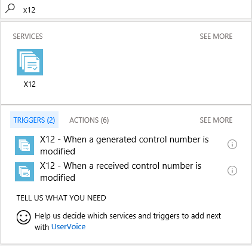

3. Selecting the trigger prompts to establish a connection to integration account. Trigger to be connected to primary region integration account.  Give a connection name, select your **primary region integration account** from the list and click create.   
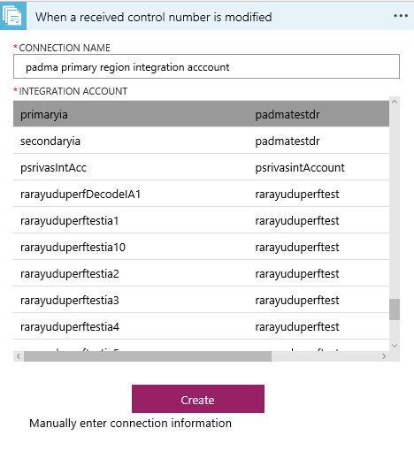

4. DateTime to start control number sync is optional.  Frequency can be set to **Day**, **Hour**, **Minute**, or **Second** with an interval.    
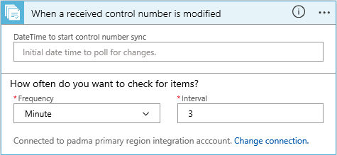

5. Click **New step** and **Add an action**    
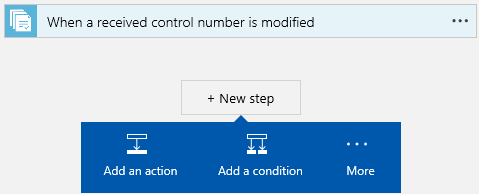

6. Search **X12** and select **X12 - Add or update a received control number**   
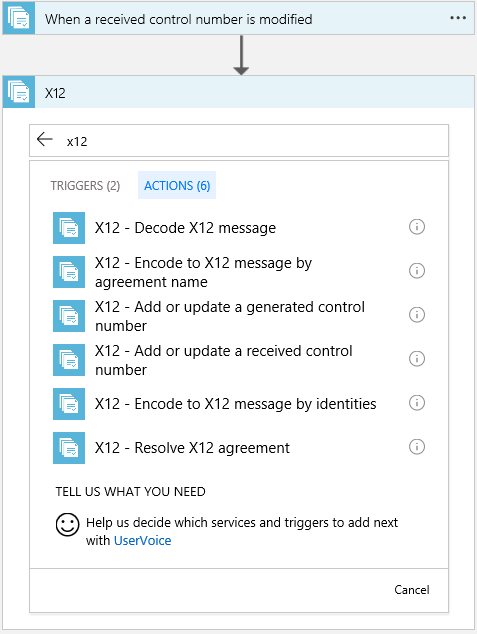

7. Action to be connected to secondary integration account.  Select **Change connection** and **Add new connection** lists the available integration accounts.  Give a connection name, select your **secondary region integration account** from the list and click create.     
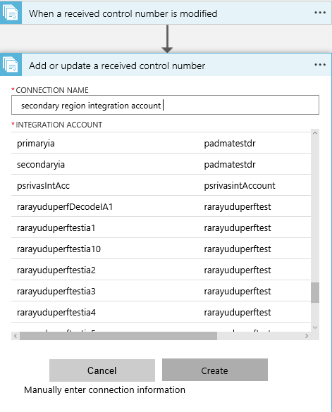

8. Select the dynamic content and save the logic app   
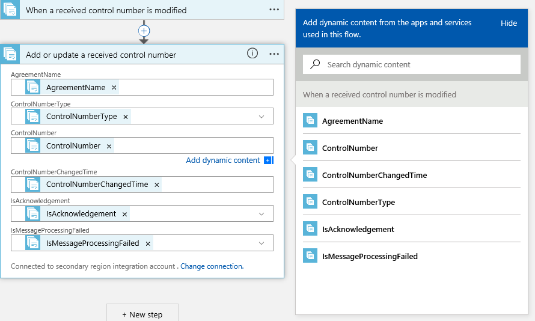

9. Based on the time interval, the trigger polls the primary region received control number table, pulls the new records and actions updates them to secondary region integration account.  If they are no updates, the trigger status shows as skipped.   
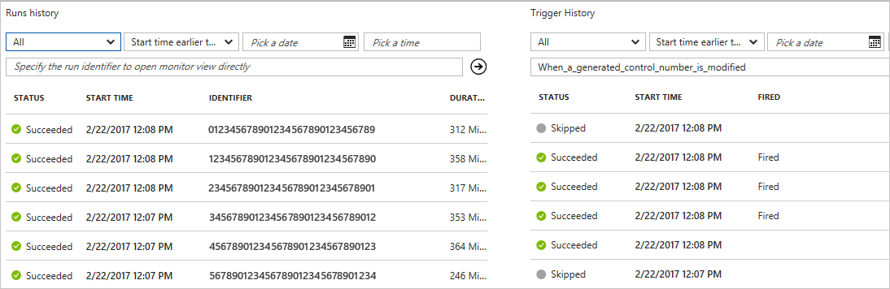

### Control numbers generated and from the partners
1. Create a [Logic App](../logic-apps/logic-apps-create-a-logic-app.md) in the secondary region  

2. Search **X12** and select **X12 - When a generated control number is modified**   

3. Selecting the trigger prompts to establish a connection to integration account. Trigger to be connected to primary region integration account.  Give a connection name, select your **primary region integration account** from the list and click create.   
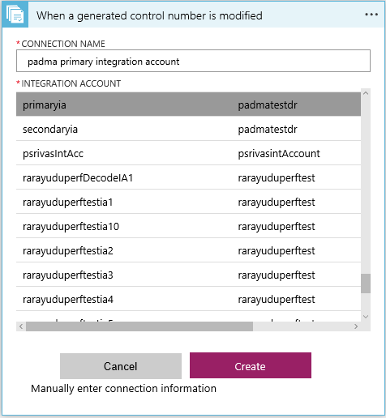 

4. DateTime to start control number sync is optional.  Frequency can be set to **Day**, **Hour**, **Minute**, or **Second** with an interval.   
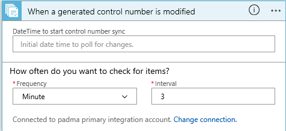  

5. Click **New step** and **Add an action**   
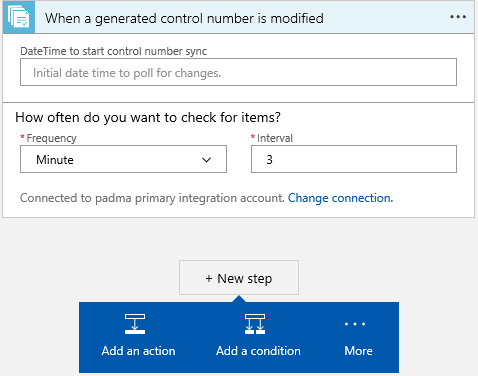

6. Search **X12** and select **X12 - Add or update a generated control number**   
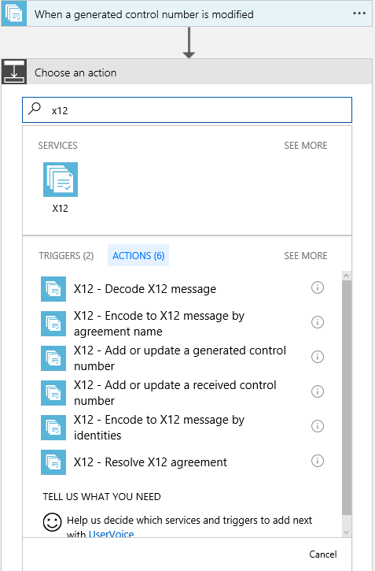

7. Action to be connected to secondary integration account.  Select **Change connection** and **Add new connection** lists the available integration accounts.  Give a connection name, select your **secondary region integration account** from the list and click create.    
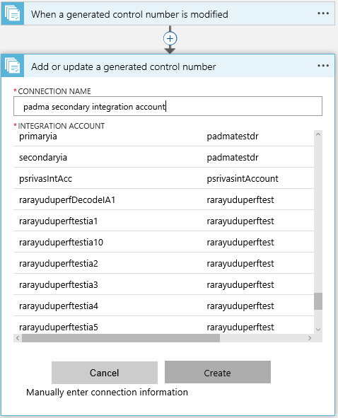

8. Select the dynamic content and save the logic app   
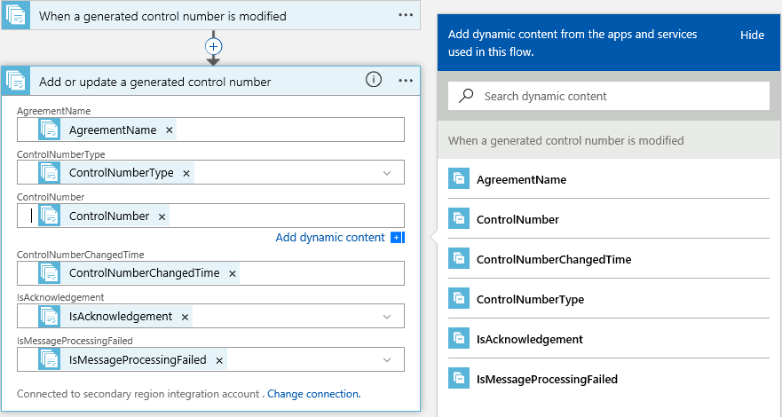

9. Based on the time interval, the trigger polls the primary region received control number table, pulls the new records and actions updates them to secondary region integration account.  If they are no updates, the trigger status shows as skipped.  
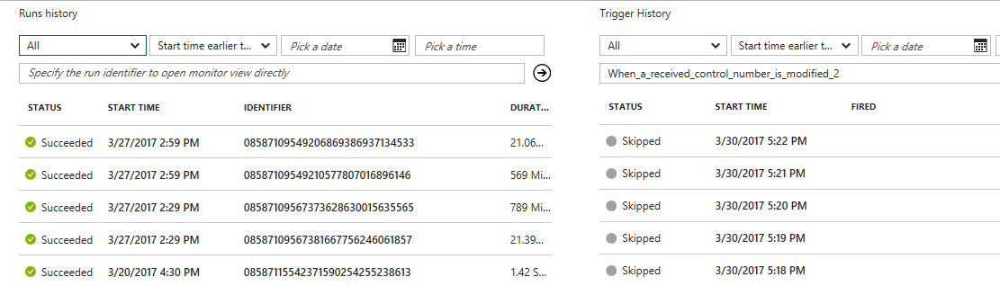

Based on the time interval, the incremental runtime status replicates from primary region to secondary region.  During a disaster event, when the primary region is not available, direct traffic to the secondary region for business continuity. 

## Next Steps
* Learn more about [monitoring B2B messages](logic-apps-monitor-b2b-message.md).   