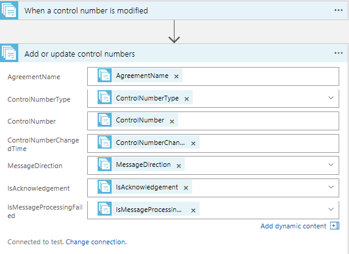

# Logic Apps B2B cross-region disaster recovery
B2B workloads involve money transactions like orders and invoices. During a disaster event, it's critical for a business to quickly recover to meet the business-level SLAs agreed upon with their partners. This article demonstrates how to build a business continuity plan for B2B workloads. 

* Disaster Recovery readiness 
* Fail over to secondary region during a disaster event 
* Fall back to primary region post-disaster event

## Disaster Recovery readiness  

1. Identify a secondary region and create an [integration account](../logic-apps/logic-apps-enterprise-integration-create-integration-account.md) in secondary region 

2. Add partners, schemas, and agreements for the required message flows where the run status needs to be replicated to secondary region integration account.

    > [!Tip]
    > Make sure there's consistency in the integration account artifact's naming convention across regions. 
    > 
    > 

3. To pull the run status from the primary region, create a Logic App in the secondary region.  It should have a **trigger** and an **action**.  The trigger should connect to primary region integration account and the action should connect to secondary region integration account.  Based on the time interval, the trigger polls the primary region run status table pulls the new records if any and action updates them to secondary region integration account. This helps to get incremental runtime status from primary region to secondary region.

4. Business continuity in Logic Apps integration account is designed to support based on B2B protocols - X12, AS2, and EDIFACT.  To find detailed steps, select respective links.

5. The recommendation is to deploy all primary region resources in a secondary region as well. Primary region resources include Azure SQL Database or Azure Cosmos DB, Azure Service Bus/Azure Event Hubs used for messaging, Azure API Management, and the Logic Apps feature of Azure App Service.   

6. Establish a connection from a primary region to a secondary region. To pull the run status from a primary region, create a logic app in a secondary region. It should have a trigger and an action. The trigger should connect to a primary region integration account. The action should connect to a secondary region integration account. Based on the time interval, the trigger polls the primary region run status table and pulls the new records, if any. The action updates them to a secondary region integration account. This process helps to get incremental runtime status from the primary region to the secondary region.

Business continuity in a Logic Apps integration account provides support based on the B2B protocols X12, AS2, and EDIFACT. For detailed steps on using X12 and AS2, see [X12](../logic-apps/logic-apps-enterprise-integration-b2b-business-continuity.md#x12) and [AS2](../logic-apps/logic-apps-enterprise-integration-b2b-business-continuity.md#as2) in this article.

## Fail over to a secondary region during a disaster event
During a disaster event, when the primary region is not available for business continuity, direct traffic to the secondary region. A secondary region helps a business to recover functions quickly to meet the RPO/RTO agreed upon by their partners. It also minimizes efforts to fail over from one region to another region. 

There is an expected latency while copying control numbers from a primary region to a secondary region. To avoid sending duplicate generated control numbers to partners during a disaster event, the recommendation is to bump up control numbers in the secondary region agreements by using [PowerShell cmdlets](https://blogs.msdn.microsoft.com/david_burgs_blog/2017/03/09/fresh-of-the-press-new-azure-powershell-cmdlets-for-upcoming-x12-connector-disaster-recovery).

## Fall back to a primary region post-disaster event
To fall back to a primary region when it is available, follow these steps:

1. Stop accepting messages from partners in the secondary region.  

2. Bump up generated control numbers for all the primary region agreements by using [PowerShell cmdlets](https://blogs.msdn.microsoft.com/david_burgs_blog/2017/03/09/fresh-of-the-press-new-azure-powershell-cmdlets-for-upcoming-x12-connector-disaster-recovery).  

3. Direct traffic from the secondary region to the primary region.

4. Check to see that the logic app created in the secondary region to pull run status from the primary region is enabled.

## X12 
Business continuity for EDI X12 documents is based on control numbers:

> [!Tip]
    > You can also use the [X12 quick start template](https://azure.microsoft.com/documentation/templates/201-logic-app-x12-disaster-recovery-replication/) to create logic apps. Creating primary and secondary integration accounts are prerequisites to use the template. The template helps to create two logic apps, one for received control numbers and another for generated control numbers. Respective triggers and actions are created in the logic apps, connecting the trigger to the primary integration account and the action to the secondary integration account.
    >
    >

Prerequisites:
Select duplicate check settings in X12 agreement receive settings to enable DR for inbound messages
  

1. Create a [logic app](../logic-apps/logic-apps-create-a-logic-app.md) in a secondary region.    

2. Search on **X12**, and select **X12 - When a control number is modified**.   

3. The trigger prompts you to establish a connection to an integration account. The trigger should be connected to a primary region integration account. Enter a connection name, select your **primary region integration account** from the list, and click **Create**.   

4. The **DateTime to start control number sync** setting is optional. The **Frequency** can be set to **Day**, **Hour**, **Minute**, or **Second** with an interval.   

5. Select **New step** > **Add an action**.    

6. Search on **X12**, and select **X12 - Add or update control numbers**.   

7. To connect an action to a secondary region integration account, select **Change connection** > **Add new connection** for a list of the available integration accounts. Enter a connection name, select your **secondary region integration account** from the list, and click **Create**.   

8. Select the dynamic content, and save the logic app.   

9. Based on the time interval, the trigger polls the primary region received control number table and pulls the new records. The action updates them to the secondary region integration account. If there are no updates, the trigger status appears as **Skipped**.   

Based on the time interval, the incremental runtime status replicates from a primary region to a secondary region. During a disaster event, when the primary region is not available, direct traffic to the secondary region for business continuity. 

## EDIFACT 
Business continuity for EDI EDIFACT documents is based on control numbers:

Prerequisites:
Select duplicate check settings in EDIFACT agreement receive settings to enable DR for inbound messages     
  

1. Create a [logic app](../logic-apps/logic-apps-create-a-logic-app.md) in a secondary region.    

2. Search on **EDIFACT**, and select **EDIFACT - When a control number is modified**.     

4. The trigger prompts you to establish a connection to an integration account. The trigger should be connected to a primary region integration account. Enter a connection name, select your **primary region integration account** from the list, and click **Create**.    

5. The **DateTime to start control number sync** setting is optional. The **Frequency** can be set to **Day**, **Hour**, **Minute**, or **Second** with an interval.    

6. Select **New step** > **Add an action**.    

7. Search on **EDIFACT**, and select **EDIFACT - Add or update control numbers**.   

8. To connect an action to a secondary region integration account, select **Change connection** > **Add new connection** for a list of the available integration accounts. Enter a connection name, select your **secondary region integration account** from the list, and click **Create**.   

9. Select the dynamic content, and save the logic app.   

10. Based on the time interval, the trigger polls the primary region received control number table and pulls the new records. The action updates them to the secondary region integration account. If there are no updates, the trigger status appears as **Skipped**.   

Based on the time interval, the incremental runtime status replicates from a primary region to a secondary region. During a disaster event, when the primary region is not available, direct traffic to the secondary region for business continuity. 

## AS2 
Business continuity for documents that use the AS2 protocol is based on the message ID and the MIC value.

> [!Tip]
    > You can also use the [AS2 quick start template](https://github.com/Azure/azure-quickstart-templates/pull/3302) to create logic apps. Creating primary and secondary integration accounts are prerequisites to use the template. The template helps to create a logic app that has a trigger and an action. The logic app creates a connection from a trigger to a primary integration account and an action to a secondary integration account.
    > 
    >

1. Create a [logic app](../logic-apps/logic-apps-create-a-logic-app.md) in the secondary region.  

2. Search on **AS2**, and select **AS2 - When a MIC value is created**.   

3. A trigger prompts you to establish a connection to an integration account. The trigger should be connected to a primary region integration account. Enter a connection name, select your **primary region integration account** from the list, and click **Create**.   

4. The **DateTime to start MIC value sync** setting is optional. The **Frequency** can be set to **Day**, **Hour**, **Minute**, or **Second** with an interval.   

5. Select **New step** > **Add an action**.  

6. Search on **AS2**, and select **AS2 - Add or update a MIC**.  

7. To connect an action to a secondary integration account, select **Change connection** > **Add new connection** for a list of the available integration accounts. Enter a connection name, select your **secondary region integration account** from the list, and click **Create**.    

8. Select the dynamic content, and save the logic app.   

9. Based on the time interval, the trigger polls the primary region table and pulls the new records. The action updates them to the secondary region integration account. If there are no updates, the trigger status appears as **Skipped**.  

Based on the time interval, the incremental runtime status replicates from the primary region to the secondary region. During a disaster event, when the primary region is not available, direct traffic to the secondary region for business continuity. 

## Next steps
Learn more about [monitoring B2B messages](logic-apps-monitor-b2b-message.md).   

