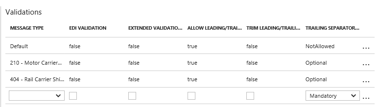

# B2B errors and solutions for Azure Logic Apps

[!INCLUDE [logic-apps-sku-consumption-standard](../../includes/logic-apps-sku-consumption-standard.md)]

This article helps you troubleshoot errors that might happen in Azure Logic Apps B2B 
scenarios and suggests appropriate actions for correcting those errors.

## Agreement resolution

### No agreement found

**Error description**: No agreement found with Agreement Resolution Parameters.

**User action**: The agreement should be added to the integration account with agreed business identities. The business identities should match to the input message IDs.

### No agreement found with identities

**Error description**: No agreement found with identities: 'AS2Identity'::'Partner1' and'AS2Identity'::'Partner3'

**User action**: Invalid AS2-From or AS2-To configured for agreement. Correct the AS2 message's "AS2-From" or "AS2-To" headers or the agreement to match the AS2 IDs in the AS2 message headers with agreement configurations.

## AS2

### Missing AS2 message headers  

**Error description**: Invalid AS2 headers. One of the "AS2-To" or "AS2-From" headers is empty.

**User action**: An AS2 message was received that did not contain the AS2-From or AS2-To or both headers. Check AS2 message AS2-From and AS2-To headers and correct them based on agreement configuration.

### Missing AS2 message body and headers    

**Error description**: The request content is null or empty.

**User action**: An AS2 message was received that did not contain the message body.

### AS2 message decryption failure

**Error description**:  [processed/Error: decryption-failed]

**User action**: Add @base64ToBinary to AS2Message before sending to partner.

For example:

```json
"HTTP": {
   "inputs": {
   "body": "@base64ToBinary(body('Encode_to_AS2_message')?['AS2Message']?['Content'])",
   "headers": "@body('Encode_to_AS2_message')?['AS2Message']?['OutboundHeaders']",
   "method": "POST",
   "uri": "xxxxx.xxx"
},
``` 

### MDN decryption failure

**Error description**:  [processed/Error: decryption-failed]

**User action**: Add @base64ToBinary to MDN before sending to partner.

For example:

```json
"Response": {
   "inputs": {
   "body": "@base64ToBinary(body('Decode_AS2_message')?['OutgoingMDN']?['Content'])",
   "headers": "@body('Decode_AS2_message')?['OutgoingMDN']?['OutboundHeaders']",
   "statusCode": 200
},               
``` 

### Missing signing certificate

**Error description**: The Signing Certificate has not been configured for AS2 party. AS2-From: partner1 AS2-To: partner2

**User action**: Configure AS2 agreement settings with correct certificate for signature.

## X12 and EDIFACT

### Leading or trailing space found    

**Error description**: Error encountered during parsing. The EDIFACT transaction set with ID '123456' contained in interchange (without group) with ID '987654', with sender ID 'Partner1', receiver ID 'Partner2' is being suspended with following errors: "Leading Trailing separator found"

**User action**: The agreement settings to be configured to allow leading and trailing space. Edit agreement settings to allow leading and trailing space.



### Duplicate check has enabled in the agreement

**Error description**: Duplicate Control Number

**User action**: This error indicates the received message has duplicate control numbers. Correct the control number and resend the message.

### Missing schema in the agreement

**Error description**: Error encountered during parsing. The X12 transaction set with ID '564220001' contained in functional group with ID '56422', in interchange with ID '000056422', with sender ID '12345678', receiver ID '87654321' is being suspended with following errors: "The message has an unknown document type and did not resolve to any of the existing schemas configured in the agreement"

**User action**: Configure schema in the agreement settings.

### Incorrect schema in the agreement

**Error description**: The message has an unknown document type and did not resolve to any of the existing schemas configured in the agreement.

**User action**: Configure correct schema in the agreement settings.

## Flat file

### Input message with no body

**Error description**: InvalidTemplate. Unable to process template language expressions in action 'Flat_File_Decoding' inputs at line '1' and column '1902': 'Required property 'content' expects a value but got null. Path ''.'.

**User action**: This error indicates the input message does not contain a body.
