# Receive and send B2B messages by using Azure Logic Apps and Enterprise Integration Pack

When you have an integration account that defines trading partners and agreements, you can create an automated business to business (B2B) workflow that exchanges messages between trading partners by using [Azure Logic Apps](../logic-apps/logic-apps-overview.md) with the [Enterprise Integration Pack](../logic-apps/logic-apps-enterprise-integration-overview.md). Azure Logic Apps works with connectors that support AS2, X12, EDIFACT, and RosettaNet industry-standard protocols. You can also combine these connectors with other [connectors available in Logic Apps](../connectors/apis-list.md), for example, Salesforce and Office 365 Outlook.

This article shows how to create a logic app that receives an HTTP request by using a Request trigger, decodes the message content by using the AS2 and X12 actions, and then returns a response by using the Response action.

## Prerequisites

* An Azure subscription. If you don't have a subscription yet, [sign up for a free Azure account](https://azure.microsoft.com/free/).

* A blank logic app so that you can create the B2B workflow by using the [Request](../connectors/connectors-native-reqres.md) trigger, which is followed by the [AS2 Decode](../logic-apps/logic-apps-enterprise-integration-as2.md) action, [Decode X12 message](../logic-apps/logic-apps-enterprise-integration-x12.md) action, and [Response](../connectors/connectors-native-reqres.md) action in this example. If you're new to logic apps, review [What is Azure Logic Apps?](../logic-apps/logic-apps-overview.md) and [Quickstart: Create your first logic app](../logic-apps/quickstart-create-first-logic-app-workflow.md).

* An [integration account](../logic-apps/logic-apps-enterprise-integration-accounts.md) that's associated with your Azure subscription and linked to your logic app. Both your logic app and integration account must exist in the same location or Azure region.

* At least two [trading partners](../logic-apps/logic-apps-enterprise-integration-partners.md) that you've already defined in your integration account along with [AS2 and X12 agreements](logic-apps-enterprise-integration-agreements.md) for those partners.

## Add Request trigger

This example uses the Logic App Designer in the Azure portal, but you can follow similar steps for the Logic App Designer in Visual Studio.

1. In the [Azure portal](https://portal.azure.com), open your blank logic app in the Logic App Designer.

1. In the search box, enter `when a http request`, and select **When an HTTP request is received** to use as the trigger.

   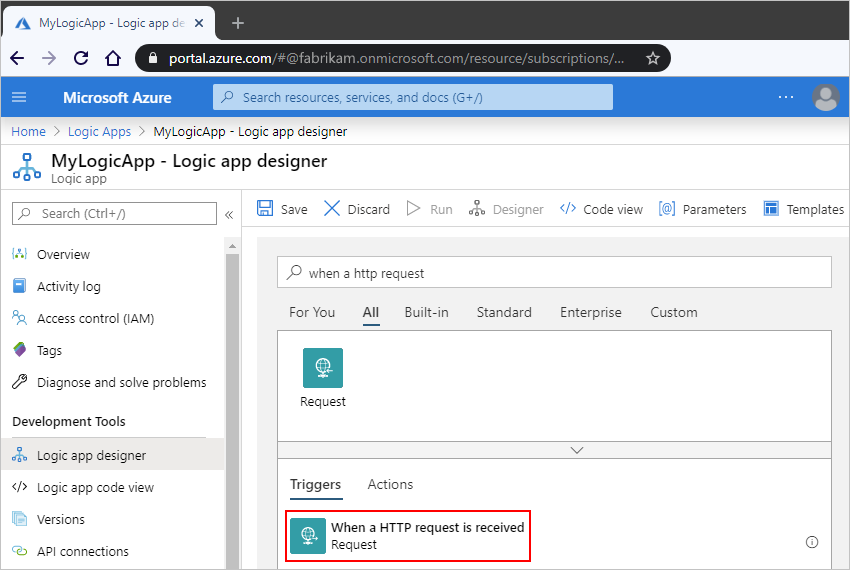

1. In the **Request body JSON Schema** box, enter the JSON schema that describes the body content that you expect from the incoming request. For more information, see [Receive and respond to incoming HTTPS calls](../connectors/connectors-native-reqres.md).

   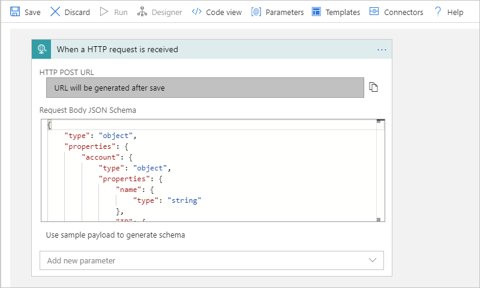

1. When you're done, on the designer toolbar, select **Save**.

   This step generates the **HTTP POST URL** to use for sending the request that triggers the logic app. To copy this URL, select the copy icon next to the URL.

   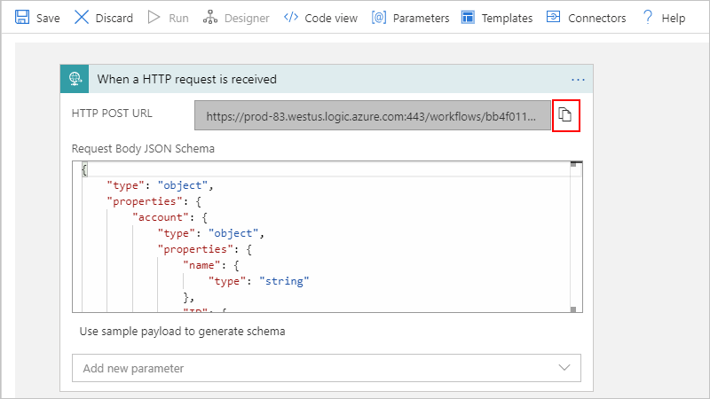

## Add AS2 decode action

Now add the B2B actions that you want to use. This example uses AS2 and X12 actions.

1. Under the trigger, select **New step**. To hide the trigger details, click on the trigger's title bar.

   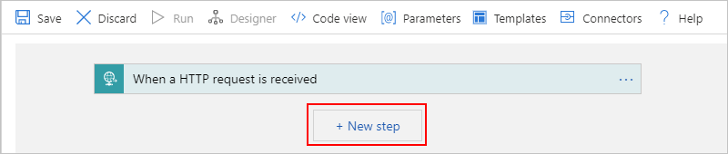

1. Under **Choose an action**, in the search box, enter `as2 decode`, and select **AS2 Decode (v2)**.

   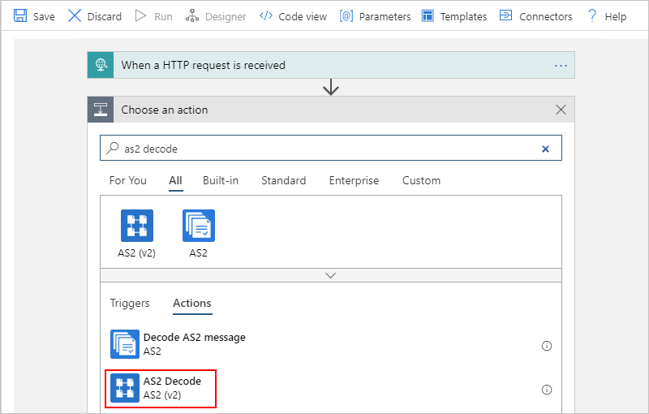

1. For the **Message to decode** property, enter the input that you want the AS2 action to decode, which is the `body` content that's received by the HTTP request trigger. You have multiple ways to specify this content as input, either from the dynamic content list or as an expression:

   * To select tokens that represent the available trigger outputs, click inside the **Message to decode** box. After the dynamic content list appears, under **When a HTTP request is received**, select **Body** property value, for example:

     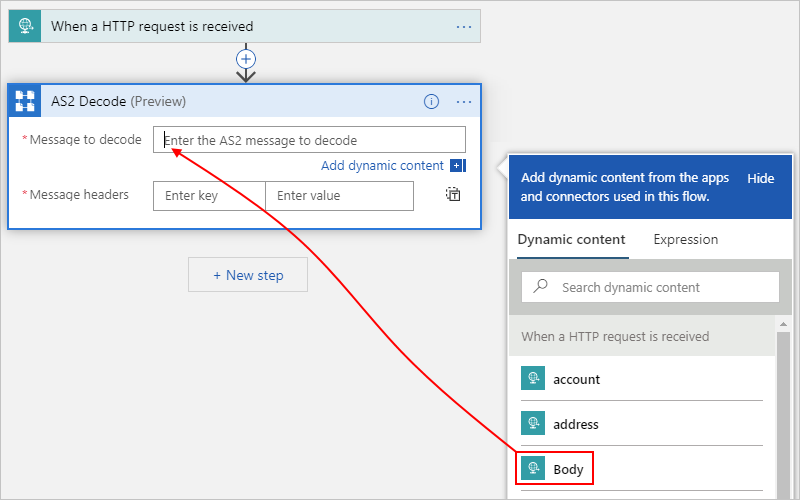

   * To enter an expression that references the trigger's `body` output, click inside the **Message to decode** box. After the dynamic content list appears, select **Expression**. In the expression editor, enter the expression here, and select **OK**:

     `triggerOutputs()['body']`

     Or, in the **Message to decode** box, directly enter this expression:

     `@triggerBody()`

     The expression resolves to the **Body** token.

     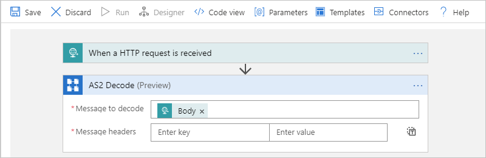

1. For the **Message headers** property, enter any headers required for the AS2 action, which are described by the `headers` content that's received by the HTTP request trigger.

   To enter an expression that references the trigger's `headers` output, click inside the **Message headers** box. After the dynamic content list appears, select **Expression**. In the expression editor, enter the expression here, and select **OK**:

   `triggerOutputs()['headers']`

   The expression resolves to a token.

   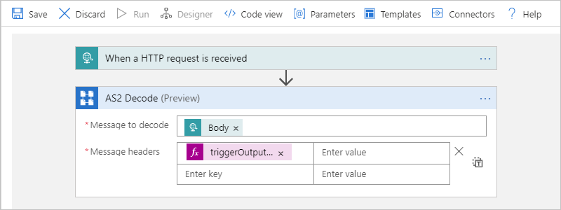

## Add notification for message receipt

To notify the trading partner that the message was received, you can return a response that contains an AS2 Message Disposition Notification (MDN) by using the **Response** action. By adding this action immediately after the **AS2 Decode** action, should that action fail, the logic app doesn't continue processing.

1. Under the **AS2 Decode** action, select **New step**.

1. Under **Choose an action**, in the search box, enter `response`, and select **Response**.

   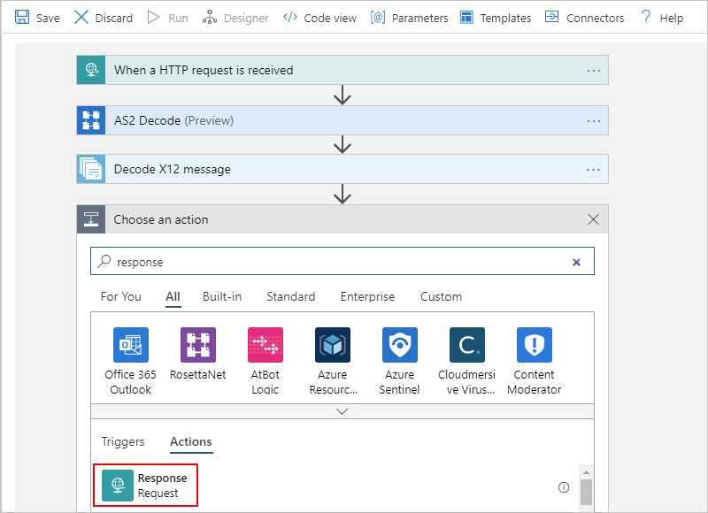

1. To access the AS2 MDN from the **AS2 Decode** action's output, in the **Response** action's **Body** property, enter this expression:

   `@base64ToString(body('AS2_Decode')?['OutgoingMdn']?['Content'])`

   The expression resolves to a token:

   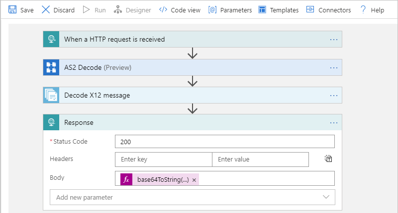

1. Save your logic app.

## Add Decode X12 message action

1. Now add the **Decode X12 message** action. Under the **Response** action, select **New step**.

1. Under **Choose an action**, in the search box, enter `x12 decode`, and select **Decode X12 message**.

   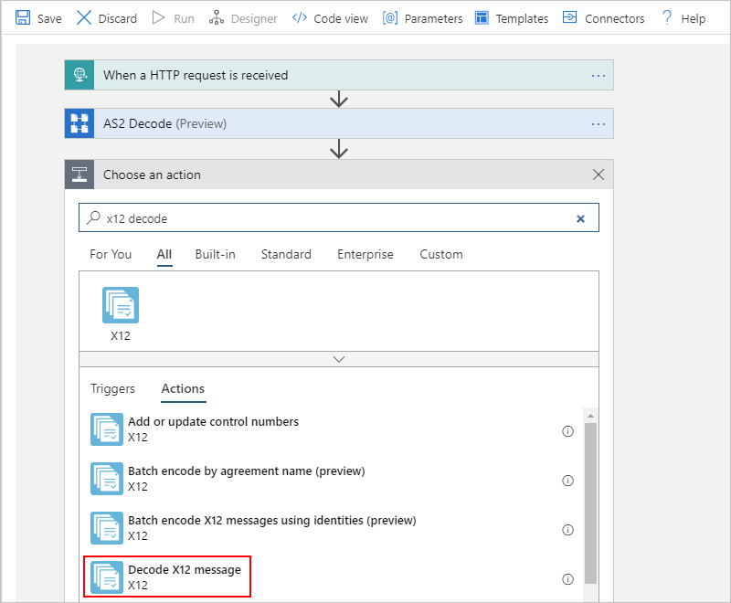

1. Now specify the input for the X12 action. This example uses the output from the AS2 action, which is the message content but note that this content is in JSON object format and is base64 encoded. So, you have to convert this content to a string.

   1. If the X12 action prompts you for connection information, provide the name for the connection, select the integration account you want to use, and then select **Create**.

      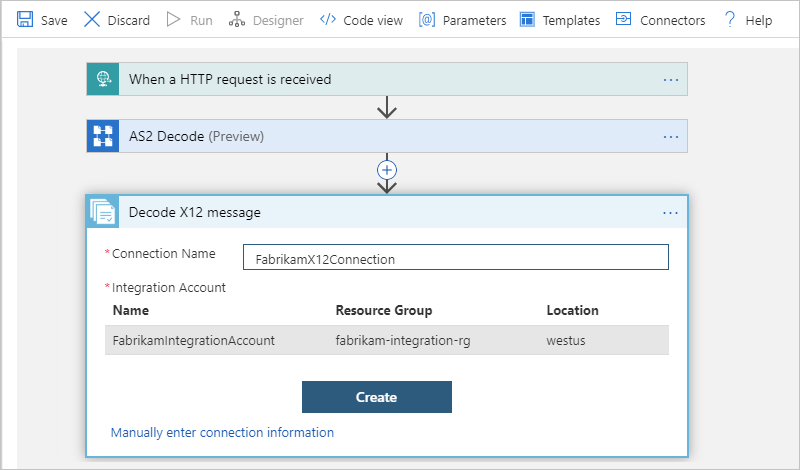

   1. In the **X12 Flat file message to decode** box, enter this expression to convert the AS2 output:

      `@base64ToString(body('AS2_Decode')?['AS2Message']?['Content'])`

      The expression resolves to a token:

      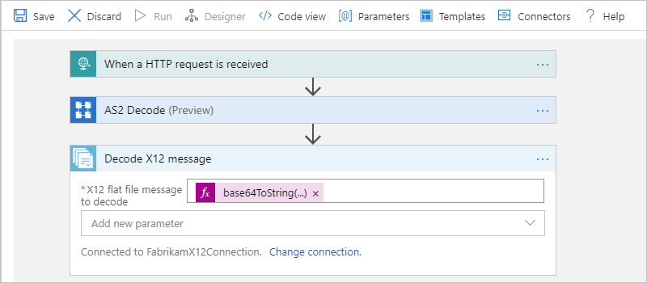

1. Save your logic app.

   If you need additional steps for this logic app, for example, to decode the message content and output that content in JSON object format, continue building your logic app.

You're now done setting up your B2B logic app. In a real world app, you might want to store the decoded X12 data in a line-of-business (LOB) app or data store. To connect your own LOB apps and use these APIs in your logic app, you can add further actions or write custom APIs.

## Next steps

* [Receive and respond to incoming HTTPS calls](../connectors/connectors-native-reqres.md)
* [Exchange AS2 messages for B2B enterprise integration](../logic-apps/logic-apps-enterprise-integration-as2.md)
* [Exchange X12 messages for B2B enterprise integration](../logic-apps/logic-apps-enterprise-integration-x12.md)
* Learn more about the [Enterprise Integration Pack](../logic-apps/logic-apps-enterprise-integration-overview.md)