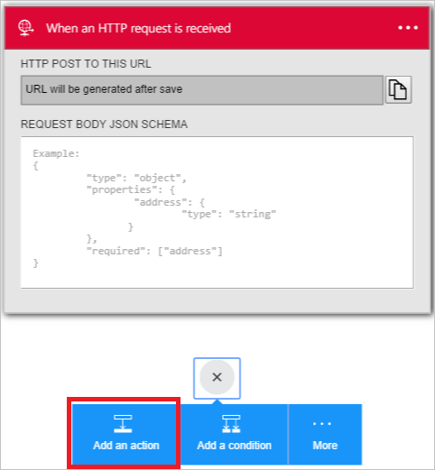
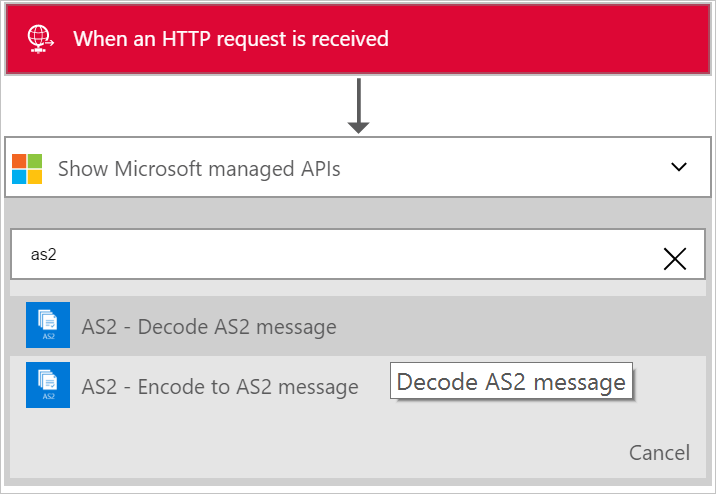
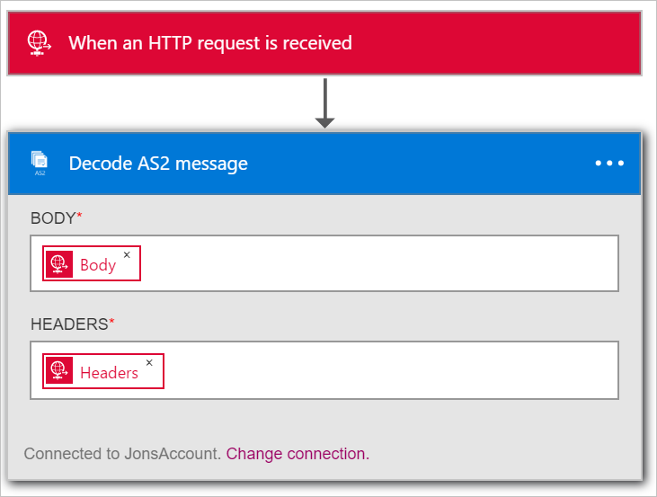
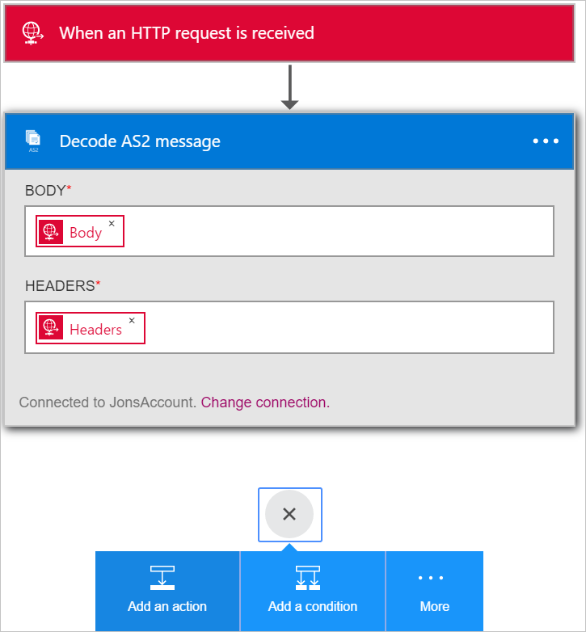
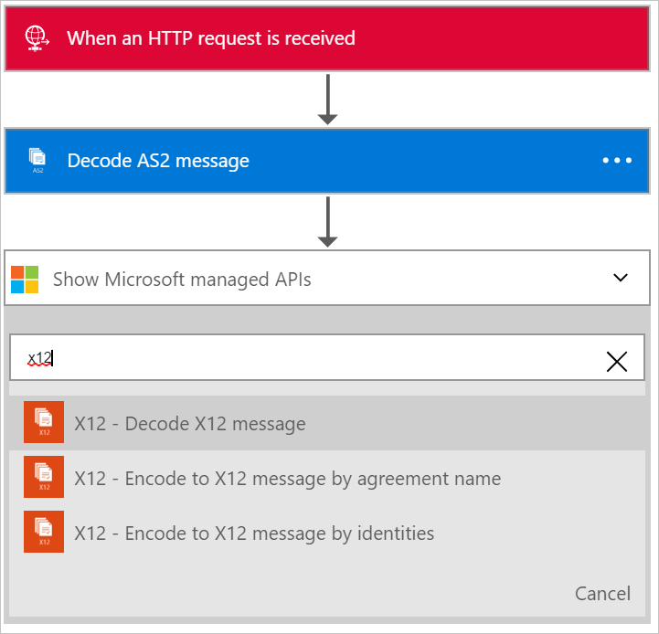
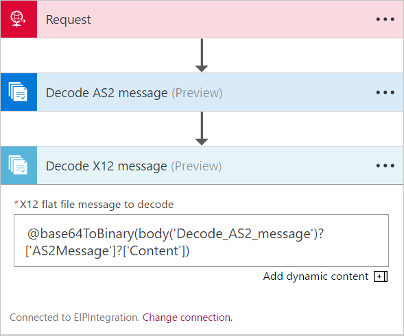
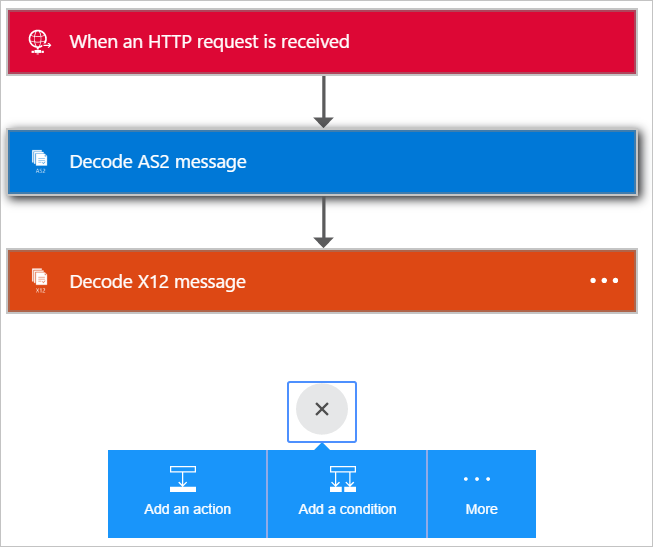
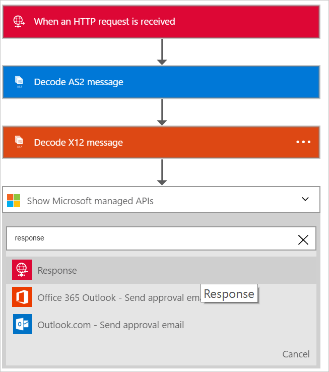
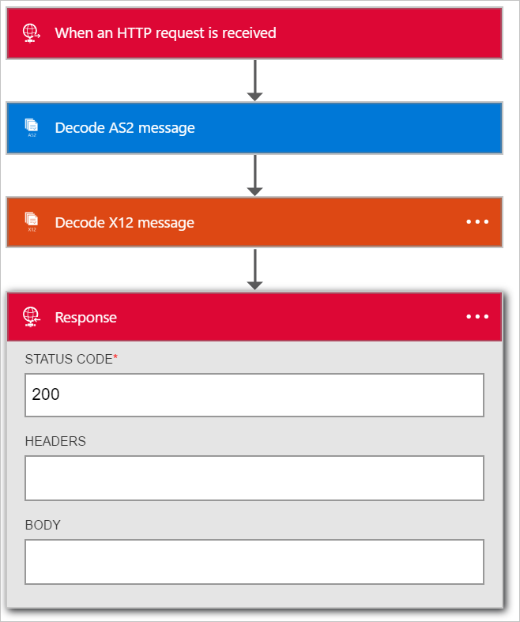
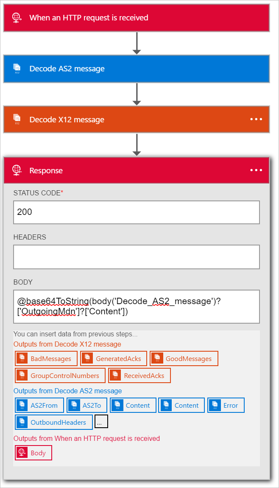

# Receive B2B data with Azure Logic Apps and Enterprise Integration Pack

After you create an integration account that has partners and agreements, 
you are ready to create a business to business (B2B) workflow for your logic app 
with the [Enterprise Integration Pack](logic-apps-enterprise-integration-overview.md).

## Prerequisites

To use the AS2 and X12 actions, you must have 
an Enterprise Integration Account. Learn 
[how to create an Enterprise Integration Account](../logic-apps/logic-apps-enterprise-integration-accounts.md).

## Create a logic app with B2B connectors

Follow these steps to create a B2B logic app that uses 
the AS2 and X12 actions to receive data from a trading partner:

1. Create a logic app, then 
[link your app to your integration account](../logic-apps/logic-apps-enterprise-integration-accounts.md).

2. Add a **Request - When an HTTP request is received** 
trigger to your logic app.

	

3. To add the **Decode AS2** action, 
select **Add an action**.

	

4. To filter all actions to the one that you want, 
enter the word **as2** in the search box.

	

5. Select the **AS2 - Decode AS2 message** action.

	

6. Add the **Body** that you want to use as input. 
In this example, select the body of the HTTP request 
that triggers the logic app. Or enter an expression 
that inputs the headers in the **HEADERS** field:

	@triggerOutputs()['headers']

7. Add the required **Headers** for AS2, 
which you can find in the HTTP request headers. 
In this example, select the headers of the 
HTTP request that trigger the logic app.

8. Now add the Decode X12 message action. Select **Add an action**.

	

9. To filter all actions to the one that you want, 
enter the word **x12** in the search box.

	

10. Select the **X12 - Decode X12 message** action.

	

11. Now you must specify the input to this action. 
This input is the output from the previous AS2 action.

	The actual message content is in a JSON object and is base64 encoded, 
	so you must specify an expression as the input. 
	Enter the following expression in the **X12 FLAT FILE MESSAGE TO DECODE** input field:
	
	@base64ToString(body('Decode_AS2_message')?['AS2Message']?['Content'])

	Now add steps to decode the X12 data received from the trading partner 
	and output items in a JSON object. 
	To notify the partner that the data was received, 
	you can send back a response containing the AS2 
	Message Disposition Notification (MDN) in an HTTP Response Action.

12.	To add the **Response** action, choose **Add an action**.

	

13. To filter all actions to the one that you want, 
enter the word **response** in the search box.

	

14. Select the **Response** action.

	

15. To access the MDN from the output of the **Decode X12 message** action, 
set the response **BODY** field with this expression:

	@base64ToString(body('Decode_AS2_message')?['OutgoingMdn']?['Content'])

	  

16. Save your work.

	  

You are now done setting up your B2B logic app. 
In a real world application, you might want to store the 
decoded X12 data in a line-of-business (LOB) app or data store. 
To connect your own LOB apps and use these APIs in your logic app, 
you can add further actions or write custom APIs.

## Features and use cases

* The AS2 and X12 decode and encode actions let you 
exchange data between trading partners 
by using industry standard protocols in logic apps.
* To exchange data with trading partners, 
you can use AS2 and X12 with or without each other.
* The B2B actions help you create partners and agreements easily 
in your integration account and consume them in a logic app.
* When you extend your logic app with other actions, 
you can send and receive data between other apps and services like SalesForce.

## Learn more
[Learn more about the Enterprise Integration Pack](logic-apps-enterprise-integration-overview.md)
