# Exchange B2B messages between partners using workflows in Azure Logic Apps

[!INCLUDE [logic-apps-sku-consumption-standard](../../includes/logic-apps-sku-consumption-standard.md)]

When you have an integration account that defines trading partners and agreements, you can create an automated business-to-business (B2B) workflow that exchanges messages between trading partners by using Azure Logic Apps. Your workflow can use connectors that support industry-standard protocols, such as AS2, X12, EDIFACT, and RosettaNet. You can also include operations provided by other [connectors in Azure Logic Apps](/connectors/connector-reference/connector-reference-logicapps-connectors), such as Office 365 Outlook, SQL Server, and Salesforce.

This article shows how to create an example logic app workflow that can receive HTTP requests by using a **Request** trigger, decode message content by using the **AS2 Decode** and **Decode X12** actions, and return a response by using the **Response** action. The example uses the workflow designer in the Azure portal, but you can follow similar steps for the workflow designer in Visual Studio.

If you're new to logic apps, review [What is Azure Logic Apps](logic-apps-overview.md)? For more information about B2B enterprise integration, review [B2B enterprise integration workflows with Azure Logic Apps](logic-apps-enterprise-integration-overview.md).

## Prerequisites

* An Azure account and subscription. If you don't have a subscription yet, [sign up for a free Azure account](https://azure.microsoft.com/free/?WT.mc_id=A261C142F).

* An [integration account resource](logic-apps-enterprise-integration-create-integration-account.md) where you define and store artifacts, such as trading partners, agreements, certificates, and so on, for use in your enterprise integration and B2B workflows. This resource has to meet the following requirements:

  * Is associated with the same Azure subscription as your logic app resource.

  * Exists in the same location or Azure region as your logic app resource.

  * If you're using the [**Logic App (Consumption)** resource type](logic-apps-overview.md#resource-environment-differences), your integration account requires a [link to your logic app resource](logic-apps-enterprise-integration-create-integration-account.md#link-account) before you can use artifacts in your workflow.

  * If you're using the [**Logic App (Standard)** resource type](logic-apps-overview.md#resource-environment-differences), your integration account doesn't need a link to your logic app resource but is still required to store other artifacts, such as partners, agreements, and certificates, along with using the [AS2](logic-apps-enterprise-integration-as2.md), [X12](logic-apps-enterprise-integration-x12.md), or [EDIFACT](logic-apps-enterprise-integration-edifact.md) operations. Your integration account still has to meet other requirements, such as using the same Azure subscription and existing in the same location as your logic app resource.

  > [!NOTE]
  > Currently, only the **Logic App (Consumption)** resource type supports [RosettaNet](logic-apps-enterprise-integration-rosettanet.md) operations. 
  > The **Logic App (Standard)** resource type doesn't include [RosettaNet](logic-apps-enterprise-integration-rosettanet.md) operations.

* At least two [trading partners](logic-apps-enterprise-integration-partners.md) in your integration account. The definitions for both partners must use the same *business identity* qualifier, which is AS2, X12, EDIFACT, or RosettaNet.

* An [AS2 agreement and X12 agreement](logic-apps-enterprise-integration-agreements.md) for the partners that you're using in this workflow. Each agreement requires a host partner and a guest partner.

* A logic app resource with a blank workflow where you can add the [Request](../connectors/connectors-native-reqres.md) trigger and then the following actions:

  * [AS2 Decode](../logic-apps/logic-apps-enterprise-integration-as2.md)

  * [Condition](../logic-apps/logic-apps-control-flow-conditional-statement.md), which sends a [Response](../connectors/connectors-native-reqres.md) based on whether the AS2 Decode action succeeds or fails

  * [Decode X12 message](../logic-apps/logic-apps-enterprise-integration-x12.md)

## Add the Request trigger

To start the workflow in this example, add the Request trigger.

### [Consumption](#tab/consumption)

1. In the [Azure portal](https://portal.azure.com), open your logic app resource and blank workflow in the workflow designer.

1. Under the designer search box, select **All**, if not selected. In the search box, enter `when a http request`. Select the Request trigger named **When an HTTP request is received**.

   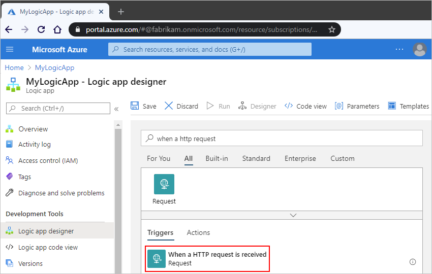

1. In the trigger, leave the **Request body JSON Schema** box empty.

   The reason is that the trigger will receive an X12 message in flat file format.

   

1. When you're done, on the designer toolbar, select **Save**.

   This step generates the **HTTP POST URL** that you later use to send a request that triggers logic app workflow.

   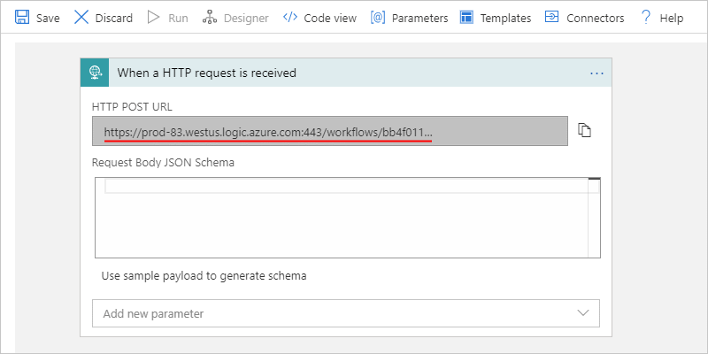

1. Copy and save the URL to use later.

### [Standard](#tab/standard)

1. In the [Azure portal](https://portal.azure.com), open your logic app resource and blank workflow in the workflow designer.

1. On the designer, select **Choose an operation**. Under the search box, select **Built-in**, if not selected. In the search box, enter `when a http request`. Select the Request trigger named **When an HTTP request is received**.

   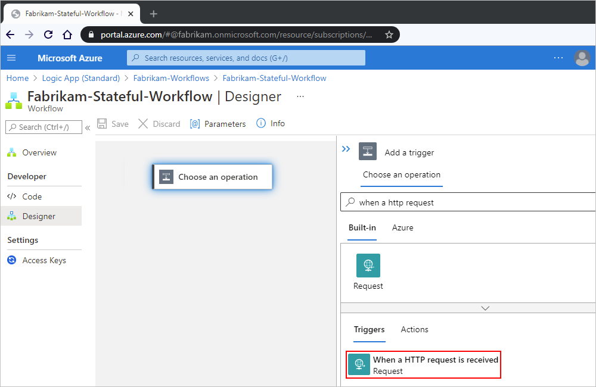

1. In the trigger, leave the **Request body JSON Schema** box empty.

   The reason is that the trigger will receive an X12 message in flat file format.

   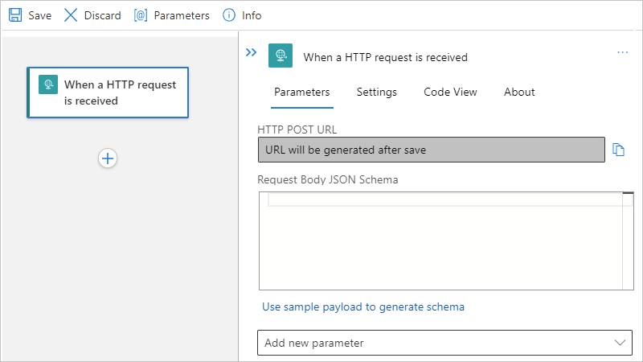

1. When you're done, on the designer toolbar, select **Save**.

   This step generates the **HTTP POST URL** that you later use to send a request that triggers logic app workflow.

   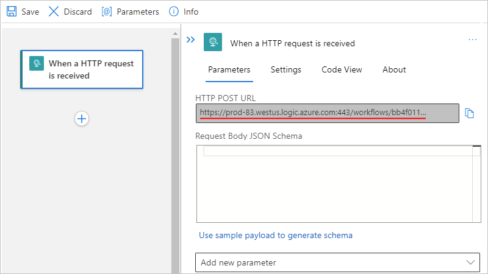

1. Copy and save the URL to use later.

---

## Add the decode AS2 action

Now add the B2B actions for this example, which uses the AS2 and X12 actions.

### [Consumption](#tab/consumption)

1. Under the trigger, select **New step**.

   > [!TIP]
   > To hide the Request trigger details, select the trigger's title bar.

   

1. Under the **Choose an operation** search box, select **All**, if not selected. In the search box, enter `as2`, and select **AS2 Decode**.

   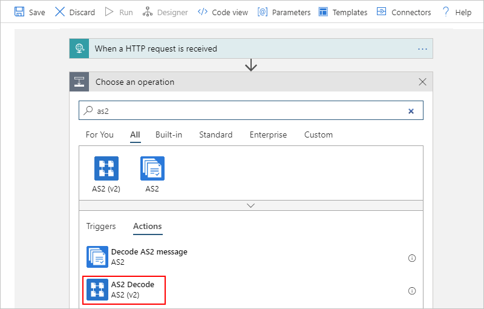

1. In the action's **Message to decode** property, enter the input that you want the AS2 action to decode, which is the `body` output from the Request trigger. You have multiple ways to specify this content as the action's input, either by selecting from the dynamic content list or as an expression:

   * To select from a list that shows the available trigger outputs, click inside the **Message to decode** box. After the dynamic content list appears, under **When a HTTP request is received**, select **Body** property value, for example:

     

     > [!TIP]
     > If no trigger outputs appear, in the dynamic property list, under **When a HTTP request is received**, 
     > select **See more**.

   * To enter an expression that references the trigger's `body` output, click inside the **Message to decode** box. After the dynamic content list appears, select **Expression**. In the expression editor, enter the following expression, and select **OK**:

     `triggerOutputs()['body']`

     Or, in the **Message to decode** box, directly enter the following expression:

     `@triggerBody()`

     The expression resolves to the **Body** token.

     

1. In the action's **Message headers** property, enter any headers required for the AS2 action, which are in the `headers` output from the Request trigger.

   1. To enter an expression that references the trigger's `headers` output, select **Switch Message headers to text mode**.

      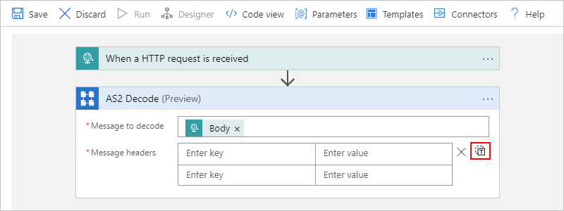

   1. Click inside the **Message headers** box. After the dynamic content list appears, select **Expression**. In the expression editor, enter the following expression, and select **OK**:

      `triggerOutputs()['Headers']`

      In the **AS2 Decode** action, the expression now appears as a token:

      ![Screenshot showing multi-tenant designer and the "Message headers" box with the "@triggerOutputs()['Headers']" token.](./media/logic-apps-enterprise-integration-b2b/as2-header-expression-consumption.png)

   1. To get the expression token to resolve into the **Headers** token, switch between the designer and code view. After this step, the **AS2 Decode** action looks like this example:

      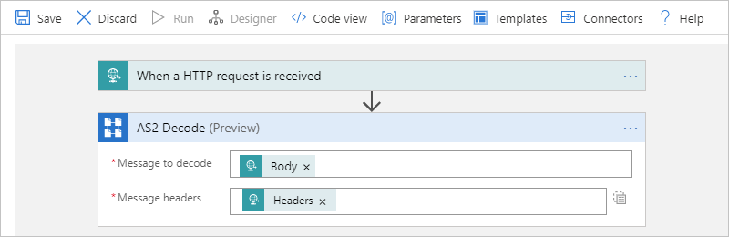

### [Standard](#tab/standard)

1. Under the trigger, select **Insert a new step** (plus sign), and then select **Add an action**.

   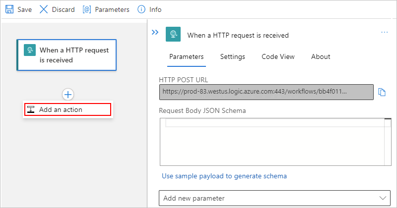

1. Under the **Choose an operation** search box, select **Azure**, if not already selected. In the search box, enter `as2`, and select **Decode AS2 message**.

   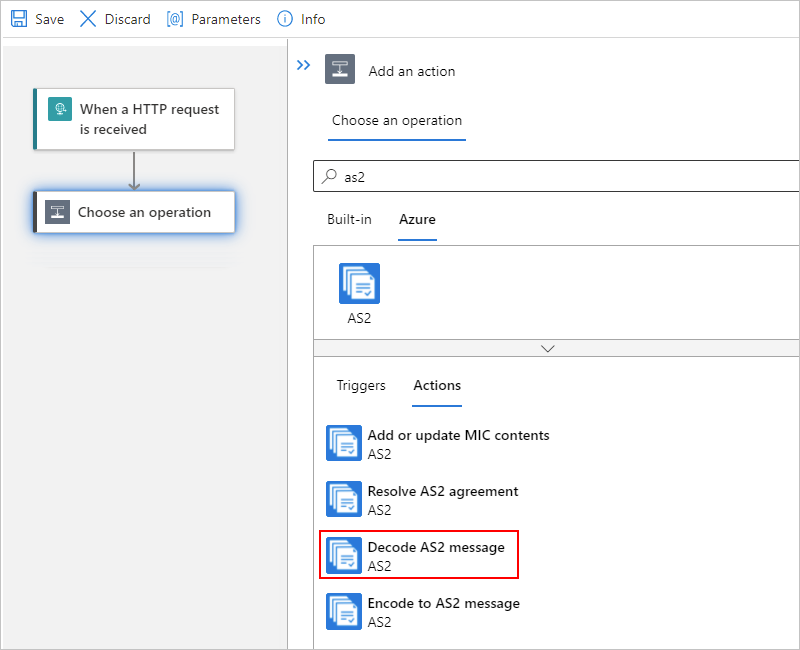

1. When prompted to create a connection to your integration account, provide a name to use for your connection, select your integration account, and then select **Create**.

1. In the action's **body** property, enter the input that you want the AS2 action to decode, which is the `body` output from the Request trigger. You have multiple ways to specify this content as action's input, either by selecting from the dynamic content list or as an expression:

   * To select from a list that shows the available trigger outputs, click inside the **body** property box. After the dynamic content list appears, under **When a HTTP request is received**, select **Body** property value, for example:

     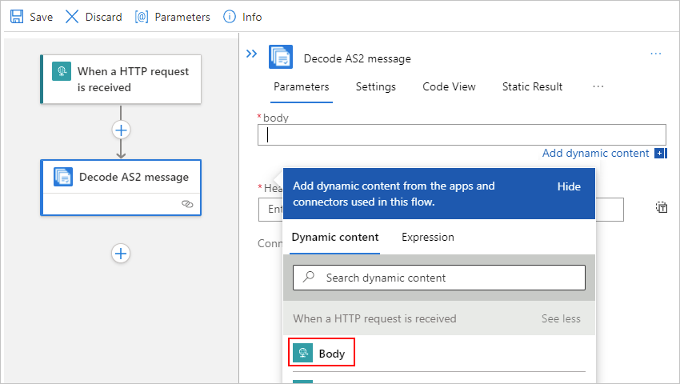

     > [!TIP]
     > If no trigger outputs appear, in the dynamic property list, under **When a HTTP request is received**, 
     > select **See more**.

   * To enter an expression that references the trigger's `body` output, click inside the **body** property box. After the dynamic content list appears, select **Expression**. In the expression editor, enter the following expression, and select **OK**:

     `triggerOutputs()['body']`

     Or, in the **body** property box, directly enter the following expression:

     `@triggerBody()`

     The expression resolves to the **Body** token.

     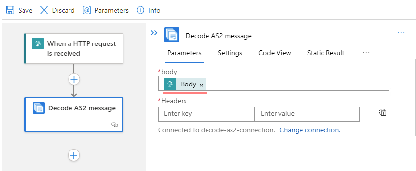

1. In the **Headers** property box, enter any headers required for the AS2 action, which are in the `headers` output from the Request trigger.

   1. To enter an expression that references the trigger's `headers` output, select **Switch Message headers to text mode**.

      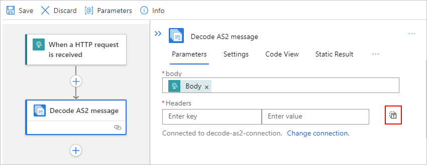

   1. Click inside the **Headers** property box. After the dynamic content list appears, select **Expression**. In the expression editor, enter the following expression, and select **OK**:

      `triggerOutputs()['Headers']`

      In the **Decode AS2 message** action, the expression now appears as a token:

      ![Screenshot showing single-tenant designer and the "Headers" property with the "@triggerOutputs()['Headers']" token.](./media/logic-apps-enterprise-integration-b2b/as2-header-expression-standard.png)

   1. To get the expression token to resolve into the **Headers** token, switch between the designer and code view. After this step, the **AS2 Decode** action looks like this example:

      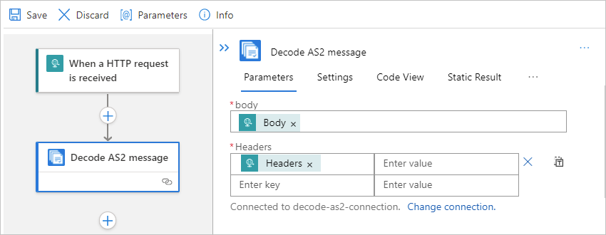

---

## Add the Response action as a message receipt

To notify the trading partner that the message was received, you can return a response that contains an AS2 Message Disposition Notification (MDN) by using the Condition and Response actions. By adding these actions immediately after the AS2 action, the logic app workflow can continue processing if the AS2 action succeeds. Otherwise, if the AS2 action fails, the logic app workflow stops processing.

### [Consumption](#tab/consumption)

1. Under the **AS2 Decode** action, select **New step**.

1. Under the **Choose an operation** search box, select **Built-in**, if not already selected. In the search box, enter `condition`. Select the **Condition** action.

   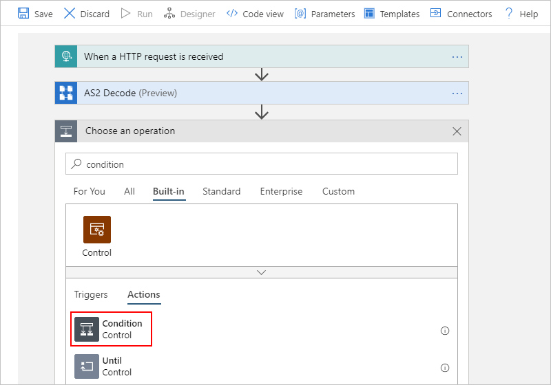

   Now the condition shape appears, including the paths that determine whether the condition is met.

   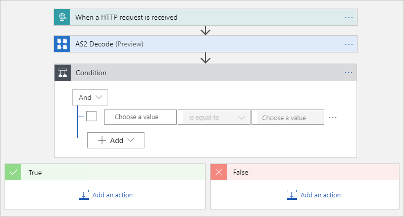

1. Now specify the condition to evaluate. In the **Choose a value** box, enter the following expression:

   `@body('AS2_Decode')?['AS2Message']?['MdnExpected']`

   In the middle box, make sure the comparison operation is set to `is equal to`. In the right-side box, enter the value `Expected`.

1. Save your logic app workflow. To get the expression to resolve as this token, switch between the designer and code view.

   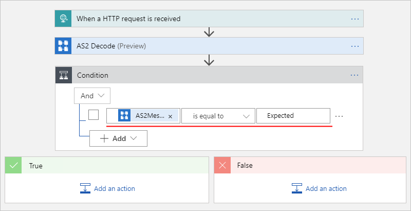

1. Now specify the responses to return based on whether the **AS2 Decode** action succeeds or not.

   1. For the case when the **AS2 Decode** action succeeds, in the **True** shape, select **Add an action**. Under the **Choose an operation** search box, enter `response`, and select **Response**.

      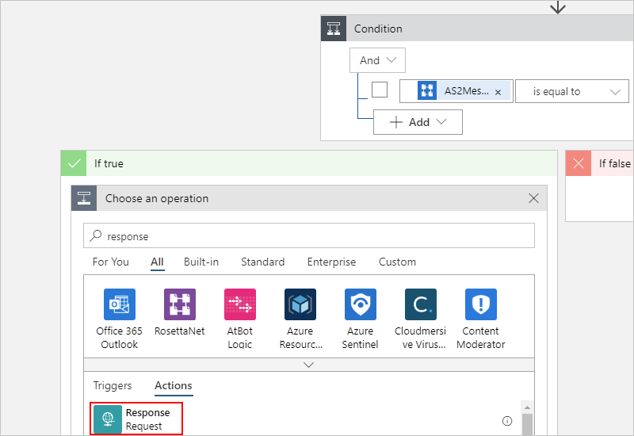

   1. To access the AS2 MDN from the **AS2 Decode** action's output, specify the following expressions:

      * In the **Response** action's **Headers** property, enter the following expression:

        `@body('AS2_Decode')?['OutgoingMdn']?['OutboundHeaders']`

      * In the **Response** action's **Body** property, enter the following expression:

        `@body('AS2_Decode')?['OutgoingMdn']?['Content']`

   1. To get the expressions to resolve as tokens, switch between the designer and code view:

      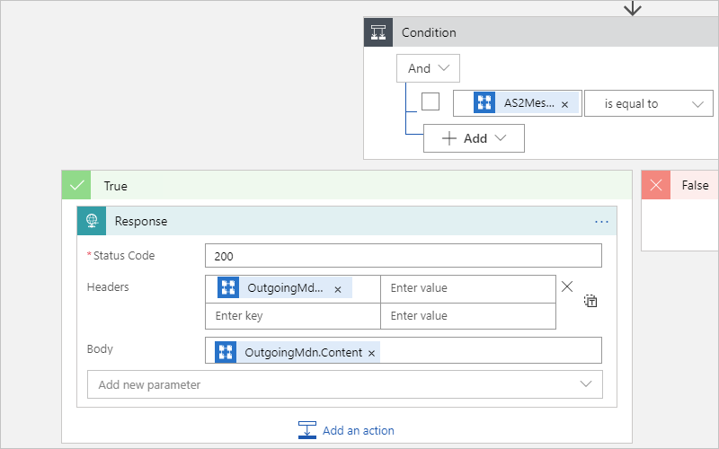

   1. For the case when the **AS2 Decode** action fails, in the **False** shape, select **Add an action**. Under the **Choose an operation** search box, enter `response`, and select **Response**. Set up the **Response** action to return the status and error that you want.

1. Save your logic app workflow.

### [Standard](#tab/standard)

1. Under the **Decode AS2 message** action, select **Insert a new step** (plus sign), and then select **Add an action**.

1. Under the **Choose an operation** search box, select **Built-in**, if not already selected. In the search box, enter `condition`. Select the **Condition** action.

   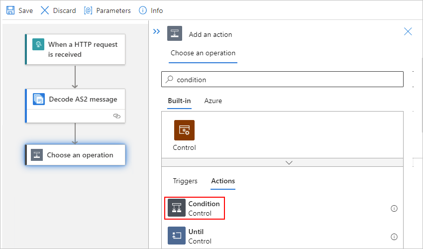

   Now the condition shape appears, including the paths that determine whether the condition is met.

   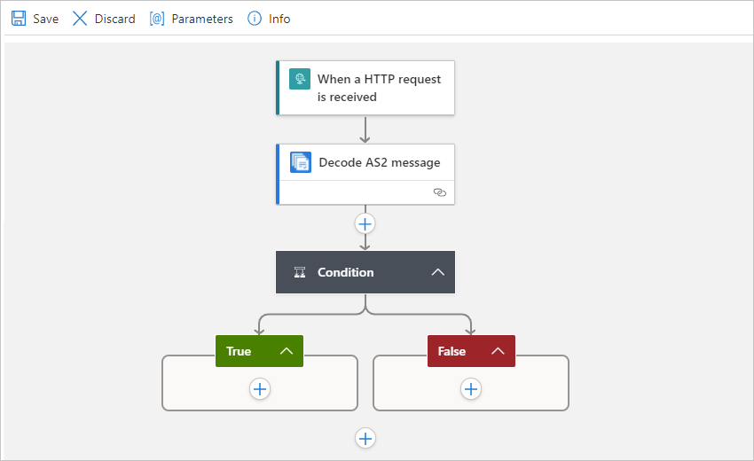

1. Now specify the condition to evaluate. Select the **Condition** shape so that the details panel appears. In the **Choose a value** box, enter the following expression:

   `@body('Decode_AS2_message')?['AS2Message']?['MdnExpected']`

   In the middle box, make sure the comparison operation is set to `is equal to`. In the right-side box, enter the value `Expected`.

1. Save your logic app workflow. To get the expression to resolve as this token, switch between the designer and code view.

   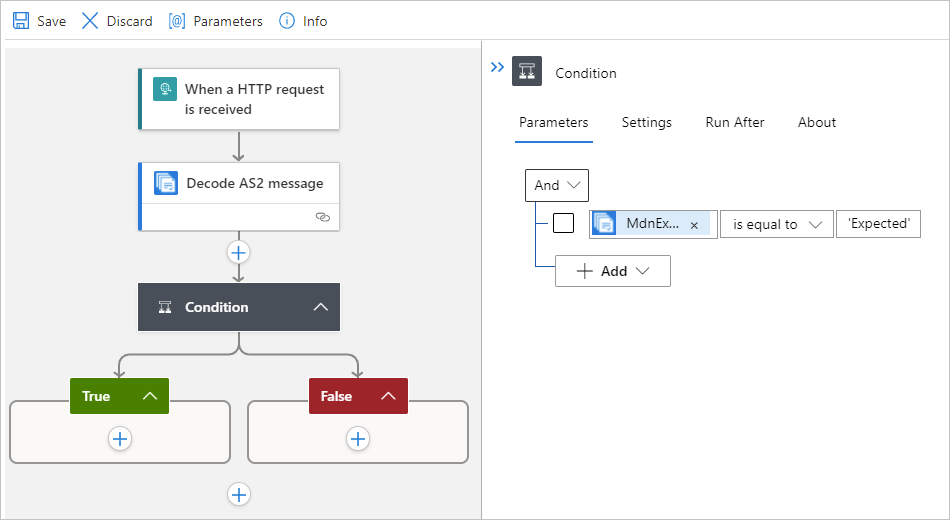

1. Now specify the responses to return based on whether the **Decode AS2 message** action succeeds or not.

   1. For the case when the **Decode AS2 message** action succeeds, in the **True** shape, select the plus sign, and then select **Add an action**. On the **Add an action** pane, in the **Choose an operation** search box, enter `response`, and select **Response**.

      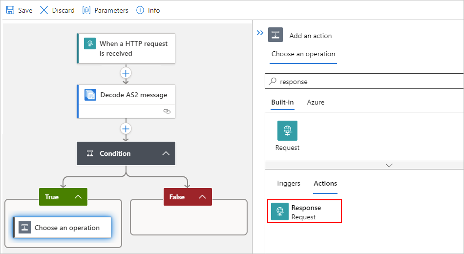

   1. To access the AS2 MDN from the **AS2 Decode** action's output, specify the following expressions:

      * In the **Response** action's **Headers** property, enter the following expression:

        `@body('Decode_AS2_message')?['OutgoingMdn']?['OutboundHeaders']`

      * In the **Response** action's **Body** property, enter the following expression:

        `@body('Decode_AS2_message')?['OutgoingMdn']?['Content']`

   1. To get the expressions to resolve as tokens, switch between the designer and code view:

      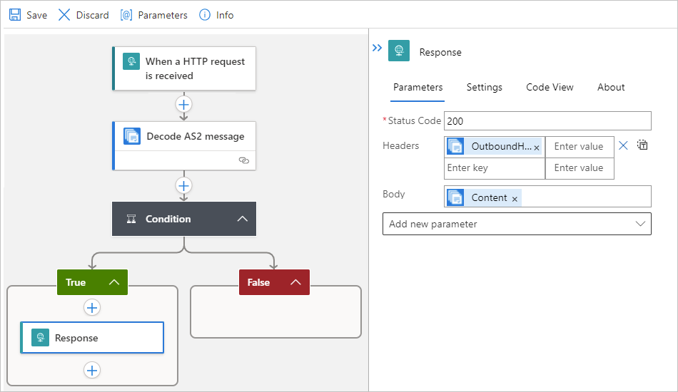

   1. For the case when the **Decode AS2 message** action fails, in the **False** shape, select the plus sign, and then select **Add an action**. On the **Add an action** pane, in the **Choose an operation** search box, enter `response`, and select **Response**. Set up the **Response** action to return the status and error that you want.

1. Save your logic app workflow.

---

## Add the decode X12 message action

Now add the **Decode X12 message** action.

### [Consumption](#tab/consumption)

1. Under the **Response** action, select **Add an action**.

1. Under **Choose an operation**, in the search box, enter `x12 decode`, and select **Decode X12 message**.

   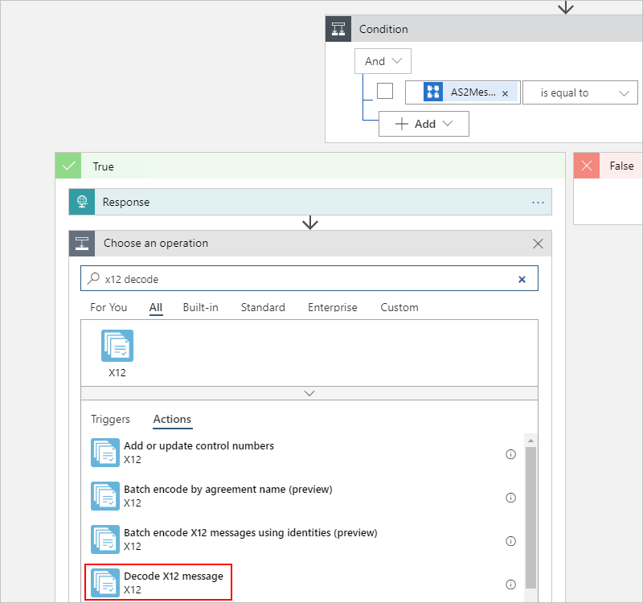

1. If the X12 action prompts you for connection information, provide the name for the connection, select the integration account you want to use, and then select **Create**.

   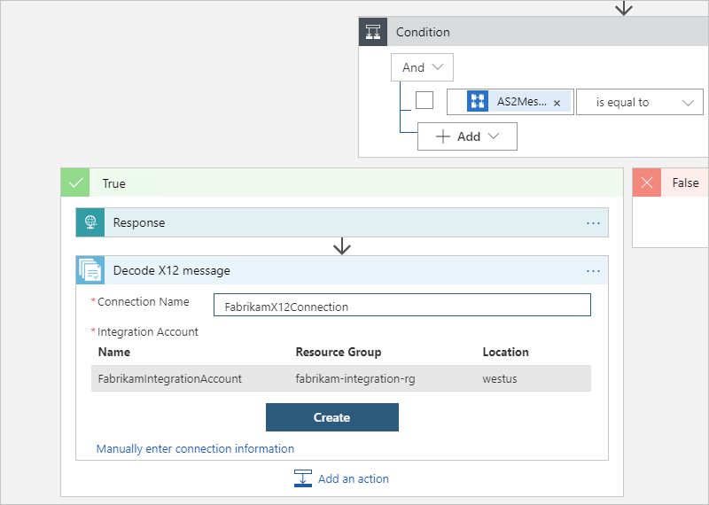

1. Now specify the input for the X12 action. This example uses the output from the AS2 action, which is the message content but note that this content is in JSON object format and is base64 encoded. So, you have to convert this content to a string.

   In the **X12 Flat file message to decode** box, enter the following expression to convert the AS2 output:

   `@base64ToString(body('AS2_Decode')?['AS2Message']?['Content'])`

1. Save your logic app workflow. To get the expression to resolve as this token, switch between the designer and code view.

    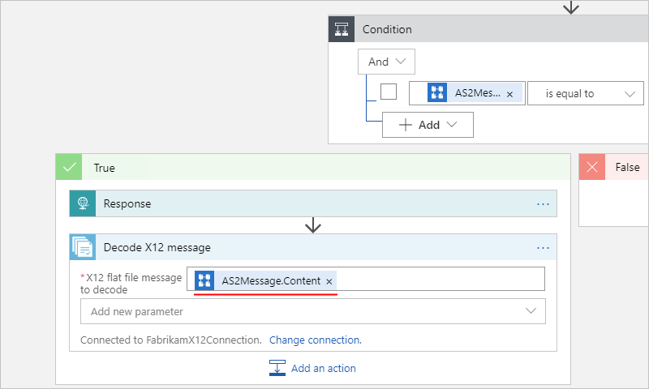

1. Save your logic app workflow.

   If you need additional steps for this logic app workflow, for example, to decode the message content and output that content in JSON object format, continue adding the necessary actions to your logic app workflow.

### [Standard](#tab/standard)

1. Under the **Response** action, select the plus sign, and then select **Add an action**. On the **Add an action** pane, under the **Choose an operation** search box, select **Azure**, if not already selected. In the search box, enter `x12 decode`, and select **Decode X12 message**.

   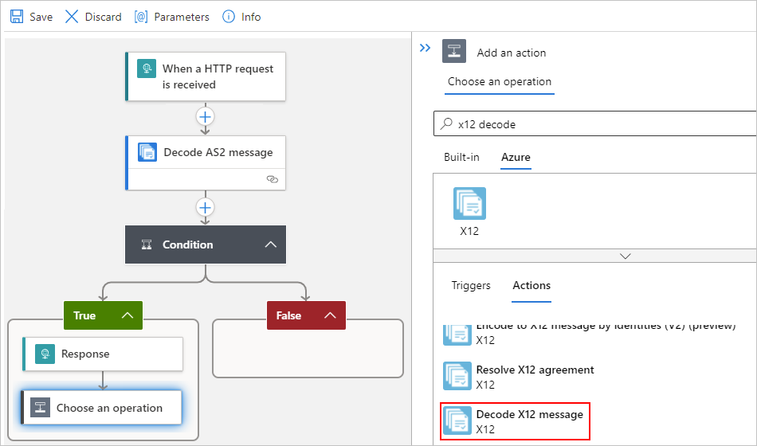

1. If the X12 action prompts you for connection information, provide the name for the connection, select the integration account you want to use, and then select **Create**.

   

1. Now specify the input for the X12 action. This example uses the output from the AS2 action, which is the message content but note that this content is in JSON object format and is base64-encoded. So, you have to convert this content to a string.

   In the **X12 Flat file message to decode** box, enter the following expression to convert the AS2 output:

   `@base64ToString(body('Decode_AS2_message')?['AS2Message']?['Content'])`

1. Save your logic app workflow. To get the expression to resolve as this token, switch between the designer and code view.

    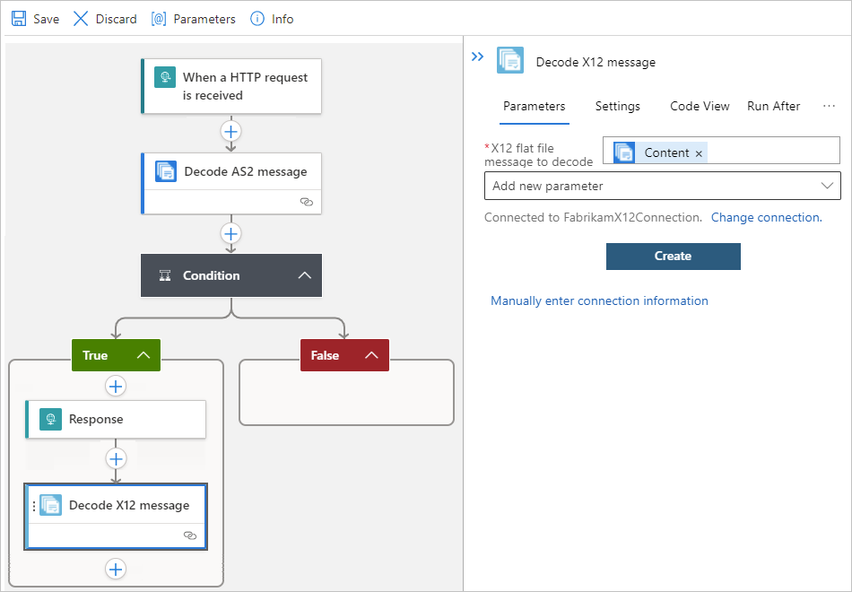

1. Save your logic app workflow again.

   If you need additional steps for this logic app workflow, for example, to decode the message content and output that content in JSON object format, continue adding the necessary actions to your logic app workflow.

---

You're now done setting up your B2B logic app workflow. In a real world app, you might want to store the decoded X12 data in a line-of-business (LOB) app or data store. For example, review the following documentation:

* [Connect to SAP systems from Azure Logic Apps](logic-apps-using-sap-connector.md)

* [Monitor, create, and manage SFTP files by using SSH and Azure Logic Apps](../connectors/connectors-sftp-ssh.md)

To connect your own LOB apps and use these APIs in your logic app, you can add more actions or [write custom APIs](logic-apps-create-api-app.md).

## Next steps

* [Receive and respond to incoming HTTPS calls](../connectors/connectors-native-reqres.md)
* [Exchange AS2 messages for B2B enterprise integration](../logic-apps/logic-apps-enterprise-integration-as2.md)
* [Exchange X12 messages for B2B enterprise integration](../logic-apps/logic-apps-enterprise-integration-x12.md)
* Learn more about the [Enterprise Integration Pack](../logic-apps/logic-apps-enterprise-integration-overview.md)
