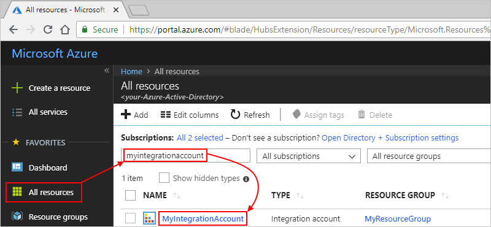
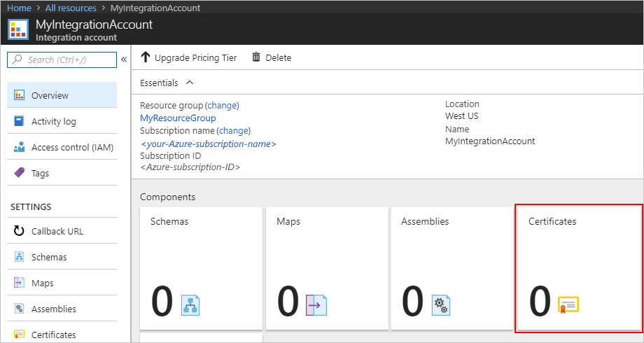

# Secure B2B messages with certificates

When you need to keep B2B communication confidential, 
you can secure B2B communication for your enterprise integration apps, 
specifically logic apps, by adding certificates to your integration account. 
Certificates are digital documents that check the identities for 
the participants in electronic communications and help you 
secure communication in these ways:

* Encrypt message content.
* Digitally sign messages. 

You can use these certificates in your enterprise integration apps:

* [Public certificates](https://en.wikipedia.org/wiki/Public_key_certificate), 
which you must purchase from a public internet 
[certificate authority (CA)](https://en.wikipedia.org/wiki/Certificate_authority) 
but don't require any keys. 

* Private certificates or [*self-signed certificates*](https://en.wikipedia.org/wiki/Self-signed_certificate), 
which you create and issue yourself but also require private keys. 

## Upload a public certificate

To use a *public certificate* in logic apps that have B2B capabilities, 
you must first upload the certificate to your integration account. 
After you define the properties in the 
[agreements](logic-apps-enterprise-integration-agreements.md) that you create, 
the certificate is available to help you secure your B2B messages.

1. Sign in to the [Azure portal](https://portal.azure.com). 
On the main Azure menu, select **All resources**. 
In the search box, enter your integration account name, 
and then select the integration account you want.

     

2. Under **Components**, choose the **Certificates** tile.

   

3. Under **Certificates**, choose **Add**. Under **Add Certificate**, 
provide these details for your certificate. When you're done, choose **OK**.

   | Property | Value | Description | 
   |----------|-------|-------------|
   | **Name** | <*certificate-name*> | Your certificate's name, which is "publicCert" in this example | 
   | **Certificate Type** | Public | Your certificate's type |
   | **Certificate** | <*certificate-file-name*> | To find and select the certificate file you want to upload, choose the folder icon next to the **Certificate** box. |
   ||||

   

   After Azure validates your selection, 
   Azure uploads your certificate.

    

## Upload a private certificate

To use a *private certificate* in logic apps that have B2B capabilities, 
you must first upload the certificate to your integration account. 
You also need to have a private key that you first add to 
[Azure Key Vault](../key-vault/key-vault-get-started.md). 

After you define the properties in the 
[agreements](logic-apps-enterprise-integration-agreements.md) that you create, 
the certificate is available to help you secure your B2B messages.

> [!NOTE]
> For private certificates, make sure that you add a corresponding 
> public certificate that appears in the 
> [AS2 agreement's](logic-apps-enterprise-integration-as2.md) **Send and Receive** settings 
> for signing and encrypting messages.

1. [Add your private key to Azure Key Vault](../key-vault/key-vault-get-started.md#add) 
and provide a **Key Name**.
   
2. Authorize Azure Logic Apps to perform operations on Azure Key Vault. 
To grant access to the Logic Apps service principal, use the PowerShell command, 
[Set-AzureRmKeyVaultAccessPolicy](https://docs.microsoft.com/powershell/module/azurerm.keyvault/set-azurermkeyvaultaccesspolicy), 
for example:

   `Set-AzureRmKeyVaultAccessPolicy -VaultName 'TestcertKeyVault' -ServicePrincipalName 
   '7cd684f4-8a78-49b0-91ec-6a35d38739ba' -PermissionsToKeys decrypt, sign, get, list`
 
3. Sign in to the [Azure portal](https://portal.azure.com). 
On the main Azure menu, select **All resources**. 
In the search box, enter your integration account name, 
and then select the integration account you want.

    

4. Under **Components**, choose the **Certificates** tile.  

   

5. Under **Certificates**, choose **Add**. Under **Add Certificate**, 
provide these details for your certificate. When you're done, choose **OK**.

   | Property | Value | Description | 
   |----------|-------|-------------|
   | **Name** | <*certificate-name*> | Your certificate's name, which is "privateCert" in this example | 
   | **Certificate Type** | Private | Your certificate's type |
   | **Certificate** | <*certificate-file-name*> | To find and select the certificate file you want to upload, choose the folder icon next to the **Certificate** box. | 
   | **Resource Group** | <*integration-account-resource-group*> | Your integration account's resource group, which is "MyResourceGroup" in this example | 
   | **Key Vault** | <*key-vault-name*> | Your Azure key vault's name |
   | **Key name** | <*key-name*> | Your key's name |
   ||||

   

   After Azure validates your selection, Azure uploads your certificate.

    

## Next steps

* [Create a B2B agreement](logic-apps-enterprise-integration-agreements.md)
