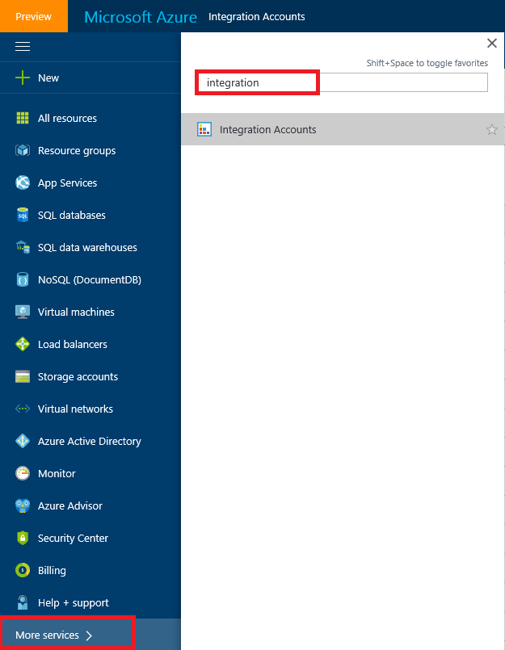
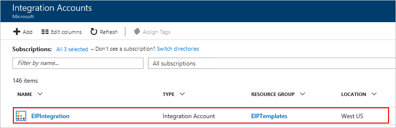
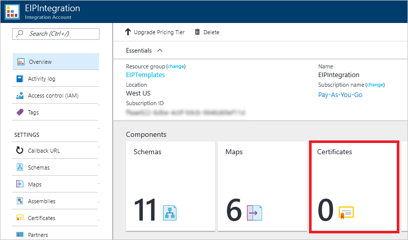
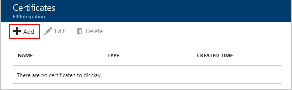
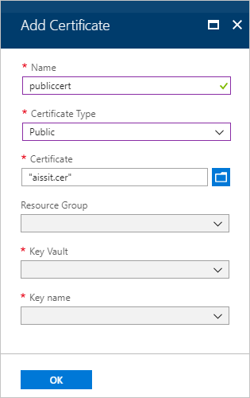
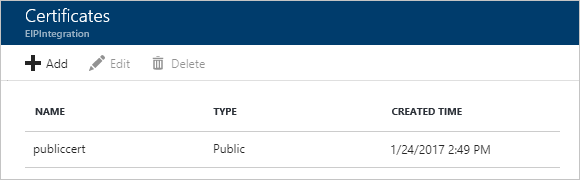
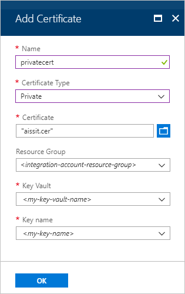
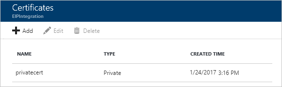

# Secure B2B messages with certificates

Sometimes you need to keep B2B communication confidential. To help you secure B2B communication for your enterprise integration apps, specifically logic apps, 
you can add certificates to your integration account. Certificates are digital 
documents that verify the identity of the participants in electronic communications.
Certificates help you secure communication in these ways:

* Encrypt message content
* Digitally sign messages  

You can use these certificates in your enterprise integration apps:

* Public certificates, which must be purchased from a certification authority (CA).
* Private certificates, which you can issue yourself. These certificates are sometimes referred to as self-signed certificates.

## Upload a public certificate

To use a *public certificate* in logic apps that have B2B capabilities, 
you must first upload the certificate to your integration account. 
After you define the properties in the [agreements](logic-apps-enterprise-integration-agreements.md) that you create, 
the certificate is available to help you secure your B2B messages.

1. Sign in to the [Azure portal](https://portal.azure.com).

2. On the main Azure menu, select **All services**. 
In the search box, enter "integration", 
and then select **Integration accounts**.

     

3. Under **Integration Accounts**, select the integration 
account where you want to add the certificate.

     

4. Choose the **Certificates** tile.  

   

5. Under **Certificates**, choose **Add**.

   

6. Under **Add Certificate**, provide the details for your certificate.
   
   1. Enter your certificate **Name**. For the certificate type, 
   select **Public**.

   2. On the right side of the **Certificate** box, choose the folder icon. 
   Find and select the certificate file that you want to upload. 
   When you're done, choose **OK**.

      

   Azure uploads your certificate after validating your selection.

    

## Upload a private certificate

To use a *private certificate* in logic apps that have B2B capabilities, 
you must first upload the certificate to your integration account. 
You also need to have a private key that you first add to [Azure Key Vault](../key-vault/key-vault-get-started.md). 

After you define the properties in the [agreements](logic-apps-enterprise-integration-agreements.md) that you create, 
the certificate is available to help you secure your B2B messages.

> [!NOTE]
> For private certificates, make sure that you add a corresponding 
> public certificate to appear in the [AS2 agreement](logic-apps-enterprise-integration-as2.md) Send and Receive settings 
> for signing and encrypting messages.

1. [Add your private key to Azure Key Vault](../key-vault/key-vault-get-started.md#add) 
and provide a **Key Name**.
   
2. Authorize Azure Logic Apps to perform operations on Azure Key Vault. 
To grant access to the Logic Apps service principal, use the PowerShell command, [Set-AzureRmKeyVaultAccessPolicy](https://docs.microsoft.com/powershell/module/azurerm.keyvault/set-azurermkeyvaultaccesspolicy), for example:

   `Set-AzureRmKeyVaultAccessPolicy -VaultName 'TestcertKeyVault' -ServicePrincipalName 
   '7cd684f4-8a78-49b0-91ec-6a35d38739ba' -PermissionsToKeys decrypt, sign, get, list`
 
3. Sign in to the [Azure portal](https://portal.azure.com).

4. On the main Azure menu, select **All services**. 
In the search box, enter "integration", 
and then select **Integration accounts**.

    

5. Under **Integration Accounts**, select the integration 
account where you want to add the certificate.

6. Choose the **Certificates** tile.  

   

7. Under **Certificates**, choose **Add**.   

   

8. Under **Add Certificate**, provide the details for your certificate.
   
   1. Enter your certificate **Name**. For the certificate type, 
   select **Private**.

   2. On the right side of the **Certificate** box, choose the folder icon. 
   Find and select the certificate file that you want to upload. 
   Also, select the **Resource Group**, **Key Vault**, and **Key Name**. 
   When you're done, choose **OK**.

      

   Azure uploads your certificate after validating your selection.

   

## Next steps

* [Create a B2B agreement](logic-apps-enterprise-integration-agreements.md)
