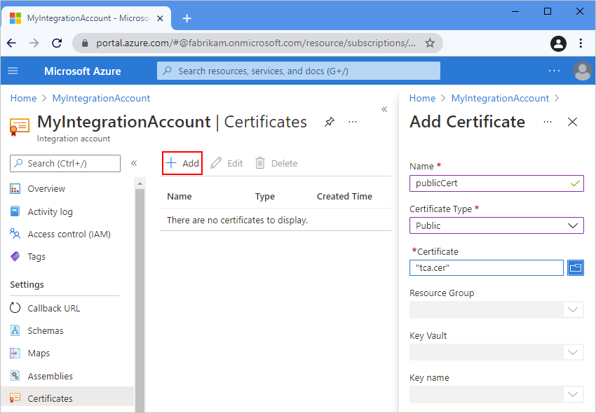
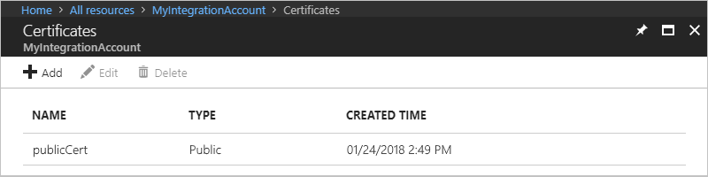
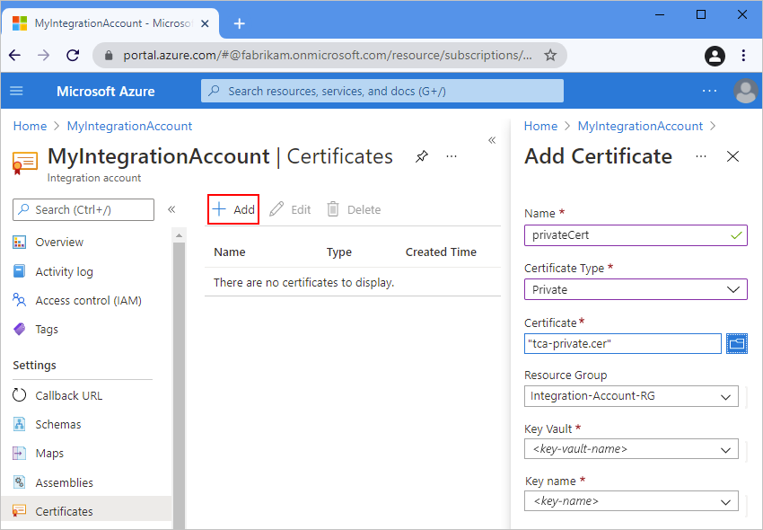

# Add certificates to integration accounts for securing messages in workflows with Azure Logic Apps

[!INCLUDE [logic-apps-sku-consumption-standard](../../includes/logic-apps-sku-consumption-standard.md)]

When you need to exchange confidential messages in a logic app business-to-business (B2B) workflow, you can increase the security around this communication by using certificates. A certificate is a digital document that helps secure communication in the following ways:

* Checks the participants' identities in electronic communications.

* Encrypts message content.

* Digitally signs messages.

You can use the following certificate types in your workflows:

* [Public certificates](https://en.wikipedia.org/wiki/Public_key_certificate), which you must purchase from a public internet [certificate authority (CA)](https://en.wikipedia.org/wiki/Certificate_authority). These certificates don't require any keys.

* Private certificates or [*self-signed certificates*](https://en.wikipedia.org/wiki/Self-signed_certificate), which you create and issue yourself. However, these certificates require [private keys in an Azure key vault](#prerequisites).

If you're new to logic apps, review [What is Azure Logic Apps](logic-apps-overview.md)? For more information about B2B enterprise integration, review [B2B enterprise integration workflows with Azure Logic Apps and Enterprise Integration Pack](logic-apps-enterprise-integration-overview.md).

## Prerequisites

* An Azure account and subscription. If you don't have a subscription yet, [sign up for a free Azure account](https://azure.microsoft.com/free/?WT.mc_id=A261C142F).

* An [integration account resource](logic-apps-enterprise-integration-create-integration-account.md) where you define and store artifacts, such as trading partners, agreements, certificates, and so on, for use in your enterprise integration and B2B workflows. This resource has to meet the following requirements:

  * Is associated with the same Azure subscription as your logic app resource.

  * Exists in the same location or Azure region as your logic app resource.

  * If you use the [**Logic App (Consumption)** resource type](logic-apps-overview.md#resource-environment-differences), you have to [link your integration account to your logic app resource](logic-apps-enterprise-integration-create-integration-account.md#link-account) before you can use your artifacts in your workflow.

    To create and add certificates for use in **Logic App (Consumption)** workflows, you don't need a logic app resource yet. However, when you're ready to use those certificates in your workflows, your logic app resource requires a linked integration account that stores those certificates.

  * If you're using the [**Logic App (Standard)** resource type](logic-apps-overview.md#resource-environment-differences), your integration account doesn't need a link to your logic app resource but is still required to store other artifacts, such as partners, agreements, and certificates, along with using the [AS2](logic-apps-enterprise-integration-as2.md), [X12](logic-apps-enterprise-integration-x12.md), and [EDIFACT](logic-apps-enterprise-integration-edifact.md) operations. Your integration account still has to meet other requirements, such as using the same Azure subscription and existing in the same location as your logic app resource.

    > [!NOTE]
    > Currently, only the **Logic App (Consumption)** resource type supports [RosettaNet](logic-apps-enterprise-integration-rosettanet.md) operations. 
    > The **Logic App (Standard)** resource type doesn't include [RosettaNet](logic-apps-enterprise-integration-rosettanet.md) operations.

* For private certificates, you must meet the following prerequisites:

  * Add a private key in [Azure Key Vault](../key-vault/general/overview.md) and have the **Key Name**. For more information, review [Add your private key to Azure Key Vault](../key-vault/certificates/certificate-scenarios.md#import-a-certificate).

  * Authorize the Azure Logic Apps service to perform operations on your key vault. To grant access to the Azure Logic Apps service principal, use the PowerShell command, [Set-AzKeyVaultAccessPolicy](/powershell/module/az.keyvault/set-azkeyvaultaccesspolicy), for example:

    `Set-AzKeyVaultAccessPolicy -VaultName 'TestcertKeyVault' -ServicePrincipalName '7cd684f4-8a78-49b0-91ec-6a35d38739ba' -PermissionsToKeys decrypt, sign, get, list`

    [!INCLUDE [updated-for-az](../../includes/updated-for-az.md)]

  * [Add the corresponding public certificate](#add-public-certificate) to your key vault. This certificate appears in your [agreement's **Send** and **Receive** settings for signing and encrypting messages](logic-apps-enterprise-integration-agreements.md). For example, review [Reference for AS2 messages settings in Azure Logic Apps](logic-apps-enterprise-integration-as2-message-settings.md).

* At least two [trading partners](logic-apps-enterprise-integration-partners.md) and an [agreement between those partners](logic-apps-enterprise-integration-agreements.md) in your integration account. An agreement requires a host partner and a guest partner. Also, an agreement requires that both partners use the same or compatible *business identity* qualifier that's appropriate for an AS2, X12, EDIFACT, or RosettaNet agreement.

* Optionally, the logic app resource and workflow where you want to use the certificate. The workflow requires any trigger that starts your logic app's workflow. If you haven't created a logic app workflow before, review [Quickstart: Create an example Consumption logic app workflow](quickstart-create-example-consumption-workflow.md).

## Use a public certificate

To use a *public certificate* in your workflow, you have to first add the certificate to your integration account.

1. In the [Azure portal](https://portal.azure.com) search box, enter `integration accounts`, and select **Integration accounts**.

1. Under **Integration accounts**, select the integration account where you want to add your certificate.

1. On the integration account menu, under **Settings**, select **Certificates**.

1. On the **Certificates** pane, select **Add**.

1. On the **Add Certificate** pane, provide the following information about the certificate:

   | Property | Required | Value | Description |
   |----------|----------|-------|-------------|
   | **Name** | Yes | <*certificate-name*> | Your certificate's name, which is `publicCert` in this example |
   | **Certificate Type** | Yes | **Public** | Your certificate's type |
   | **Certificate** | Yes | <*certificate-file-name*> | To browse for the certificate file that you want to add, select the folder icon next to the **Certificate** box. Select the certificate that you want to use. |
   |||||

   

1. When you're done, select **OK**.

   After Azure validates your selection, Azure uploads your certificate.

   

## Use a private certificate

To use a *private certificate* in your workflow, you have to first meet the [prerequisites for private keys](#prerequisites), and add a public certificate to your integration account.

1. In the [Azure portal](https://portal.azure.com) search box, enter `integration accounts`, and select **Integration accounts**.

1. Under **Integration accounts**, select the integration account where you want to add your certificate.

1. On the integration account menu, under **Settings**, select **Certificates**.

1. On the **Certificates** pane, select **Add**.

1. On the **Add Certificate** pane, provide the following information about the certificate:

   | Property | Required | Value | Description |
   |----------|----------|-------|-------------|
   | **Name** | Yes | <*certificate-name*> | Your certificate's name, which is `privateCert` in this example |
   | **Certificate Type** | Yes | **Private** | Your certificate's type |
   | **Certificate** | Yes | <*certificate-file-name*> | To browse for the certificate file that you want to add, select the folder icon next to the **Certificate** box. Select the public certificate that corresponds to the private key that's stored in your key vault. |
   | **Resource Group** | Yes | <*integration-account-resource-group*> | Your integration account's resource group, which is `Integration-Account-RG` in this example |
   | **Key Vault** | Yes | <*key-vault-name*> | Your key vault name |
   | **Key name** | Yes | <*key-name*> | Your key name |
   |||||

   

1. When you're done, select **OK**.

   After Azure validates your selection, Azure uploads your certificate.

   

## Next steps

* [Exchange AS2 messages](logic-apps-enterprise-integration-as2.md)
* [Exchange EDIFACT messages](logic-apps-enterprise-integration-edifact.md)
* [Exchange X12 messages](logic-apps-enterprise-integration-x12.md)
* [Exchange RosettaNet messages](logic-apps-enterprise-integration-rosettanet.md)
