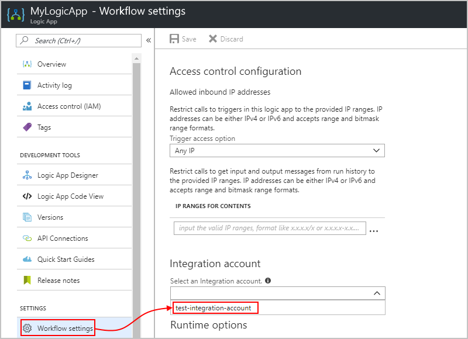
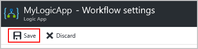
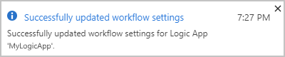
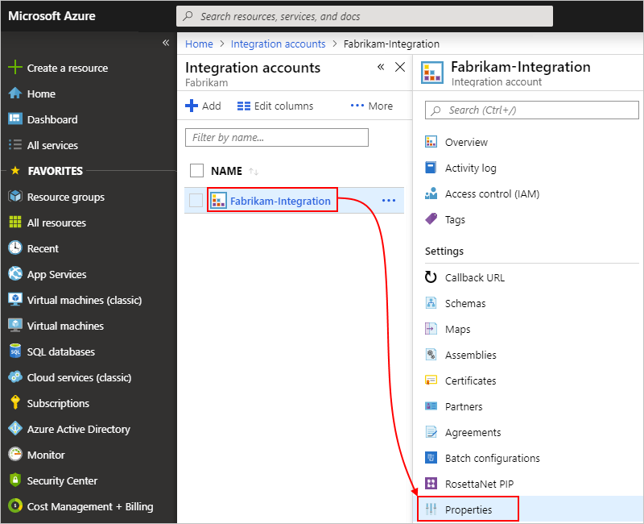

# Create and manage integration accounts for B2B solutions with logic apps

Before you can build [enterprise integration and B2B solutions](../logic-apps/logic-apps-enterprise-integration-overview.md) 
with [Azure Logic Apps](../logic-apps/logic-apps-overview.md), 
you must first have an integration account, which is where you create, 
store, and manage B2B artifacts, such as trading partners, agreements, maps, 
schemas, certificates, and so on. Before your logic app can work with the 
artifacts in your integration account and use the Logic Apps B2B connectors, 
such as XML validation, you must [link your integration account](#link-account) 
to your logic app. To link them, both your integration account and 
logic app must have the *same* Azure location, or region.

This article shows you how to perform these tasks:

* Create your integration account.
* Link your integration account to a logic app.
* Move your integration account to another Azure resource group or subscription.
* Delete your integration account.

If you don't have an Azure subscription, 
<a href="https://azure.microsoft.com/free/" target="_blank">sign up for a free Azure account</a>.

## Sign in to the Azure portal

Sign in to the <a href="https://portal.azure.com" target="_blank">Azure portal</a> 
with your Azure account credentials.

## Create integration account

1. From the main Azure menu, select **All services**. 
In the search box, enter "integration accounts" as your filter, 
and select **Integration accounts**.

   

2. Under **Integration accounts**, choose **Add**.

   

3. Provide information about your integration account: 

   

   | Property | Required | Example value | Description | 
   |----------|----------|---------------|-------------|
   | Name | Yes | test-integration-account | The name for your integration account. For this example, use the specified name. | 
   | Subscription | Yes | <*Azure-subscription-name*> | The name for the Azure subscription to use | 
   | Resource group | Yes | test-integration-account-rg | The name for the [Azure resource group](../azure-resource-manager/resource-group-overview.md) used to organize related resources. For this example, create a new resource group with the specified name. | 
   | Pricing Tier | Yes | Free | The pricing tier that you want to use. For this example, select **Free**, but for more information, see [Logic Apps limits and configuration](../logic-apps/logic-apps-limits-and-config.md) and [Logic Apps pricing](https://azure.microsoft.com/pricing/details/logic-apps/). | 
   | Location | Yes | West US | The region where to store your integration account information. Either select the same location as your logic app, or create a logic app in the same location as your integration account. | 
   | Log Analytics workspace | No | Off | Keep the **Off** setting for diagnostic logging. | 
   ||||| 

4. When you're ready, select **Pin to dashboard**, and choose **Create**.

   After Azure deploys your integration account to the 
   selected location, which usually finishes within one minute, 
   Azure opens your integration account.

   

Now, before your logic app can use your integration account, 
you must link the integration account to your logic app.

<a name="link-account"></a>

## Link to logic app

To give your logic apps access to an integration account that contains 
your B2B artifacts, such as trading partners, agreements, maps, 
and schemas, you must link your integration account to your logic app. 

> [!NOTE]
> Your integration account and logic app must exist in the same region.

1. In the Azure portal, find and open your logic app.

2. On your logic app's menu, under **Settings**, 
select **Workflow settings**. In the 
**Select an Integration account** list, 
select the integration account to link to your logic app.

   

3. To finish linking, choose **Save**.

   

   When your integration account is successfully linked, 
   Azure shows a confirmation message. 

   

Now your logic app can use any and all the artifacts in your 
integration account plus the B2B connectors, 
such as XML validation and flat file encoding or decoding.  

## Unlink from logic app

To link your logic app to another integration account, 
or no longer use an integration account with your logic app, 
you can delete the link through Azure Resource Explorer.

1. In your browser, go to 
<a href="https://resources.azure.com" target="_blank">Azure Resource Explorer (https://resources.azure.com)</a>. 
Make sure that you're signed in with the same Azure credentials.

   

2. In the search box, enter your logic app's name, 
then find and select your logic app.

   

3. On the explorer title bar, choose **Read/Write**.

   

4. On the **Data** tab, choose **Edit**.

   

5. In the editor, find the `integrationAccount` property for the 
integration account and delete that property, which has this format:

   ```json
   "integrationAccount": {
      "name": "<integration-account-name>",
      "id": "<integration-account-resource-ID>",
      "type": "Microsoft.Logic/integrationAccounts"  
   },
   ```

   For example:

   

6. On the **Data** tab, choose **Put** to save your changes. 

   

7. In the Azure portal, under your logic app's **Workflow settings**, 
check that the **Integration account** property now appears empty.

   

## Move integration account

You can move your integration account to 
another Azure subscription or resource group.

1. On the main Azure menu, select **All services**. 
In the search box, enter "integration accounts" as your filter, 
and select **Integration accounts**.

   

2. Under **Integration accounts**, select the integration 
account that you want to move. On your integration account menu, 
under **Settings**, choose **Properties**.

   

3. Change either the Azure resource group or subscription for your integration account.

   

4. When you're done, make sure that you update any and all 
scripts with the new resource IDs for your artifacts.  

## Delete integration account

1. On the main Azure menu, select **All services**. 
In the search box, enter "integration accounts" as your filter, 
and select **Integration accounts**.

   

2. Under **Integration accounts**, select the integration 
account that you want to delete. On the integration account menu, 
choose **Overview**, then choose **Delete**. 

   

3. To confirm that you want to delete your integration account, choose **Yes**.

   

## Next steps

* [Create trading partners](../logic-apps/logic-apps-enterprise-integration-partners.md)
* [Create agreements](../logic-apps/logic-apps-enterprise-integration-agreements.md)
