# What is an integration account?

An integration account allows enterprise integration apps to manage artifacts, 
including schemas, maps, certificates, partners and agreements. 
Any integration app you create uses an integration account to access these schemas, 
maps, certificates, and so on.

## Create an integration account

1.	Sign in to the [Azure portal](http://portal.azure.com "Azure portal"). 
From the left menu, select **More services**.

	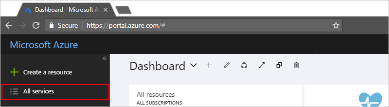

2. In the search box, type "integration" for your filter. 
In the results list, select **Integration Accounts**.

	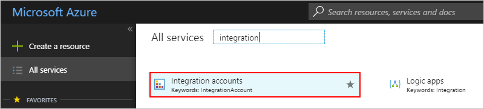  

3. At the top of the page, choose **Add**.

	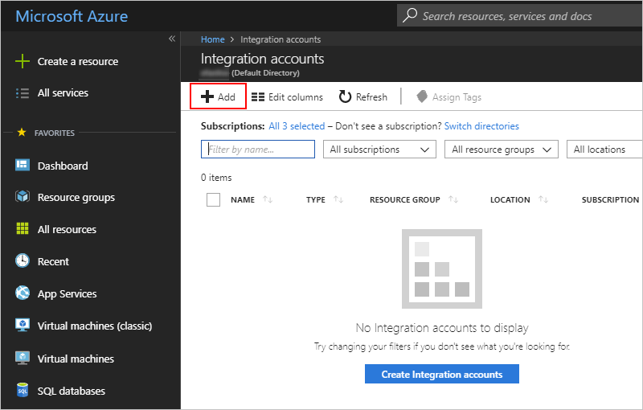

4. Name your integration account and select the Azure subscription that you want to use. 
You can either create a new **Resource group** or select an existing resource group. 
Then select a **Location** for hosting your integration account and a **Pricing Tier**. 

	When you're ready, choose **Create**.

	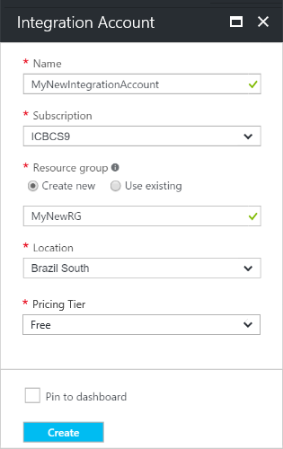

	Azure provisions your integration account 
	in the selected location, which should complete within 1 minute.

5. Refresh the page. You see your new integration account listed.

	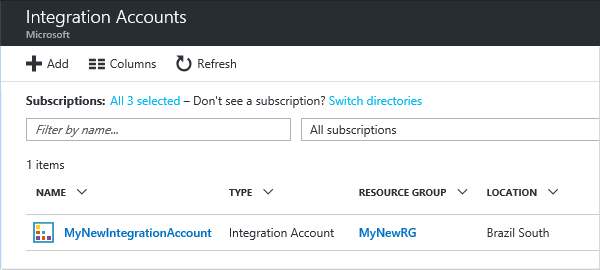 

Next, link the integration account that you created to your logic app. 

## Link an integration account to a logic app

To give your logic apps access to maps, schemas, agreements, and other artifacts in your integration account, 
link the integration account to your logic app.

### Prerequisites

* An integration account
* A logic app

> [!NOTE] 
> Make sure your integration account and logic app are in the *same Azure location* before you begin.

1. In the Azure portal, select your logic app, and check your logic app's location.

	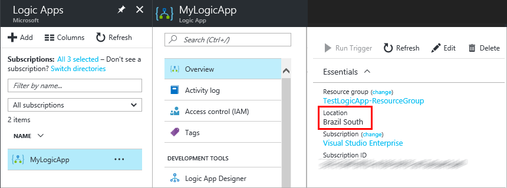

2. Under **Settings**, select **Integration Account**.

	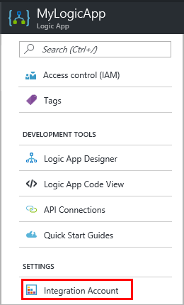

3. From the **Select an Integration account** list, 
select the integration account you want to link to your logic app. 
To finish linking, choose **Save**.

	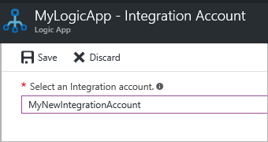

	You get a notification that shows your integration account is linked to your logic app, 
	and that all artifacts in your integration account are now available to your logic app.

	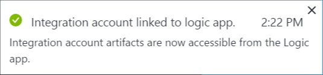

Now that your integration account is linked to your logic app, 
you can use the B2B connectors in your logic apps. 
Some common B2B connectors include XML validation and flat file encode/decode.  

## Delete your integration account

1. Select **More services**.

	

2. In the search box, type "integration" for your filter. 
In the results list, select **Integration Accounts**.

	  

3. Select the integration account that you want to delete.

	

4. On the menu, choose **Delete**.

	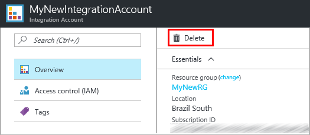

5. Confirm your choice to delete the integration account.

## Move your integration account

To move an integration account to another Azure subscription or resource group, follow these steps.

> [!IMPORTANT]
> You must update all scripts to use the new resource IDs after you move an integration account.

1. Select **More services**.

	

2. In the search box, type "integration" for your filter. 
In the results list, select **Integration Accounts**.

	

3. Select the integration account that you want to move. 
Under **Settings**, choose **Properties**.

	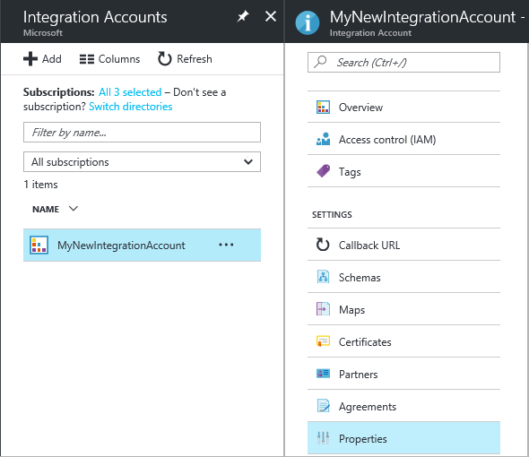

5. Change the resource group or Azure subscription that's associated with your integration account.

	

## Next Steps
* [Learn more about agreements](../logic-apps/logic-apps-enterprise-integration-agreements.md "Learn about enterprise integration agreements")  

