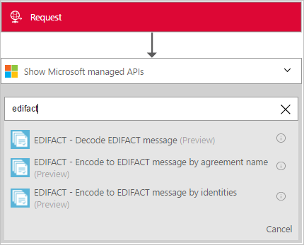
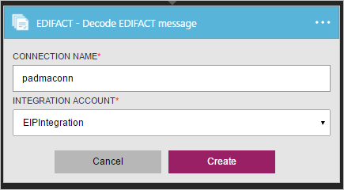
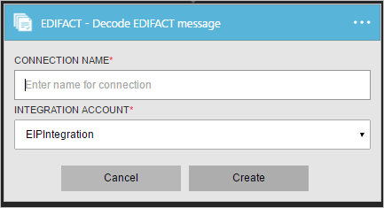
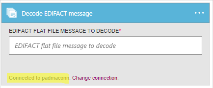
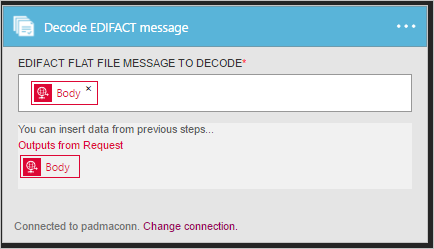

# Decode EDIFACT messages for Azure Logic Apps with the Enterprise Integration Pack

With the Decode EDIFACT message connector, you can validate EDI and partner-specific properties, split interchanges into transactions sets or preserve entire interchanges, and generate acknowledgments for processed transactions. 
To use this connector, you must add the connector to an existing trigger in your logic app.

## Before you start

Here's the items you need:

* An Azure account; you can create a [free account](https://azure.microsoft.com/free)
* An [integration account](logic-apps-enterprise-integration-create-integration-account.md) 
that's already defined and associated with your Azure subscription. 
You must have an integration account to use the Decode EDIFACT message connector. 
* At least two [partners](logic-apps-enterprise-integration-partners.md) 
that are already defined in your integration account
* An [EDIFACT agreement](logic-apps-enterprise-integration-edifact.md) 
that's already defined in your integration account

## Decode EDIFACT messages

> [!IMPORTANT]
> The EDIFACT connector supports only UTF-8 characters.
> If your output contains unexpected characters, check that your EDIFACT messages use the UTF-8 character set. 

1. [Create a logic app](quickstart-create-first-logic-app-workflow.md).

2. The Decode EDIFACT message connector doesn't have triggers, 
so you must add a trigger for starting your logic app, like a Request trigger. 
In the Logic App Designer, add a trigger, and then add an action to your logic app.

3. In the search box, enter "EDIFACT" as your filter. 
Select **Decode EDIFACT Message**.
   
    

3. If you didn't previously create any connections to your integration account, 
you're prompted to create that connection now. Name your connection, 
and select the integration account that you want to connect.
   
    

	Properties with an asterisk are required.

	| Property | Details |
	| --- | --- |
	| Connection Name * |Enter any name for your connection. |
	| Integration Account * |Enter a name for your integration account. Make sure that your integration account and logic app are in the same Azure location. |

4. When you're done to finish creating your connection, choose **Create**. 
Your connection details should look similar to this example:

	  

5. After your connection is created, as shown in this example, 
select the EDIFACT flat file message to decode.

	  

	For example:

	  

## EDIFACT decoder details

The Decode EDIFACT connector performs these tasks: 

* Validates the envelope against trading partner agreement.
* Resolves the agreement by matching the sender qualifier & identifier and receiver qualifier & identifier.
* Splits an interchange into multiple transactions when the interchange has 
more than one transaction based on the agreement's receive settings configuration.
* Disassembles the interchange.
* Validates EDI and partner-specific properties including:
  * Validation of the interchange envelope structure
  * Schema validation of the envelope against the control schema
  * Schema validation of the transaction-set data elements against the message schema
  * EDI validation performed on transaction-set data elements
* Verifies that the interchange, group, and transaction set control numbers are not duplicates (if configured) 
  * Checks the interchange control number against previously received interchanges. 
  * Checks the group control number against other group control numbers in the interchange. 
  * Checks the transaction set control number against other transaction set control numbers in that group.
* Splits the interchange into transaction sets, or preserves the entire interchange:
  * Split Interchange as transaction sets - suspend transaction sets on error: 
  Splits interchange into transaction sets and parses each transaction set. 
  The X12 Decode action outputs only those transaction sets 
  that fail validation to `badMessages`, and outputs the remaining transactions sets to `goodMessages`.
  * Split Interchange as transaction sets - suspend interchange on error: 
  Splits interchange into transaction sets and parses each transaction set. 
  If one or more transaction sets in the interchange fail validation, 
  the X12 Decode action outputs all the transaction sets in that interchange to `badMessages`.
  * Preserve Interchange - suspend transaction sets on error: 
  Preserve the interchange and process the entire batched interchange. 
  The X12 Decode action outputs only those transaction sets that fail validation to `badMessages`, 
  and outputs the remaining transactions sets to `goodMessages`.
  * Preserve Interchange - suspend interchange on error: 
  Preserve the interchange and process the entire batched interchange. 
  If one or more transaction sets in the interchange fail validation, 
  the X12 Decode action outputs all the transaction sets in that interchange to `badMessages`.
* Generates a Technical (control) and/or Functional acknowledgment (if configured).
  * A Technical Acknowledgment or the CONTRL ACK reports the results of a syntactical check of the complete received interchange.
  * A functional acknowledgment acknowledges accept or reject a received interchange or a group

## View Swagger file
To view the Swagger details for the EDIFACT connector, see [EDIFACT](/connectors/edifact/).

## Next steps
[Learn more about the Enterprise Integration Pack](logic-apps-enterprise-integration-overview.md "Learn about Enterprise Integration Pack") 

