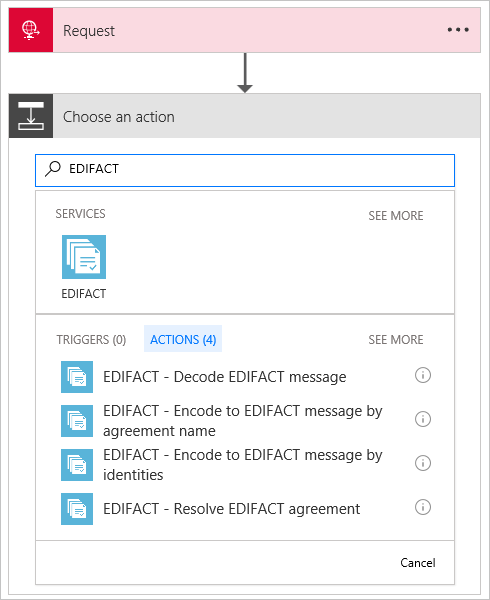
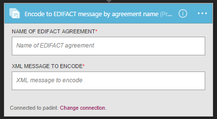
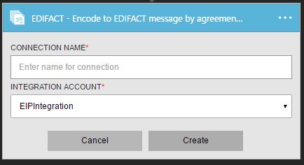
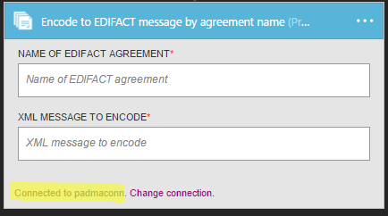
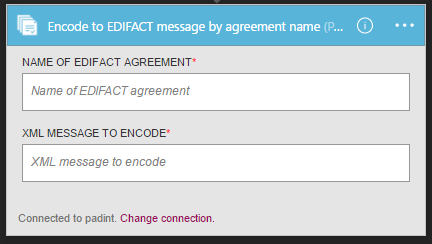
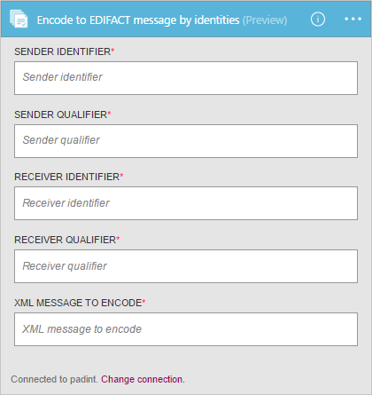

# Encode EDIFACT messages for Azure Logic Apps with Enterprise Integration Pack

With the Encode EDIFACT message connector, you can validate EDI and partner-specific properties, 
generate an XML document for each transaction set, 
and request a Technical Acknowledgement, Functional Acknowledgment, or both.
To use this connector, you must add the connector to an existing trigger in your logic app.

## Before you start

Here's the items you need:

* An Azure account; you can create a [free account](https://azure.microsoft.com/free)
* An [integration account](logic-apps-enterprise-integration-create-integration-account.md) 
that's already defined and associated with your Azure subscription. 
You must have an integration account to use the Encode EDIFACT message connector. 
* At least two [partners](logic-apps-enterprise-integration-partners.md) 
that are already defined in your integration account
* An [EDIFACT agreement](logic-apps-enterprise-integration-edifact.md) 
that's already defined in your integration account

## Encode EDIFACT messages

1. [Create a logic app](quickstart-create-first-logic-app-workflow.md).

2. The Encode EDIFACT message connector doesn't have triggers, 
so you must add a trigger for starting your logic app, like a Request trigger. 
In the Logic App Designer, add a trigger, and then add an action to your logic app.

3.	In the search box, enter "EDIFACT" as your filter. 
Select either **Encode EDIFACT Message by agreement name** or 
**Encode to EDIFACT message by identities**.
   
      

3. If you didn't previously create any connections to your integration account, 
you're prompted to create that connection now. Name your connection, 
and select the integration account that you want to connect.

      

	Properties with an asterisk are required.

	| Property | Details |
	| --- | --- |
	| Connection Name * |Enter any name for your connection. |
	| Integration Account * |Enter a name for your integration account. Make sure that your integration account and logic app are in the same Azure location. |

5.	When you're done, your connection details should look similar to this example. 
To finish creating your connection, choose **Create**.

	

	Your connection is now created.

    

#### Encode EDIFACT Message by agreement name

If you chose to encode EDIFACT messages by agreement name, 
open the **Name of EDIFACT agreement** list, 
enter or select your EDIFACT agreement name. 
Enter the XML message to encode.

#### Encode EDIFACT Message by identities

If you choose to encode EDIFACT messages by identities, enter the sender identifier, 
sender qualifier, receiver identifier, and receiver qualifier as 
configured in your EDIFACT agreement. Select the XML message to encode.

## EDIFACT Encode details

The Encode EDIFACT connector performs these tasks: 

* Resolve the agreement by matching the sender qualifier & identifier and receiver qualifier and identifier
* Serializes the EDI interchange, converting XML-encoded messages into EDI transaction sets in the interchange.
* Applies transaction set header and trailer segments
* Generates an interchange control number, a group control number, and a transaction set control number for each outgoing interchange
* Replaces separators in the payload data
* Validates EDI and partner-specific properties
  * Schema validation of the transaction-set data elements against the message schema.
  * EDI validation performed on transaction-set data elements.
  * Extended validation performed on transaction-set data elements
* Generates an XML document for each transaction set.
* Requests a Technical and/or Functional acknowledgment (if configured).
  * As a technical acknowledgment, the CONTRL message indicates receipt of an interchange.
  * As a functional acknowledgment, the CONTRL message indicates acceptance or rejection of the received interchange, group, or message, with a list of errors or unsupported functionality

## View Swagger file
To view the Swagger details for the EDIFACT connector, see [EDIFACT](/connectors/edifact/).

## Next steps
[Learn more about the Enterprise Integration Pack](logic-apps-enterprise-integration-overview.md "Learn about Enterprise Integration Pack") 

