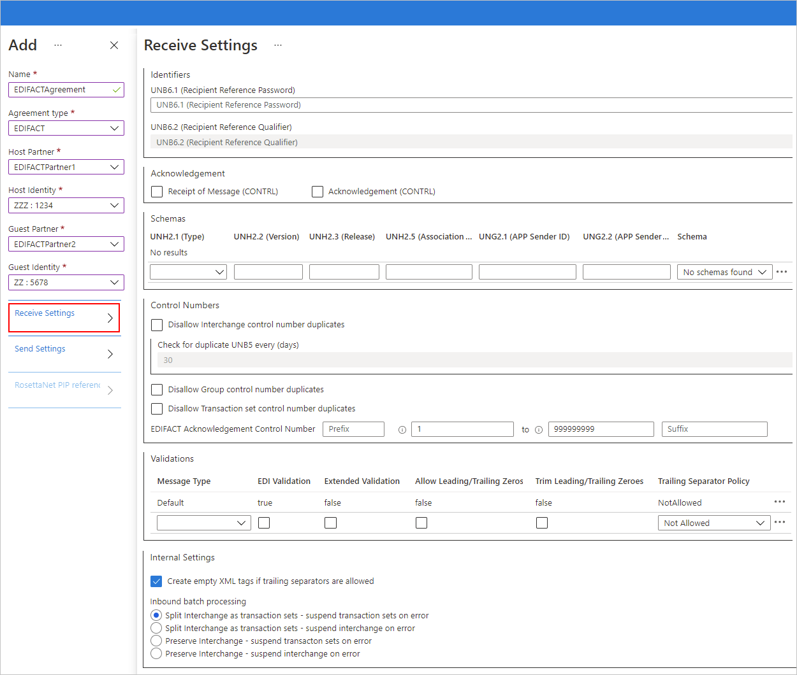
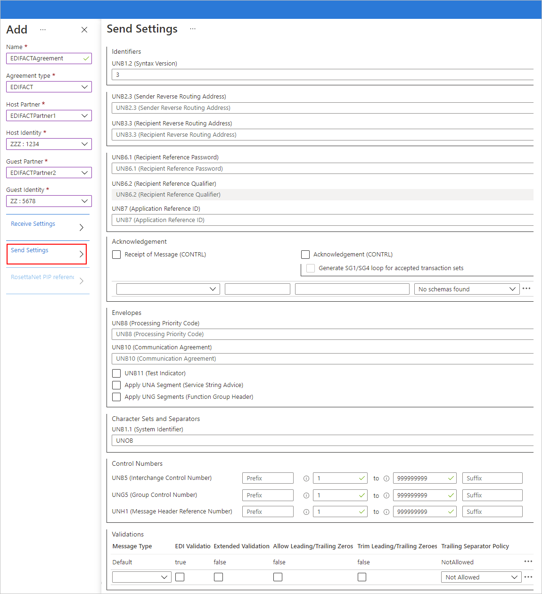

# Reference for EDIFACT message settings in agreements for Azure Logic Apps

[!INCLUDE [logic-apps-sku-consumption-standard](../../includes/logic-apps-sku-consumption-standard.md)]

This reference describes the properties that you can set in an EDIFACT agreement for specifying how to handle messages between [trading partners](logic-apps-enterprise-integration-partners.md). Set up these properties based on your agreement with the partner that exchanges messages with you.

## EDIFACT Receive settings

### Identifiers

| Property | Description |
|----------|-------------|
| **UNB6.1 (Recipient Reference Password)** | An alphanumeric value that is 1-14 characters. |
| **UNB6.2 (Recipient Reference Qualifier)** | An alphanumeric value that is 1-2 characters. |

### Acknowledgments

| Property | Description |
|----------|-------------|
| **Receipt of Message (CONTRL)** | Return a technical (CONTRL) acknowledgment to the interchange sender, based on the agreement's Send Settings. |
| **Acknowledgment (CONTRL)** | Return a functional (CONTRL) acknowledgment to the interchange sender, based on the agreement's Send settings. |

### Schemas

| Property | Description |
|----------|-------------|
| **UNH2.1 (Type)** | The transaction set type. |
| **UNH2.2 (Version)** | The message version number that is 1-3 characters. |
| **UNH2.3 (Release)** | The message release number that is 1-3 characters. |
| **UNH2.5 (Associated Assigned Code)** | The assigned code that is alphanumeric and is 1-6 characters. |
| **UNG2.1 (App Sender ID)** |Enter an alphanumeric value with a minimum of one character and a maximum of 35 characters. |
| **UNG2.2 (App Sender Code Qualifier)** |Enter an alphanumeric value, with a maximum of four characters. |
| **Schema** | The previously uploaded schema that you want to use in from either resource type:   - Consumption: An integration account linked to your logic app.  - Standard: Your logic app resource |

### Control Numbers

| Property | Description |
|----------|-------------|
| **Disallow interchange control number duplicates** | Block duplicate interchanges. The EDIFACT decoding action checks that the interchange control number (UNB5) for the received interchange doesn't match a previously processed interchange control number. If a match is detected, the interchange isn't processed. |
| **Check for duplicate UNB5 every (days)** | If you chose to disallow duplicate interchange control numbers, you can specify the number of days between running the check. |
| **Disallow Group control number duplicates** | Block interchanges that have duplicate group control numbers (UNG5). |
| **Disallow Transaction set control number duplicates** | Block interchanges that have duplicate transaction set control numbers (UNH1). |
| **EDIFACT Acknowledgment Control Number** | Assign the transaction set reference numbers to use in an acknowledgment by entering a value for the prefix, a range of reference numbers, and a suffix. |

### Validation

After you finish setting up a validation row, the next row automatically appears. If you don't specify any rules, validation uses the row that's labeled **Default**.

| Property | Description |
|----------|-------------|
| **Message Type** | The EDI message type. |
| **EDI Validation** | Run EDI validation on data types as defined by the schema's EDI properties, length restrictions, empty data elements, and trailing separators. |
| **Extended Validation** | If the data type isn't EDI, validation runs on the data element requirement and allowed repetition, enumerations, and data element length validation (min and max). |
| **Allow Leading/Trailing Zeroes** | Keep any extra leading or trailing zero and space characters. Don't remove these characters. |
| **Trim Leading/Trailing Zeroes** | Remove the leading or trailing zero and space characters. |
| **Trailing Separator Policy** | Generate trailing separators.   - **Not Allowed**: Prohibit trailing delimiters and separators in the received interchange. If the interchange has trailing delimiters and separators, the interchange is declared not valid.   - **Optional**: Accept interchanges with or without trailing delimiters and separators.   - **Mandatory**: The received interchange must have trailing delimiters and separators. |

### Internal Settings

| Property | Description |
|----------|-------------|
| **Create empty XML tags if trailing separators are allowed** | The interchange sender includes empty XML tags as trailing separators. |
| **Split Interchange as transaction sets - suspend transaction sets on error** | Parse each transaction set in an interchange into a separate XML document by applying the appropriate envelope to the transaction set. Suspend only the transaction sets that fail validation. |
| **Split Interchange as transaction sets - suspend interchange on error** | Parse each transaction set in an interchange into a separate XML document by applying the appropriate envelope. Suspend the entire interchange when one or more transaction sets in the interchange fail validation. |
| **Preserve Interchange - suspend transaction sets on error** | Keep the interchange intact, create an XML document for the entire batched interchange. Suspend only the transaction sets that fail validation, while continuing to process all other transaction sets. |
| **Preserve Interchange - suspend interchange on error** | Keep the interchange intact, create an XML document for the entire batched interchange. Suspend the entire interchange when one or more transaction sets in the interchange fail validation. |

## EDIFACT Send settings

### Identifiers

| Property | Description |
|----------|-------------|
| **UNB1.2 (Syntax Version)** | A value that is 1-4. |
| **UNB2.3 (Sender Reverse Routing Address)** | An alphanumeric value that is 1-14 characters. |
| **UNB3.3 (Recipient Reverse Routing Address)** | An alphanumeric value that is 1-14 characters. |
| **UNB6.1 (Recipient Reference Password)** | An alphanumeric value that is 1-14 characters. |
| **UNB6.2 (Recipient Reference Qualifier)** | An alphanumeric value that is 1-2 characters. |
| **UNB7 (Application Reference ID)** | An alphanumeric value that is 1-14 characters. |

### Acknowledgment

| Property | Description |
|----------|-------------|
| **Receipt of Message (CONTRL)** | The host partner that sends the message requests a technical (CONTRL) acknowledgment from the guest partner. |
| **Acknowledgment (CONTRL)** | The host partner that sends the message expects requests a functional (CONTRL) acknowledgment from the guest partner. |
| **Generate SG1/SG4 loop for accepted transaction sets** | If you chose to request a functional acknowledgment, this setting forces the generation of SG1/SG4 loops in the functional acknowledgments for accepted transaction sets. |

### Schemas

| Property | Description |
|----------|-------------|
| **UNH2.1 (Type)** | The transaction set type. |
| **UNH2.2 (Version)** | The message version number. |
| **UNH2.3 (Release)** | The message release number. |
| **Schema** | The previously uploaded schema that you want to use in from either resource type:   - Consumption: An integration account linked to your logic app.  - Standard: Your logic app resource |

### Envelopes

After you finish setting up an envelope row, the next row automatically appears. If you don't specify any rules, validation uses the row that's labeled **Default**.

| Property | Description |
|----------|-------------|
| **UNB8 (Processing Priority Code)** | An alphabetical value that is not more than one character long. |
| **UNB10 (Communication Agreement)** | An alphanumeric value that is 1-40 characters. |
| **UNB11 (Test Indicator)** | Indicate that the generated interchange is test data. |
| **Apply UNA Segment (Service String Advice)** | Generate a UNA segment for the interchange to send. |
| **Apply UNG Segments (Function Group Header)** | Create grouping segments in the functional group header for messages sent to the guest partner. The following values are used to create the UNG segments:   - **Schema**: The previously uploaded schema that you want to use in from either resource type:   - Consumption: An integration account linked to your logic app.   - Standard: Your logic app resource   - **UNG1**: An alphanumeric value that is 1-6 characters.   - **UNG2.1**: An alphanumeric value that is 1-35 characters.   - **UNG2.2**: An alphanumeric value that is 1-4 characters.   - **UNG3.1**: An alphanumeric value that is 1-35 characters.   - **UNG3.2**: An alphanumeric value that is 1-4 characters.   - **UNG6**: An alphanumeric value that is 1-3 characters.   - **UNG7.1**: An alphanumeric value that is 1-3 characters.   - **UNG7.2**: An alphanumeric value that is 1-3 characters.   - **UNG7.3**: An alphanumeric value that is 1-6 characters.   - **UNG8**: An alphanumeric value that is 1-14 characters. |

### Character Sets and Separators

Other than the character set, you can specify a different set of delimiters to use for each message type. If you don't specify a character set for a given message schema, the **Default** character set is used.

| Property | Description |
|----------|-------------|
| **UNB1.1 (System Identifier)** | The EDIFACT character set to apply to the outbound interchange. |
| **Schema** | The previously uploaded schema that you want to use in from either resource type:   - Consumption: An integration account linked to your logic app.   - Standard: Your logic app resource   For the selected schema, select the separators set that you want to use, based on the following separator descriptions. After you finish setting up a schema row, the next row automatically appears. |
| **Input Type** | The input type for the message. |
| **Component Separator** | A single character to use for separating composite data elements. |
| **Data Element Separator** | A single character to use for separating simple data elements within composite data elements. |
| **UNA3 (Decimal Notation)** | The notation to use in the outbound interchange. |
| **UNA4 (Release Indicator)** | A value to use for the release indicator that indicates that the following character is not a syntax separator, terminator, or release character, but is part of the original data. |
| **UNA5 (Repetition Separator)** | A value to use for the repetition separator that separates segments that repeat within a transaction set. |
| **Segment Terminator** | A single character that indicates the end in an EDI segment. |
| **Suffix** | The character to use with the segment identifier. If you designate a suffix, the segment terminator data element can be empty. If the segment terminator is left empty, you have to designate a suffix. |

### Control Numbers

| Property | Description |
|----------|-------------|
| **UNB5 (Interchange Control Number)** | A prefix, a range of values to use as the interchange control number, and a suffix. These values are used to generate an outbound interchange. The control number is required, but the prefix and suffix are optional. The control number is incremented for each new message, while the prefix and suffix stay the same. |
| **UNG5 (Group Control Number)** | A prefix, a range of values to use as the interchange control number, and a suffix. These values are used to generate the group control number. The control number is required, but the prefix and suffix are optional. The control number is incremented for each new message until the maximum value is reached, while the prefix and suffix stay the same. |
| **UNH1 (Message Header Reference Number)** | A prefix, a range of values for the interchange control number, and a suffix. These values are used to generate the message header reference number. The reference number is required, but the prefix and suffix are optional. The prefix and suffix are optional, while the reference number is required. The reference number is incremented for each new message, while the prefix and suffix stay the same. |

### Validation

After you finish setting up a validation row, the next row automatically appears. If you don't specify any rules, validation uses the row that's labeled **Default**.

| Property | Description |
|----------|-------------|
| **Message Type** | The EDI message type. |
| **EDI Validation** | Run EDI validation on data types as defined by the schema's EDI properties, length restrictions, empty data elements, and trailing separators. |
| **Extended Validation** | If the data type isn't EDI, run validation on the data element requirement and allowed repetition, enumerations, and data element length validation (min/max). |
| **Allow Leading/Trailing Zeroes** | Keep any extra leading or trailing zero and space characters. Don't remove these characters. |
| **Trim Leading/Trailing Zeroes** | Remove leading or trailing zero characters. |
| **Trailing Separator Policy** | Generate trailing separators.   - **Not Allowed**: Prohibit trailing delimiters and separators in the sent interchange. If the interchange has trailing delimiters and separators, the interchange is declared not valid.   - **Optional**: Send interchanges with or without trailing delimiters and separators.   -  **Mandatory**: The sent interchange must have trailing delimiters and separators. |

## Next steps

[Exchange EDIFACT messages](logic-apps-enterprise-integration-edifact.md)