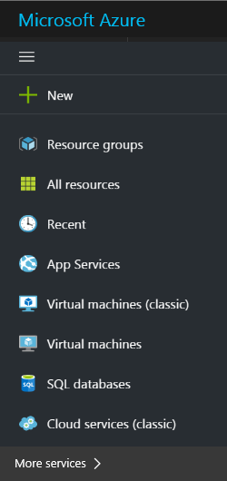
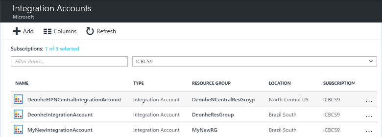
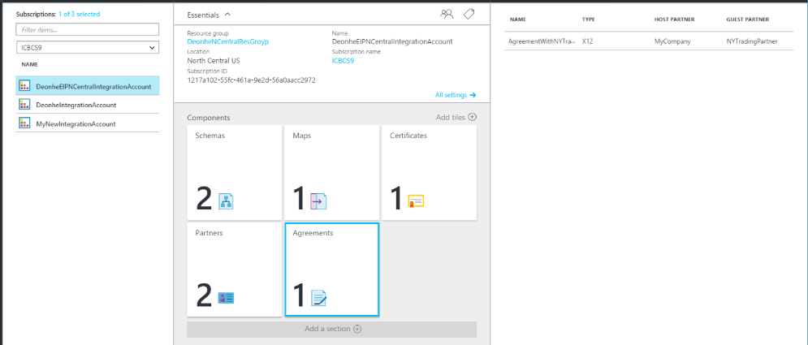
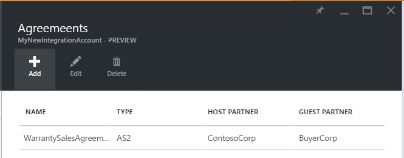
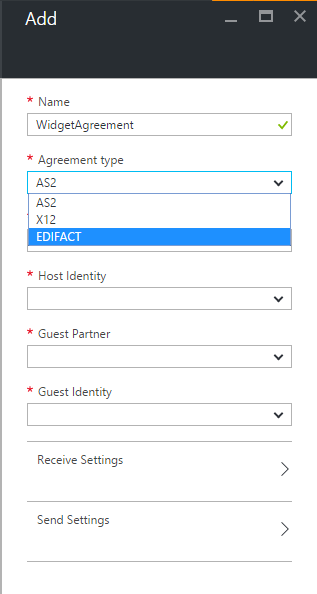
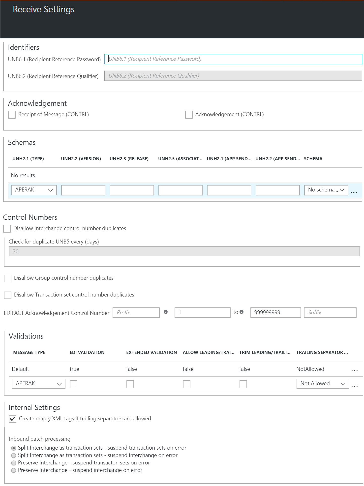
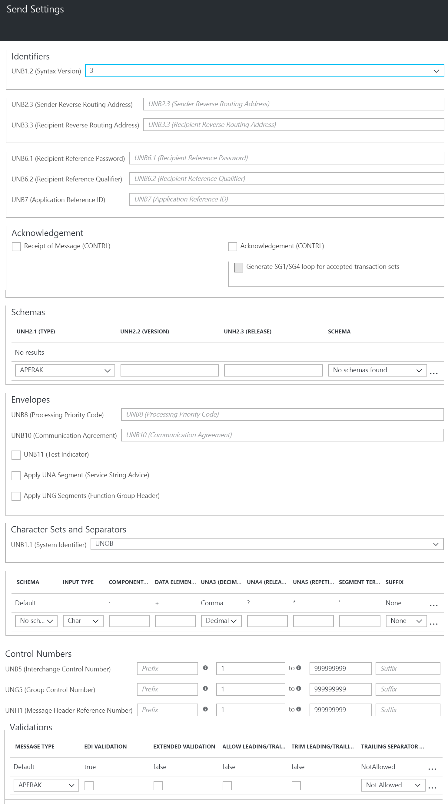
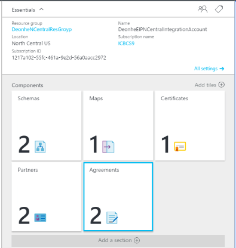

# Exchange EDIFACT messages for B2B enterprise integration in Azure Logic Apps with Enterprise Integration Pack

Before you can exchange EDIFACT messages for Azure Logic Apps, 
you must create an EDIFACT agreement and 
store that agreement in your integration account. 
Here are the steps for how to create an EDIFACT agreement.

> [!NOTE]
> This page covers the EDIFACT features for Azure Logic Apps. 
> For more information, see [X12](logic-apps-enterprise-integration-x12.md).

## Before you start

Here's the items you need:

* An [integration account](logic-apps-enterprise-integration-create-integration-account.md) 
that's already defined and associated with your Azure subscription  
* At least two [partners](logic-apps-enterprise-integration-partners.md) 
that are already defined in your integration account

> [!NOTE]
> When you create an agreement, the content in the messages that you 
> receive or send to and from the partner must match the agreement type.

After you [create an integration account](../logic-apps/logic-apps-enterprise-integration-create-integration-account.md) 
and [add partners](logic-apps-enterprise-integration-partners.md), 
you can create an EDIFACT agreement by following these steps.

## Create an EDIFACT agreement 

1. Sign in to the [Azure portal](https://portal.azure.com "Azure portal"). 

2. On the main Azure menu, select **All services**. 
In the search box, enter "integration", 
and then select **Integration accounts**.

   

   > [!TIP]
   > If **All services** doesn't appear, you might have to expand the menu first. 
   > At the top of the collapsed menu, select **Show text labels**.

3. Under **Integration Accounts**, select the integration 
account where you want to create the agreement.

   

4. Choose **Agreements**. If you don't have an Agreements tile, 
add the tile first.   

   

5. On the Agreements page, choose **Add**.

   

6. Under **Add**, enter a **Name** for your agreement. 
For **Agreement type**, select **EDIFACT**. 
Select the **Host Partner**, **Host Identity**, 
**Guest Partner**, and **Guest Identity** for your agreement.

   

   | Property | Description |
   | --- | --- |
   | Name |Name of the agreement |
   | Agreement Type | Should be EDIFACT |
   | Host Partner |An agreement needs both a host and guest partner. The host partner represents the organization that configures the agreement. |
   | Host Identity |An identifier for the host partner |
   | Guest Partner |An agreement needs both a host and guest partner. The guest partner represents the organization that's doing business with the host partner. |
   | Guest Identity |An identifier for the guest partner |
   | Receive Settings |These properties apply to all messages received by an agreement. |
   | Send Settings |These properties apply to all messages sent by an agreement. |
   ||| 

## Configure how your agreement handles received messages

Now that you've set the agreement properties, 
you can configure how this agreement identifies and 
handles incoming messages received from your partner through this agreement.

1. Under **Add**, select **Receive Settings**.
Configure these properties based on your agreement 
with the partner that exchanges messages with you. 
For property descriptions, see the tables in this section.

   **Receive Settings** is organized into these sections: 
   Identifiers, Acknowledgment, Schemas, Control Numbers, 
   Validation, and Internal Settings.

     

2. After you're done, make sure to save your settings by choosing **OK**.

Now your agreement is ready to handle incoming 
messages that conform to your selected settings.

### Identifiers

| Property | Description |
| --- | --- |
| UNB6.1 (Recipient Reference Password) |Enter an alphanumeric value ranging between 1 and 14 characters. |
| UNB6.2 (Recipient Reference Qualifier) |Enter an alphanumeric value with a minimum of one character and a maximum of two characters. |

### Acknowledgments

| Property | Description |
| --- | --- |
| Receipt of Message (CONTRL) |Select this checkbox to return a technical (CONTRL) acknowledgment to the interchange sender. The acknowledgment is sent to the interchange sender based on the Send Settings for the agreement. |
| Acknowledgement (CONTRL) |Select this checkbox to return a functional (CONTRL) acknowledgment to the interchange sender The acknowledgment is sent to the interchange sender based on the Send Settings for the agreement. |

### Schemas

| Property | Description |
| --- | --- |
| UNH2.1 (TYPE) |Select a transaction set type. |
| UNH2.2 (VERSION) |Enter the message version number. (Minimum, one character; maximum, three characters). |
| UNH2.3 (RELEASE) |Enter the message release number. (Minimum, one character; maximum, three characters). |
| UNH2.5 (ASSOCIATED ASSIGNED CODE) |Enter the assigned code. (Maximum, six characters. Must be alphanumeric). |
| UNG2.1 (APP SENDER ID) |Enter an alphanumeric value with a minimum of one character and a maximum of 35 characters. |
| UNG2.2 (APP SENDER CODE QUALIFIER) |Enter an alphanumeric value, with a maximum of four characters. |
| SCHEMA |Select the previously uploaded schema you want to use from your associated integration account. |

### Control Numbers
| Property | Description |
| --- | --- |
| Disallow Interchange Control Number duplicates |To block duplicate interchanges, select this property. If selected, the EDIFACT Decode Action checks that the interchange control number (UNB5) for the received interchange does not match a previously processed interchange control number. If a match is detected, then the interchange is not processed. |
| Check for duplicate UNB5 every (days) |If you chose to disallow duplicate interchange control numbers, you can specify the number of days when to perform the check by giving the appropriate value for this setting. |
| Disallow Group control number duplicates |To block interchanges with duplicate group control numbers (UNG5), select this property. |
| Disallow Transaction set control number duplicates |To block interchanges with duplicate transaction set control numbers (UNH1), select this property. |
| EDIFACT Acknowledgement Control Number |To designate the transaction set reference numbers for use in an acknowledgment, enter a value for the prefix, a range of reference numbers, and a suffix. |

### Validations

When you complete each validation row, another is automatically added. 
If you don't specify any rules, then validation uses the "Default" row.

| Property | Description |
| --- | --- |
| Message Type |Select the EDI message type. |
| EDI Validation |Perform EDI validation on data types as defined by the schema's EDI properties, length restrictions, empty data elements, and trailing separators. |
| Extended Validation |If the data type isn't EDI, validation is on the data element requirement and allowed repetition, enumerations, and data element length validation (min/max). |
| Allow Leading/Trailing Zeroes |Retain any additional leading or trailing zero and space characters. Don't remove these characters. |
| Trim Leading/Trailing Zeroes |Remove leading or trailing zero and space characters. |
| Trailing Separator Policy |Generate trailing separators. 
Select **Not Allowed** to prohibit trailing delimiters and separators in the received interchange. If the interchange has trailing delimiters and separators, the interchange is declared not valid. 
Select **Optional** to accept interchanges with or without trailing delimiters and separators. 
Select **Mandatory** when the received interchange must have trailing delimiters and separators. |

### Internal Settings

| Property | Description |
| --- | --- |
| Create empty XML tags if trailing separators are allowed |Select this check box to have the interchange sender include empty XML tags for trailing separators. |
| Split Interchange as transaction sets - suspend transaction sets on error|Parses each transaction set in an interchange into a separate XML document by applying the appropriate envelope to the transaction set. Suspend only the transaction sets that fail validation. |
| Split Interchange as transaction sets - suspend interchange on error|Parses each transaction set in an interchange into a separate XML document by applying the appropriate envelope. Suspend the entire interchange when one or more transaction sets in the interchange fail validation. | 
| Preserve Interchange - suspend transaction sets on error |Leaves the interchange intact, creates an XML document for the entire batched interchange. Suspend only the transaction sets that fail validation, while continuing to process all other transaction sets. |
| Preserve Interchange - suspend interchange on error |Leaves the interchange intact, creates an XML document for the entire batched interchange. Suspend the entire interchange when one or more transaction sets in the interchange fail validation. |

## Configure how your agreement sends messages

You can configure how this agreement identifies and handles outgoing 
messages that you send to your partners through this agreement.

1.	Under **Add**, select **Send Settings**.
Configure these properties based on your agreement 
with your partner who exchanges messages with you. 
For property descriptions, see the tables in this section.

	**Send Settings** is organized into these sections: 
	Identifiers, Acknowledgment, Schemas, Envelopes, 
	Character Sets and Separators, Control Numbers, and Validations.

	    

2. After you're done, 
make sure to save your settings by choosing **OK**.

Now your agreement is ready to handle outgoing 
messages that conform to your selected settings.

### Identifiers

| Property | Description |
| --- | --- |
| UNB1.2 (Syntax version) |Select a value between **1** and **4**. |
| UNB2.3 (Sender Reverse Routing Address) |Enter an alphanumeric value with a minimum of one character and a maximum of 14 characters. |
| UNB3.3 (Recipient Reverse Routing Address) |Enter an alphanumeric value with a minimum of one character and a maximum of 14 characters. |
| UNB6.1 (Recipient Reference Password) |Enter an alphanumeric value with a minimum of one and a maximum of 14 characters. |
| UNB6.2 (Recipient Reference Qualifier) |Enter an alphanumeric value with a minimum of one character and a maximum of two characters. |
| UNB7 (Application Reference ID) |Enter an alphanumeric value with a minimum of one character and a maximum of 14 characters |

### Acknowledgment
| Property | Description |
| --- | --- |
| Receipt of Message (CONTRL) |Select this checkbox if the hosted partner expects to receive a technical (CONTRL) acknowledgment. This setting specifies that the hosted partner, who is sending the message, requests an acknowledgement from the guest partner. |
| Acknowledgement (CONTRL) |Select this checkbox if the hosted partner expects to receive a functional (CONTRL) acknowledgment. This setting specifies that the hosted partner, who is sending the message, requests an acknowledgement from the guest partner. |
| Generate SG1/SG4 loop for accepted transaction sets |If you chose to request a functional acknowledgement, select this checkbox to force generation of SG1/SG4 loops in functional CONTRL acknowledgments for accepted transaction sets. |

### Schemas
| Property | Description |
| --- | --- |
| UNH2.1 (TYPE) |Select a transaction set type. |
| UNH2.2 (VERSION) |Enter the message version number. |
| UNH2.3 (RELEASE) |Enter the message release number. |
| SCHEMA |Select the schema to use. Schemas are located in your integration account. To access your schemas, first link your integration account to your Logic app. |

### Envelopes
| Property | Description |
| --- | --- |
| UNB8 (Processing Priority Code) |Enter an alphabetical value that is not more than one character long. |
| UNB10 (Communication Agreement) |Enter an alphanumeric value with a minimum of one character and a maximum of 40 characters. |
| UNB11 (Test Indicator) |Select this checkbox to indicate that the interchange generated is test data |
| Apply UNA Segment (Service String Advice) |Select this checkbox to generate a UNA segment for the interchange to be sent. |
| Apply UNG Segments (Function Group Header) |Select this checkbox to create grouping segments in the functional group header in the messages sent to the guest partner. The following values are used to create the UNG segments: 
For **UNG1**, enter an alphanumeric value with a minimum of one character and a maximum of six characters. 
For **UNG2.1**, enter an alphanumeric value with a minimum of one character and a maximum of 35 characters. 
For **UNG2.2**, enter an alphanumeric value, with a maximum of four characters. 
For **UNG3.1**, enter an alphanumeric value with a minimum of one character and a maximum of 35 characters. 
For **UNG3.2**, enter an alphanumeric value, with a maximum of four characters. 
For **UNG6**, enter an alphanumeric value with a minimum of one and a maximum of three characters. 
For **UNG7.1**, enter an alphanumeric value with a minimum of one character and a maximum of three characters. 
For **UNG7.2**, enter an alphanumeric value with a minimum of one character and a maximum of three characters. 
For **UNG7.3**, enter an alphanumeric value with a minimum of 1 character and a maximum of 6 characters. 
For **UNG8**, enter an alphanumeric value with a minimum of one character and a maximum of 14 characters. |

### Character Sets and Separators

Other than the character set, you can enter a different set of delimiters to be used for each message type. 
If a character set is not specified for a given message schema, then the default character set is used.

| Property | Description |
| --- | --- |
| UNB1.1 (System Identifier) |Select the EDIFACT character set to be applied on the outgoing interchange. |
| Schema |Select a schema from the drop-down list. After you complete each row, a new row is automatically added. For the selected schema, select the separators set that you want to use, based on the separator descriptions below. |
| Input Type |Select an input type from the drop-down list. |
| Component Separator |To separate composite data elements, enter a single character. |
| Data Element Separator |To separate simple data elements within composite data elements, enter a single character. |
| Segment Terminator |To indicate the end of an EDI segment, enter a single character. |
| Suffix |Select the character that is used with the segment identifier. If you designate a suffix, then the segment terminator data element can be empty. If the segment terminator is left empty, then you must designate a suffix. |

### Control Numbers
| Property | Description |
| --- | --- |
| UNB5 (Interchange Control Number) |Enter a prefix, a range of values for the interchange control number, and a suffix. These values are used to generate an outgoing interchange. The prefix and suffix are optional, while the control number is required. The control number is incremented for each new message; the prefix and suffix remain the same. |
| UNG5 (Group Control Number) |Enter a prefix, a range of values for the interchange control number, and a suffix. These values are used to generate the group control number. The prefix and suffix are optional, while the control number is required. The control number is incremented for each new message until the maximum value is reached; the prefix and suffix remain the same. |
| UNH1 (Message Header Reference Number) |Enter a prefix, a range of values for the interchange control number, and a suffix. These values are used to generate the message header reference number. The prefix and suffix are optional, while the reference number is required. The reference number is incremented for each new message; the prefix and suffix remain the same. |

### Validations

When you complete each validation row, another is automatically added. 
If you don't specify any rules, then validation uses the "Default" row.

| Property | Description |
| --- | --- |
| Message Type |Select the EDI message type. |
| EDI Validation |Perform EDI validation on data types as defined by the EDI properties of the schema, length restrictions, empty data elements, and trailing separators. |
| Extended Validation |If the data type isn't EDI, validation is on the data element requirement and allowed repetition, enumerations, and data element length validation (min/max). |
| Allow Leading/Trailing Zeroes |Retain any additional leading or trailing zero and space characters. Don't remove these characters. |
| Trim Leading/Trailing Zeroes |Remove leading or trailing zero characters. |
| Trailing Separator Policy |Generate trailing separators. 
Select **Not Allowed** to prohibit trailing delimiters and separators in the sent interchange. If the interchange has trailing delimiters and separators, the interchange is declared not valid. 
Select **Optional** to send interchanges with or without trailing delimiters and separators. 
Select **Mandatory** if the sent interchange must have trailing delimiters and separators. |

## Find your created agreement

1.	After you finish setting all your agreement properties, 
on the **Add** page, choose **OK** to finish creating your agreement 
and return to your integration account.

	Your newly added agreement now appears in your **Agreements** list.

2.	You can also view your agreements in your integration account overview. 
On your integration account menu, choose **Overview**, then select the **Agreements** tile. 

	   

## View Swagger file
To view the Swagger details for the EDIFACT connector, see [EDIFACT](/connectors/edifact/).

## Learn more
* [Learn more about the Enterprise Integration Pack](logic-apps-enterprise-integration-overview.md "Learn about Enterprise Integration Pack")  

