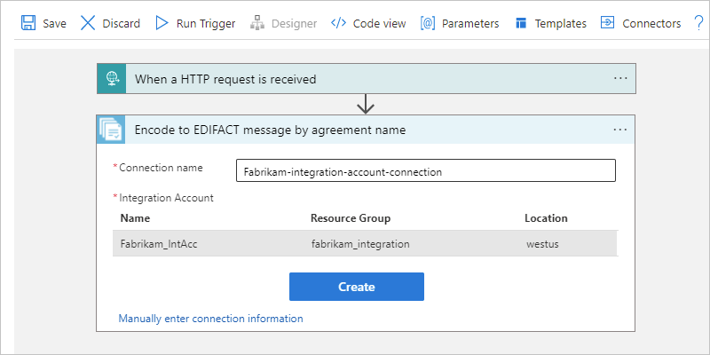
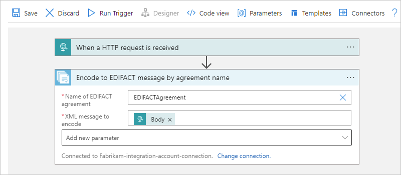
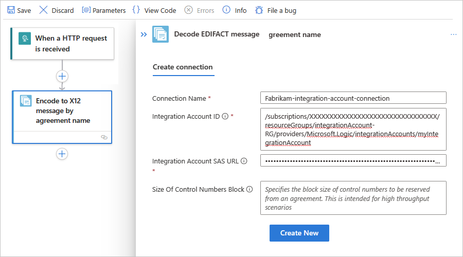
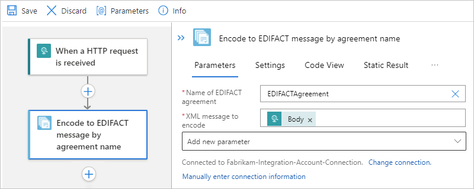
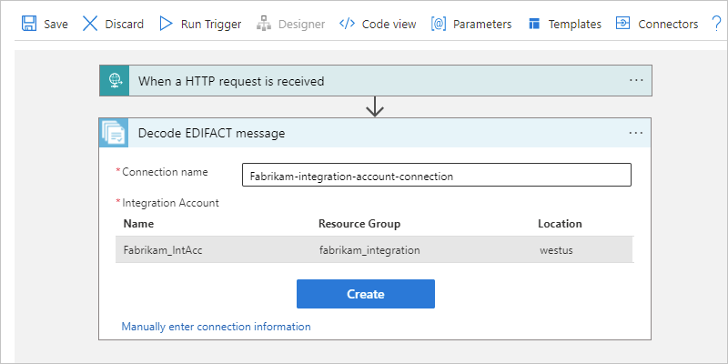
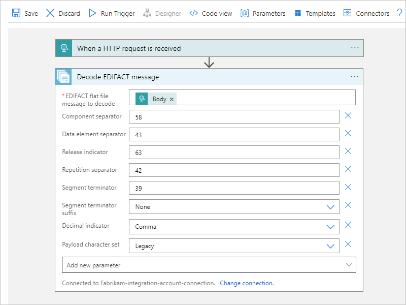
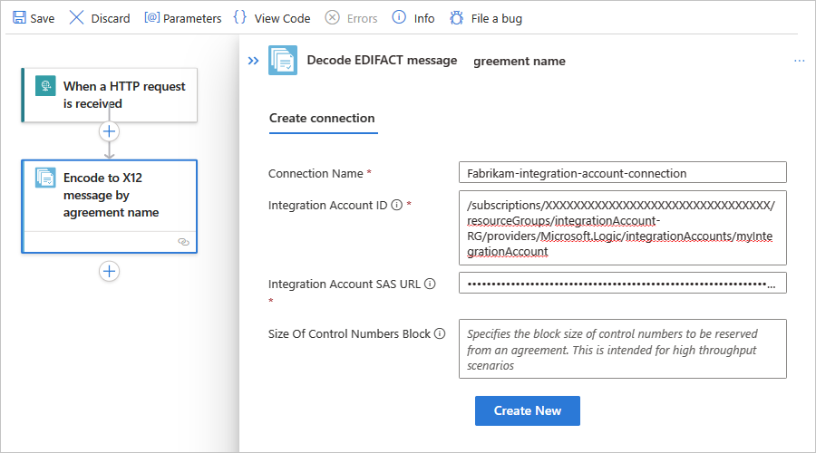
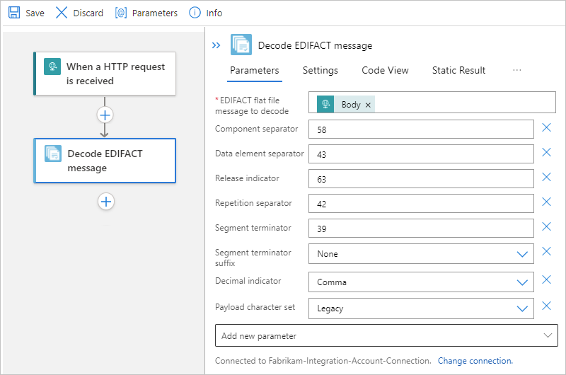
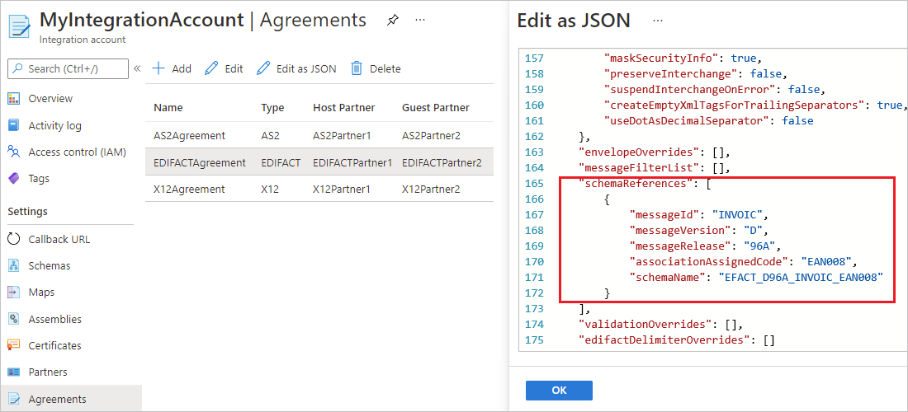
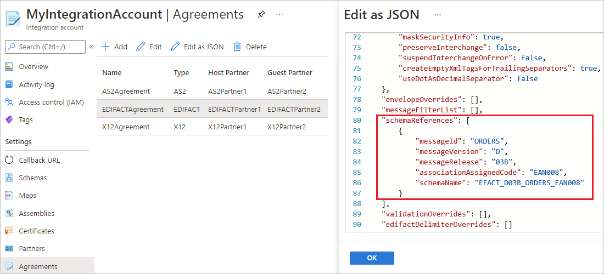

# Exchange EDIFACT messages using workflows in Azure Logic Apps

To send and receive EDIFACT messages in workflows that you create using Azure Logic Apps, use the **EDIFACT** connector, which provides operations that support and manage EDIFACT communication.

This how-to guide shows how to add the EDIFACT encoding and decoding actions to an existing logic app workflow. The **EDIFACT** connector doesn't include any triggers, so you can use any trigger to start your workflow. The examples in this guide use the [Request trigger](../connectors/connectors-native-reqres.md).

## Connector technical reference

The **EDIFACT** connector has one version across workflows in [multi-tenant Azure Logic Apps, single-tenant Azure Logic Apps, and the integration service environment (ISE)](logic-apps-overview.md#resource-environment-differences). For technical information about the **EDIFACT** connector, see the following documentation:

* [Connector reference page](/connectors/edifact/), which describes the triggers, actions, and limits as documented by the connector's Swagger file

* [B2B protocol limits for message sizes](logic-apps-limits-and-config.md#b2b-protocol-limits)

  For example, in an [integration service environment (ISE)](connect-virtual-network-vnet-isolated-environment-overview.md), this connector's ISE version uses the [B2B message limits for ISE](logic-apps-limits-and-config.md#b2b-protocol-limits).

The following sections provide more information about the tasks that you can complete using the EDIFACT encoding and decoding actions.

### Encode to EDIFACT message action

This action performs the following tasks:

* Resolve the agreement by matching the sender qualifier & identifier and receiver qualifier and identifier.

* Serialize the Electronic Data Interchange (EDI), which converts XML-encoded messages into EDI transaction sets in the interchange.

* Apply transaction set header and trailer segments.

* Generate an interchange control number, a group control number, and a transaction set control number for each outgoing interchange.

* Replace separators in the payload data.

* Validate EDI and partner-specific properties, such as the schema for transaction-set data elements against the message schema, transaction-set data elements, and extended validation on transaction-set data elements.

* Generate an XML document for each transaction set.

* Request a technical acknowledgment, functional acknowledgment, or both, if configured.

  * As a technical acknowledgment, the CONTRL message indicates the receipt for an interchange.

  * As a functional acknowledgment, the CONTRL message indicates the acceptance or rejection for the received interchange, group, or message, including a list of errors or unsupported functionality.

### Decode EDIFACT message action

This action performs the following tasks:

* Validate the envelope against the trading partner agreement.

* Resolve the agreement by matching the sender qualifier and identifier along with the receiver qualifier and identifier.

* Split an interchange into multiple transaction sets when the interchange has more than one transaction, based on the agreement's **Receive Settings**.

* Disassemble the interchange.

* Validate Electronic Data Interchange (EDI) and partner-specific properties, such as the interchange envelope structure, the envelope schema against the control schema, the schema for the transaction-set data elements against the message schema, and extended validation on transaction-set data elements.

* Verify that the interchange, group, and transaction set control numbers aren't duplicates, if configured, for example:

  * Check the interchange control number against previously received interchanges.

  * Check the group control number against other group control numbers in the interchange.

  * Check the transaction set control number against other transaction set control numbers in that group.

* Split the interchange into transaction sets, or preserve the entire interchange, for example:

  * Split Interchange as transaction sets - suspend transaction sets on error.

    The decoding action splits the interchange into transaction sets and parses each transaction set. The action outputs only those transaction sets that fail validation to `badMessages`, and outputs the remaining transactions sets to `goodMessages`.

  * Split Interchange as transaction sets - suspend interchange on error.

    The decoding action splits the interchange into transaction sets and parses each transaction set. If one or more transaction sets in the interchange fail validation, the action outputs all the transaction sets in that interchange to `badMessages`.

  * Preserve Interchange - suspend transaction sets on error.

    The decoding action preserves the interchange and processes the entire batched interchange. The action outputs only those transaction sets that fail validation to `badMessages`, and outputs the remaining transactions sets to `goodMessages`.

  * Preserve Interchange - suspend interchange on error.

    The decoding action preserves the interchange and processes the entire batched interchange. If one or more transaction sets in the interchange fail validation, the action outputs all the transaction sets in that interchange to `badMessages`.

* Generate a technical acknowledgment, functional acknowledgment, or both, if configured.

  * A technical acknowledgment or the CONTRL ACK, which reports the results from a syntactical check on the complete received interchange.

  * A functional acknowledgment that acknowledges the acceptance or rejection for the received interchange or group.

## Prerequisites

* An Azure account and subscription. If you don't have a subscription yet, [sign up for a free Azure account](https://azure.microsoft.com/free/?WT.mc_id=A261C142F).

* An [integration account resource](logic-apps-enterprise-integration-create-integration-account.md) where you define and store artifacts, such as trading partners, agreements, certificates, and so on, for use in your enterprise integration and B2B workflows. This resource has to meet the following requirements:

  * Both your integration account and logic app resource must exist in the same Azure subscription and Azure region.

  * Defines at least two [trading partners](logic-apps-enterprise-integration-partners.md) that participate in the **EDIFACT** operation used in your workflow. The definitions for both partners must use the same *business identity* qualifier, which is **ZZZ - Mutually Defined** for this scenario.

  * Defines an [EDIFACT agreement](logic-apps-enterprise-integration-agreements.md) between the trading partners that participate in your workflow. Each agreement requires a host partner and a guest partner. The content in the messages between you and the other partner must match the agreement type. For information about agreement settings to use when receiving and sending messages, see [EDIFACT message settings](logic-apps-enterprise-integration-edifact-message-settings.md).

    > [!IMPORTANT]
    >
    > The EDIFACT connector supports only UTF-8 characters. If your output contains 
    > unexpected characters, check that your EDIFACT messages use the UTF-8 character set.

* Based on whether you're working on a Consumption or Standard logic app workflow, your logic app resource might require a link to your integration account:

  | Logic app workflow | Link required? |
  |--------------------|----------------|
  | Consumption | Connection to integration account required, but no link required. You can create the connection when you add the **EDIFACT** operation to your workflow. |
  | Standard | Connection to integration account required, but no link required. You can create the connection when you add the **EDIFACT** operation to your workflow. |

* The logic app resource and workflow where you want to use the EDIFACT operations.

  For more information, see the following documentation:

  * [Create an example Consumption logic app workflow in multi-tenant Azure Logic Apps](quickstart-create-example-consumption-workflow.md)

  * [Create an example Standard logic app workflow in single-tenant Azure Logic Apps](create-single-tenant-workflows-azure-portal.md)

## Encode EDIFACT messages

### [Consumption](#tab/consumption)

1. In the [Azure portal](https://portal.azure.com), open your logic app resource and workflow in the designer.

1. In the designer, [follow these general steps to add the **EDIFACT** action named **Encode to EDIFACT message by agreement name** to your workflow](create-workflow-with-trigger-or-action.md?tabs=consumption#add-action).

   > [!NOTE]
   >
   > If you want to use **Encode to EDIFACT message by identities** action instead, 
   > you later have to provide different values, such as the **Sender identifier** 
   > and **Receiver identifier** that's specified by your EDIFACT agreement. 
   > You also have to specify the **XML message to encode**, which can be the output 
   > from the trigger or a preceding action.

1. When prompted, provide the following connection information for your integration account:

   | Property | Required | Description |
   |----------|----------|-------------|
   | **Connection name** | Yes | A name for the connection |
   | **Integration account** | Yes | From the list of available integration accounts, select the account to use. |

   For example:

   

1. When you're done, select **Create**.

1. In the EDIFACT action information box, provide the following property values:

   | Property | Required | Description |
   |----------|----------|-------------|
   | **Name of EDIFACT agreement** | Yes | The EDIFACT agreement to use. |
   | **XML message to encode** | Yes | The business identifier for the message sender as specified by your EDIFACT agreement |
   | Other parameters | No | This operation includes the following other parameters: 
- **Data element separator**  - **Release indicator**  - **Component separator**  - **Repetition separator**  - **Segment terminator**  - **Segment terminator suffix**  - **Decimal indicator** 
For more information, review [EDIFACT message settings](logic-apps-enterprise-integration-edifact-message-settings.md). |

   For example, the XML message payload can be the **Body** content output from the Request trigger:

   

### [Standard](#tab/standard)

1. In the [Azure portal](https://portal.azure.com), open your logic app resource and workflow in the designer.

1. In the designer, [follow these general steps to add the **EDIFACT** action named **Encode to EDIFACT message by agreement name** to your workflow](create-workflow-with-trigger-or-action.md?tabs=standard#add-action).

   > [!NOTE]
   >
   > If you want to use **Encode to EDIFACT message by identities** action instead, 
   > you later have to provide different values, such as the **Sender identifier** 
   > and **Receiver identifier** that's specified by your EDIFACT agreement. 
   > You also have to specify the **XML message to encode**, which can be the output 
   > from the trigger or a preceding action.

1. When prompted, provide the following connection information for your integration account:

   | Property | Required | Description |
   |----------|----------|-------------|
   | **Connection name** | Yes | A name for the connection |
   | **Integration account** | Yes | From the list of available integration accounts, select the account to use. |

   For example:

   

1. When you're done, select **Create**.

1. In the EDIFACT action information box, provide the following property values:

   | Property | Required | Description |
   |----------|----------|-------------|
   | **Name of EDIFACT agreement** | Yes | The EDIFACT agreement to use. |
   | **XML message to encode** | Yes | The business identifier for the message sender as specified by your EDIFACT agreement |
   | Other parameters | No | This operation includes the following other parameters: 
- **Data element separator**  - **Release indicator**  - **Component separator**  - **Repetition separator**  - **Segment terminator**  - **Segment terminator suffix**  - **Decimal indicator** 
For more information, review [EDIFACT message settings](logic-apps-enterprise-integration-edifact-message-settings.md). |

   For example, the message payload is the **Body** content output from the Request trigger:

   

---

## Decode EDIFACT messages

### [Consumption](#tab/consumption)

1. In the [Azure portal](https://portal.azure.com), open your logic app resource and workflow in the designer.

1. In the designer, [follow these general steps to add the **EDIFACT** action named **Decode EDIFACT message** to your workflow](create-workflow-with-trigger-or-action.md?tabs=consumption#add-action).

1. When prompted, provide the following connection information for your integration account:

   | Property | Required | Description |
   |----------|----------|-------------|
   | **Connection name** | Yes | A name for the connection |
   | **Integration account** | Yes | From the list of available integration accounts, select the account to use. |

   For example:

   

1. When you're done, select **Create**.

1. In the EDIFACT action information box, provide the following property values:

   | Property | Required | Description |
   |----------|----------|-------------|
   | **EDIFACT flat file message to decode** | Yes | The XML flat file message to decode. |
   | Other parameters | No | This operation includes the following other parameters: 
- **Component separator**  - **Data element separator**  - **Release indicator**  - **Repetition separator**  - **Segment terminator**  - **Segment terminator suffix**  - **Decimal indicator**  - **Payload character set**  - **Segment terminator suffix**  - **Preserve Interchange**  - **Suspend Interchange On Error** 
For more information, review [EDIFACT message settings](logic-apps-enterprise-integration-edifact-message-settings.md). |

   For example, the XML message payload to decode can be the **Body** content output from the Request trigger:

   

### [Standard](#tab/standard)

1. In the [Azure portal](https://portal.azure.com), open your logic app resource and workflow in the designer.

1. In the designer, [follow these general steps to add the **EDIFACT** action named **Decode EDIFACT message** to your workflow](create-workflow-with-trigger-or-action.md?tabs=standard#add-action).

1. When prompted, provide the following connection information for your integration account:

   | Property | Required | Description |
   |----------|----------|-------------|
   | **Connection name** | Yes | A name for the connection |
   | **Integration account** | Yes | From the list of available integration accounts, select the account to use. |

   For example:

   

1. When you're done, select **Create**.

1. In the EDIFACT action information box, provide the following property values:

   | Property | Required | Description |
   |----------|----------|-------------|
   | **Name of EDIFACT agreement** | Yes | The EDIFACT agreement to use. |
   | **XML message to encode** | Yes | The business identifier for the message sender as specified by your EDIFACT agreement |
   | Other parameters | No | This operation includes the following other parameters: 
- **Data element separator**  - **Release indicator**  - **Component separator**  - **Repetition separator**  - **Segment terminator**  - **Segment terminator suffix**  - **Decimal indicator** 
For more information, review [EDIFACT message settings](logic-apps-enterprise-integration-edifact-message-settings.md). |

   For example, the message payload is the **Body** content output from the Request trigger:

   

---

## Handle UNH2.5 segments in EDIFACT documents

In an EDIFACT document, the [UNH2.5 segment](logic-apps-enterprise-integration-edifact-message-settings.md#receive-settings-schemas) is used for schema lookup. For example, in this sample EDIFACT message, the UNH field is `EAN008`:

`UNH+SSDD1+ORDERS:D:03B:UN:EAN008`

To handle an EDIFACT document or process an EDIFACT message that has a UN2.5 segment, follow these steps:

1. Update or deploy a schema that has the UNH2.5 root node name.

   For example, suppose the schema root name for the sample UNH field is `EFACT_D03B_ORDERS_EAN008`. For each `D03B_ORDERS` that has a different UNH2.5 segment, you have to deploy an individual schema.

1. In the [Azure portal](https://portal.azure.com), add the schema to your integration account resource or logic app resource, based on whether you have a Consumption or Standard logicapp workflow respectively.

1. Whether you're using the EDIFACT decoding or encoding action, upload your schema and set up the schema settings in your EDIFACT agreement's **Receive Settings** or **Send Settings** sections respectively.

1. To edit your EDIFACT agreement, on the **Agreements** pane, select your agreement. On the **Agreements** pane's toolbar, select **Edit as JSON**.

   * In the agreement's `receiveAgreement` section, find the `schemaReferences` section, and add the UNH2.5 value.

     

   * In the agreement's `sendAgreement`section, find the `schemaReferences` section, and add the UNH2.5 value.

     

## Next steps

* [EDIFACT message settings](logic-apps-enterprise-integration-edifact-message-settings.md)
