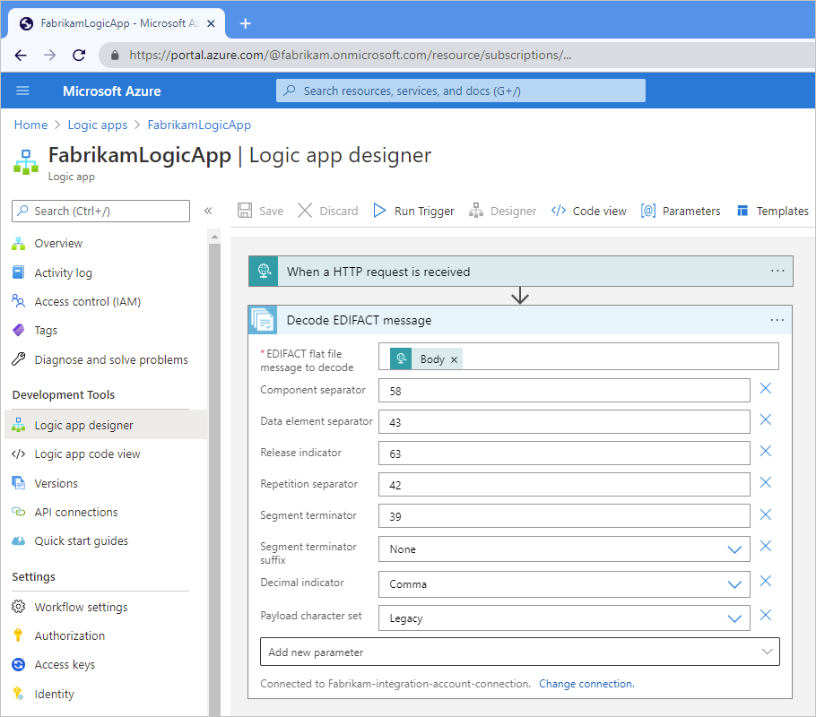
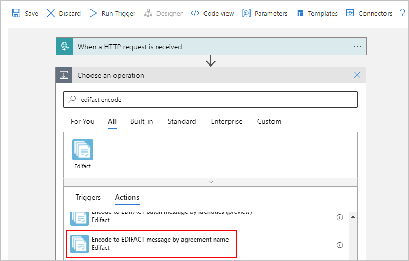
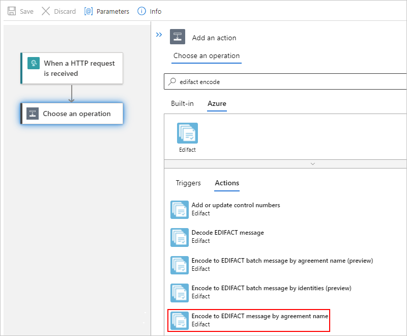
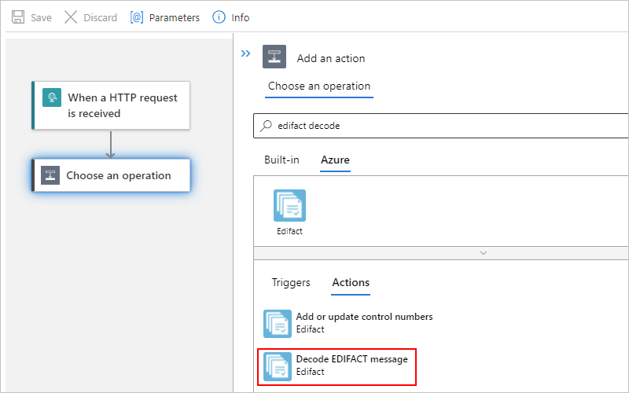

# Exchange EDIFACT messages using workflows in Azure Logic Apps

To send and receive EDIFACT messages in workflows that you create using Azure Logic Apps, use the **EDIFACT** connector, which provides triggers and actions that support and manage EDIFACT communication.

This article shows how to add the EDIFACT encoding and decoding actions to an existing logic app workflow. Although you can use any trigger to start your workflow, the examples use the [Request](../connectors/connectors-native-reqres.md) trigger. For more information about the **EDIFACT** connector's triggers, actions, and limits version, review the [connector's reference page](/connectors/edifact/) as documented by the connector's Swagger file.

## EDIFACT encoding and decoding

The following sections describe the tasks that you can complete using the EDIFACT encoding and decoding actions.

### Encode to EDIFACT message action

* Resolve the agreement by matching the sender qualifier & identifier and receiver qualifier and identifier.

* Serialize the Electronic Data Interchange (EDI), which converts XML-encoded messages into EDI transaction sets in the interchange.

* Apply transaction set header and trailer segments.

* Generate an interchange control number, a group control number, and a transaction set control number for each outgoing interchange.

* Replace separators in the payload data.

* Validate EDI and partner-specific properties, such as the schema for transaction-set data elements against the message schema, transaction-set data elements, and extended validation on transaction-set data elements.

* Generate an XML document for each transaction set.

* Request a technical acknowledgment, functional acknowledgment, or both, if configured.

  * As a technical acknowledgment, the CONTRL message indicates the receipt for an interchange.

  * As a functional acknowledgment, the CONTRL message indicates the acceptance or rejection for the received interchange, group, or message, including a list of errors or unsupported functionality.

### Decode EDIFACT message action

* Validate the envelope against the trading partner agreement.

* Resolve the agreement by matching the sender qualifier and identifier along with the receiver qualifier and identifier.

* Split an interchange into multiple transaction sets when the interchange has more than one transaction, based on the agreement's **Receive Settings**.

* Disassemble the interchange.

* Validate Electronic Data Interchange (EDI) and partner-specific properties, such as the interchange envelope structure, the envelope schema against the control schema, the schema for the transaction-set data elements against the message schema, and extended validation on transaction-set data elements.

* Verify that the interchange, group, and transaction set control numbers aren't duplicates, if configured, for example:

  * Check the interchange control number against previously received interchanges.

  * Check the group control number against other group control numbers in the interchange.

  * Check the transaction set control number against other transaction set control numbers in that group.

* Split the interchange into transaction sets, or preserve the entire interchange, for example:

  * Split Interchange as transaction sets - suspend transaction sets on error.

    The decoding action splits the interchange into transaction sets and parses each transaction set. The action outputs only those transaction sets that fail validation to `badMessages`, and outputs the remaining transactions sets to `goodMessages`.

  * Split Interchange as transaction sets - suspend interchange on error.

    The decoding action splits the interchange into transaction sets and parses each transaction set. If one or more transaction sets in the interchange fail validation, the action outputs all the transaction sets in that interchange to `badMessages`.

  * Preserve Interchange - suspend transaction sets on error.

    The decoding action preserves the interchange and processes the entire batched interchange. The action outputs only those transaction sets that fail validation to `badMessages`, and outputs the remaining transactions sets to `goodMessages`.

  * Preserve Interchange - suspend interchange on error.

    The decoding action preserves the interchange and processes the entire batched interchange. If one or more transaction sets in the interchange fail validation, the action outputs all the transaction sets in that interchange to `badMessages`.

* Generate a technical acknowledgment, functional acknowledgment, or both, if configured.

  * A technical acknowledgment or the CONTRL ACK, which reports the results from a syntactical check on the complete received interchange.

  * A functional acknowledgment that acknowledges the acceptance or rejection for the received interchange or group.

## Connector reference

For technical information about the **EDIFACT** connector, review the [connector's reference page](/connectors/edifact/), which describes the triggers, actions, and limits as documented by the connector's Swagger file. Also, review the [B2B protocol limits for message sizes](logic-apps-limits-and-config.md#b2b-protocol-limits) for workflows running in [multi-tenant Azure Logic Apps, single-tenant Azure Logic Apps, or the integration service environment (ISE)](logic-apps-overview.md#resource-environment-differences). For example, in an [integration service environment (ISE)](connect-virtual-network-vnet-isolated-environment-overview.md), this connector's ISE version uses the [B2B message limits for ISE](logic-apps-limits-and-config.md#b2b-protocol-limits).

## Prerequisites

* An Azure account and subscription. If you don't have a subscription yet, [sign up for a free Azure account](https://azure.microsoft.com/free/?WT.mc_id=A261C142F).

* An [integration account resource](logic-apps-enterprise-integration-create-integration-account.md) where you define and store artifacts, such as trading partners, agreements, certificates, and so on, for use in your enterprise integration and B2B workflows. This resource has to meet the following requirements:

  * Is associated with the same Azure subscription as your logic app resource.

  * Exists in the same location or Azure region as your logic app resource.

  * When you use the [**Logic App (Consumption)** resource type](logic-apps-overview.md#resource-environment-differences) and the **EDIFACT** operations, your logic app resource doesn't need a link to your integration account. However, you still need this account to store artifacts, such as partners, agreements, and certificates, along with using the EDIFACT, [X12](logic-apps-enterprise-integration-x12.md), or [AS2](logic-apps-enterprise-integration-as2.md) operations. Your integration account still has to meet other requirements, such as using the same Azure subscription and existing in the same location as your logic app resource.

  * When you use the [**Logic App (Standard)** resource type](logic-apps-overview.md#resource-environment-differences) and the **EDIFACT** operations, your workflow requires a connection to your integration account that you create directly from your workflow when you add the AS2 operation.

* At least two [trading partners](logic-apps-enterprise-integration-partners.md) in your integration account. The definitions for both partners must use the same *business identity* qualifier, which is **ZZZ - Mutually Defined** for this scenario.

* An [EDIFACT agreement](logic-apps-enterprise-integration-agreements.md) in your integration account between the trading partners that participate in your workflow. Each agreement requires a host partner and a guest partner. The content in the messages between you and the other partner must match the agreement type.

  > [!IMPORTANT]
  > The EDIFACT connector supports only UTF-8 characters. If your output contains 
  > unexpected characters, check that your EDIFACT messages use the UTF-8 character set.

* The logic app resource and workflow where you want to use the EDIFACT operations.

  For more information, see the following documentation:

  * [Create an example Consumption logic app workflow in multi-tenant Azure Logic Apps](quickstart-create-example-consumption-workflow.md)

  * [Create an example Standard logic app workflow in single-tenant Azure Logic Apps](create-single-tenant-workflows-azure-portal.md)

## Encode EDIFACT messages

### [Consumption](#tab/consumption)

1. In the [Azure portal](https://portal.azure.com), open your logic app resource and workflow in the designer.

1. On the designer, under the trigger or action where you want to add the EDIFACT action, select **New step**.

1. Under the **Choose an operation** search box, select **All**. In the search box, enter `edifact encode`. For this example, select the action named **Encode to EDIFACT message by agreement name**.

   

   > [!NOTE]
   > You can choose to select the **Encode to EDIFACT message by identities** action instead, but you later have to 
   > provide different values, such as the **Sender identifier** and **Receiver identifier** that's specified by 
   > your EDIFACT agreement. You also have to specify the **XML message to encode**, which can be the output from 
   > the trigger or a preceding action.

1. When prompted to create a connection to your integration account, provide the following information:

   | Property | Required | Description |
   |----------|----------|-------------|
   | **Connection name** | Yes | A name for the connection |
   | **Integration account** | Yes | From the list of available integration accounts, select the account to use. |
   ||||

   For example:

   

1. When you're done, select **Create**.

1. After the EDIFACT operation appears on the designer, provide information for the following properties specific to this operation:

   | Property | Required | Description |
   |----------|----------|-------------|
   | **Name of EDIFACT agreement** | Yes | The EDIFACT agreement to use. |
   | **XML message to encode** | Yes | The business identifier for the message sender as specified by your EDIFACT agreement |
   | Other parameters | No | This operation includes the following other parameters: 
- **Data element separator**  - **Release indicator**  - **Component separator**  - **Repetition separator**  - **Segment terminator**  - **Segment terminator suffix**  - **Decimal indicator** 
For more information, review [EDIFACT message settings](logic-apps-enterprise-integration-edifact-message-settings.md). |
   ||||

   For example, the XML message payload can be the **Body** content output from the Request trigger:

   

### [Standard](#tab/standard)

1. In the [Azure portal](https://portal.azure.com), open your logic app resource and workflow in the designer.

1. On the designer, under the trigger or action where you want to add the EDIFACT action, select **Insert a new step** (plus sign), and then select **Add an action**.

1. Under the **Choose an operation** search box, select **Azure**. In the search box, enter `edifact encode`. Select the action named **Encode to EDIFACT message by agreement name**.

   

   > [!NOTE]
   > You can choose to select the **Encode to EDIFACT message by identities** action instead, but you later have to 
   > provide different values, such as the **Sender identifier** and **Receiver identifier** that's specified by 
   > your EDIFACT agreement. You also have to specify the **XML message to encode**, which can be the output from 
   > the trigger or a preceding action.

1. When prompted to create a connection to your integration account, provide the following information:

   | Property | Required | Description |
   |----------|----------|-------------|
   | **Connection name** | Yes | A name for the connection |
   | **Integration account** | Yes | From the list of available integration accounts, select the account to use. |
   ||||

   For example:

   

1. When you're done, select **Create**.

1. After the EDIFACT details pane appears on the designer, provide information for the following properties:

   | Property | Required | Description |
   |----------|----------|-------------|
   | **Name of EDIFACT agreement** | Yes | The EDIFACT agreement to use. |
   | **XML message to encode** | Yes | The business identifier for the message sender as specified by your EDIFACT agreement |
   | Other parameters | No | This operation includes the following other parameters: 
- **Data element separator**  - **Release indicator**  - **Component separator**  - **Repetition separator**  - **Segment terminator**  - **Segment terminator suffix**  - **Decimal indicator** 
For more information, review [EDIFACT message settings](logic-apps-enterprise-integration-edifact-message-settings.md). |
   ||||

   For example, the message payload is the **Body** content output from the Request trigger:

   

---

## Decode EDIFACT messages

### [Consumption](#tab/consumption)

1. In the [Azure portal](https://portal.azure.com), open your logic app resource and workflow in the designer.

1. On the designer, under the trigger or action where you want to add the EDIFACT action, select **New step**.

1. Under the **Choose an operation** search box, select **All**. In the search box, enter `edifact encode`. Select the action named **Decode EDIFACT message**.

1. When prompted to create a connection to your integration account, provide the following information:

   | Property | Required | Description |
   |----------|----------|-------------|
   | **Connection name** | Yes | A name for the connection |
   | **Integration account** | Yes | From the list of available integration accounts, select the account to use. |
   ||||

   For example:

   

1. When you're done, select **Create**.

1. After the EDIFACT operation appears on the designer, provide information for the following properties specific to this operation:

   | Property | Required | Description |
   |----------|----------|-------------|
   | **EDIFACT flat file message to decode** | Yes | The XML flat file message to decode. |
   | Other parameters | No | This operation includes the following other parameters: 
- **Component separator**  - **Data element separator**  - **Release indicator**  - **Repetition separator**  - **Segment terminator**  - **Segment terminator suffix**  - **Decimal indicator**  - **Payload character set**  - **Segment terminator suffix**  - **Preserve Interchange**  - **Suspend Interchange On Error** 
For more information, review [EDIFACT message settings](logic-apps-enterprise-integration-edifact-message-settings.md). |
   ||||

   For example, the XML message payload to decode can be the **Body** content output from the Request trigger:

   

### [Standard](#tab/standard)

1. In the [Azure portal](https://portal.azure.com), open your logic app resource and workflow in the designer.

1. On the designer, under the trigger or action where you want to add the EDIFACT action, select **Insert a new step** (plus sign), and then select **Add an action**.

1. Under the **Choose an operation** search box, select **Azure**. In the search box, enter `edifact encode`. Select the action named **Decode EDIFACT message**.

   

1. When prompted to create a connection to your integration account, provide the following information:

   | Property | Required | Description |
   |----------|----------|-------------|
   | **Connection name** | Yes | A name for the connection |
   | **Integration account** | Yes | From the list of available integration accounts, select the account to use. |
   ||||

   For example:

   

1. When you're done, select **Create**.

1. After the EDIFACT details pane appears on the designer, provide information for the following properties:

   | Property | Required | Description |
   |----------|----------|-------------|
   | **Name of EDIFACT agreement** | Yes | The EDIFACT agreement to use. |
   | **XML message to encode** | Yes | The business identifier for the message sender as specified by your EDIFACT agreement |
   | Other parameters | No | This operation includes the following other parameters: 
- **Data element separator**  - **Release indicator**  - **Component separator**  - **Repetition separator**  - **Segment terminator**  - **Segment terminator suffix**  - **Decimal indicator** 
For more information, review [EDIFACT message settings](logic-apps-enterprise-integration-edifact-message-settings.md). |
   ||||

   For example, the message payload is the **Body** content output from the Request trigger:

   

---

## Handle UNH2.5 segments in EDIFACT documents

In an EDIFACT document, the [UNH2.5 segment](logic-apps-enterprise-integration-edifact-message-settings.md#receive-settings-schemas) is used for used for schema lookup. For example, in this sample EDIFACT message, the UNH field is `EAN008`:

`UNH+SSDD1+ORDERS:D:03B:UN:EAN008`

To handle an EDIFACT document or process an EDIFACT message that has a UN2.5 segment, follow these steps:

1. Update or deploy a schema that has the UNH2.5 root node name.

   For example, suppose the schema root name for the sample UNH field is `EFACT_D03B_ORDERS_EAN008`. For each `D03B_ORDERS` that has a different UNH2.5 segment, you have to deploy an individual schema.

1. In the [Azure portal](https://portal.azure.com), add the schema to your integration account resource or logic app resource, which is based on whether you're working with the **Logic App (Consumption)** or **Logic App (Standard)** resource type respectively.

1. Whether you're using the EDIFACT decoding or encoding action, upload your schema and set up the schema settings in your EDIFACT agreement's **Receive Settings** or **Send Settings** sections respectively.

1. To edit your EDIFACT agreement, on the **Agreements** pane, select your agreement. On the **Agreements** pane's toolbar, select **Edit as JSON**.

   * In the agreement's `receiveAgreement` section, find the `schemaReferences` section, and add the UNH2.5 value.

     

   * In the agreement's `sendAgreement`section, find the `schemaReferences` section, and add the UNH2.5 value.

     

## Next steps

* [EDIFACT message settings](logic-apps-enterprise-integration-edifact-message-settings.md)
