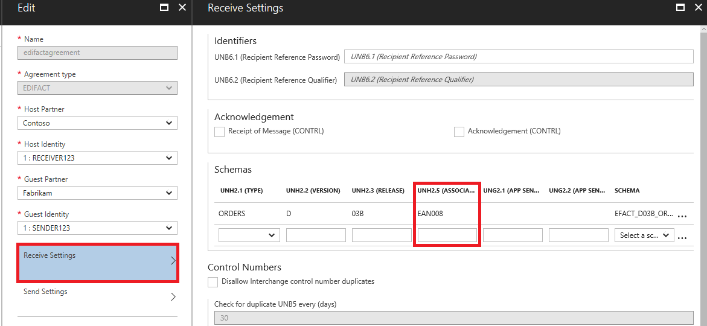
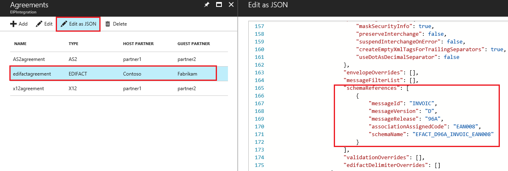

# Handle EDIFACT documents with UNH2.5 segments in Azure Logic Apps

When UNH2.5 is present in the EDIFACT document, it is being used for schema lookup. 

Example: The UNH field is **EAN008** in the EDIFACT message  
UNH+SSDD1+ORDERS:D:03B:UN:**EAN008**'  

Steps to follow to handle the message 
1. Update the schema
2. Check the agreement settings  

## Update the schema
To process the message, you need to deploy a schema with the UNH2.5 root node name.  For given an example, the schema root name would be **EFACT_D03B_ORDERS_EAN008**  

For each D03B_ORDERS with a different UNH2.5 segment, you would have to deploy an individual schema.  

## Add schema to the EDIFACT agreement
### EDIFACT Decode
To Decode the incoming message, configure the schema in the EDIFACT agreement receive settings
1. Add the schema to the integration account    
2. Configure the schema in the EDIFACT agreement receive settings. 
3. Select EDIFACT agreement and click **Edit as JSON**.  Add UNH2.5 value in the Receive Agreement **schemaReferences**

### EDIFACT Encode
To Encode the incoming message, configure the schema in the EDIFACT agreement send settings
1. Add the schema to the integration account    
2. Configure the schema in the EDIFACT agreement send settings. 
3. Select EDIFACT agreement and click **Edit as JSON**.  Add UNH2.5 value in the Send Agreement **schemaReferences**

## Next Steps
* [Learn more about integration account agreements](../logic-apps/logic-apps-enterprise-integration-agreements.md "Learn about enterprise integration agreements")  