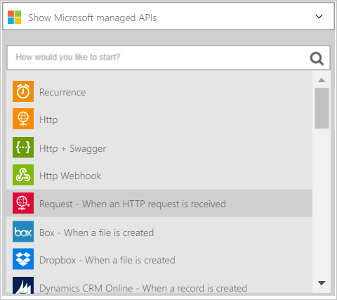
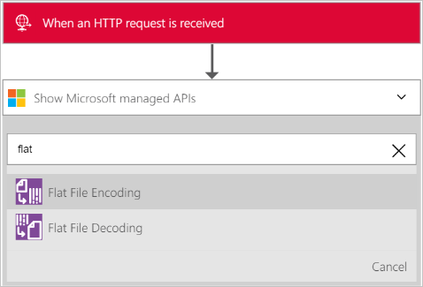
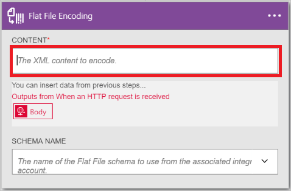
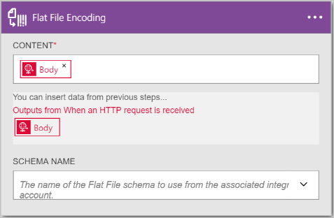
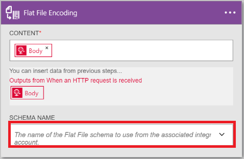
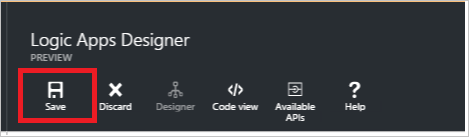
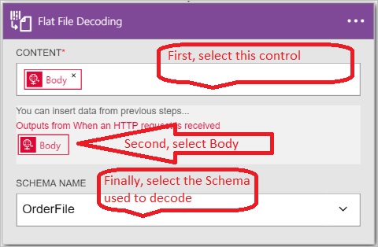

# Encode or decode flat files with Azure Logic Apps and Enterprise Integration Pack

You may want to encode XML content before you send it to a business partner in a business-to-business (B2B) scenario. In a logic app, you can use the flat file encoding connector to do this. The logic app that you create can get its XML content from a variety of sources, including from an HTTP request trigger, from another application, or even from one of the many [connectors](../connectors/apis-list.md). For more information about logic apps, see the [logic apps documentation](logic-apps-overview.md "Learn more about Logic apps").  

## Create the flat file encoding connector
Follow these steps to add a flat file encoding connector to your logic app.

1. Create a logic app and [link it to your integration account](logic-apps-enterprise-integration-accounts.md "Learn to link an integration account to a Logic app"). This account contains the schema you will use to encode the XML data.  
1. Add a **Request - When an HTTP request is received** trigger to your logic app.  
       
1. Add the flat file encoding action, as follows:
   
    a. Select the **plus** sign.
   
    b. Select the **Add an action** link (appears after you have selected the plus sign).
   
    c. In the search box, enter *Flat* to filter all the actions to the one that you want to use.
   
    d. Select the **Flat File Encoding** option from the list.   
      
1. On the **Flat File Encoding** dialog box, select the **Content** text box.  
     
1. Select the body tag as the content that you want to encode. The body tag will populate the content field.     
     
1. Select the **Schema Name** list box, and choose the schema you want to use to encode the input content.    
     
1. Save your work.   
     

At this point, you are finished setting up your flat file encoding connector. In a real world application, you may want to store the encoded data in a line-of-business application, such as Salesforce. Or you can send that encoded data to a trading partner. You can easily add an action to send the output of the encoding action to Salesforce, or to your trading partner, by using any one of the other connectors provided.

You can now test your connector by making a request to the HTTP endpoint, and including the XML content in the body of the request.  

## Create the flat file decoding connector

> [!NOTE]
> To complete these steps, you need to have a schema file already uploaded into you integration account.

1. Add a **Request - When an HTTP request is received** trigger to your logic app.  
       
1. Add the flat file decoding action, as follows:
   
    a. Select the **plus** sign.
   
    b. Select the **Add an action** link (appears after you have selected the plus sign).
   
    c. In the search box, enter *Flat* to filter all the actions to the one that you want to use.
   
    d. Select the **Flat File Decoding** option from the list.   
      
1. Select the **Content** control. This produces a list of the content from earlier steps that you can use as the content to decode. Notice that the *Body* from the incoming HTTP request is available to be used as the content to decode. You can also enter the content to decode directly into the **Content** control.     
1. Select the *Body* tag. Notice the body tag is now in the **Content** control.
1. Select the name of the schema that you want to use to decode the content. The following screenshot shows that *OrderFile* is the selected schema name. This schema name had been uploaded into the integration account previously.
   
       
1. Save your work.  
       

At this point, you are finished setting up your flat file decoding connector. In a real world application, you may want to store the decoded data in a line-of-business application such as Salesforce. You can easily add an action to send the output of the decoding action to Salesforce.

You can now test your connector by making a request to the HTTP endpoint and including the XML content you want to decode in the body of the request.  

## Next steps
* [Learn more about the Enterprise Integration Pack](logic-apps-enterprise-integration-overview.md "Learn about Enterprise Integration Pack").  

